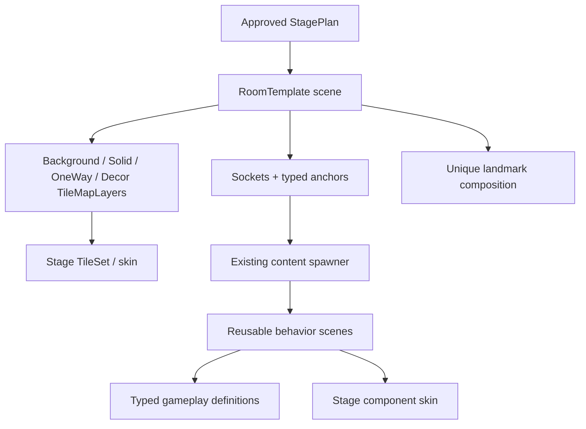
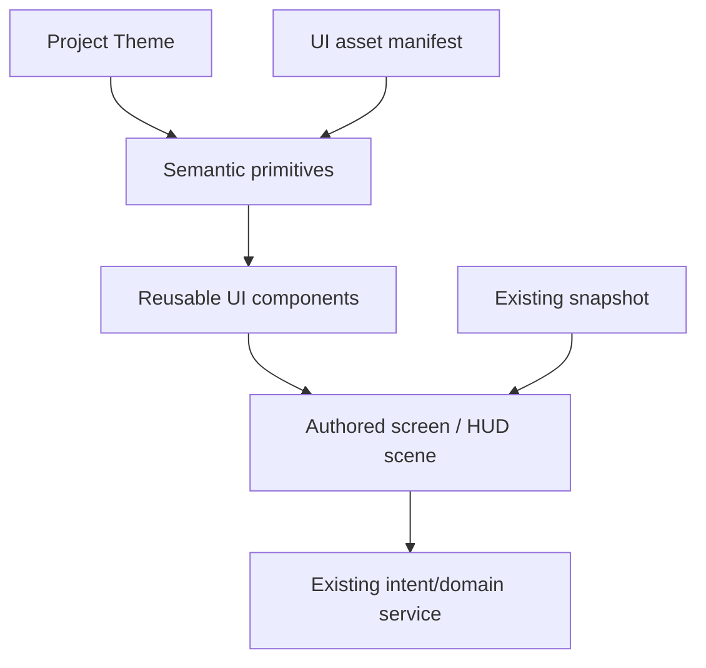

# Component And UI Foundation Plan

## Why / Context

Cardborne has a playable production run and strong typed gameplay contracts, but its presentation was built as a functional prototype:

- 30 rooms repeat static collision and `Polygon2D` terrain instead of using a shared tile authoring system;
- behavior-level components exist, but most do not have a clean stage-skin boundary or production sprite/animation pipeline;
- the production UI behavior is real, but the shared style vocabulary is bordered and rounded, composition is partly generated in scripts, and scene-local theme overrides have drifted;
- AI-generated visual boards establish a useful direction but cannot be sliced directly into production atlases;
- the parent worktree contains active gameplay changes, so presentation foundation work must not absorb or overwrite them.

The goal is not to redesign game rules or resume random map generation. The goal is to establish a production-ready authoring system that can render the existing fixed stages and UI coherently, while preserving traversal, damage, reward, progression, focus, and transaction behavior.

## Current Preproduction State

- [x] Created isolated worktree `D:\npjt\cardborne-platformer-component-ui-preproduction`.
- [x] Created branch `codex/component-ui-preproduction` from local `master` commit `5e9ce34`.
- [x] Kept the parent worktree's uncommitted gameplay changes outside this branch.
- [x] Audited room, terrain, hazard, component, UI, validator, and lifecycle owners.
- [x] Verified no production `TileMapLayer`/`TileSet` exists.
- [x] Reviewed Godot 4.7 TileSet, TileMapLayer, Theme, focus, and scene-organization guidance.
- [x] Compared native authoring, LDtk, and Tiled without installing a dependency.
- [x] Generated and inspected world-style and component-decomposition reference boards.
- [x] Defined proposed tile/component/skin/unique and flat UI contracts.
- [x] Defined image-generation batch boundaries, asset approval gates, and the temporary HTML review-gallery contract.
- [x] Tested the first generation model and recorded why per-object/full-state rendering is not a viable production unit.
- [ ] Owner accepts or revises the two draft design specs.
- [ ] Revise the world-component image production plan around terrain-first kits, canonical bases, and state overlays; then obtain owner acceptance.
- [ ] A separate implementation branch/worktree is created after current gameplay work lands.

No game code, production scene, runtime resource, dependency, or import configuration is changed by this preproduction branch.

## Scope / Non-Scope

### In Scope For Future Implementation

- One Godot-native terrain TileSet foundation and semantic TileMapLayer layout.
- One representative room migration that preserves sockets, anchors, collision, and route validation.
- Stage-specific visual skin contracts for terrain and reusable components.
- A reusable component-skin contract proven first by existing poison-vent, crumbling-platform, and spike-row behavior.
- A temporary static HTML asset-review gallery followed by a Godot component gallery for isolated runtime/state review.
- A project Theme, semantic type variations, token ownership, and image manifest.
- One representative HUD/menu migration followed by measured rollout.
- Focused validators, screenshots, and migration guards.
- A later evidence-based decision on LDtk/Tiled, not an automatic adoption.

### Out Of Scope

- New map generation or random visual composition.
- New stage layouts, traversal rules, combat balance, rewards, progression, or save schema.
- Rewriting existing component behavior frameworks.
- Full art production for all rooms/actors in the foundation spike.
- Adopting an external plugin, package, or asset pack without a separate approval and ledger entry.
- Cropping generated reference images into runtime atlases.
- Merging this preproduction branch into a dirty or stale parent branch.

## Assumptions

- Approved fixed stage plans remain the production mode while presentation is refined.
- Existing room scenes remain the source of truth for geometry composition, sockets, anchors, and camera bounds.
- Existing typed definitions and runtime spawners remain behavior owners.
- Required routes retain the current shared movement/traversal envelope; presentation work does not depend on a character-class model.
- UI continues to render immutable snapshots and emit intents.
- The selected visual direction is simplified saturated foundry/relic art with borderless flat UI.
- Exact cell size, atlas resolution, and final colors remain spike decisions.

## As-Is / To-Be Matrix

| Area | As-is evidence | To-be contract | Guard |
| --- | --- | --- | --- |
| Static terrain | Repeated `StaticBody2D` + collision + `Polygon2D` in 30 rooms. | External stage TileSets and semantic TileMapLayers for repeated static surfaces. | Route, socket, support, collision, and camera snapshots must remain equal or intentionally versioned. |
| Terrain variation | `TerrainPresentationStyler` recolors named polygons. | Stage TileSets implement the same semantic role manifest with stage-specific art. | No cross-stage atlas mixing; stable semantic roles. |
| Room composition | Authored room scenes plus typed resources and anchors. | Same room contract, now composed from tiles/components/set pieces. | Do not move planner/anchor data into TileSet metadata. |
| Hazards | Typed definitions instantiate reusable scenes at anchors. | Same behavior scenes with separate skin selection and clearer art/state nodes. | Existing runtime states, timing, and damage/support envelopes remain unchanged. |
| Interactables | Several reusable scenes, mostly procedural visuals. | Same transaction/interaction scenes with manifest-backed skins. | Transaction IDs and exactly-once settlement unchanged. |
| Trap variants | Individual behavior scenes/definitions; no common visual module contract. | Chassis/actuator/connector/payload/telegraph roles with validated variants. | Cosmetic swap cannot alter gameplay envelope. |
| Unique content | One-off room/boss polygons mixed with repeated geometry. | Unique landmarks remain authored, but repeated surfaces and behaviors delegate to shared systems. | “Unique” cannot bypass collision/hazard/reward validation. |
| UI styling | `ProductionUIStyles` creates bordered, rounded local styles. | Project Theme with zero-border flat semantic variations. | Focus and state remain visible through fill/marker/icon/text. |
| UI composition | HUD is substantially built in GDScript; screens use local overrides. | `.tscn` scenes own composition and Containers; scripts bind snapshots/intents. | Existing public snapshots, signals, and layout snapshot tests remain stable. |
| UI images | Procedural glyphs and placeholders. | Manifest-backed PNG icons, portraits, items, and backdrops with declared fallbacks. | No baked text/value/state; stable component dimensions. |
| Authoring tool | Godot room editor only; old research proposed LDtk/Tiled. | Native pipeline first; external editor only behind one import adapter after spike. | Generated output cannot be hand-edited; importer version pinned and validated. |

## Proposed Design

### World Composition

### UI Composition

### First Vertical Slice

Choose one room and one UI surface that exercise the largest number of contracts without broad migration:

- room candidate criteria: solid mass, inner/outer corner, one-way ledge, socket seam, component anchor, foreground/background decor, and existing geometry fixtures;
- UI candidate: `ProductionHUD`, because it exercises responsive layout, six action states, prompt/receipt lane, boss state, class accents, and gameplay visibility;
- component candidates: timed poison vent and crumbling platform, because both already exist and prove state/telegraph/support skins without adding gameplay behavior;
- stage skin candidate: Flooded Works/foundry, because it most directly matches the selected visual direction.

The provisional first room is `FwCrumbleCrossing`; `FwPoisonTiming` follows only after
the first terrain/component slice passes. Final selection is reconciled against the
latest clean gameplay branch before implementation.

Lock the provisional room only after the latest gameplay branch is rebased and its active layout changes are known.

## Milestones

### M0 - Decision And Branch Gate

- [ ] Owner reviews `GAME_COMPONENT_ART_SYSTEM.md`.
- [ ] Owner reviews `WORLD_COMPONENT_IMAGE_PRODUCTION_PLAN.md`.
- [ ] Owner reviews `UI_VISUAL_SYSTEM.md`.
- [ ] Record accepted changes in Decision Notes; do not silently promote unresolved draft language.
- [ ] Confirm parent gameplay work is committed or intentionally excluded.
- [ ] Rebase a new implementation branch onto the latest clean local `master`.
- [ ] Run the existing focused release validators before any migration.
- [ ] Capture baseline screenshots and geometry/layout snapshots.

Acceptance:

- One explicit room, stage skin, component, and UI surface are selected.
- The implementation diff starts clean and contains no parent worktree leakage.
- Baseline validators and screenshots are reproducible.

Stop if:

- parent changes touch the selected room/HUD/component and have not been reconciled;
- the selected behavior contract is already failing before presentation work;
- implementation would require an unapproved external dependency.

### M1 - Native Tile Foundation Spike

#### As-is

- [ ] Record selected room's collision bodies, surfaces, sockets, anchors, and geometry snapshot.
- [ ] Measure player collider and common support dimensions.
- [ ] Compare 24, 32, and 48 px logical cells against the room without changing gameplay geometry.

#### To-be

- [ ] Create one external stage TileSet with stable source IDs.
- [ ] Implement minimum semantic roles: fill, cap, side, outer corner, inner corner, ceiling/underside, one-way deck/end, and background fill.
- [ ] Create separate `BackgroundTiles`, `SolidTerrain`, `OneWayTerrain`, and optional decor layers.
- [ ] Rebuild only the representative room's repeated static terrain.
- [ ] Keep anchors, sockets, components, camera bounds, and unique landmarks outside the TileMap layers.
- [ ] Add missing-tile, collision-role, one-way-layer, and semantic-manifest validation.

Acceptance:

- Room geometry/route validators pass against the current shared traversal contract.
- Visual support edges and collision support edges agree.
- No missing atlas/source IDs after editor reopen and headless import.
- Authoring time and diff readability are better than the polygon baseline.

Guard:

- Do not delete the original terrain until before/after snapshots and human traversal pass.
- Do not migrate a second room before the first room's semantic roles are stable.

### M2 - Stage Skin And Component Gallery

#### As-is

- [ ] Inventory component roots, visual children, collision envelopes, and typed definitions.
- [ ] Identify procedural visuals that currently mix behavior and presentation.

#### To-be

- [ ] Define a stage-skin manifest for terrain, platforms, hazards, interactables, pickups, and common feedback.
- [ ] Build the temporary static HTML review gallery defined by `WORLD_COMPONENT_IMAGE_PRODUCTION_PLAN.md`.
- [ ] Add an isolated Godot component gallery with deterministic runtime states.
- [ ] Prove one component can swap between fallback and Flooded Works skin without changing gameplay snapshot.
- [ ] Prove timed-poison-vent `warning`/`active`/`cooldown` art without changing origin, damage area, or timing.
- [ ] Prove crumbling-platform `stable`/`warning`/`disabled`/`respawning` art without changing support top, width, or timing.
- [ ] Prove spike-row presentation without changing its damage bounds or placement width.
- [ ] Defer pendulum mount/connector/payload production until a real gameplay behavior contract exists.
- [ ] Add skin completeness and cross-stage path validation.

Acceptance:

- Skin swap changes presentation only.
- Runtime state timing and collision/support behavior are identical before/after.
- Gallery shows every existing warning, active, cooldown, stable, disabled, respawning, available, pending, claimed, and depleted state as applicable.

Guard:

- A payload with a different collision envelope becomes a typed gameplay variant and requires gameplay review.
- Do not infer stage identity from node names or scene paths inside component behavior.

### M3 - UI Theme And Asset Foundation

#### As-is

- [ ] Inventory all production `theme_override_*`, `StyleBoxFlat`, procedural glyph, and runtime node-construction sites.
- [ ] Map current validators and public layout snapshots.
- [ ] Capture all supported UI states at 960x540, 1280x720, and 1920x1080.

#### To-be

- [ ] Create one project Theme and the approved semantic type variations.
- [ ] Set default border width and corner radius to zero.
- [ ] Define token roles for color, typography, spacing, states, and motion.
- [ ] Define a UI asset manifest with fallback and tint rules.
- [ ] Move `ProductionHUD` composition into its `.tscn` without changing its snapshot/intent API.
- [ ] Replace border focus with reserved marker, accent fill, icon, and text/state channels.
- [ ] Replace only the representative icon/portrait set needed by the HUD spike.
- [ ] Add a component/state gallery for buttons, action slots, meters, prompts, choices, comparison rows, and receipts.

Acceptance:

- UI reads as flat and borderless in screenshots.
- Keyboard focus is immediately visible and follows explicit neighbors.
- Existing gameplay HUD validators pass at all three viewports.
- No state change resizes or shifts a component.
- No required state relies on color alone.

Guard:

- Do not rewrite run/combat/reward state while moving composition.
- Do not bake labels, bindings, values, cooldown, lock, or selected state into image assets.

### M4 - One-Stage Production Rollout

- [ ] Migrate the selected region room by room, starting with low-risk rooms.
- [ ] Keep one migration commit per coherent room/component family.
- [ ] Run room and stage validators after every room, not at the end.
- [ ] Replace fallback component visuals only after their gallery contract passes.
- [ ] Preserve approved fixed-stage layout and authored pickup/hazard/reward placements.
- [ ] Capture full-stage screenshots and human traversal/combat/readability evidence.

Acceptance:

- The region remains fully clearable under the current shared movement/traversal contract.
- Stage visual language is coherent and contains no accidental other-region assets.
- Terrain reads as filled masses at varied heights with usable traversal space.
- Foreground and HUD never obscure collision edges or hazard tells.

### M5 - Tool Adoption Decision

- [ ] Measure native authoring time, error rate, reviewability, and merge conflicts.
- [ ] If native authoring is acceptable, close LDtk/Tiled as deferred.
- [ ] If not, create an isolated LDtk spike with a pinned editor/importer version.
- [ ] Import one representative room into generated output only.
- [ ] Map typed entities to existing room anchors/resources through one adapter.
- [ ] Verify exact round-trip, collision, source IDs, sockets, and headless import.
- [ ] Compare Tiled only if LDtk cannot preserve the contracts.

Acceptance for adoption:

- External authoring materially reduces time or errors.
- Generated output is deterministic and never requires hand edits.
- All existing validators remain applicable.
- License, version, source, update policy, and rollback are recorded in the adoption ledger.

Default result: no external tool adoption.

### M6 - Broader Migration

- [ ] Migrate remaining regions only after M4 human acceptance.
- [ ] Create separate stage skin kits implementing the same semantic manifest.
- [ ] Migrate remaining UI screens component by component.
- [ ] Remove obsolete polygon/style code only when no production consumer remains.
- [ ] Archive superseded evidence and promote durable contracts after owner approval.

## Branch And Worktree Safety

### Current Preproduction Branch

- Branch: `codex/component-ui-preproduction`
- Worktree: `D:\npjt\cardborne-platformer-component-ui-preproduction`
- Base at creation: local `master` commit `5e9ce34`
- Intended contents: research, draft specs, plan, and reference images only

### Before Implementation

- [ ] Do not turn this documentation branch into the implementation branch.
- [ ] Let current gameplay changes land or be intentionally shelved by their owner.
- [ ] Fetching is optional; local `master` is the integration authority unless the owner asks to synchronize remotes.
- [ ] Create a fresh scoped implementation branch from the latest clean local `master`.
- [ ] Cherry-pick or merge the accepted documentation commit only after conflict review.
- [ ] Re-audit selected room/HUD/component because current parent changes were not included at branch creation.
- [ ] Record baseline commit and selected content versions in the implementation plan update.

### Merge Discipline

- Never merge generated import caches, `.godot/`, `.import/`, docs image `.png.import`, logs, or captures.
- Do not stage unrelated gameplay changes.
- Do not replace collision and visual representation across all rooms in one commit.
- Keep behavior-preserving migration commits separate from art/tuning commits.
- If socket geometry changes, increment content version and update fixtures deliberately.
- If a TileSet source ID changes, include an explicit tile-reference migration and missing-ID validator.
- If a UI public snapshot/layout key changes, update the owning spec and all consumers in the same reviewed change.
- Preserve rollback by keeping old representation until the replacement passes focused and human checks.

## Test Plan

### Baseline

- `git diff --check`
- `.\tools\godot.ps1 --path . --headless --import`
- current room, stage generation, terrain presentation, hazard catalog, production stage, gameplay HUD, shell UI, and reward-choice validators
- baseline captures at 960x540, 1280x720, and 1920x1080

### Tile/Room

- TileSet semantic-role manifest validation.
- Stable source/atlas ID and missing-tile scan.
- Collision/visible-silhouette comparison.
- One-way physics-layer validation.
- Room socket, support, seam, anchor, camera, and shared traversal-envelope validation.
- Editor reopen plus headless reimport check.

### Components/Skins

- Isolated component configuration warnings/validator.
- Definition and skin manifest completeness.
- Before/after gameplay snapshot equality under skin swap.
- Hazard warning/active/cooldown and stable/disabled/respawning safe-zone checks.
- Interaction exactly-once and reward receipt checks.
- Gallery screenshots for every state.

### UI

- Theme variation and asset manifest resolution.
- Zero-border default assertion with documented exceptions only.
- Snapshot/intent/transaction regression suite.
- Explicit focus-neighbor and initial/return focus checks.
- Stable bounds across component states.
- Overflow/clipping/overlap checks at all three viewports.
- Color-blind simulation and contrast/readability review.
- Production-like full-run manual QA after built/headless validation.

## Validation Cadence

- Run the smallest focused validator after each resource/scene change.
- Run room/component gallery capture after each visual family.
- Run stage/HUD viewport suite before each scoped commit.
- Run the full release suite before an implementation PR or local merge.
- Require human traversal and visual-readability checks before deleting fallback representation.

## Rollback / Safety

- Keep original room terrain nodes disabled or on the previous commit until the migrated room passes all gates; do not maintain two live collision systems.
- Roll back one room/component/UI surface at a time through scoped commits.
- Preserve typed IDs, content versions, scene paths, and public snapshots whenever possible.
- Missing art falls back to declared placeholder presentation; it cannot disable gameplay.
- A failed external-editor spike is deleted as an isolated adapter experiment with no production data migration.
- No production dependency or asset license is added without owner approval.

## Risks

| Risk | Consequence | Mitigation |
| --- | --- | --- |
| Tile visuals do not match collision | Unreadable or blocked traversal | Collision/silhouette validator plus shared traversal-contract room replay. |
| Tile source IDs shift | Invisible/missing terrain references | Stable manifest, no destructive reindex, explicit migration validator. |
| Overusing tiles for stateful objects | Hidden behavior and brittle IDs | Keep hazards/interactables as explicit scenes at typed anchors. |
| Skin data leaks into behavior | Stage art changes gameplay | Snapshot equality and typed gameplay variants for envelope changes. |
| Generated art is used directly | Seams, noisy detail, inconsistent pivots | Treat boards as references; redraw on exact grid. |
| Borderless UI loses focus/readability | Keyboard navigation becomes unusable | Reserved marker/fill/icon/text channels and focus tests. |
| Theme migration changes UI behavior | Broken transactions/focus/layout | Preserve snapshot/intent API and migrate one surface at a time. |
| Branch starts from stale gameplay state | Conflicts or reintroduced bugs | Fresh implementation branch from latest clean local `master`. |
| External importer is version-incompatible | Broken imports and opaque generated scenes | Native baseline; isolated pinned spike only after measured need. |

## Open Questions

- [ ] Does the latest gameplay branch preserve the required `FwCrumbleCrossing` contracts so it can remain the first tile migration? If not, select another Flooded Works room with equivalent coverage.
- [ ] Does the owner accept 32 px as the starting cell-size candidate for the spike?
- [ ] Should stage TileSets be entirely separate, or share a locked semantic base with stage atlases? Recommended first answer: separate resources with a validated common manifest.
- [ ] Which UI image family should be produced first after the gameplay model lands? Defer character, weapon, equipment, skill-tree, and inventory icons during the world-component image phase.
- [ ] Should the unique menu backdrop be static, lightly parallaxed, or animated? Defer until structural UI passes.
- [ ] Is LDtk worth a spike after native authoring measurements? Default: no.

## Decision Notes

- 2026-07-13: Owner required all UI to be outline-free and flat-color.
- 2026-07-13: Owner selected a combination of steampunk/post-apocalyptic foundry structure and the richer relic-print palette, without a pale result.
- 2026-07-13: Owner clarified that terrain must be built from repeated tiles and that traps/environment objects must be modular.
- 2026-07-13: Owner clarified that module appearance is stage-specific, not random cross-stage composition.
- 2026-07-13: Owner required a simpler art style because detailed image generation introduces noisy, pointillist artifacts.
- 2026-07-13: Preproduction recommends Godot-native TileMapLayer/TileSet/PackedScene/Theme first; LDtk and Tiled remain conditional spikes.
- 2026-07-13: This branch intentionally contains preparation artifacts only. Implementation starts on a fresh branch after current gameplay work is reconciled.
- 2026-07-14: Owner required image-generation call boundaries, per-asset production planning, and a temporary HTML review gallery before new art generation.
- 2026-07-14: The first component-skin proof uses existing timed poison vent, crumbling platform, and spike row behavior; pendulum art is deferred until its gameplay contract exists.
- 2026-07-14: Character, weapon, equipment, skill-tree, and inventory work remains outside this presentation branch.
- 2026-07-14: Owner rejected broad per-object and complete-state image generation after visual trials; future production is terrain-first and uses canonical component bases plus separate overlay/effect layers.
- 2026-07-14: Generated previews remain unaccepted external evidence. No generated image is runtime art or may be imported without strict-grid/alpha/pivot/gallery review.
