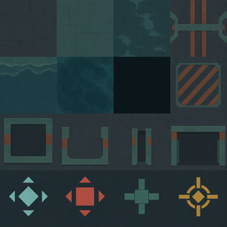

# Flooded Works Floor 1 Map and Enemy Foundation - Execution Plan

The current 19.8 x 19.8 m Movement Check becomes the optional tutorial entry to
one connected, authored Floor 1. Tiled `.tmj` maps become the editable source of
truth for floor shape, sockets, bounds, and placement; a deterministic Godot
build step produces the native 3D room scenes used at runtime. Six executable
phases add that map pipeline, room streaming, three coordinated moving enemy
roles, three terrain compositions, destructible props and potion pickups, Slime
King, then audio settings and production-style validation. Progression spending
remains outside this plan, but its reward and transition contracts are fixed in
the related upgrade specification.

## Purpose

- Objective: turn the current static-target sandbox into a short connected run
  whose terrain, objectives, enemies, props, and boss can be judged in play.
- Final artifact: Movement Check -> Foundry Approach -> Pump Gallery -> Pressure
  Vault -> Slime King Reservoir, connected by in-world gates and short fades.
- Completion state: the built game supports the full room route, every ordinary
  enemy moves and completes repeated attacks without stalling, non-arena rooms
  do not require extermination, props and potion pickups work exactly once, and
  the owner can judge whether the floor is worth expanding.

## Why / Context

The current build proves movement, facing, melee, ranged attack, dash, guard,
potion use, cover collision, raster actor presentation, and a following camera.
It does not yet contain enemy AI, navigation, room flow, a boss runtime, drops,
or audio playback. The next useful question is therefore not whether more UI or
economy can be restored; it is whether a sequence of authored combat spaces can
produce readable pressure and different tactical decisions with the current
Traveler.

The retired platformer at `7cc069c` contains useful data-boundary ideas, but its
gravity, ropes, fixed jump trajectories, side-view rooms, and broad economy are
not runtime sources. This plan reuses only reviewed concepts: stable content IDs,
typed reward transactions, data-driven cards/equipment, forward room flow, and
explicit non-extermination completion policies.

## Pre-plan Evidence Already Verified

| Source or path | Verified fact | Decision affected | Freshness or recheck boundary |
| --- | --- | --- | --- |
| `master` at `b76c0fe`; `git status` on 2026-07-18 | The Tiled authoring kit is committed; pre-existing `.import` changes are unrelated and must not be staged with this work. | Work in scoped commits and preserve unrelated import metadata. | Recheck before every commit. |
| `./tools/godot.ps1 --version` | Local engine is `4.7.stable.official.5b4e0cb0f`. | Use Godot 4.7 GDScript and current 3D APIs. | Recheck if the wrapper or project feature version changes. |
| `validate_movement_and_actions.gd`, run 2026-07-18 | Current raster world, movement, lateral gait, dash, attacks, guard, projectile collision, camera, targeting, potion, pulse, and pause contracts pass. | Preserve the player foundation while extracting it from the one-room scene. | Rerun after each phase touching shared runtime. |
| `CombatSandbox3D.tscn`; `combat_sandbox_3d.gd` | One room owns architecture, player, camera, fixtures, and HUD together; it has no room transition or navigation owner. | Extract persistent actors/camera/HUD from room-owned geometry before adding content. | Recheck before Phase 1. |
| `traveler_3d.gd`; `proof_projectile_3d.gd` | Player attacks use direct method calls; ordinary ranged shots collide with `World` and `Enemy`. | Introduce a typed damage request without changing the accepted action timings or input. | Recheck after any player-combat refactor. |
| `docs/product/isometric_action_rpg_product_brief.md` | Route, three ordinary roles, room objectives, controls, boss patterns, and non-extermination rules are already product requirements. | The plan implements that authored proof rather than inventing procedural breadth. | Recheck if the product brief is superseded. |
| `art/world/flooded_works/README.md`; `docs/design/UI_VISUAL_SYSTEM.md` | Drowned foundry, broad flat color masses, no outlines/noise, close-hue foregrounds, and separable gameplay props are accepted. | All new rooms and actor assets stay in one art family and keep gameplay state separate. | Recheck before asset production. |
| `art/world/flooded_works/tiled/`; commit `b76c0fe` | A 4x4, 64 px, orthogonal authoring atlas, external `.tsx`, 16 individual tiles, and a parseable preview `.tmj` exist; `meters_per_tile` is 1.0 and the atlas is explicitly authoring-only. | Reuse this exact palette and IDs as the initial Tiled contract; do not treat the atlas as runtime floor art. | Recheck when the `.tsx` or manifest changes. |
| `Get-Command tiled` and standard install paths, checked 2026-07-18 | Tiled is not installed on this machine. | Installing the selected signed Tiled 1.12.2 Windows release is an exact owner-approval gate; no package or runtime dependency is added. | Recheck immediately before installation. |
| [Tiled JSON map format](https://doc.mapeditor.org/en/stable/reference/json-map-format/) and [Worlds](https://doc.mapeditor.org/en/stable/manual/worlds/), accessed 2026-07-18 | Finite orthogonal maps can store readable tile arrays, object layers, custom properties, and external tilesets; `.world` stores maps and authoring positions. | Commit finite uncompressed `.tmj` room sources plus one `.world` overview. | Recheck if pinned Tiled changes. |
| [Tiled Godot 4 export](https://doc.mapeditor.org/en/stable/manual/export-tscn/), accessed 2026-07-18 | The built-in exporter targets Godot 4's 2D TileMap format. | Do not use it for this native 3D runtime; own a project-local `.tmj` parser and room builder. | Recheck only if the project returns to 2D. |
| [Godot NavigationMeshGenerator](https://docs.godotengine.org/en/4.7/classes/class_navigationmeshgenerator.html), accessed 2026-07-18 | Godot 4.7 can parse generated 3D source geometry and bake a `NavigationMesh`. | Bake and save one navmesh per generated room during the build step, never during gameplay. | Recheck if the pinned engine changes. |
| `art/ui/production/asset-manifest.json` | Potion, material, card, equipment, Slime King, and boss-core illustrations already have stable IDs. | Reuse UI identity assets later; do not crop concept boards into runtime sprites. | Recheck when the manifest changes. |
| Git `7cc069c`: `CardDefinition`, `RewardTable`, `RewardService`, equipment resources | The retired build separated data, resolution, transaction, and UI responsibilities. | Recover boundary ideas only; rewrite every runtime owner for current 3D combat. | Historical source; never cherry-pick wholesale. |
| [Godot NavigationAgent3D](https://docs.godotengine.org/en/4.7/classes/class_navigationagent3d.html), accessed 2026-07-18 | Setting a target requests a path; `get_next_path_position()` must be advanced from the physics loop, while the parent remains responsible for movement. | `EnemyMotor3D` owns velocity and calls the agent once per physics frame. | Recheck only if the pinned engine changes. |
| [Godot NavigationObstacle guidance](https://docs.godotengine.org/en/4.7/tutorials/navigation/navigation_using_navigationobstacles.html), accessed 2026-07-18 | Dynamic obstacles are soft avoidance, not a substitute for a correct navigation mesh or narrow-space pathfinding. | Permanent geometry is baked; destructibles never define critical connectivity and keep wide side clearance. | Recheck if destructibles are allowed to gate routes. |
| [Godot AudioServer](https://docs.godotengine.org/en/4.7/classes/class_audioserver.html) and [saving guidance](https://docs.godotengine.org/en/4.7/tutorials/io/saving_games.html), accessed 2026-07-18 | Audio buses expose linear/dB volume, and `ConfigFile` is the intended user-configuration store. | Add Master/SFX buses and persist only those settings. | Recheck if music or a broader settings schema enters scope. |

## Locked Decisions

| Topic | Final decision | Rationale / source |
| --- | --- | --- |
| World form | Use five authored Tiled room sources whose generated 3D scenes load one at a time under a persistent floor runtime. | A single huge scene wastes memory, complicates reset/navigation, and is not required for connectedness. |
| Map source of truth | Use finite, orthogonal, uncompressed Tiled `.tmj` files at 64 px per cell and 1 cell = 1 m. The `.tmj`, shared `.tsx`, and `.world` are authored sources; generated `.tscn` files are committed runtime outputs. | Makes floor shape and room continuity directly inspectable while preserving native 3D gameplay. |
| Tiled scope | Tiled owns ground cells, non-walkable regions, structure footprints, paired connection sockets, camera bounds, and named encounter/prop/objective anchors. It never owns combat timing, AI state, collision height, materials, or reward logic. | Keeps level layout editable without turning a 2D editor into the runtime engine. |
| Conversion | `tools/tiled/build_flooded_works_rooms.gd` parses `.tmj`/`.tsx`, validates the contract, greedily merges same-role cells into 3D chunks, instances registered structures/components, bakes navigation, and saves deterministic generated scenes. Runtime never parses Tiled files. | Removes hand-copied coordinates and runtime importer risk. |
| Generated ownership | Files under `scenes/rooms/flooded_works/generated/` are build products and must not be hand-edited. Each stores source path, source SHA-256, generator version, and tile-contract version metadata. | A `--check` build can reject stale or manually modified generated scenes. |
| Layer contract | Every room has exactly one `ground` tile layer and object layers named `structures`, `connections`, `spawns`, `props`, `objectives`, and `camera_bounds`; unused required object layers remain present and empty. No other gameplay layer is accepted. | Stable names keep parsing, review, and validation deterministic. |
| Floor overview | `flooded-works-floor1.world` arranges the five maps for human continuity review only. Runtime route and transitions still come from room definitions and reciprocal door socket data. | Tiled can show the whole floor without making every room resident. |
| Tool installation | Use the official signed Tiled 1.12.2 Windows release after explicit owner approval. Do not add a Node/Python exporter, editor plugin, package-manager dependency, or Tiled runtime binary to the repository. | Minimizes supply-chain and maintenance surface. |
| Connection | Every room ends at a matching Flooded Works gate. Transition locks input, fades out in 0.18 s, swaps the room, places the Traveler at the paired entry marker, and fades in in 0.18 s; target total is under 0.60 s. | Reads as one facility while keeping each encounter testable. |
| Route | Movement Check -> Foundry Approach -> Pump Gallery -> Pressure Vault -> Slime King Reservoir. A post-Foundry transition hook is reserved for the future card reward without blocking this map/enemy plan. | Matches the proof brief and keeps progression implementation separate. |
| Tutorial gate | Movement Check remains optional practice. Its north gate is available from the start; no forced checklist blocks the run. | The player can practice or immediately reach moving enemies. |
| Terrain | All gameplay stays on one X/Z ground plane. Tiled cells define logical occupancy; the converter merges them into broad 3D chunks and applies project materials so the shipped floor never reads as a repeated square tilemap. Rooms vary through footprint, permanent cover, non-walkable water channels, machinery, and hazard placement, not stacked floors. | Preserves the accepted simulation/presentation split and avoids visible tile repetition. |
| Camera | Reuse the fixed orthographic angle and actor scale. Each room supplies camera bounds; foreground walls remain absent or below the Traveler silhouette. | Prevents the visibility regression already identified by the owner. |
| Navigation | Each generated room has one build-time-baked `NavigationRegion3D`. Walkable Tiled cells and permanent structure footprints produce the source geometry; movable or destructible props never create the only route. | Deterministic, inspectable paths with no runtime rebake dependency. |
| Ordinary roster | Implement exactly three roles: Pursuer, Shooter, Controller. Variance comes from placement, objective pressure, and later data variants, not unrelated enemy systems in this slice. | Smallest roster that tests close pressure, cover, and area denial. |
| Coordination | One close-commit token and one pressure-commit token exist per encounter. Pursuers share the close token; Shooter and Controller share the pressure token. Waiting enemies keep repositioning. | At most two meaningful simultaneous threats remain readable. |
| Attacks | Every enemy attack has startup, active, recovery, interruption, and defeat cleanup. Only the active startup/impact warning is shown; paths and predicted trajectories stay hidden. | Behavior should be understandable without debug-like UI. |
| Projectile collision | Ordinary enemy projectiles stop on permanent cover, intact crates, or the first valid target. | Resolves the prior terrain-piercing failure. |
| Player interaction | Keep arrows, Space, Shift melee, `Z` ranged, `X` guard, `C` potion, and Esc. Add `V` / gamepad west-face as the only interact action for pumps, doors, and later rewards. | Keeps interactions distinct without displacing accepted combat controls. |
| Props | Add waterlogged supply crates, potion-charge pickups, pump stations, and pressure vents. Props are authored components, never baked into backgrounds. | Supplies readable world interaction without opening the economy. |
| Crate behavior | A crate has 20 health, breaks from one standard melee or two ranged hits, blocks actors/projectiles while intact, drops at most once, and never defines route connectivity. | Makes both attacks useful and avoids soft-locks. |
| Potion pickup | A loose potion grants one charge up to the cap of three. At cap it remains on the ground; it never auto-converts or disappears. | No invisible waste or economy dependency. |
| Materials/cards/equipment | No material wallet, Forge, skill tree, card effect, equipment mutation, or permanent save is implemented by this plan. Their exact ownership and source matrix live in the related upgrade spec. | Honors the request to document progression for later while focusing implementation on maps/enemies. |
| Audio | The current repo has no playable audio asset. Add Master and SFX buses at 100% defaults and an in-run pause settings panel, but do not source new sounds in this plan. | Corrects the current-state assumption without adding an external asset dependency. |
| Art production | The three generated boards are composition evidence only. Runtime enemies, props, and room surfaces require separate normalized assets and manifest entries. | A multi-object concept sheet is not a valid sprite atlas. |

## Rejected Alternatives

| Alternative | Why it was viable | Why it was rejected |
| --- | --- | --- |
| One seamless Floor 1 scene | No loading fade and a single physical layout. | Couples all encounters, navigation, reset state, and art memory before the loop is proven. |
| Procedural/chunk-generated rooms | Could create more layouts quickly. | Repetition and encounter-quality problems would be harder to diagnose; authored rooms are the current product requirement. |
| Restore retired Flooded Works rooms | Existing room IDs and layouts were broad. | They encode platform traversal, ropes, verticality, and side-view collision. |
| Hand-author every room coordinate in `.tscn` | Uses only the Godot editor and has no converter cost. | Floor silhouettes, connections, markers, collision, and review would drift across separate representations. |
| Use Tiled's built-in Godot 4 exporter | It already emits `.tscn`. | It targets 2D TileMap output and cannot own this project's merged 3D geometry, collision, object registry, or navmesh contract. |
| Parse `.tmj` in the shipped game | Avoids committing generated scenes. | Moves authoring errors and expensive geometry/navigation work into runtime and makes builds depend on editor data. |
| Use Godot `GridMap` as the authoring source | Directly places 3D mesh-library cells. | It is weaker for top-down whole-floor review and still encourages visible per-cell construction for the exact problem being corrected. |
| Bake props/enemies into room images | Fast visual fidelity. | Breaks collision/state ownership and prevents reuse, damage, drops, and readable movement. |
| Runtime navigation rebake on every crate break | Opens exact geometry after destruction. | Unnecessary cost and complexity because crates do not gate critical paths. |
| Independent enemy attacks with no coordinator | Simplest individual AI. | Mixed groups can produce unreadable overlapping startups and unavoidable damage. |
| Persistent lock-on, path lines, or attack trajectories | Makes AI intent explicit. | The owner rejected debug-like overlays; startup pose/telegraph/recovery are sufficient. |
| Random per-kill loot showers | Immediate reward feedback. | Adds visual noise and progression state before its spending loop exists. |
| Restore the retired progression runtime | Feature-rich and already typed. | Its triggers, equipment assumptions, save schema, and platform combat are no longer valid. |

## Visual Direction

These images explain composition and asset boundaries. They are not runtime
atlases, collision maps, navigation meshes, or exact object counts.


The floor reads as one facility, but each room changes its large terrain shape:
dry intake slab, foundry presses/rails, crossed water channels and pumps, then a
circular pressure/boss threshold. Matching gates, palette, fog, and machinery
provide continuity.


The actual camera sees only part of a larger room. The Pursuer closes through an
open lane, the Shooter relocates behind permanent cover, and the Controller owns
one warning area. Pumps, crates, potion, water, and exit are separable components.


Role identity comes from silhouette and tool, not unrelated colors: low/forward
Pursuer, taller crossbow Shooter, wide/grounded Controller, and larger Slime King.
The lower row defines the prop family but must be regenerated as individual
runtime assets with required states.



This 4x4 atlas is the editor vocabulary, not final floor art. The top two rows
mark surface occupancy; the third row marks wall/cover/connection footprints;
the fourth row marks player, enemy, prop, and objective anchors. The converter
uses the `.tsx` properties and local tile IDs, then replaces them with merged 3D
chunks, live components, and named markers.

## Current State

Already true:

- `PivotRoot` boots directly into `CombatSandbox3D`.
- Movement Check has a 19.8 x 19.8 m floor, four low boundaries, one north gate,
  two permanent cover blocks, three resettable targets, and one training pulse.
- Traveler movement, camera-relative facing, soft targeting, melee, ranged, dash,
  guard, potion, damage, pause, reset, and raster presentation pass validation.
- Player projectiles already stop on `World` collision.
- The far Flooded Works panel and same-hue architecture albedo are in use.
- The committed Tiled authoring kit contains a 256 x 256 atlas, sixteen 64 x 64
  individual tiles, an external `.tsx` with stable `asset_id`/role properties,
  and a 4 x 4 preview `.tmj`; XML, JSON, references, and image sizes validate.
- No Tiled application, production room `.tmj`, `.world`, parser, converter,
  generated room directory, or source/generated drift validator exists yet.
- No enemy AI, navigation region, room host, encounter objective, drop component,
  boss runtime, audio stream, audio bus layout, or settings store exists.

Remaining implementation is exactly Phases 1-6. The progression spec is an
adjacent future contract, not a hidden seventh phase.

## Scope / Non-scope

In scope:

- persistent Traveler/camera/HUD plus single-room loading and paired gate flow;
- Tiled 1.12.2 finite orthogonal room sources, one shared tileset, one Floor 1
  `.world`, a deterministic Godot 3D builder, committed generated room scenes,
  and source/generated drift validation;
- Movement Check migration and four new Tiled-authored, Godot-generated room scenes;
- one navigation plane per room and three moving ordinary enemy roles;
- encounter coordination, projectiles, zones, interruption, defeat, and cleanup;
- arena-clear, two-pump activation, 45-second survival, and boss-defeat objectives;
- waterlogged crates, one-charge potion pickups, pump stations, pressure vents;
- Slime King room and the four already specified boss patterns;
- objective/boss UI needed to understand this floor;
- Master/SFX settings infrastructure and a live-screen pause panel;
- native/headless validators, rendered captures, Web export, and built-app review.

Out of scope:

- material wallet, Forge, merchant, skill/stat tree, equipment inventory, card
  effect runtime, persistent progression, or profile migration;
- procedural generation, random room graphs, alternate biomes, multiple floors,
  minimap, quests, narrative scripting, or a main menu;
- player jump, ropes, platform geometry, stacked navigation, stairs as gameplay
  elevation, or a free camera;
- importing new third-party assets, music, or sound effects;
- using generated concept boards directly as production sprites or textures.
- using the Tiled authoring atlas as a runtime floor texture, rendering one 3D
  mesh per painted cell, Tiled runtime parsing, or Tiled's 2D Godot exporter.

Destructive or irreversible actions:

- none; migration of `CombatSandbox3D` must use a scoped rename/extraction and
  keep the existing validation fixture recoverable through Git history.

Exact actions requiring owner approval:

- any external asset/dependency, paid or free;
- installing the official signed Tiled 1.12.2 Windows application; approval is
  for that authoring tool only and does not authorize extensions or packages;
- a change to accepted player controls other than the additive `V` interact;
- a second ground elevation or seamless/open-world streaming;
- implementing progression beyond the related specification;
- merging, pushing, publishing, or deploying.

## Assumptions

- The user-visible term “connected” means consistent in-world gates and short
  room transitions; it does not require every room to be resident simultaneously.
- The current camera angle, Traveler scale, combat timings, and close-hue raster
  world are the baseline to preserve.
- Concept images communicate target composition, not pixel-accurate runtime art.
- Tiled is an offline authoring tool. The game, native build, and Web export must
  run without Tiled installed and without `.tmj` parsing at runtime.
- Physical gamepad availability is not assumed for automated checks; input-map
  parity is validated structurally and a physical-device gate remains manual.

## Open Questions

None. Tiled 1.12.2, finite orthogonal `.tmj`, 64 px cells, 1 m world cells,
project-owned 3D conversion, generated-scene ownership, `V` interact, linear
authored route, room-by-room loading, three ordinary roles, exact objectives,
prop behavior, upgrade boundary, and audio-setting scope are fixed for execution.
The exact Tiled installation is approval-gated, not an unresolved technology
choice. New owner feedback may supersede these decisions before Phase 1.

## Proposed Design

### Tiled authoring and Godot build contract

The editable and generated owners are deliberately separate:

```text
art/world/flooded_works/tiled/flooded-works-authoring.tsx
data/rooms/flooded_works/tiled/
  movement-check.tmj
  foundry-approach.tmj
  pump-gallery.tmj
  pressure-vault.tmj
  slime-king-reservoir.tmj
  flooded-works-floor1.world
data/rooms/flooded_works/tiled-room-build-catalog.tres
  -> tools/tiled/build_flooded_works_rooms.gd --write
scenes/rooms/flooded_works/generated/
  MovementCheck3D.tscn
  FoundryApproach3D.tscn
  PumpGallery3D.tscn
  PressureVault3D.tscn
  SlimeKingReservoir3D.tscn
data/rooms/flooded_works/generated-room-build-manifest.json
```

Only the `.tmj`, `.tsx`, `.world`, build catalog, and converter are edited by
hand. Generated scenes and their baked navigation resources are committed so the
runtime and Web export need neither Tiled nor an importer. The build manifest
records generator/schema versions plus SHA-256 values for every source, tileset,
catalog, and generated output. `--check` rejects any stale source hash, missing
output, output hash drift, hand-edited generated scene, or unknown build version.

All maps use a fixed orthogonal grid, JSON array tile data without base64 or
compression, 64 x 64 editor pixels, and 1 x 1 m world cells. Infinite maps,
embedded tilesets, flipped/rotated GID flags, image layers, isometric projection,
scripts, and custom Tiled extensions are rejected. Tiled top is north; cell
center `(column + 0.5, row + 0.5)` maps to Godot `(X, Z)` in meters, with north
facing `-Z`. All gameplay remains at Y=0.

Every room source uses exactly this layer schema:

| Layer | Tiled type | Allowed content | Required instance properties |
| --- | --- | --- | --- |
| `ground` | tile layer | Local IDs 0-7 only: floor, water, void, hazard occupancy | Tile `.tsx` owns `asset_id`, `walkable`, and `runtime_role` |
| `structures` | object layer | Tile objects using wall/low-cover IDs 8-9, snapped to the grid and scaled in whole cells | `anchor_id`, `archetype_id`, `height_class` = `standard` or `cutaway` |
| `connections` | object layer | Tile objects using door/gate IDs 10-11 | `socket_id`, `target_room_id`, `target_socket_id`, `facing` = north/east/south/west |
| `spawns` | object layer | Tile objects using player/enemy IDs 12-13 | `anchor_id`; enemies also require `spawn_group` and `enemy_role` |
| `props` | object layer | Prop-anchor ID 14 | `anchor_id`, `component_id`, `drop_slot_id`; empty string means no drop |
| `objectives` | object layer | Objective-anchor ID 15 | `anchor_id`, `objective_role` |
| `camera_bounds` | object layer | Exactly one axis-aligned rectangle named `room_bounds` | No custom property; rectangle must contain all walkable cells |

The map root requires `room_id`, `schema_version = 1`, and
`meters_per_tile = 1.0`. Object names are cosmetic; stable IDs live in the
properties above. Unknown layers, properties, tile IDs, component IDs, enemy
roles, or objective roles fail the source validator instead of being ignored.
The catalog maps `archetype_id` and `component_id` to project-owned PackedScenes,
materials, collision profiles, and presentation owners; `.tmj` files never store
Godot scene paths or geometry heights.

The converter processes each room in this fixed order:

1. Parse the external `.tsx` with `XMLParser` and the finite `.tmj` with `JSON`;
   clear no GID flags because any transform flag is a validation failure.
2. Validate the map/layer/property schema, required anchors, registered catalog
   IDs, map bounds, camera bounds, and at least one reciprocal connection except
   at the route endpoints.
3. Merge adjacent `ground` cells with identical `asset_id`, `walkable`, and
   `runtime_role` using deterministic row-major maximal rectangles. Emit broad
   surface meshes/colliders rather than one mesh per tile. `void` and deep water
   produce no walkable collider; the authoring PNG is never assigned as albedo.
4. Instance registered walls, cutaway walls, low cover, gates, props, and marker
   nodes at snapped transforms. Camera-facing boundary structures must use the
   `cutaway` catalog variant or be absent.
5. Build one `NavigationRegion3D` from walkable surface geometry minus permanent
   structures, bake its `NavigationMesh`, then verify every required entry,
   objective, and enemy anchor can reach its room exit. Destructible props are
   excluded from bake-source geometry.
6. Save the generated scene and update the build manifest only if every room and
   every cross-room connection passes. A failure writes no partial output.

Connection correctness is data-enforced. Every non-terminal socket ID is unique
within its room and points to exactly one reciprocal socket. Reciprocal sockets
must point back, face opposite directions, use the same 1 m or 3 m width, sit on
walkable boundary cells, and retain a clear 2 m-deep landing strip. The converter
creates the runtime entry marker 1.5 m inward from the socket center. The
`.world` places adjacent map rectangles so paired socket centers align within one
editor pixel; this is a human continuity check and never supplies runtime global
coordinates.

### Floor route and transition flow

```text
Movement Check (optional practice; exit open)
  -> north gate / short fade
Foundry Approach (five enemies, two waves, deliberate arena clear)
  -> transition hook: card_reward (future owner; non-blocking in this plan)
Pump Gallery (activate Pump A + Pump B; living enemies allowed)
  -> north gate
Pressure Vault (survive 45 s; living enemies allowed)
  -> reservoir gate
Slime King Reservoir (boss defeat)
  -> result hook
```

Only the active room is instanced. `FloorRouteController3D` owns the ordered room
definitions, transition lock, fade, current room snapshot, paired entry marker,
and next-room preload. It does not own objective logic or upgrade behavior.

### Persistent runtime composition

```text
PivotRoot
  FloorRuntime3D
    FloorRouteController3D
    RoomHost                 exactly one active room
    Traveler3D               persists across room swaps
    CameraRig3D              reads active room camera bounds
    ProjectilesAndEffects    cleared at transition/retry
    HUD                      health, potion, objective, boss, pause/settings
```

Each generated room scene owns only its environment and encounter contract:

```text
FloodedWorksRoom3D
  Architecture
  Collision
  NavigationRegion3D
  EntryMarkers/FromPrevious
  ExitDoor
  CameraBounds
  EnemySpawns
  PropSpawns
  EncounterRuntime3D
```

### Room construction matrix

| Room | Footprint | Terrain silhouette | Objective and enemy placement | Props | Exit rule |
| --- | --- | --- | --- | --- | --- |
| Movement Check | Existing 19.8 x 19.8 m | Dry intake slab, two permanent cover blocks, cutaway edges | No live AI; targets/pulse remain optional practice | None | North gate available immediately |
| Foundry Approach | 28 x 22 m | Broken press bases and two broad rail lanes; dry floor | Wave 1: two Pursuers from north corners. Wave 2: Pursuer center-north, Shooter west behind cover, Controller east with open escape lane. | Two margin crates; one authored loose potion if entry charges are below two | All five enemies defeated; the only ordinary arena clear |
| Pump Gallery | 30 x 24 m | Crossed dark-teal water channel, two wide dry crossings, Pump A west and Pump B east | One Pursuer starts center, Shooter starts north with a cover-separated sightline, Controller guards the farther pump | Two margin crates, two pump stations, one inert vent landmark | Both one-second pump activations; damage interrupts; enemies may live |
| Pressure Vault | 26 m diameter | Circular pressure chamber, radial permanent cover, four vent sockets | Start: Pursuer + Shooter. At 15 s: Pursuer + Controller. At 30 s: two Pursuers + Shooter; maximum six alive. | Four timed vents; one side potion pickup available at 20 s if below cap | 45 seconds; no new spawns after completion; enemies may live |
| Slime King Reservoir | 30 m diameter | Open reservoir basin, low ring edge, two pressure-node sockets, clear safe lanes | Slime King only; lane charge, landing slam, poison safe bands, pressure nodes | No crates during boss; guaranteed future reward socket after defeat | Boss defeated |

Room coordinates and spawn anchors are authored in `.tmj` sources and generated
into scenes; encounter resources reference anchor IDs, not raw global positions.
The Tiled source validator rejects missing or duplicate anchors before the room
builder writes runtime output.

### Enemy roster and movement contract

| Role | Health / move | Positioning | Attack | Coordination token | Required recovery behavior |
| --- | --- | --- | --- | --- | --- |
| Pursuer | 48 HP; 4.4 m/s | Repath toward a 1.4-2.0 m engagement ring, choose a flank when another Pursuer owns the front lane | 12 damage; `0.35 / 0.18 / 0.45` startup/active/recovery straight lunge | Close | Releases token on recovery/interruption; immediately resumes flank movement |
| Shooter | 36 HP; 3.6 m/s | Maintain 7-9 m, strafe to regain line of sight, retreat below 5 m | 10 damage; `0.55 / projectile / 0.60`; 10 m/s ordinary bolt | Pressure | Projectile dies on World/crate/player; Shooter selects a new lateral anchor after each shot |
| Controller | 56 HP; 3.0 m/s | Maintain 6-8 m and avoid sharing the Shooter lane | 8 damage; `0.80 / 1.50 / 0.80`; 1.8 m zone locked to the sampled player ground position | Pressure | Zone is removed on interruption/defeat/room exit; Controller relocates before requesting another token |

Shared movement rules:

- `EnemyActor3D` is a `CharacterBody3D`; the feet remain at Y=0 and visual height
  never changes path, damage, cover, or targetability.
- `NavigationAgent3D` supplies the next path position. `EnemyMotor3D` calculates
  velocity, separation, acceleration, braking, and `move_and_slide()`.
- Target position is refreshed at 5 Hz or after the Traveler moves 1 m; the next
  path position is still advanced once every physics frame.
- Permanent cover/walls are baked. Destructible crates have at least 1.4 m side
  clearance and use soft avoidance only; they never block the only route.
- If commanded movement displaces less than 0.15 m over 0.75 s, the motor first
  refreshes the path, then samples a 1.5 m lateral reachable point. A third
  failure within five seconds aborts the pending attack, returns to the role
  anchor, and records one warning; it never teleports in view.
- Waiting for a threat token never means standing still. Pursuers flank; Shooter
  and Controller seek valid role-distance anchors.
- No ordinary enemy deals passive contact damage outside an explicit active
  attack window.

### Combat interaction matrix

| Traveler action | Enemy | Permanent cover | Intact crate | Pump/vent | Pickup |
| --- | --- | --- | --- | --- | --- |
| Shift melee | Damage + stagger inside committed hit | Stops | Damages; one normal hit breaks | No damage | No effect |
| `Z` ranged | Damage + stagger on first hit | Projectile terminates | Projectile terminates and damages; two shots break | No damage | No effect |
| Space dash | Invulnerable for current accepted window; does not damage without a future card | Cannot cross | Cannot cross | Can cross an active warning/zone but not solid base | Can collect when ending in radius |
| Held `X` guard | Reduces blockable Pursuer/Shooter damage by 65% | N/A | N/A | Pressure-zone damage is non-blockable | N/A |
| `V` interact | No effect | Door only when unlocked | No effect | Holds pump for 1.0 s; damage interrupts | Pickups remain proximity-based |

The damage request therefore adds `amount`, `stagger`, `source_id`, `team`, and
`blockable`. Player/enemy/prop receivers share the transaction shape, but each
receiver decides what categories it accepts. Enemy attacks do not break crates.

### Props, pickups, and loose-item policy

| Component | Runtime state | Placement rule | Result |
| --- | --- | --- | --- |
| Waterlogged crate | intact -> hit flash -> broken | Side margins/alcoves only; never a critical chokepoint | Disables solid collision and navigation avoidance, plays one break effect, resolves one authored drop |
| Potion-charge pickup | available -> collected | Visible ground slot with 0.8 m collection radius | Adds one charge if below three; otherwise remains available |
| Pump station | idle -> activating -> active | One open escape lane around every console | Holds for 1.0 s; damage cancels progress; active state persists for the room snapshot |
| Pressure vent | recovery -> warning -> active | Never overlaps all safe ground; permanent base is readable | Warning 0.8 s, active 0.18 s, recovery 2.5 s; clears on objective/room exit |
| Future material pickup | specified, not implemented | Reward sockets are reserved but empty in this plan | Related upgrade spec owns transaction and persistence |

Cards and equipment never appear as tiny random floor drops. Major encounters
use a future full choice surface; blueprints/equipment use an authored cache or
boss receipt. This prevents important rewards from being lost in combat clutter.

### Art and presentation boundary

- Keep the approved far background as a non-interactive negative layer. Room
  geometry, cover, water, enemies, props, telegraphs, and pickups remain live.
- Reuse the current foundry albedo during graybox composition. Do not import
  additional Kenney assets unless the existing adopted subset cannot express a
  required silhouette and the owner approves the scope.
- First enemy pass uses clear diagnostic 3D bodies with role silhouettes. After
  behavior acceptance, produce separate normalized raster atlases for Pursuer,
  Shooter, Controller, Slime King, crate states, pump states, vent states, potion,
  projectile, and impact/telegraph effects.
- Ordinary enemy materials stay in one charcoal/teal family. Small coral or
  mustard accents communicate role/action; variation does not come from unrelated
  palettes, outlines, grain, or dense surface markings.
- Camera-facing walls stay below the Traveler or are omitted. Tall back walls
  never sit between camera and active combat.

### Progression integration seam

The map/enemy runtime emits typed reward context without applying a reward:

```text
RewardSourceContext
  source_id
  room_id
  source_kind       encounter | prop | boss
  reward_table_id
  transaction_key
```

This plan creates only the interface and authored source slots required by
future progression. `progression_upgrade_system_spec.md` owns cards, materials,
equipment, skill/stat upgrades, settlement, and persistent state. No current
enemy or prop script branches on a card/equipment/material ID.

### Audio and settings boundary

- Current audio state is empty; no hidden stream is assumed.
- `default_bus_layout.tres` contains `Master` and `SFX`, both defaulting to 1.0
  linear volume. Future gameplay streams must target `SFX` explicitly.
- `PivotSettingsStore` persists only `audio/master_volume` and
  `audio/sfx_volume` to `user://cardborne_pivot_settings.cfg`.
- Missing/malformed values restore 1.0 and log one concise warning.
- Esc pauses the tree and retains/dims the live room. The panel exposes Resume,
  Restart Room, Master, SFX, and Exit; it does not use a separate backdrop.
- No music bus appears until a music stream enters an approved plan.

## Architecture and Ownership

| Concern | Final owner | Interface or invariant | Existing owner to reuse or retire |
| --- | --- | --- | --- |
| Input registration | `scripts/main/pivot_root.gd` | Existing controls plus `interact`; no gameplay behavior | Extend current `_register_input_map()` |
| Tiled authoring palette | `art/world/flooded_works/tiled/flooded-works-authoring.tsx`; atlas and individual tiles | Stable local tile IDs and authoring properties; never runtime art | Landed kit at `b76c0fe` |
| Room layout source | `data/rooms/flooded_works/tiled/*.tmj`; `flooded-works-floor1.world` | Finite orthogonal schema, 1 m cells, paired sockets, named anchors | Replaces scene-authored coordinates |
| Tiled build catalog | `data/rooms/flooded_works/tiled-room-build-catalog.tres` | Maps registered authoring IDs to project scenes/material/collision profiles | New; no Godot paths inside `.tmj` |
| Room generation | `tools/tiled/tiled_source_parser.gd`; `tools/tiled/build_flooded_works_rooms.gd`; generated build manifest | Validate all sources, merge cells, instance catalog entries, bake nav, then atomically write | New; do not use Tiled's 2D exporter |
| Generated rooms | `scenes/rooms/flooded_works/generated/*.tscn` | Committed runtime output with source/output hashes; no hand edits | Replaces hand-authored environment scenes |
| Persistent floor runtime | `scenes/run/FloorRuntime3D.tscn`; `scripts/rooms/floor_route_controller_3d.gd` | Exactly one active room; persistent Traveler/camera/HUD; transition lock | Extract from `CombatSandbox3D.tscn` |
| Room data | `scripts/rooms/room_definition_3d.gd`; `data/rooms/flooded_works/*.tres` | Stable room ID, scene, entry/exit, camera bounds, next ID, transition hook | New; no retired `RoomTemplateData` port |
| Room scene contract | `scripts/rooms/flooded_works_room_3d.gd` | One generated nav region, named anchors, encounter, exit door | Migrate current sandbox geometry through the Tiled builder |
| Camera | `isometric_camera_3d.gd` | Reads active room bounds; angle/size remain accepted | Reuse and remove hard-coded center limits |
| Damage transaction | `scripts/combat/damage_request_3d.gd`; receiver methods | One source/target activation hit; blockable is explicit | Replace positional integer-only method calls |
| Enemy actor | `scripts/enemies/enemy_actor_3d.gd` | Health, stagger, target point, interruption, defeat cleanup | New; dummy remains a fixture |
| Enemy movement | `scripts/enemies/enemy_motor_3d.gd`; child `NavigationAgent3D` | Agent supplies path; motor owns velocity/motion | New |
| Enemy decisions | `scripts/enemies/enemy_brain_3d.gd`; role scripts | Explicit state transitions only | New; no retired platform AI port |
| Threat coordination | `scripts/encounters/threat_coordinator_3d.gd` | One close + one pressure token; movement never blocked | New |
| Objectives | `scripts/encounters/encounter_runtime_3d.gd`; `objectives/` | Objective alone unlocks exit | New; no global all-enemies-dead fallback |
| Props | `scripts/rooms/props/`; `scenes/rooms/components/` | State, collision, drop, and presentation remain separate | New; old 2D destructible is evidence only |
| Boss | `scripts/bosses/`; `data/bosses/flooded_works/` | Every damaging pattern has startup/active/recovery/safe response | Rebuild from active product spec |
| UI | `scripts/ui/proof/`; `scenes/ui/proof/` | Present snapshots and emit intents only | Split current sandbox HUD into reusable floor HUD/pause |
| Settings | `scripts/autoload/pivot_settings_store.gd`; `default_bus_layout.tres` | Master/SFX only; run state never serialized | New |
| Future progression | `docs/product/progression_upgrade_system_spec.md` | Typed reward context; no implementation in this plan | Reuse retired boundary concepts only |

## As-Is / To-Be Delta Map

| Concern | As-is | To-be | Acceptance check | Guard / leftover check |
| --- | --- | --- | --- | --- |
| World | One monolithic sandbox scene | Persistent runtime plus five room scenes | Traverse every gate twice without stale state | No duplicate Traveler/camera/HUD under rooms |
| Map authoring | Coordinates embedded in one hand-authored `.tscn` | Five finite `.tmj` sources, one `.world`, generated committed scenes | Change one source cell/socket, rebuild, and observe only deterministic expected output | Runtime contains no `.tmj` parser; generated scenes show no hash drift |
| Map variation | One dry square | Dry foundry, water-channel gallery, circular pressure/boss spaces | Each room silhouette is identifiable without palette changes | No stacked nav or platform geometry |
| Enemies | Three static resettable dummies | Three moving roles plus Slime King | Each ordinary role performs three legal cycles and recovers from obstruction | No fixed jump path, passive contact damage, or indefinite idle |
| Coordination | None | Close/pressure token lanes | Mixed encounter never commits more than two threats | Waiting enemies still reposition |
| Objectives | Reset key only | Clear, activation, survival, boss defeat | Pump/Pressure complete with an enemy alive | No universal extermination fallback |
| Props | Permanent cover only | Destructible crate, potion, pump, vent | Every state transitions once and resets from snapshot | Background art owns no prop state |
| Damage | Integer method calls | Typed request including blockability/stagger/team | Guard, zone, projectile, crate cases match matrix | UI/presentation cannot apply damage |
| Projectiles | Player proof bolt | Player + enemy bolts stop on World/props/target | Cover fixture terminates both directions | No ordinary piercing flag |
| Audio/settings | No streams/buses/store | Master/SFX defaults and pause panel | Missing/malformed config and restart pass | No run/progression serialization |
| Progression | None | Interface/spec only | No map/enemy code knows a reward effect ID | No wallet, Forge, cards, equipment, save code lands |

## Milestones

1. Tiled parser/builder plus persistent runtime and two connected rooms prove
   source-of-truth generation, loading, camera bounds, connection validation, and reset.
2. Foundry Approach proves three moving roles, cover, coordination, and arena clear.
3. Pump Gallery proves props, potion, interaction, and non-extermination activation.
4. Pressure Vault proves sustained spawning, vents, survival, and cleanup.
5. Slime King Reservoir completes the floor and raster presentation target.
6. Audio settings, Web build, continuous play, and owner review close the plan.

## Tasks

### Phase 1: Establish Tiled room generation and connect Movement Check

Goal: preserve current combat behavior while making Tiled the inspectable layout
source and generated Godot rooms safely replaceable.

Source owners touched: `art/world/flooded_works/tiled/`,
`data/rooms/flooded_works/tiled/`, `tiled-room-build-catalog.tres`,
`tools/tiled/`, `tools/validation/validate_tiled_room_sources.gd`,
`scenes/rooms/flooded_works/generated/`, `PivotRoot.tscn`, `pivot_root.gd`,
`CombatSandbox3D.tscn`, `scripts/rooms/`, `scenes/run/`,
`scenes/player/Traveler3D.tscn`, `isometric_camera_3d.gd`, and room data.

- [ ] **1.1 Install the selected authoring tool and freeze the project contract.**
  - As-is: the committed atlas/`.tsx`/preview map exist, but Tiled is not
    installed and no production map folder or `.world` exists.
  - To-be: after explicit owner approval, install only the official signed Tiled
    1.12.2 Windows application; open the committed preview and initialize the
    production source directory without creating placeholder room maps.
  - Accept: the installed executable reports 1.12.2, opens the committed preview
    and external `.tsx` without repair prompts, and saves a no-op copy without
    changing tile IDs, encoding, orientation, or layer names.
  - Guard: add no Tiled binary, extension, script, package, runtime plugin, or
    package-manager change to the repository. Without explicit approval, perform
    no installation and do not begin map authoring.
- [x] **1.2 Implement the parser, build catalog, atomic builder, and validators.**
  - As-is: Godot cannot consume the landed authoring files and rooms are manually
    composed scenes.
  - To-be: parse `.tsx`/`.tmj`/`.world`, enforce the exact schema and reciprocal
    sockets, merge ground cells, instance registered structures/markers, bake one
    navmesh, write generated scenes atomically, and record source/output hashes.
  - Accept: preview and deliberately invalid fixtures prove every rejection rule;
    two consecutive `--write` runs are byte-stable, and `--check` detects a changed
    source, changed catalog, missing output, and one manual generated-scene edit.
  - Guard: runtime scripts never parse `.tmj`; unknown data never degrades to a
    generic object; a failed all-room build leaves every prior output untouched.
- [x] **1.3 Reconcile controls and extract the persistent actor/camera/HUD runtime.**
  - As-is: current runtime and product brief agree on Shift melee / Z ranged /
    X guard, but `.agent/Prompt.md` retains an obsolete mapping, no interact exists,
    and the room scene owns Traveler, camera, projectiles, and HUD.
  - To-be: align active documentation and InputMap; add `interact` on `V` and
    gamepad west-face; create `FloorRuntime3D`, an instanced Traveler scene,
    RoomHost, persistent camera/effects/HUD, and route controller.
  - Accept: the input validator sees every exact binding, Movement Check behaves
    identically after extraction, and the existing movement/action validator passes.
  - Guard: no contextual combat substitution enters interaction handling and
    generated room scenes contain no Traveler, camera, or duplicate global HUD.
- [x] **1.4 Author all five final floor shells and connect Movement Check to Foundry.**
  - As-is: Movement Check geometry and markers live only in one `.tscn`; Foundry
    and the other four room shells have no source maps.
  - To-be: reproduce current Movement Check in `movement-check.tmj`, author the
    final footprint, permanent structure footprints, connections, and camera
    bounds for Foundry, Pump, Pressure, and Reservoir from the locked room matrix;
    align all five in `flooded-works-floor1.world`, generate every shell, and make
    only Movement Check and Foundry active in the Phase 1 route.
  - Accept: generated Movement Check matches current walkable extents, fixtures,
    camera bounds, and north gate; all five final terrain silhouettes are distinct;
    every reciprocal socket aligns within one editor pixel and every shell entry
    reaches its exit on the baked navmesh.
  - Guard: authoring atlas pixels never appear in the runtime; one-cell meshes,
    stacked elevation, high camera-facing walls, and scene-local raw coordinates
    outside generated output are absent. Later phases may add registered anchors
    and components but do not replace these shells with temporary layouts.
- [x] **1.5 Implement transition, snapshot, and cleanup.**
  - As-is: no room change.
  - To-be: lock input, fade, clear projectiles/effects, swap the generated scene,
    restore the Traveler snapshot, apply generated camera bounds, and place at the
    builder-created paired entry marker.
  - Accept: loop Movement Check -> Foundry shell -> Movement Check 20 times with
    one Traveler, one camera, one HUD, valid source/output hashes, and no orphan
    projectiles; each transition remains under 0.60 s in the native build.
  - Guard: transition hooks cannot mutate combat or progression state directly;
    no runtime code reads `.tmj`, `.tsx`, or `.world`.

Batch acceptance: Tiled source/build validation, deterministic generation,
current movement/action checks, room contracts, reciprocal sockets, nav reachability,
and the first gate transition all pass from a clean checkout.

Batch guard: no enemy, drop, boss, card, wallet, settings implementation, runtime
Tiled dependency, or hand-edited generated room enters this phase.

### Phase 2: Implement moving enemy foundations and Foundry Approach

Goal: deliver one fair mixed encounter whose actors continuously navigate,
position, attack, recover, and clean up.

Source owners touched: `scripts/combat/`, `scripts/enemies/`,
`scripts/encounters/`, `scenes/enemies/flooded_works/`,
`data/enemies/flooded_works/`, `foundry-approach.tmj`, generated
`FoundryApproach3D.tscn`, validation fixtures.

- [x] **2.1 Introduce the typed 3D damage request.**
  - As-is: player/dummy/pulse methods pass positional integers and source IDs.
  - To-be: one typed request/result carries damage, stagger, team, source, and
    blockability; adapt Traveler, dummy, pulse, melee, and projectile without
    changing accepted timings or values.
  - Accept: old fixtures produce the same health/stagger outcomes, guard reduces
    blockable damage by 65%, and non-blockable pressure damage bypasses guard.
  - Guard: presentation, animation, and UI cannot construct authoritative hits.
- [x] **2.2 Implement `EnemyActor3D`, `EnemyMotor3D`, and navigation contracts.**
  - As-is: no moving target or navigation region consumer.
  - To-be: add actor health/stagger/targetability, agent-supplied paths,
    motor-owned movement/separation, role anchors, and deterministic stuck recovery.
  - Accept: an obstruction fixture runs for 60 seconds with no enemy stationary
    over 1.5 seconds outside startup/active/recovery/stagger.
  - Guard: the agent never directly moves the parent and no Y-axis gameplay motion exists.
- [x] **2.3 Implement Pursuer, Shooter, and Controller state machines.**
  - As-is: static dummies only.
  - To-be: implement exact roster values/states, enemy projectile collision,
    Controller zone ownership, interruption, and defeat cleanup.
  - Accept: each role completes three attack cycles, can be interrupted, resumes
    legal positioning, and leaves no hitbox/projectile/zone after defeat.
  - Guard: no passive contact damage, fixed jump track, trajectory overlay, or
    attack outside an active state.
- [x] **2.4 Add threat coordination and build Foundry Approach.**
  - As-is: no mixed encounter or objective owner.
  - To-be: add close/pressure tokens and two fixed waves; finish the Foundry
    `.tmj` with permanent cover, spawn/objective anchors, and registered components;
    rebuild the generated room, arena-clear objective, exit unlock, and retry.
  - Accept: five enemies spawn in the exact matrix; only arena clear unlocks the
    gate; Shooter shots terminate on cover; no more than two threats commit.
  - Guard: enemy scripts do not decide room completion or spawn the next wave.

Batch acceptance: complete Foundry three times using melee-heavy, ranged-heavy,
and guard/dash-heavy play. No enemy stalls, projectile crosses cover, or stale
effect survives room retry/transition.

Batch guard: Pump, Pressure, props, upgrade rewards, and boss stay absent.

### Phase 3: Add destructible props, potion pickups, and Pump Gallery

Goal: make the next room tactically different through interaction and live props,
not through a larger extermination wave.

Source owners touched: `scripts/rooms/props/`, `scenes/rooms/components/`,
`data/items/pickups/`, `scripts/encounters/objectives/activation_objective_3d.gd`,
`pump-gallery.tmj`, generated `PumpGallery3D.tscn`, validation.

- [x] **3.1 Implement generic prop damage and one-shot drop resolution.**
  - As-is: only permanent cover is damageable through dummy-specific methods.
  - To-be: create the crate component with 20 health, collision/avoidance state,
    one break signal, one authored drop slot, and snapshot reset.
  - Accept: one melee or two ranged shots break it; enemy attacks do not; its
    drop resolves once across repeated hit callbacks and once again after retry.
  - Guard: crate placement never closes a critical navigation corridor.
- [x] **3.2 Implement potion pickup and pump components.**
  - As-is: potions are starting charges only and no interaction action exists.
  - To-be: add generic pickup definition/presenter with the potion-charge effect;
    add one-second interruptible pump activation and persistent room state.
  - Accept: potion increments below cap, remains at cap, cannot double-collect;
    damage cancels pump progress and completed pumps do not reset mid-room.
  - Guard: no material/card/equipment effect enters the pickup resolver.
- [x] **3.3 Build Pump Gallery and activation objective.**
  - As-is: Foundry is the only live enemy room.
  - To-be: author `pump-gallery.tmj` with water-channel ground cells, two broad
    crossings, registered pump/cover/spawn/prop/objective anchors, reciprocal
    sockets and camera bounds; rebuild the room and non-extermination exit.
  - Accept: activate both pumps and leave while at least one enemy is alive;
    objective/door/HUD agree and new attacks cease after completion.
  - Guard: water has no hidden elevation or invisible slow effect in this phase.

Batch acceptance: clear the room by fighting everything and by activating under
pressure with enemies alive. Navigation, pickup, crate, pump, transition, and
retry state remain deterministic.

Batch guard: no material wallet, random drop table, reward choice, or persistent save.

### Phase 4: Add Pressure Vault survival and floor-route cleanup

Goal: prove sustained mixed pressure and a second non-extermination policy.

Source owners touched: `pressure_vent_3d.gd`, survival objective, encounter wave
resources, `pressure-vault.tmj`, generated `PressureVault3D.tscn`, route
controller, HUD, validation.

- [x] **4.1 Implement the pressure vent state component.**
  - As-is: only the Movement Check pulse has a similar timing proof.
  - To-be: extract reusable warning/active/recovery ownership, non-blockable
    damage, per-activation hit limit, and cleanup while preserving safe ground.
  - Accept: each vent cycles with exact timing, hits at most once per activation,
    and becomes inert on objective completion/room exit.
  - Guard: vent visuals never become navigation or collision truth.
- [x] **4.2 Build the 45-second survival encounter.**
  - As-is: fixed two-wave arena only.
  - To-be: author `pressure-vault.tmj` with the circular logical footprint,
    registered radial cover/vent/spawn/potion/objective anchors and reciprocal
    sockets; add exact start/15 s/30 s waves, six-living cap, timer, and exit.
  - Accept: the timer completes at 45 s with living enemies; spawning stops,
    exit opens, and remaining actors unload only after transition.
  - Guard: no hidden kill count or global clear fallback gates completion.
- [x] **4.3 Run the full ordinary-room route and transition hooks.**
  - As-is: rooms validated mostly in isolation.
  - To-be: play Movement -> Foundry -> Pump -> Pressure with health/potions
    preserved, room retry snapshots, clean transition hooks, and no duplicate state.
  - Accept: two consecutive routes including one death/retry have no stale enemy,
    objective, pump, vent, projectile, potion, or door state.
  - Guard: the unimplemented card-reward hook remains data/interface only and
    does not block the current route.

Batch acceptance: one ordinary route reaches the reservoir gate in the expected
four-to-six-minute pre-boss window and demonstrates three distinct room policies.

Batch guard: timing corrections change spawn timing/counts within this matrix,
not room count, controls, or progression scope.

### Phase 5: Add Slime King Reservoir and production raster presentation

Goal: close Floor 1 with the existing boss identity and replace diagnostic
enemy/prop visuals only after behavior is accepted.

Source owners touched: `scripts/bosses/`, `data/bosses/flooded_works/`,
`slime-king-reservoir.tmj`, generated `SlimeKingReservoir3D.tscn`, enemy/prop
presentation scripts, new manifest-backed assets under
`art/world/flooded_works/isometric/`, HUD, validation.

- [x] **5.1 Implement the boss scheduler and four patterns.**
  - As-is: retained Slime King illustration only.
  - To-be: implement 600 HP Slime King, lane charge, landing slam, poison safe
    bands, pressure nodes, explicit timing, neutral read time, and full cleanup.
  - Accept: every pattern exposes startup/active/recovery and reachable safe
    ground; scheduler never repeats a pattern or overlaps major patterns.
  - Guard: no platform arc, animation-owned hit, passive contact damage, or
    unavoidable full-room overlap.
- [x] **5.2 Author the reservoir room and boss objective.**
  - As-is: Pressure gate has no destination.
  - To-be: author `slime-king-reservoir.tmj` with the circular basin ground,
    registered low-ring/node/objective/reward anchors, reciprocal entry socket and
    camera bounds; rebuild it and add boss HUD, result hook, and retry snapshot.
  - Accept: boss can be defeated, retried, and defeated again without stale
    nodes/zones/projectiles; result hook fires once.
  - Guard: no material/card/equipment grant is applied here.
- [ ] **5.3 Produce and integrate separate enemy/prop raster assets.**
  - As-is: generated concept board and diagnostic geometry.
  - To-be: create normalized state atlases and manifest entries for each role,
    boss, crate, pump, vent, potion, projectiles, impacts, and telegraphs.
  - Accept: every asset resolves, matches its collision ground point, remains
    readable at 960x540, and does not alter gameplay timing or geometry.
  - Guard: never crop the concept sheet into production; no outline/noise or
    unrelated role palettes enter runtime.

Batch acceptance: one complete native Floor 1 reaches and defeats Slime King with
readable enemies/props at all three supported viewports.

Batch guard: no Forge, inventory, permanent wallet, card effect, or additional biome.

### Phase 6: Add audio settings infrastructure and prove the built floor

Goal: close the supporting setting requested by the owner and validate the
production-style artifact without inventing audio content.

Source owners touched: `default_bus_layout.tres`,
`scripts/autoload/pivot_settings_store.gd`, pause UI, settings validation,
`tools/export_web.ps1`, route capture tools, project memory.

- [x] **6.1 Add Master/SFX defaults and settings persistence.**
  - As-is: no audio buses, streams, store, or setting controls.
  - To-be: define two buses at 1.0, persist two ConfigFile keys, restore malformed
    values, and expose live pause sliders with keyboard/gamepad focus.
  - Accept: both values apply immediately, survive restart, and reset safely from
    a malformed file; pause retains the live room under a dim layer.
  - Guard: no music bus, sound asset, run state, or progression field is saved.
- [ ] **6.2 Run automated, rendered, performance, and continuous-play gates.**
  - As-is: only the Movement Check validator/captures exist.
  - To-be: run every new validator, capture all rooms at three viewports, export
    Web, start through the fastrun manager `codex` lane, and play the built route.
  - Accept: final gates pass, transitions remain under target, frame pacing and
    effect counts stay bounded, and no console warning/error occurs.
  - Guard: do not start an ad hoc server or use the editor build as final evidence.
- [ ] **6.3 Record the owner review boundary.**
  - As-is: no Floor 1 expansion decision exists.
  - To-be: record `Expand`, `Iterate`, or `Stop` for map/enemy quality plus one
    failed category if not expanding.
  - Accept: project memory links the build/captures and the progression spec;
    any upgrade implementation receives a separate active plan.
  - Guard: this plan does not silently continue into progression work.

Batch acceptance: the native and built Floor 1 both complete twice, audio settings
persist, and the owner outcome is recorded.

Batch guard: completion authorizes no push/publish or content expansion by itself.

## Test Plan

### Validation Cadence

Inner-loop commands:

- `./tools/godot.ps1 --path . --headless --import`
- `./tools/godot.ps1 --path . --headless --script res://tools/tiled/build_flooded_works_rooms.gd -- --check`
- `./tools/godot.ps1 --path . --headless --script res://tools/validation/validate_movement_and_actions.gd`
- phase-specific validators only after the owned behavior changes.

Planned focused validators:

- `validate_tiled_room_sources.gd`: `.tsx`/`.tmj`/`.world` schema, finite
  uncompressed data, tile IDs, layer names, properties, catalog IDs, reciprocal
  sockets, world alignment, camera bounds, clear landing strips, anchor IDs,
  nav reachability, build hashes, and generated-output drift.
- `validate_floor1_room_contracts.gd`: IDs, scene paths, one navigation region,
  paired markers, camera bounds, objectives, spawn/prop anchors, and next links.
- `validate_enemy_navigation_and_actions.gd`: three roles, repeated cycles,
  obstruction recovery, token caps, interruption, projectile/zone cleanup.
- `validate_foundry_encounter.gd`: exact waves, cover, arena exit.
- `validate_pump_gallery.gd`: crate/potion/pump states and living-enemy exit.
- `validate_pressure_vault.gd`: exact timed waves, cap, vent safety, 45 s exit.
- `validate_slime_king_floor1.gd`: scheduler, pattern timing, safe responses,
  cleanup, defeat/retry.
- `validate_floor1_route.gd`: two continuous routes, one death/retry, snapshot and
  transition cleanup.
- `validate_pivot_settings.gd`: defaults, save/load, malformed fallback, buses.

Batch gates:

- Tiled source validation and generator `--check` after every atlas, catalog,
  `.tmj`, `.world`, converter, or generated-room change.
- Current movement/action validator after every shared player/combat change.
- Room-contract and route validators after every room/transition change.
- Enemy/action validator after every AI/navigation change.
- Render current phase at 960x540, 1280x720, and 1920x1080.

Final gates:

- Full import and every validator pass with exit code 0.
- A clean-checkout room `--write` followed by `--check` produces no Git diff and
  every generated output hash matches the committed build manifest.
- Web export through `./tools/export_web.ps1`.
- Production-style start through the fastrun manager `codex` lane after loading
  `$npjt-port-guard`.
- Built-app keyboard route, focus/pause/settings, death/retry, two consecutive
  clears, and browser-console review.
- Physical gamepad parity and a ten-minute feel pass remain owner/manual gates.
- Inspect `git diff --check`, scoped status, lifecycle metadata, and all local links.

Rerun policy:

- Rerun a failed narrow check only after a concrete change or new hypothesis.
- Rerun full gates only after the suspected cause changes.
- Record known non-blocking renderer/import warnings instead of rediscovering them.

## Predetermined Error Handling and Contingencies

| Trigger | Required response | Limit / escalation point |
| --- | --- | --- |
| Tiled installation is not approved or the signed 1.12.2 build is unavailable | Do not install an alternative version, package, extension, or unsigned build; retain the landed kit and report Phase 1 as approval-blocked. | Resume only with exact owner approval or an owner-selected replacement version followed by plan revision. |
| `.tmj` uses an unsupported layer, encoding, GID transform, property, or catalog ID | Reject the entire all-room build with file/layer/object context and preserve previous outputs. | Do not silently ignore, coerce, or invent a fallback object. |
| Paired sockets fail reciprocity, width/facing, landing-strip, or `.world` alignment | Keep both rooms ungenerated and report both socket IDs and expected relation. | Do not compensate with runtime teleport offsets or unpaired coordinates. |
| Generated scene or build hash drifts | Regenerate all affected rooms with the pinned generator; if a manual edit exists, move the intended change to `.tmj` or the build catalog and regenerate. | Never bless or preserve a hand edit under `generated/`. |
| Navigation bake cannot reach a required anchor | Report source/target anchor IDs and the blocking merged cell/structure bounds; correct the `.tmj` or registered footprint. | Do not add straight-line movement, teleport, or runtime rebake fallback. |
| Enemy lacks a valid path after map synchronization | Delay first target assignment one physics frame, verify the room map RID, then fail the room validator with actor/anchor IDs. | Do not add direct-through-wall fallback. |
| Enemy stalls | Apply the exact refresh/lateral/role-anchor sequence and record the last state/path point. | Three failures in five seconds abort the action; repeated fixture failure blocks the phase. |
| Dynamic crate avoidance causes crowding | Move the authored crate slot or increase side clearance; keep permanent nav mesh unchanged. | Never rely on a dynamic obstacle in a narrow corridor. |
| Pump/Pressure exit still waits for kills | Trace objective and door owners; remove any shared defeat fallback. | Any hidden kill dependency blocks the phase. |
| Projectile crosses cover | Inspect collision masks and first-hit order; add deterministic fixture before tuning speed. | Ordinary piercing is never an acceptable workaround. |
| Transition exceeds 0.60 s | Profile load/import and preload the next PackedScene after objective completion. | Do not keep every room resident as the first response. |
| Raster asset is unreadable at gameplay scale | Regenerate one asset with simpler silhouette/value grouping and revalidate downscale. | Do not compensate with outlines, glow, or oversized collision. |
| Generated concept board conflicts with runtime readability | Runtime contract wins; record the discrepancy in the concept evidence README. | Never bend collision/navigation to a concept image. |
| Audio config is missing/malformed | Restore both values to 1.0 and log one warning. | Boot must continue; no modal error. |
| Progression implementation becomes necessary for a map task | Stop at the typed reward/transition interface and open a separate plan from the active spec. | No wallet/card/equipment code in this plan. |

## Rollback / Safety

- Commit each phase separately after its batch gates pass.
- Preserve unrelated `.import` changes and never stage them with plan-owned files.
- Commit authored `.tmj`/`.world` sources, catalog/converter changes, generated
  scenes, and the refreshed build manifest together. A source change without its
  generated output, or generated output without its source, fails the commit gate.
- Roll back a room by reverting its source and generated output together, then
  rerun `--check`; never repair a generated `.tscn` directly.
- Keep Tiled outside the shipped application and repository. Uninstalling the
  authoring application must not change native/Web runtime behavior.
- Keep the current player timings, targeting, and presentation isolated from room
  migration so a room/AI phase can be reverted without losing accepted controls.
- Do not delete the original concept sources or generated-image originals.
- A failed room may be removed from the route resource without reverting the
  preceding validated rooms; do not hard-reset or rewrite unrelated history.
- No old save path is read or overwritten by this plan.

## Risks

- Extracting Traveler/camera/HUD from the current monolithic scene can subtly
  change node paths and initialization order; the existing validator is the guard.
- Navigation avoidance can appear correct in open space but fail near props;
  permanent geometry and authored clearance remain primary.
- Tiled can create a false sense that its square authoring cells are final art;
  the builder must merge cells and assign broad runtime materials, and rendered
  captures must reject obvious one-meter repetition.
- A converter bug can reproduce the same wrong geometry in all five rooms;
  source fixtures, Movement Check parity, reciprocal socket tests, and generated
  output hashes are independent gates before further room authoring.
- `.tmj` and generated-scene edits can conflict in Git if ownership is ignored;
  generated files are never hand-merged semantically and must be regenerated from
  the resolved source/catalog version.
- Three roles can still feel repetitive if only their stats differ; room
  objectives, role distance, cover, and token behavior must create the variation.
- The route concept image shows more resident world than the runtime will load;
  gates/fog/lighting must carry continuity across fades.
- AI-generated roster art is a concept only and may not yield coherent animation;
  separate small atlases need their own production review.
- Adding audio controls without audio content can look premature; keep the panel
  minimal and truthful, and do not imply music exists.

## Decision Notes

- 2026-07-18: chose room-by-room loading instead of one seamless giant map.
- 2026-07-18: preserved the current deterministic proof route and made Movement
  Check an optional, non-gating tutorial.
- 2026-07-18: locked `V` as additive interact because the accepted combat cluster
  already occupies Shift/Z/X/C/Space.
- 2026-07-18: kept exactly three ordinary roles; visual/placement variants follow
  after the base roles prove distinct play.
- 2026-07-18: separated progression into an active future spec and prohibited its
  implementation inside this map/enemy plan.
- 2026-07-18: verified that current master has no playable audio asset and limited
  settings to Master/SFX infrastructure.
- 2026-07-18: selected Tiled 1.12.2 finite orthogonal `.tmj` maps as the editable
  room-layout source and rejected the built-in 2D Godot exporter.
- 2026-07-18: fixed a project-owned build-time `.tmj` -> merged native 3D scene
  pipeline; runtime parsing and hand-edited generated scenes are prohibited.
- 2026-07-18: landed the 16-tile Flooded Works authoring kit at `b76c0fe`; the
  atlas is editor vocabulary and never a runtime surface texture.

## Progress

- [x] Pre-plan repository, active spec, current runtime, retained art, old typed
  progression boundaries, and Godot 4.7 navigation/audio evidence inspected.
- [x] Three visual direction images generated and saved in the repository.
- [x] Upgrade-system future contract documented separately.
- [x] Initial 16-tile Tiled authoring atlas, external `.tsx`, individual tile
  images, preview `.tmj`, manifest entry, and generation record landed at `b76c0fe`.
- [x] Tiled/Godot source, conversion, validation, approval, and generated-output
  contracts integrated into this execution plan.
- [x] Phase 1 runtime: deterministic Tiled parser/catalog/atomic builder, five
  generated shells, persistent Traveler/camera/HUD, transitions, snapshots, and
  cleanup. The optional Tiled 1.12.2 desktop installation remains unapproved and
  is not required to build or run the committed sources.
- [x] Phase 2: moving Pursuer/Shooter/Controller roles, typed damage, threat
  coordination, navigation, obstruction recovery, and Foundry arena clear.
- [x] Phase 3: destructible crates, potion pickup, hold-to-activate pumps, and a
  Pump Gallery objective that can finish with enemies alive.
- [x] Phase 4: warning/active/recovery vents, bounded timed waves, and a
  45-second Pressure Vault objective that can finish with enemies alive.
- [ ] Phase 5 is behavior-complete: Slime King room, scheduler, four readable
  patterns, defeat/retry, and result hook pass; separate production raster
  atlases for ordinary enemies and props await owner acceptance of the behavior.
- [ ] Phase 6 is infrastructure/automation-complete: Master/SFX persistence,
  all focused validators, Web export, production browser rendering, pause/settings,
  and console review pass. Physical gamepad parity, viewport capture matrix,
  continuous owner feel play, and the `Expand`/`Iterate`/`Stop` decision remain.

Implementation evidence on 2026-07-18:

- `--import`, generated-room `--check`, movement/action regression, five-room
  contracts with 20 round trips, enemy navigation/action, complete encounter and
  boss contracts, settings persistence/malformed fallback, and Web export all
  exit with code 0.
- The built Web app was served through the fastrun manager `codex` lane at its
  assigned port. The revised partial-room camera, objective HUD, pause overlay,
  and Master/SFX controls rendered without browser console warnings or errors.
- The authoring atlas is not applied as a runtime floor texture; generated rooms
  use merged broad flat-color surfaces. No Tiled runtime dependency is shipped.

## Next Steps

1. Owner plays the built route with keyboard and a physical gamepad, then records
   `Expand`, `Iterate`, or `Stop` for map/enemy quality and names one failed
   category when the result is not `Expand`.
2. After behavior acceptance, produce and review the separate production raster
   atlases for Pursuer, Shooter, Controller, crate, pump, vent, potion,
   projectiles, impacts, and telegraphs without changing collision or timing.
3. Complete the 960x540, 1280x720, and 1920x1080 room capture matrix plus two
   consecutive continuous clears and a ten-minute feel pass.
4. Install only the signed Tiled 1.12.2 Windows authoring tool if the owner gives
   exact approval; the committed `.tmj`/`.world` pipeline remains usable without it.
5. Start progression implementation only after an owner `Expand` decision and a
   separate execution plan are active.

## Completion Criteria

- [x] All five rooms load through matching gates with one persistent Traveler,
  camera, HUD, and clean transition state.
- [x] All five room layouts originate from finite orthogonal `.tmj` files sharing
  the committed `.tsx`; the `.world` shows aligned connections, generation is
  deterministic, `--check` passes, and no generated scene is hand-edited.
- [x] Runtime/native/Web builds contain no Tiled parser or Tiled dependency, and
  the authoring atlas is not used as a floor texture.
- [x] Terrain silhouettes differ while palette, scale, gate language, camera, and
  one-plane navigation remain coherent.
- [x] Pursuer, Shooter, and Controller move continuously, attack only through
  legal states, recover from obstruction, coordinate, and clean up on defeat.
- [x] Ordinary enemy projectiles stop on permanent cover and intact crates.
- [x] Foundry requires the fixed arena clear; Pump and Pressure complete with a
  living enemy; Slime King requires boss defeat.
- [x] Crates, potion pickups, pumps, and vents satisfy every state/one-shot/reset check.
- [x] No material wallet, Forge, card effect, equipment mutation, or persistent
  progression code appears in the implementation diff.
- [x] Master/SFX settings default safely, persist, and render in a focused in-run panel.
- [ ] Every validator, viewport capture, Web export, and built continuous-play gate passes.
- [ ] No retired runtime owner, duplicate path, placeholder room, or unresolved
  material decision remains in this plan's scope.
- [ ] Durable decisions, prompts, assets, and run/verify commands are linked from
  canonical project documentation.

## Stop Conditions

Complete when:

- all completion criteria pass and the owner decision is recorded.

Escalate only when:

- approval for the exact signed Tiled 1.12.2 authoring installation is withheld,
  or a required external asset/dependency, control change, extra elevation,
  route expansion, or progression implementation becomes necessary;
- the same pathfinding/transition/art blocker persists after the exact contingency
  and two concrete correction attempts.

Do not stop when:

- one enemy needs tuning within the locked role/timing envelope;
- a room needs authored spawn/cover adjustments within its fixed footprint;
- a narrow validator or generated production asset needs a scoped correction.

## Handoff

```text
Goal:
Build the connected Flooded Works Floor 1 map/enemy foundation without restoring
platform traversal or progression breadth.

Read first:
AGENTS.md
docs/product/isometric_action_rpg_product_brief.md
.agent/execplans/2026-07-18-flooded-works-floor1-map-enemies.md
docs/design/concepts/flooded-works-floor1/README.md
art/world/flooded_works/tiled/flooded-works-authoring.tsx

Execute exactly:
Start at Phase 1. After exact Tiled installation approval, implement the source
validator and atomic room builder, reproduce Movement Check in `.tmj`, author the
final Foundry floor shell, preserve current player behavior, extract the persistent
runtime, and connect the two generated rooms before adding any enemy.

Validate with:
The Tiled source validator and generator `--check`, then the current
movement/action validator plus the phase-specific validators and viewport/build
gates listed above.

Stop when:
The current phase batch passes and has a scoped commit, or an explicit escalation
condition requires owner approval. Never cross into progression implementation.
```
