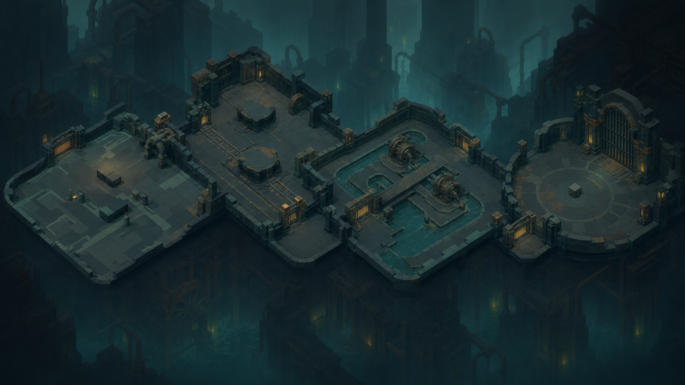
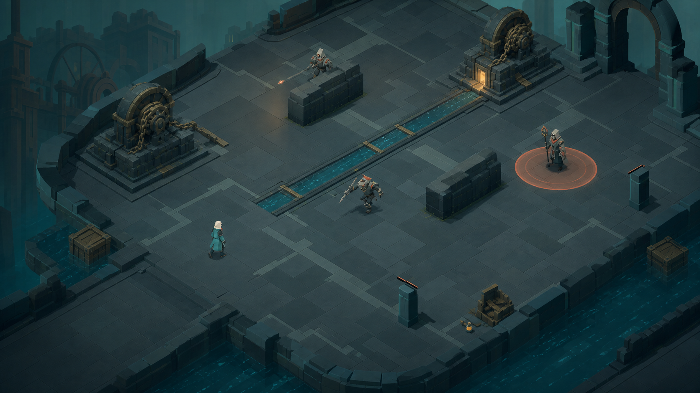
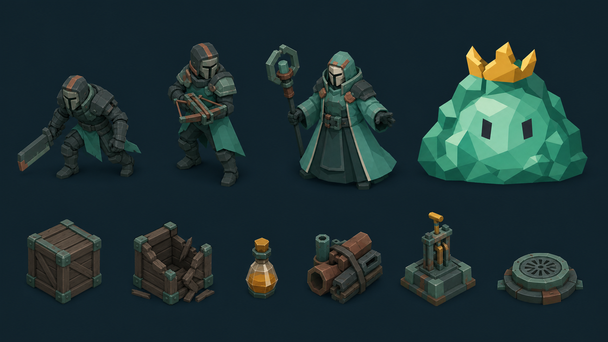

# Flooded Works Floor 1 Map and Enemy Foundation - Execution Plan

The current 19.8 x 19.8 m Movement Check becomes the optional tutorial entry to
one connected, authored Floor 1. Six executable phases add room streaming,
three coordinated moving enemy roles, three terrain compositions, destructible
props and potion pickups, Slime King, then audio settings and production-style
validation. Progression spending remains outside this plan, but its reward and
transition contracts are fixed in the related upgrade specification.

## Purpose

- Objective: turn the current static-target sandbox into a short connected run
  whose terrain, objectives, enemies, props, and boss can be judged in play.
- Final artifact: Movement Check -> Foundry Approach -> Pump Gallery -> Pressure
  Vault -> Slime King Reservoir, connected by in-world gates and short fades.
- Completion state: the built game supports the full room route, every ordinary
  enemy moves and completes repeated attacks without stalling, non-arena rooms
  do not require extermination, props and potion pickups work exactly once, and
  the owner can judge whether the floor is worth expanding.

## Why / Context

The current build proves movement, facing, melee, ranged attack, dash, guard,
potion use, cover collision, raster actor presentation, and a following camera.
It does not yet contain enemy AI, navigation, room flow, a boss runtime, drops,
or audio playback. The next useful question is therefore not whether more UI or
economy can be restored; it is whether a sequence of authored combat spaces can
produce readable pressure and different tactical decisions with the current
Traveler.

The retired platformer at `7cc069c` contains useful data-boundary ideas, but its
gravity, ropes, fixed jump trajectories, side-view rooms, and broad economy are
not runtime sources. This plan reuses only reviewed concepts: stable content IDs,
typed reward transactions, data-driven cards/equipment, forward room flow, and
explicit non-extermination completion policies.

## Pre-plan Evidence Already Verified

| Source or path | Verified fact | Decision affected | Freshness or recheck boundary |
| --- | --- | --- | --- |
| `master` at `fd42f96`; `git status` on 2026-07-18 | Master is 17 commits ahead of `origin/master`; pre-existing `.import` changes are unrelated and must not be staged with this work. | Work in scoped commits and preserve unrelated import metadata. | Recheck before every commit. |
| `./tools/godot.ps1 --version` | Local engine is `4.7.stable.official.5b4e0cb0f`. | Use Godot 4.7 GDScript and current 3D APIs. | Recheck if the wrapper or project feature version changes. |
| `validate_movement_and_actions.gd`, run 2026-07-18 | Current raster world, movement, lateral gait, dash, attacks, guard, projectile collision, camera, targeting, potion, pulse, and pause contracts pass. | Preserve the player foundation while extracting it from the one-room scene. | Rerun after each phase touching shared runtime. |
| `CombatSandbox3D.tscn`; `combat_sandbox_3d.gd` | One room owns architecture, player, camera, fixtures, and HUD together; it has no room transition or navigation owner. | Extract persistent actors/camera/HUD from room-owned geometry before adding content. | Recheck before Phase 1. |
| `traveler_3d.gd`; `proof_projectile_3d.gd` | Player attacks use direct method calls; ordinary ranged shots collide with `World` and `Enemy`. | Introduce a typed damage request without changing the accepted action timings or input. | Recheck after any player-combat refactor. |
| `docs/product/isometric_action_rpg_product_brief.md` | Route, three ordinary roles, room objectives, controls, boss patterns, and non-extermination rules are already product requirements. | The plan implements that authored proof rather than inventing procedural breadth. | Recheck if the product brief is superseded. |
| `art/world/flooded_works/README.md`; `docs/design/UI_VISUAL_SYSTEM.md` | Drowned foundry, broad flat color masses, no outlines/noise, close-hue foregrounds, and separable gameplay props are accepted. | All new rooms and actor assets stay in one art family and keep gameplay state separate. | Recheck before asset production. |
| `art/ui/production/asset-manifest.json` | Potion, material, card, equipment, Slime King, and boss-core illustrations already have stable IDs. | Reuse UI identity assets later; do not crop concept boards into runtime sprites. | Recheck when the manifest changes. |
| Git `7cc069c`: `CardDefinition`, `RewardTable`, `RewardService`, equipment resources | The retired build separated data, resolution, transaction, and UI responsibilities. | Recover boundary ideas only; rewrite every runtime owner for current 3D combat. | Historical source; never cherry-pick wholesale. |
| [Godot NavigationAgent3D](https://docs.godotengine.org/en/4.7/classes/class_navigationagent3d.html), accessed 2026-07-18 | Setting a target requests a path; `get_next_path_position()` must be advanced from the physics loop, while the parent remains responsible for movement. | `EnemyMotor3D` owns velocity and calls the agent once per physics frame. | Recheck only if the pinned engine changes. |
| [Godot NavigationObstacle guidance](https://docs.godotengine.org/en/4.7/tutorials/navigation/navigation_using_navigationobstacles.html), accessed 2026-07-18 | Dynamic obstacles are soft avoidance, not a substitute for a correct navigation mesh or narrow-space pathfinding. | Permanent geometry is baked; destructibles never define critical connectivity and keep wide side clearance. | Recheck if destructibles are allowed to gate routes. |
| [Godot AudioServer](https://docs.godotengine.org/en/4.7/classes/class_audioserver.html) and [saving guidance](https://docs.godotengine.org/en/4.7/tutorials/io/saving_games.html), accessed 2026-07-18 | Audio buses expose linear/dB volume, and `ConfigFile` is the intended user-configuration store. | Add Master/SFX buses and persist only those settings. | Recheck if music or a broader settings schema enters scope. |

## Locked Decisions

| Topic | Final decision | Rationale / source |
| --- | --- | --- |
| World form | Use five authored room scenes loaded one at a time under a persistent floor runtime. | A single huge scene wastes memory, complicates reset/navigation, and is not required for connectedness. |
| Connection | Every room ends at a matching Flooded Works gate. Transition locks input, fades out in 0.18 s, swaps the room, places the Traveler at the paired entry marker, and fades in in 0.18 s; target total is under 0.60 s. | Reads as one facility while keeping each encounter testable. |
| Route | Movement Check -> Foundry Approach -> Pump Gallery -> Pressure Vault -> Slime King Reservoir. A post-Foundry transition hook is reserved for the future card reward without blocking this map/enemy plan. | Matches the proof brief and keeps progression implementation separate. |
| Tutorial gate | Movement Check remains optional practice. Its north gate is available from the start; no forced checklist blocks the run. | The player can practice or immediately reach moving enemies. |
| Terrain | All gameplay stays on one X/Z ground plane. Rooms vary through footprint, permanent cover, non-walkable water channels, machinery, and hazard placement, not stacked floors. | Preserves the accepted simulation/presentation split. |
| Camera | Reuse the fixed orthographic angle and actor scale. Each room supplies camera bounds; foreground walls remain absent or below the Traveler silhouette. | Prevents the visibility regression already identified by the owner. |
| Navigation | Each room has one editor-baked `NavigationRegion3D`. Permanent walls/cover are baked; movable or destructible props never create the only route. | Deterministic, inspectable paths with no runtime rebake dependency. |
| Ordinary roster | Implement exactly three roles: Pursuer, Shooter, Controller. Variance comes from placement, objective pressure, and later data variants, not unrelated enemy systems in this slice. | Smallest roster that tests close pressure, cover, and area denial. |
| Coordination | One close-commit token and one pressure-commit token exist per encounter. Pursuers share the close token; Shooter and Controller share the pressure token. Waiting enemies keep repositioning. | At most two meaningful simultaneous threats remain readable. |
| Attacks | Every enemy attack has startup, active, recovery, interruption, and defeat cleanup. Only the active startup/impact warning is shown; paths and predicted trajectories stay hidden. | Behavior should be understandable without debug-like UI. |
| Projectile collision | Ordinary enemy projectiles stop on permanent cover, intact crates, or the first valid target. | Resolves the prior terrain-piercing failure. |
| Player interaction | Keep arrows, Space, Shift melee, `Z` ranged, `X` guard, `C` potion, and Esc. Add `V` / gamepad west-face as the only interact action for pumps, doors, and later rewards. | Keeps interactions distinct without displacing accepted combat controls. |
| Props | Add waterlogged supply crates, potion-charge pickups, pump stations, and pressure vents. Props are authored components, never baked into backgrounds. | Supplies readable world interaction without opening the economy. |
| Crate behavior | A crate has 20 health, breaks from one standard melee or two ranged hits, blocks actors/projectiles while intact, drops at most once, and never defines route connectivity. | Makes both attacks useful and avoids soft-locks. |
| Potion pickup | A loose potion grants one charge up to the cap of three. At cap it remains on the ground; it never auto-converts or disappears. | No invisible waste or economy dependency. |
| Materials/cards/equipment | No material wallet, Forge, skill tree, card effect, equipment mutation, or permanent save is implemented by this plan. Their exact ownership and source matrix live in the related upgrade spec. | Honors the request to document progression for later while focusing implementation on maps/enemies. |
| Audio | The current repo has no playable audio asset. Add Master and SFX buses at 100% defaults and an in-run pause settings panel, but do not source new sounds in this plan. | Corrects the current-state assumption without adding an external asset dependency. |
| Art production | The three generated boards are composition evidence only. Runtime enemies, props, and room surfaces require separate normalized assets and manifest entries. | A multi-object concept sheet is not a valid sprite atlas. |

## Rejected Alternatives

| Alternative | Why it was viable | Why it was rejected |
| --- | --- | --- |
| One seamless Floor 1 scene | No loading fade and a single physical layout. | Couples all encounters, navigation, reset state, and art memory before the loop is proven. |
| Procedural/chunk-generated rooms | Could create more layouts quickly. | Repetition and encounter-quality problems would be harder to diagnose; authored rooms are the current product requirement. |
| Restore retired Flooded Works rooms | Existing room IDs and layouts were broad. | They encode platform traversal, ropes, verticality, and side-view collision. |
| Bake props/enemies into room images | Fast visual fidelity. | Breaks collision/state ownership and prevents reuse, damage, drops, and readable movement. |
| Runtime navigation rebake on every crate break | Opens exact geometry after destruction. | Unnecessary cost and complexity because crates do not gate critical paths. |
| Independent enemy attacks with no coordinator | Simplest individual AI. | Mixed groups can produce unreadable overlapping startups and unavoidable damage. |
| Persistent lock-on, path lines, or attack trajectories | Makes AI intent explicit. | The owner rejected debug-like overlays; startup pose/telegraph/recovery are sufficient. |
| Random per-kill loot showers | Immediate reward feedback. | Adds visual noise and progression state before its spending loop exists. |
| Restore the retired progression runtime | Feature-rich and already typed. | Its triggers, equipment assumptions, save schema, and platform combat are no longer valid. |

## Visual Direction

These images explain composition and asset boundaries. They are not runtime
atlases, collision maps, navigation meshes, or exact object counts.



The floor reads as one facility, but each room changes its large terrain shape:
dry intake slab, foundry presses/rails, crossed water channels and pumps, then a
circular pressure/boss threshold. Matching gates, palette, fog, and machinery
provide continuity.



The actual camera sees only part of a larger room. The Pursuer closes through an
open lane, the Shooter relocates behind permanent cover, and the Controller owns
one warning area. Pumps, crates, potion, water, and exit are separable components.



Role identity comes from silhouette and tool, not unrelated colors: low/forward
Pursuer, taller crossbow Shooter, wide/grounded Controller, and larger Slime King.
The lower row defines the prop family but must be regenerated as individual
runtime assets with required states.

## Current State

Already true:

- `PivotRoot` boots directly into `CombatSandbox3D`.
- Movement Check has a 19.8 x 19.8 m floor, four low boundaries, one north gate,
  two permanent cover blocks, three resettable targets, and one training pulse.
- Traveler movement, camera-relative facing, soft targeting, melee, ranged, dash,
  guard, potion, damage, pause, reset, and raster presentation pass validation.
- Player projectiles already stop on `World` collision.
- The far Flooded Works panel and same-hue architecture albedo are in use.
- No enemy AI, navigation region, room host, encounter objective, drop component,
  boss runtime, audio stream, audio bus layout, or settings store exists.

Remaining implementation is exactly Phases 1-6. The progression spec is an
adjacent future contract, not a hidden seventh phase.

## Scope / Non-scope

In scope:

- persistent Traveler/camera/HUD plus single-room loading and paired gate flow;
- Movement Check migration and four new authored room scenes;
- one navigation plane per room and three moving ordinary enemy roles;
- encounter coordination, projectiles, zones, interruption, defeat, and cleanup;
- arena-clear, two-pump activation, 45-second survival, and boss-defeat objectives;
- waterlogged crates, one-charge potion pickups, pump stations, pressure vents;
- Slime King room and the four already specified boss patterns;
- objective/boss UI needed to understand this floor;
- Master/SFX settings infrastructure and a live-screen pause panel;
- native/headless validators, rendered captures, Web export, and built-app review.

Out of scope:

- material wallet, Forge, merchant, skill/stat tree, equipment inventory, card
  effect runtime, persistent progression, or profile migration;
- procedural generation, random room graphs, alternate biomes, multiple floors,
  minimap, quests, narrative scripting, or a main menu;
- player jump, ropes, platform geometry, stacked navigation, stairs as gameplay
  elevation, or a free camera;
- importing new third-party assets, music, or sound effects;
- using generated concept boards directly as production sprites or textures.

Destructive or irreversible actions:

- none; migration of `CombatSandbox3D` must use a scoped rename/extraction and
  keep the existing validation fixture recoverable through Git history.

Exact actions requiring owner approval:

- any external asset/dependency, paid or free;
- a change to accepted player controls other than the additive `V` interact;
- a second ground elevation or seamless/open-world streaming;
- implementing progression beyond the related specification;
- merging, pushing, publishing, or deploying.

## Assumptions

- The user-visible term “connected” means consistent in-world gates and short
  room transitions; it does not require every room to be resident simultaneously.
- The current camera angle, Traveler scale, combat timings, and close-hue raster
  world are the baseline to preserve.
- Concept images communicate target composition, not pixel-accurate runtime art.
- Physical gamepad availability is not assumed for automated checks; input-map
  parity is validated structurally and a physical-device gate remains manual.

## Open Questions

None. `V` interact, linear authored route, room-by-room loading, three ordinary
roles, exact objectives, prop behavior, upgrade boundary, and audio-setting scope
are fixed for execution. New owner feedback may supersede them before Phase 1.

## Proposed Design

### Floor route and transition flow

```text
Movement Check (optional practice; exit open)
  -> north gate / short fade
Foundry Approach (five enemies, two waves, deliberate arena clear)
  -> transition hook: card_reward (future owner; non-blocking in this plan)
Pump Gallery (activate Pump A + Pump B; living enemies allowed)
  -> north gate
Pressure Vault (survive 45 s; living enemies allowed)
  -> reservoir gate
Slime King Reservoir (boss defeat)
  -> result hook
```

Only the active room is instanced. `FloorRouteController3D` owns the ordered room
definitions, transition lock, fade, current room snapshot, paired entry marker,
and next-room preload. It does not own objective logic or upgrade behavior.

### Persistent runtime composition

```text
PivotRoot
  FloorRuntime3D
    FloorRouteController3D
    RoomHost                 exactly one active room
    Traveler3D               persists across room swaps
    CameraRig3D              reads active room camera bounds
    ProjectilesAndEffects    cleared at transition/retry
    HUD                      health, potion, objective, boss, pause/settings
```

Each room scene owns only its environment and encounter contract:

```text
FloodedWorksRoom3D
  Architecture
  Collision
  NavigationRegion3D
  EntryMarkers/FromPrevious
  ExitDoor
  CameraBounds
  EnemySpawns
  PropSpawns
  EncounterRuntime3D
```

### Room construction matrix

| Room | Footprint | Terrain silhouette | Objective and enemy placement | Props | Exit rule |
| --- | --- | --- | --- | --- | --- |
| Movement Check | Existing 19.8 x 19.8 m | Dry intake slab, two permanent cover blocks, cutaway edges | No live AI; targets/pulse remain optional practice | None | North gate available immediately |
| Foundry Approach | 28 x 22 m | Broken press bases and two broad rail lanes; dry floor | Wave 1: two Pursuers from north corners. Wave 2: Pursuer center-north, Shooter west behind cover, Controller east with open escape lane. | Two margin crates; one authored loose potion if entry charges are below two | All five enemies defeated; the only ordinary arena clear |
| Pump Gallery | 30 x 24 m | Crossed dark-teal water channel, two wide dry crossings, Pump A west and Pump B east | One Pursuer starts center, Shooter starts north with a cover-separated sightline, Controller guards the farther pump | Two margin crates, two pump stations, one inert vent landmark | Both one-second pump activations; damage interrupts; enemies may live |
| Pressure Vault | 26 m diameter | Circular pressure chamber, radial permanent cover, four vent sockets | Start: Pursuer + Shooter. At 15 s: Pursuer + Controller. At 30 s: two Pursuers + Shooter; maximum six alive. | Four timed vents; one side potion pickup available at 20 s if below cap | 45 seconds; no new spawns after completion; enemies may live |
| Slime King Reservoir | 30 m diameter | Open reservoir basin, low ring edge, two pressure-node sockets, clear safe lanes | Slime King only; lane charge, landing slam, poison safe bands, pressure nodes | No crates during boss; guaranteed future reward socket after defeat | Boss defeated |

Room coordinates and spawn anchors are authored in scenes; encounter resources
reference anchor IDs, not raw global positions. A validator rejects missing or
duplicate anchors before runtime.

### Enemy roster and movement contract

| Role | Health / move | Positioning | Attack | Coordination token | Required recovery behavior |
| --- | --- | --- | --- | --- | --- |
| Pursuer | 48 HP; 4.4 m/s | Repath toward a 1.4-2.0 m engagement ring, choose a flank when another Pursuer owns the front lane | 12 damage; `0.35 / 0.18 / 0.45` startup/active/recovery straight lunge | Close | Releases token on recovery/interruption; immediately resumes flank movement |
| Shooter | 36 HP; 3.6 m/s | Maintain 7-9 m, strafe to regain line of sight, retreat below 5 m | 10 damage; `0.55 / projectile / 0.60`; 10 m/s ordinary bolt | Pressure | Projectile dies on World/crate/player; Shooter selects a new lateral anchor after each shot |
| Controller | 56 HP; 3.0 m/s | Maintain 6-8 m and avoid sharing the Shooter lane | 8 damage; `0.80 / 1.50 / 0.80`; 1.8 m zone locked to the sampled player ground position | Pressure | Zone is removed on interruption/defeat/room exit; Controller relocates before requesting another token |

Shared movement rules:

- `EnemyActor3D` is a `CharacterBody3D`; the feet remain at Y=0 and visual height
  never changes path, damage, cover, or targetability.
- `NavigationAgent3D` supplies the next path position. `EnemyMotor3D` calculates
  velocity, separation, acceleration, braking, and `move_and_slide()`.
- Target position is refreshed at 5 Hz or after the Traveler moves 1 m; the next
  path position is still advanced once every physics frame.
- Permanent cover/walls are baked. Destructible crates have at least 1.4 m side
  clearance and use soft avoidance only; they never block the only route.
- If commanded movement displaces less than 0.15 m over 0.75 s, the motor first
  refreshes the path, then samples a 1.5 m lateral reachable point. A third
  failure within five seconds aborts the pending attack, returns to the role
  anchor, and records one warning; it never teleports in view.
- Waiting for a threat token never means standing still. Pursuers flank; Shooter
  and Controller seek valid role-distance anchors.
- No ordinary enemy deals passive contact damage outside an explicit active
  attack window.

### Combat interaction matrix

| Traveler action | Enemy | Permanent cover | Intact crate | Pump/vent | Pickup |
| --- | --- | --- | --- | --- | --- |
| Shift melee | Damage + stagger inside committed hit | Stops | Damages; one normal hit breaks | No damage | No effect |
| `Z` ranged | Damage + stagger on first hit | Projectile terminates | Projectile terminates and damages; two shots break | No damage | No effect |
| Space dash | Invulnerable for current accepted window; does not damage without a future card | Cannot cross | Cannot cross | Can cross an active warning/zone but not solid base | Can collect when ending in radius |
| Held `X` guard | Reduces blockable Pursuer/Shooter damage by 65% | N/A | N/A | Pressure-zone damage is non-blockable | N/A |
| `V` interact | No effect | Door only when unlocked | No effect | Holds pump for 1.0 s; damage interrupts | Pickups remain proximity-based |

The damage request therefore adds `amount`, `stagger`, `source_id`, `team`, and
`blockable`. Player/enemy/prop receivers share the transaction shape, but each
receiver decides what categories it accepts. Enemy attacks do not break crates.

### Props, pickups, and loose-item policy

| Component | Runtime state | Placement rule | Result |
| --- | --- | --- | --- |
| Waterlogged crate | intact -> hit flash -> broken | Side margins/alcoves only; never a critical chokepoint | Disables solid collision and navigation avoidance, plays one break effect, resolves one authored drop |
| Potion-charge pickup | available -> collected | Visible ground slot with 0.8 m collection radius | Adds one charge if below three; otherwise remains available |
| Pump station | idle -> activating -> active | One open escape lane around every console | Holds for 1.0 s; damage cancels progress; active state persists for the room snapshot |
| Pressure vent | recovery -> warning -> active | Never overlaps all safe ground; permanent base is readable | Warning 0.8 s, active 0.18 s, recovery 2.5 s; clears on objective/room exit |
| Future material pickup | specified, not implemented | Reward sockets are reserved but empty in this plan | Related upgrade spec owns transaction and persistence |

Cards and equipment never appear as tiny random floor drops. Major encounters
use a future full choice surface; blueprints/equipment use an authored cache or
boss receipt. This prevents important rewards from being lost in combat clutter.

### Art and presentation boundary

- Keep the approved far background as a non-interactive negative layer. Room
  geometry, cover, water, enemies, props, telegraphs, and pickups remain live.
- Reuse the current foundry albedo during graybox composition. Do not import
  additional Kenney assets unless the existing adopted subset cannot express a
  required silhouette and the owner approves the scope.
- First enemy pass uses clear diagnostic 3D bodies with role silhouettes. After
  behavior acceptance, produce separate normalized raster atlases for Pursuer,
  Shooter, Controller, Slime King, crate states, pump states, vent states, potion,
  projectile, and impact/telegraph effects.
- Ordinary enemy materials stay in one charcoal/teal family. Small coral or
  mustard accents communicate role/action; variation does not come from unrelated
  palettes, outlines, grain, or dense surface markings.
- Camera-facing walls stay below the Traveler or are omitted. Tall back walls
  never sit between camera and active combat.

### Progression integration seam

The map/enemy runtime emits typed reward context without applying a reward:

```text
RewardSourceContext
  source_id
  room_id
  source_kind       encounter | prop | boss
  reward_table_id
  transaction_key
```

This plan creates only the interface and authored source slots required by
future progression. `progression_upgrade_system_spec.md` owns cards, materials,
equipment, skill/stat upgrades, settlement, and persistent state. No current
enemy or prop script branches on a card/equipment/material ID.

### Audio and settings boundary

- Current audio state is empty; no hidden stream is assumed.
- `default_bus_layout.tres` contains `Master` and `SFX`, both defaulting to 1.0
  linear volume. Future gameplay streams must target `SFX` explicitly.
- `PivotSettingsStore` persists only `audio/master_volume` and
  `audio/sfx_volume` to `user://cardborne_pivot_settings.cfg`.
- Missing/malformed values restore 1.0 and log one concise warning.
- Esc pauses the tree and retains/dims the live room. The panel exposes Resume,
  Restart Room, Master, SFX, and Exit; it does not use a separate backdrop.
- No music bus appears until a music stream enters an approved plan.

## Architecture and Ownership

| Concern | Final owner | Interface or invariant | Existing owner to reuse or retire |
| --- | --- | --- | --- |
| Input registration | `scripts/main/pivot_root.gd` | Existing controls plus `interact`; no gameplay behavior | Extend current `_register_input_map()` |
| Persistent floor runtime | `scenes/run/FloorRuntime3D.tscn`; `scripts/rooms/floor_route_controller_3d.gd` | Exactly one active room; persistent Traveler/camera/HUD; transition lock | Extract from `CombatSandbox3D.tscn` |
| Room data | `scripts/rooms/room_definition_3d.gd`; `data/rooms/flooded_works/*.tres` | Stable room ID, scene, entry/exit, camera bounds, next ID, transition hook | New; no retired `RoomTemplateData` port |
| Room scene contract | `scripts/rooms/flooded_works_room_3d.gd` | One nav region, named anchors, encounter, exit door | Migrate current sandbox geometry |
| Camera | `isometric_camera_3d.gd` | Reads active room bounds; angle/size remain accepted | Reuse and remove hard-coded center limits |
| Damage transaction | `scripts/combat/damage_request_3d.gd`; receiver methods | One source/target activation hit; blockable is explicit | Replace positional integer-only method calls |
| Enemy actor | `scripts/enemies/enemy_actor_3d.gd` | Health, stagger, target point, interruption, defeat cleanup | New; dummy remains a fixture |
| Enemy movement | `scripts/enemies/enemy_motor_3d.gd`; child `NavigationAgent3D` | Agent supplies path; motor owns velocity/motion | New |
| Enemy decisions | `scripts/enemies/enemy_brain_3d.gd`; role scripts | Explicit state transitions only | New; no retired platform AI port |
| Threat coordination | `scripts/encounters/threat_coordinator_3d.gd` | One close + one pressure token; movement never blocked | New |
| Objectives | `scripts/encounters/encounter_runtime_3d.gd`; `objectives/` | Objective alone unlocks exit | New; no global all-enemies-dead fallback |
| Props | `scripts/rooms/props/`; `scenes/rooms/components/` | State, collision, drop, and presentation remain separate | New; old 2D destructible is evidence only |
| Boss | `scripts/bosses/`; `data/bosses/flooded_works/` | Every damaging pattern has startup/active/recovery/safe response | Rebuild from active product spec |
| UI | `scripts/ui/proof/`; `scenes/ui/proof/` | Present snapshots and emit intents only | Split current sandbox HUD into reusable floor HUD/pause |
| Settings | `scripts/autoload/pivot_settings_store.gd`; `default_bus_layout.tres` | Master/SFX only; run state never serialized | New |
| Future progression | `docs/product/progression_upgrade_system_spec.md` | Typed reward context; no implementation in this plan | Reuse retired boundary concepts only |

## As-Is / To-Be Delta Map

| Concern | As-is | To-be | Acceptance check | Guard / leftover check |
| --- | --- | --- | --- | --- |
| World | One monolithic sandbox scene | Persistent runtime plus five room scenes | Traverse every gate twice without stale state | No duplicate Traveler/camera/HUD under rooms |
| Map variation | One dry square | Dry foundry, water-channel gallery, circular pressure/boss spaces | Each room silhouette is identifiable without palette changes | No stacked nav or platform geometry |
| Enemies | Three static resettable dummies | Three moving roles plus Slime King | Each ordinary role performs three legal cycles and recovers from obstruction | No fixed jump path, passive contact damage, or indefinite idle |
| Coordination | None | Close/pressure token lanes | Mixed encounter never commits more than two threats | Waiting enemies still reposition |
| Objectives | Reset key only | Clear, activation, survival, boss defeat | Pump/Pressure complete with an enemy alive | No universal extermination fallback |
| Props | Permanent cover only | Destructible crate, potion, pump, vent | Every state transitions once and resets from snapshot | Background art owns no prop state |
| Damage | Integer method calls | Typed request including blockability/stagger/team | Guard, zone, projectile, crate cases match matrix | UI/presentation cannot apply damage |
| Projectiles | Player proof bolt | Player + enemy bolts stop on World/props/target | Cover fixture terminates both directions | No ordinary piercing flag |
| Audio/settings | No streams/buses/store | Master/SFX defaults and pause panel | Missing/malformed config and restart pass | No run/progression serialization |
| Progression | None | Interface/spec only | No map/enemy code knows a reward effect ID | No wallet, Forge, cards, equipment, save code lands |

## Milestones

1. Persistent runtime and two connected rooms prove loading, camera bounds, and reset.
2. Foundry Approach proves three moving roles, cover, coordination, and arena clear.
3. Pump Gallery proves props, potion, interaction, and non-extermination activation.
4. Pressure Vault proves sustained spawning, vents, survival, and cleanup.
5. Slime King Reservoir completes the floor and raster presentation target.
6. Audio settings, Web build, continuous play, and owner review close the plan.

## Tasks

### Phase 1: Extract the persistent floor runtime and connect Movement Check

Goal: preserve current combat behavior while making rooms replaceable.

Source owners touched: `PivotRoot.tscn`, `pivot_root.gd`,
`CombatSandbox3D.tscn`, `scripts/rooms/`, `scenes/run/`,
`scenes/player/Traveler3D.tscn`, `isometric_camera_3d.gd`, room data, validation.

- [ ] **1.1 Reconcile the control/authority docs and add interact.**
  - As-is: current runtime and product brief agree on Shift melee / Z ranged /
    X guard, but `.agent/Prompt.md` retains an obsolete mapping and no interact.
  - To-be: align active documentation and InputMap; add `interact` on `V` and
    gamepad west-face without changing existing actions.
  - Accept: the input validator sees every exact binding and no duplicate
    keyboard event across combat/interact actions.
  - Guard: no contextual combat substitution enters interaction handling.
- [ ] **1.2 Extract the persistent actor/camera/HUD runtime.**
  - As-is: room scene owns Traveler, camera, projectiles, and HUD.
  - To-be: create `FloorRuntime3D`, an instanced Traveler scene, RoomHost,
    persistent camera/effects/HUD, and route controller.
  - Accept: current Movement Check behaves identically after extraction and the
    existing movement/action validator still passes.
  - Guard: room scenes contain no Traveler, camera, or duplicate global HUD.
- [ ] **1.3 Migrate the sandbox into `MovementCheck3D` and add room definitions.**
  - As-is: one testbed with hard-coded reset traversal.
  - To-be: move environment/fixtures into the first Flooded Works room, add
    contract anchors/navigation/camera bounds/open north exit, and define the
    five-room route resources.
  - Accept: room-contract validation finds one nav region, unique markers, one
    exit, and exact next-room IDs for every definition.
  - Guard: the retained background remains decorative and no room resource stores
    arbitrary absolute player positions.
- [ ] **1.4 Implement transition, snapshot, and cleanup.**
  - As-is: no room change.
  - To-be: lock input, fade, clear projectiles/effects, swap scene, restore the
    Traveler snapshot, apply room camera bounds, and place at paired entry.
  - Accept: loop Movement Check -> temporary Foundry fixture -> Movement Check
    20 times with one Traveler, one camera, one HUD, and no orphan projectiles.
  - Guard: transition hooks cannot mutate combat or progression state directly.

Batch acceptance: current movement/action checks pass, room contract checks pass,
and the first gate transition remains under 0.60 s in the native build.

Batch guard: no enemy, drop, boss, card, wallet, or settings implementation yet.

### Phase 2: Implement moving enemy foundations and Foundry Approach

Goal: deliver one fair mixed encounter whose actors continuously navigate,
position, attack, recover, and clean up.

Source owners touched: `scripts/combat/`, `scripts/enemies/`,
`scripts/encounters/`, `scenes/enemies/flooded_works/`,
`data/enemies/flooded_works/`, `FoundryApproach3D.tscn`, validation fixtures.

- [ ] **2.1 Introduce the typed 3D damage request.**
  - As-is: player/dummy/pulse methods pass positional integers and source IDs.
  - To-be: one typed request/result carries damage, stagger, team, source, and
    blockability; adapt Traveler, dummy, pulse, melee, and projectile without
    changing accepted timings or values.
  - Accept: old fixtures produce the same health/stagger outcomes, guard reduces
    blockable damage by 65%, and non-blockable pressure damage bypasses guard.
  - Guard: presentation, animation, and UI cannot construct authoritative hits.
- [ ] **2.2 Implement `EnemyActor3D`, `EnemyMotor3D`, and navigation contracts.**
  - As-is: no moving target or navigation region consumer.
  - To-be: add actor health/stagger/targetability, agent-supplied paths,
    motor-owned movement/separation, role anchors, and deterministic stuck recovery.
  - Accept: an obstruction fixture runs for 60 seconds with no enemy stationary
    over 1.5 seconds outside startup/active/recovery/stagger.
  - Guard: the agent never directly moves the parent and no Y-axis gameplay motion exists.
- [ ] **2.3 Implement Pursuer, Shooter, and Controller state machines.**
  - As-is: static dummies only.
  - To-be: implement exact roster values/states, enemy projectile collision,
    Controller zone ownership, interruption, and defeat cleanup.
  - Accept: each role completes three attack cycles, can be interrupted, resumes
    legal positioning, and leaves no hitbox/projectile/zone after defeat.
  - Guard: no passive contact damage, fixed jump track, trajectory overlay, or
    attack outside an active state.
- [ ] **2.4 Add threat coordination and build Foundry Approach.**
  - As-is: no mixed encounter or objective owner.
  - To-be: add close/pressure tokens, two fixed waves, permanent cover, spawn
    anchors, arena-clear objective, exit unlock, and deterministic retry.
  - Accept: five enemies spawn in the exact matrix; only arena clear unlocks the
    gate; Shooter shots terminate on cover; no more than two threats commit.
  - Guard: enemy scripts do not decide room completion or spawn the next wave.

Batch acceptance: complete Foundry three times using melee-heavy, ranged-heavy,
and guard/dash-heavy play. No enemy stalls, projectile crosses cover, or stale
effect survives room retry/transition.

Batch guard: Pump, Pressure, props, upgrade rewards, and boss stay absent.

### Phase 3: Add destructible props, potion pickups, and Pump Gallery

Goal: make the next room tactically different through interaction and live props,
not through a larger extermination wave.

Source owners touched: `scripts/rooms/props/`, `scenes/rooms/components/`,
`data/items/pickups/`, `scripts/encounters/objectives/activation_objective_3d.gd`,
`PumpGallery3D.tscn`, validation.

- [ ] **3.1 Implement generic prop damage and one-shot drop resolution.**
  - As-is: only permanent cover is damageable through dummy-specific methods.
  - To-be: create the crate component with 20 health, collision/avoidance state,
    one break signal, one authored drop slot, and snapshot reset.
  - Accept: one melee or two ranged shots break it; enemy attacks do not; its
    drop resolves once across repeated hit callbacks and once again after retry.
  - Guard: crate placement never closes a critical navigation corridor.
- [ ] **3.2 Implement potion pickup and pump components.**
  - As-is: potions are starting charges only and no interaction action exists.
  - To-be: add generic pickup definition/presenter with the potion-charge effect;
    add one-second interruptible pump activation and persistent room state.
  - Accept: potion increments below cap, remains at cap, cannot double-collect;
    damage cancels pump progress and completed pumps do not reset mid-room.
  - Guard: no material/card/equipment effect enters the pickup resolver.
- [ ] **3.3 Build Pump Gallery and activation objective.**
  - As-is: Foundry is the only live enemy room.
  - To-be: author water-channel terrain, crossings, two pumps, cover, exact three
    enemies, props, optional potion condition, and non-extermination exit.
  - Accept: activate both pumps and leave while at least one enemy is alive;
    objective/door/HUD agree and new attacks cease after completion.
  - Guard: water has no hidden elevation or invisible slow effect in this phase.

Batch acceptance: clear the room by fighting everything and by activating under
pressure with enemies alive. Navigation, pickup, crate, pump, transition, and
retry state remain deterministic.

Batch guard: no material wallet, random drop table, reward choice, or persistent save.

### Phase 4: Add Pressure Vault survival and floor-route cleanup

Goal: prove sustained mixed pressure and a second non-extermination policy.

Source owners touched: `pressure_vent_3d.gd`, survival objective, encounter wave
resources, `PressureVault3D.tscn`, route controller, HUD, validation.

- [ ] **4.1 Implement the pressure vent state component.**
  - As-is: only the Movement Check pulse has a similar timing proof.
  - To-be: extract reusable warning/active/recovery ownership, non-blockable
    damage, per-activation hit limit, and cleanup while preserving safe ground.
  - Accept: each vent cycles with exact timing, hits at most once per activation,
    and becomes inert on objective completion/room exit.
  - Guard: vent visuals never become navigation or collision truth.
- [ ] **4.2 Build the 45-second survival encounter.**
  - As-is: fixed two-wave arena only.
  - To-be: add exact start/15 s/30 s waves, six-living cap, radial cover, vent
    sockets, side potion condition, timer objective, and north exit.
  - Accept: the timer completes at 45 s with living enemies; spawning stops,
    exit opens, and remaining actors unload only after transition.
  - Guard: no hidden kill count or global clear fallback gates completion.
- [ ] **4.3 Run the full ordinary-room route and transition hooks.**
  - As-is: rooms validated mostly in isolation.
  - To-be: play Movement -> Foundry -> Pump -> Pressure with health/potions
    preserved, room retry snapshots, clean transition hooks, and no duplicate state.
  - Accept: two consecutive routes including one death/retry have no stale enemy,
    objective, pump, vent, projectile, potion, or door state.
  - Guard: the unimplemented card-reward hook remains data/interface only and
    does not block the current route.

Batch acceptance: one ordinary route reaches the reservoir gate in the expected
four-to-six-minute pre-boss window and demonstrates three distinct room policies.

Batch guard: timing corrections change spawn timing/counts within this matrix,
not room count, controls, or progression scope.

### Phase 5: Add Slime King Reservoir and production raster presentation

Goal: close Floor 1 with the existing boss identity and replace diagnostic
enemy/prop visuals only after behavior is accepted.

Source owners touched: `scripts/bosses/`, `data/bosses/flooded_works/`,
`SlimeKingReservoir3D.tscn`, enemy/prop presentation scripts, new manifest-backed
assets under `art/world/flooded_works/isometric/`, HUD, validation.

- [ ] **5.1 Implement the boss scheduler and four patterns.**
  - As-is: retained Slime King illustration only.
  - To-be: implement 600 HP Slime King, lane charge, landing slam, poison safe
    bands, pressure nodes, explicit timing, neutral read time, and full cleanup.
  - Accept: every pattern exposes startup/active/recovery and reachable safe
    ground; scheduler never repeats a pattern or overlaps major patterns.
  - Guard: no platform arc, animation-owned hit, passive contact damage, or
    unavoidable full-room overlap.
- [ ] **5.2 Author the reservoir room and boss objective.**
  - As-is: Pressure gate has no destination.
  - To-be: add circular basin, low ring, node sockets, boss HUD, defeat exit/result
    hook, death/retry snapshot, and future reward source socket.
  - Accept: boss can be defeated, retried, and defeated again without stale
    nodes/zones/projectiles; result hook fires once.
  - Guard: no material/card/equipment grant is applied here.
- [ ] **5.3 Produce and integrate separate enemy/prop raster assets.**
  - As-is: generated concept board and diagnostic geometry.
  - To-be: create normalized state atlases and manifest entries for each role,
    boss, crate, pump, vent, potion, projectiles, impacts, and telegraphs.
  - Accept: every asset resolves, matches its collision ground point, remains
    readable at 960x540, and does not alter gameplay timing or geometry.
  - Guard: never crop the concept sheet into production; no outline/noise or
    unrelated role palettes enter runtime.

Batch acceptance: one complete native Floor 1 reaches and defeats Slime King with
readable enemies/props at all three supported viewports.

Batch guard: no Forge, inventory, permanent wallet, card effect, or additional biome.

### Phase 6: Add audio settings infrastructure and prove the built floor

Goal: close the supporting setting requested by the owner and validate the
production-style artifact without inventing audio content.

Source owners touched: `default_bus_layout.tres`,
`scripts/autoload/pivot_settings_store.gd`, pause UI, settings validation,
`tools/export_web.ps1`, route capture tools, project memory.

- [ ] **6.1 Add Master/SFX defaults and settings persistence.**
  - As-is: no audio buses, streams, store, or setting controls.
  - To-be: define two buses at 1.0, persist two ConfigFile keys, restore malformed
    values, and expose live pause sliders with keyboard/gamepad focus.
  - Accept: both values apply immediately, survive restart, and reset safely from
    a malformed file; pause retains the live room under a dim layer.
  - Guard: no music bus, sound asset, run state, or progression field is saved.
- [ ] **6.2 Run automated, rendered, performance, and continuous-play gates.**
  - As-is: only the Movement Check validator/captures exist.
  - To-be: run every new validator, capture all rooms at three viewports, export
    Web, start through the fastrun manager `codex` lane, and play the built route.
  - Accept: final gates pass, transitions remain under target, frame pacing and
    effect counts stay bounded, and no console warning/error occurs.
  - Guard: do not start an ad hoc server or use the editor build as final evidence.
- [ ] **6.3 Record the owner review boundary.**
  - As-is: no Floor 1 expansion decision exists.
  - To-be: record `Expand`, `Iterate`, or `Stop` for map/enemy quality plus one
    failed category if not expanding.
  - Accept: project memory links the build/captures and the progression spec;
    any upgrade implementation receives a separate active plan.
  - Guard: this plan does not silently continue into progression work.

Batch acceptance: the native and built Floor 1 both complete twice, audio settings
persist, and the owner outcome is recorded.

Batch guard: completion authorizes no push/publish or content expansion by itself.

## Test Plan

### Validation Cadence

Inner-loop commands:

- `./tools/godot.ps1 --path . --headless --import`
- `./tools/godot.ps1 --path . --headless --script res://tools/validation/validate_movement_and_actions.gd`
- phase-specific validators only after the owned behavior changes.

Planned focused validators:

- `validate_floor1_room_contracts.gd`: IDs, scene paths, one navigation region,
  paired markers, camera bounds, objectives, spawn/prop anchors, and next links.
- `validate_enemy_navigation_and_actions.gd`: three roles, repeated cycles,
  obstruction recovery, token caps, interruption, projectile/zone cleanup.
- `validate_foundry_encounter.gd`: exact waves, cover, arena exit.
- `validate_pump_gallery.gd`: crate/potion/pump states and living-enemy exit.
- `validate_pressure_vault.gd`: exact timed waves, cap, vent safety, 45 s exit.
- `validate_slime_king_floor1.gd`: scheduler, pattern timing, safe responses,
  cleanup, defeat/retry.
- `validate_floor1_route.gd`: two continuous routes, one death/retry, snapshot and
  transition cleanup.
- `validate_pivot_settings.gd`: defaults, save/load, malformed fallback, buses.

Batch gates:

- Current movement/action validator after every shared player/combat change.
- Room-contract and route validators after every room/transition change.
- Enemy/action validator after every AI/navigation change.
- Render current phase at 960x540, 1280x720, and 1920x1080.

Final gates:

- Full import and every validator pass with exit code 0.
- Web export through `./tools/export_web.ps1`.
- Production-style start through the fastrun manager `codex` lane after loading
  `$npjt-port-guard`.
- Built-app keyboard route, focus/pause/settings, death/retry, two consecutive
  clears, and browser-console review.
- Physical gamepad parity and a ten-minute feel pass remain owner/manual gates.
- Inspect `git diff --check`, scoped status, lifecycle metadata, and all local links.

Rerun policy:

- Rerun a failed narrow check only after a concrete change or new hypothesis.
- Rerun full gates only after the suspected cause changes.
- Record known non-blocking renderer/import warnings instead of rediscovering them.

## Predetermined Error Handling and Contingencies

| Trigger | Required response | Limit / escalation point |
| --- | --- | --- |
| Enemy lacks a valid path after map synchronization | Delay first target assignment one physics frame, verify the room map RID, then fail the room validator with actor/anchor IDs. | Do not add direct-through-wall fallback. |
| Enemy stalls | Apply the exact refresh/lateral/role-anchor sequence and record the last state/path point. | Three failures in five seconds abort the action; repeated fixture failure blocks the phase. |
| Dynamic crate avoidance causes crowding | Move the authored crate slot or increase side clearance; keep permanent nav mesh unchanged. | Never rely on a dynamic obstacle in a narrow corridor. |
| Pump/Pressure exit still waits for kills | Trace objective and door owners; remove any shared defeat fallback. | Any hidden kill dependency blocks the phase. |
| Projectile crosses cover | Inspect collision masks and first-hit order; add deterministic fixture before tuning speed. | Ordinary piercing is never an acceptable workaround. |
| Transition exceeds 0.60 s | Profile load/import and preload the next PackedScene after objective completion. | Do not keep every room resident as the first response. |
| Raster asset is unreadable at gameplay scale | Regenerate one asset with simpler silhouette/value grouping and revalidate downscale. | Do not compensate with outlines, glow, or oversized collision. |
| Generated concept board conflicts with runtime readability | Runtime contract wins; record the discrepancy in the concept evidence README. | Never bend collision/navigation to a concept image. |
| Audio config is missing/malformed | Restore both values to 1.0 and log one warning. | Boot must continue; no modal error. |
| Progression implementation becomes necessary for a map task | Stop at the typed reward/transition interface and open a separate plan from the active spec. | No wallet/card/equipment code in this plan. |

## Rollback / Safety

- Commit each phase separately after its batch gates pass.
- Preserve unrelated `.import` changes and never stage them with plan-owned files.
- Keep the current player timings, targeting, and presentation isolated from room
  migration so a room/AI phase can be reverted without losing accepted controls.
- Do not delete the original concept sources or generated-image originals.
- A failed room may be removed from the route resource without reverting the
  preceding validated rooms; do not hard-reset or rewrite unrelated history.
- No old save path is read or overwritten by this plan.

## Risks

- Extracting Traveler/camera/HUD from the current monolithic scene can subtly
  change node paths and initialization order; the existing validator is the guard.
- Navigation avoidance can appear correct in open space but fail near props;
  permanent geometry and authored clearance remain primary.
- Three roles can still feel repetitive if only their stats differ; room
  objectives, role distance, cover, and token behavior must create the variation.
- The route concept image shows more resident world than the runtime will load;
  gates/fog/lighting must carry continuity across fades.
- AI-generated roster art is a concept only and may not yield coherent animation;
  separate small atlases need their own production review.
- Adding audio controls without audio content can look premature; keep the panel
  minimal and truthful, and do not imply music exists.

## Decision Notes

- 2026-07-18: chose room-by-room loading instead of one seamless giant map.
- 2026-07-18: preserved the current deterministic proof route and made Movement
  Check an optional, non-gating tutorial.
- 2026-07-18: locked `V` as additive interact because the accepted combat cluster
  already occupies Shift/Z/X/C/Space.
- 2026-07-18: kept exactly three ordinary roles; visual/placement variants follow
  after the base roles prove distinct play.
- 2026-07-18: separated progression into an active future spec and prohibited its
  implementation inside this map/enemy plan.
- 2026-07-18: verified that current master has no playable audio asset and limited
  settings to Master/SFX infrastructure.

## Progress

- [x] Pre-plan repository, active spec, current runtime, retained art, old typed
  progression boundaries, and Godot 4.7 navigation/audio evidence inspected.
- [x] Three visual direction images generated and saved in the repository.
- [x] Upgrade-system future contract documented separately.
- [ ] Phase 1: persistent runtime and connected Movement Check.
- [ ] Phase 2: moving enemies and Foundry Approach.
- [ ] Phase 3: props, potion, pumps, and Pump Gallery.
- [ ] Phase 4: Pressure Vault and ordinary route.
- [ ] Phase 5: Slime King and raster presentation.
- [ ] Phase 6: audio settings, built validation, and owner decision.

## Next Steps

1. Execute Phase 1 only: reconcile controls, extract the persistent runtime, and
   connect Movement Check to a temporary Foundry fixture.
2. Do not generate production enemy art until the Phase 2 diagnostic actors pass
   navigation, coordination, and obstruction tests.
3. Continue one phase at a time, committing only after each batch gate.
4. Start progression implementation only after this floor receives an owner
   `Expand` decision and a separate plan is activated.

## Completion Criteria

- [ ] All five rooms load through matching gates with one persistent Traveler,
  camera, HUD, and clean transition state.
- [ ] Terrain silhouettes differ while palette, scale, gate language, camera, and
  one-plane navigation remain coherent.
- [ ] Pursuer, Shooter, and Controller move continuously, attack only through
  legal states, recover from obstruction, coordinate, and clean up on defeat.
- [ ] Ordinary enemy projectiles stop on permanent cover and intact crates.
- [ ] Foundry requires the fixed arena clear; Pump and Pressure complete with a
  living enemy; Slime King requires boss defeat.
- [ ] Crates, potion pickups, pumps, and vents satisfy every state/one-shot/reset check.
- [ ] No material wallet, Forge, card effect, equipment mutation, or persistent
  progression code appears in the implementation diff.
- [ ] Master/SFX settings default safely, persist, and render in a focused in-run panel.
- [ ] Every validator, viewport capture, Web export, and built continuous-play gate passes.
- [ ] No retired runtime owner, duplicate path, placeholder room, or unresolved
  material decision remains in this plan's scope.
- [ ] Durable decisions, prompts, assets, and run/verify commands are linked from
  canonical project documentation.

## Stop Conditions

Complete when:

- all completion criteria pass and the owner decision is recorded.

Escalate only when:

- a required external asset/dependency, control change, extra elevation, route
  expansion, or progression implementation becomes necessary;
- the same pathfinding/transition/art blocker persists after the exact contingency
  and two concrete correction attempts.

Do not stop when:

- one enemy needs tuning within the locked role/timing envelope;
- a room needs authored spawn/cover adjustments within its fixed footprint;
- a narrow validator or generated production asset needs a scoped correction.

## Handoff

```text
Goal:
Build the connected Flooded Works Floor 1 map/enemy foundation without restoring
platform traversal or progression breadth.

Read first:
AGENTS.md
docs/product/isometric_action_rpg_product_brief.md
.agent/execplans/2026-07-18-flooded-works-floor1-map-enemies.md
docs/design/concepts/flooded-works-floor1/README.md

Execute exactly:
Start at Phase 1. Preserve current player behavior, extract the persistent runtime,
and connect Movement Check before adding any enemy.

Validate with:
The current movement/action validator plus the phase-specific validators and
viewport/build gates listed above.

Stop when:
The current phase batch passes and has a scoped commit, or an explicit escalation
condition requires owner approval. Never cross into progression implementation.
```
