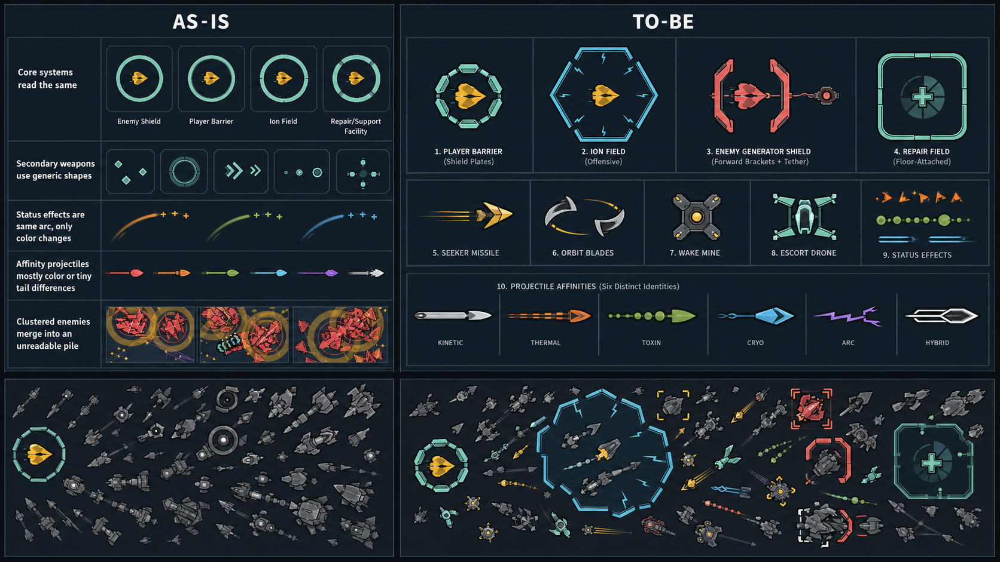
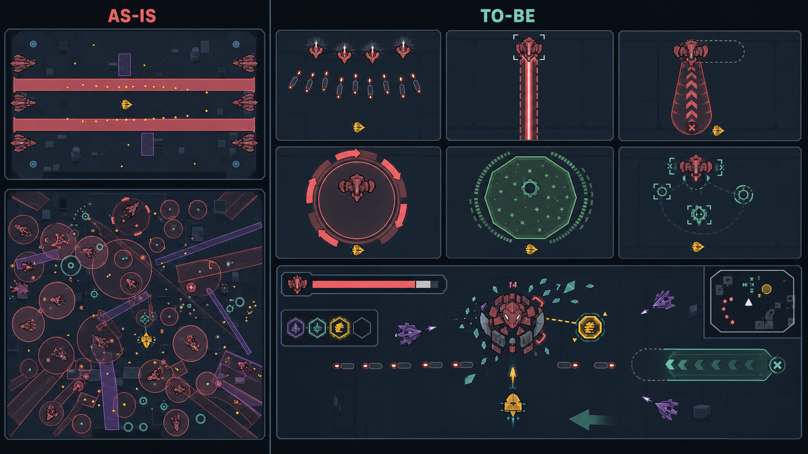
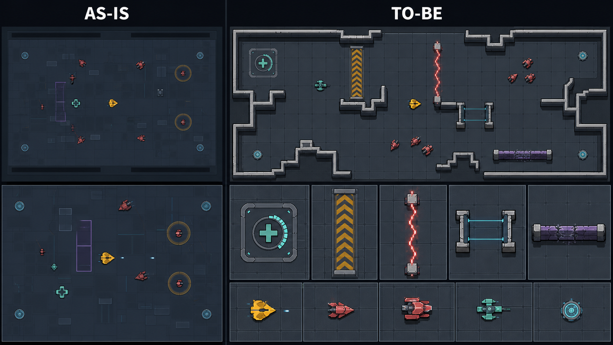

# 시맨틱 비주얼·맵·보스·군집 성능 전면 교정 실행 계획

## Purpose

현재 runtime에서 서로 다른 기능이 같은 원·다이아몬드·호 형태로 겹쳐
보이는 문제를 끝낸다. 방어막, 역장, 보조 무기, 상태 이상, 속성 탄환,
적 지원 효과, 공격 예고와 목표 표시는 색을 지워도 형태와 무늬만으로
구분되어야 한다.

맵은 장식 패널 위에 기능을 얹는 방식이 아니라 다음 세 계층으로 다시
구성한다.

1. 실제 보행 가능 영역에서 생성되는 단순한 구조 바닥 타일
2. 바닥과 명도·높이·외곽선이 명백히 다른 실제 충돌 벽
3. 수리, 과충전, 전격 위험, 이동 게이트, 파괴 가능한 격벽처럼 실제
   gameplay 기능이 있는 지형

보스는 피해 무효화를 폐기하고 봉인 상태에서도 실제 피해의 `20%`를
받는다. 플레이어가 무엇을 파괴하거나 어디로 이동해야 하는지 boss HUD,
기체 주변 threat radar, world arrow와 minimap objective marker가 함께
알린다. 다섯 보스는 같은 공격 목록의 순서만 바꾸지 않고 서로 다른
공간 판단과 반격 타이밍을 요구한다.

모든 asset과 UI가 교체되고 rendered acceptance를 통과한 뒤 마지막
milestone에서만 군집 성능 구조를 교정하고 기존 성능 기준을 검증한다.

## Why / Current Evidence

### 확인된 시각 중복

현재 코드는 비슷해 보이는 수준을 넘어 일부 의미를 정확히 같은 geometry로
그린다.

| 우선순위 | 현재 중복 | 직접 원인 | 결과 |
| --- | --- | --- | --- |
| 치명적 | 적 shield, player barrier, Ion Field, repair/support field | `vehicle_combat_renderer.gd`가 mint ring 계열을 공유하고 enemy shield는 일반 ring batch를 alias함 | 방어, 공격, 시설을 반경과 색으로만 추측해야 함 |
| 높음 | generator shield와 shield escort | 보호받는 대상에 source 연결이 없고 같은 mint ring으로 끝남 | 어떤 적을 먼저 파괴해야 하는지 읽히지 않음 |
| 높음 | stage/transit/EMP/dash/hit protection | 하나의 `protection_sources` 상태에서 bracket, beam 또는 무표시로 흩어짐 | 무적 원인과 남은 상태를 알 수 없음 |
| 중간 | burn, poison, chill | 같은 status arc mesh를 회전하고 색만 바꿈 | 군집에서 상태 종류가 사라짐 |
| 중간 | Orbit Blades, Escort Drone, Wake Mine | generic secondary batch, enemy chevron, coral diamond를 재사용함 | 보조 무기 정체성이 없음 |
| 중간 | muzzle, impact, commit, affinity accent | diamond와 ring을 반복 사용함 | 발사, 피격, 목표 지정, 속성 의미가 겹침 |
| 중간 | minimap marker | objective, blocker, cluster가 단순 square/rectangle/circle로 축약됨 | world의 역할 차이가 minimap에서 소실됨 |

특히 다음 관계는 코드로 증명됐다.

- enemy shield overlay와 ordinary ring batch가 동일하다.
- player barrier와 Ion Field가 같은 mint ring geometry다.
- repair field도 같은 ring 계열이다.
- muzzle과 impact가 같은 diamond 계열이다.
- player Escort Drone과 enemy `scrap_drone`이
  `swarm_scrap_chevron` recipe를 공유한다.
- burn, poison, chill은 live renderer에서 같은 arc mesh다.

### 현재 sheet의 구조적 누락

현재 12-sheet publication은 category 예시를 보여줄 뿐, runtime의 모든
구체 ID와 상태를 한 칸씩 보장하지 않는다. 특히 다음이 누락되거나
축약되어 있다.

- `seeker`, `ion_field`, `orbit_blades`, `wake_mines`,
  `escort_drone`의 실제 runtime identity
- enemy shield, player barrier, stage/transit/EMP/dash/hit protection
- player projectile와 opening breach
- live muzzle, impact, reflect, barrier hit, dash start
- burn/poison/chill의 실제 runtime morphology
- boss objective module의 active/locked/resolved와 sealed/open core
- objective, support source, attack commit을 구분하는 minimap state

따라서 “sheet가 존재한다”와 “모든 asset이 교체됐다”를 같은 의미로
취급할 수 없다.

### 공격 표시와 보스 상태

- boss lane volley는 실제로 작은 탄환을 순서대로 발사하지만 telegraph는
  최대 약 `1,584` world unit의 완전한 연속 corridor를 먼저 그린다.
  플레이어에게는 탄환열이 아니라 이미 활성화된 긴 beam처럼 보인다.
- projectile, beam, charge가 모두 corridor를 쓰고 area, mine, persistent
  zone은 원을 반복해 공격의 수명과 회피법이 구분되지 않는다.
- boss objective가 표시될 때 HUD가 objective panel을 숨긴다.
- active module은 minimap의 전용 objective marker가 아니라 일반
  priority/elite marker로 축약된다.
- `VehicleBossRuntime`의 pattern recovery vulnerability와
  `VehicleBossExamRuntime`의 core-open vulnerability가 다른 뜻인데 같은
  bracket/timer처럼 노출된다.
- objective lock과 phase floor는 실제 damage path를 조기 종료해 피해를
  `0`으로 만든다.

### 맵

`VehicleFieldSurfacePatternCompiler`의 `variant`, `has_inset`,
hash-ranked `service_rail`은 결정적이지만 gameplay 기능은 없다. 결정적
장식은 기능적 타일이 아니다. 현재 큰 저대비 panel과 검은 band는 바닥,
벽, 장식의 경계를 약화한다.

### 측정된 군집 성능

보존된 `peak_horde` 3회는 모두 workload가 유효했고 적 `276`, hostile
projectile `72`를 유지했지만 다음 결과를 보였다.

| 지표 | 3회 범위 | 기존 통과 기준 |
| --- | ---: | ---: |
| frame p95 | `142.76–143.99 ms` | `≤18 ms` |
| 1% low | `6.76–6.84 FPS` | `≥55 FPS` |
| physics p95 | `20.49–20.81 ms` | 한 physics tick 안에 안정적으로 완료 |
| presentation p95 | `10.69–11.18 ms` | frame budget 안에서 완료 |
| enemies/grid p95 | `10.83–11.24 ms` | 별도 기준 없음 |
| behavior/motion p95 | `8.64–9.38 ms` | 별도 기준 없음 |
| draw-call p95 | `308` | `≤200` |
| combat batches | `50` | `≤50` |

physics tick이 `16.67 ms`를 넘겨 여러 physics step이 한 render frame에
밀리는 악순환이 발생하고, measured work 밖의 median 약 `105 ms`가
누적된다. 단순히 outline을 줄이거나 적 수를 줄이는 방식으로 해결할
문제가 아니다.

## Authority Order

충돌하는 시각 판단은 다음 순서로 해소한다.

1. 사용자의 현재 피드백
2. 이 계획의 세 v2 AS-IS/TO-BE 비교 시안
3. `00-general-sf-component-master-v1.png`의 hard-edged mechanical
   layering
4. `docs/design/UI_VISUAL_SYSTEM.md`의 일반 SF와 semantic color contract
5. runtime catalog와 component recipe
6. 현재 `system-v1` sheet는 AS-IS inventory로만 사용

승인하지 않은 재질·문화·해양·의례 theme, pixel 제약, 무의미한 장식
motif는 authority가 아니다.

## Research Conclusions

### 렌더링과 군집

- Godot 4.7의
  [MultiMesh API](https://docs.godotengine.org/en/4.7/classes/class_multimesh.html)
  와
  [MultiMesh 최적화 안내](https://docs.godotengine.org/en/4.7/tutorials/performance/using_multimesh.html)
  는 maximum-capacity allocation, `visible_instance_count`, bulk buffer
  upload와 필요할 때만 공간 분할하는 방식을 권한다.
- 공식
  [Bullet Shower demo](https://github.com/godotengine/godot-demo-projects/tree/master/2d/bullet_shower)
  는 500개 bullet을 entity node로 만들지 않고 한 owner에서 관리하며,
  bullet-to-bullet collision을 끄고 shared shape를 사용한다.
- Godot의
  [server 최적화 안내](https://docs.godotengine.org/en/4.7/tutorials/performance/using_servers.html)
  는 direct server가 scene system bottleneck일 때만 효과가 있고,
  고수준 최적화를 소진한 뒤 쓰라고 명시한다.
- [GPU 최적화 안내](https://docs.godotengine.org/en/4.7/tutorials/performance/gpu_optimization.html)
  는 비슷한 2D item을 묶고 material/texture state change와 겹친 투명
  fill을 줄이도록 권한다.

Cardborne은 이미 pool, one-owner simulation, shared pursuit/grid, swept
projectile collision과 retained MultiMesh bulk upload를 사용한다. 따라서
engine/server 전면 교체가 아니라 현재 구조의 clump degeneration,
반복 scan, per-frame allocation, overdraw를 제거하는 것이 맞다.

### 맵

- Godot
  [TileMap](https://docs.godotengine.org/en/4.7/tutorials/2d/using_tilemaps.html)
  과
  [TileSet terrain](https://docs.godotengine.org/en/4.7/tutorials/2d/using_tilesets.html)
  은 layer 분리와 neighbor-aware edge/corner 선택이 절차적 맵에서 유효함을
  보여준다. scene tile은 atlas tile보다 비싸고 built-in navigation에는
  한계가 있다.
- David Pittman의
  [Eldritch 절차적 레벨 디자인](https://media.gdcvault.com/gdc2015/presentations/Pittman_David_Procedural%20Level%20Design.pdf)
  은 기능 공간을 먼저 고정하고 variation을 나중에 적용한다.

Cardborne은 기존 geometry snapshot과 world mesh owner가 collision,
cover, navigation truth를 이미 공유한다. 실제 `TileMapLayer`로 갈아타지
않고, terrain autotiling의 neighbor-mask 원리만 static mesh compiler에
적용한다.

### 보스

- Itay Keren의
  [Boss Up](https://gdcvault.com/play/1024921/Boss-Up-Boss-Battle-Design)
  은 보스를 학습한 능력을 시험하고 변주하는 구간으로 정의하며,
  피할 수 없는 위험은 선행 정보 부족을 보상할 만큼 telegraph해야 한다고
  설명한다.
- Double Fine의
  [Psychonauts 2 boss pipeline](https://www.gdcvault.com/play/1028746/AI-Summit-Crafting-Epic-Boss)
  은 공격을 `telegraph → attack → recovery` maneuver chain으로 데이터화하고
  phase별 조건, cooldown과 조합을 분리한다.
- Bad Robot Games의
  [4:Loop Scanner 설계](https://blog.playstation.com/2026/04/28/4loop-designing-the-ominous-cube-shaped-scanner-boss/)
  는 천천히 읽히는 공간 위험, 파괴 가능한 외부 panel과 짧은 core exposure를
  하나의 직관적인 목표로 결합한다.
- Game Bakers의
  [Furi boss 회고](https://www.thegamebakers.com/furi-and-creating-memorable-moments/)
  는 난이도를 수치만 올리는 대신 pattern 자체와 반격 기회를 바꾼다.

따라서 pattern 이름을 늘리는 것이 아니라 각 공격에 읽기, 실제 위험
geometry, 회피 동사, recovery, objective interaction을 하나의 contract로
묶는다.

### 색과 윤곽선

Microsoft의
[XAG 102 Contrast](https://learn.microsoft.com/en-us/xbox/accessibility/xbox-accessibility-guidelines/102)
와
[XAG 103 Visual cues](https://learn.microsoft.com/en-us/xbox/accessibility/xbox-accessibility-guidelines/103)
는 중요한 actor, minimap, glyph의 대비와 outline을 확보하고 색만으로
의미를 전달하지 말 것을 요구한다. 그래서 모든 combat body에는 같은
dark perimeter를 넣되, 밝은 outline은 우선순위 target에만 제한한다.

## AS-IS / TO-BE Comparison Sheets

### 1. 전체 시각 분류



- 왼쪽은 현재 방어·공격·지원이 mint ring으로 겹치고, 보조 무기와 상태
  이상이 generic shape와 색 차이에 의존하는 상태다.
- 오른쪽은 `소유자 → 기능 형태 → 속성 무늬 → 상태 변화` 순서로 읽는다.
  barrier는 hull에 붙고, Ion Field는 hull에서 떨어진 hex field이며,
  enemy shield는 source tether와 전방 plate가 있고, repair field는
  floor-attached square boundary와 repair cross를 가진다.
- 모든 body는 같은 dark perimeter를 갖지만 bright bracket은 committed
  attacker, elite, boss objective와 selected target에만 사용한다.

### 2. 공격 예고와 보스 목표



- projectile은 `0.4초` 앞의 짧은 capsule과 volley cadence pip만 보인다.
  arena 전체의 긴 줄은 삭제한다.
- beam만 전체 경로를 표시한다.
- charge는 방향 화살표, 고정 endpoint와 충돌 후 recovery marker를 가진다.
- one-shot area, persistent zone과 summon/support는 각각 countdown wedge,
  duration/tick pattern, non-danger assembly bracket으로 분리한다.
- boss bar 아래 objective tracker, world arrow와 minimap objective가 같은
  active module을 가리킨다.

### 3. 맵 3계층



- 바닥은 조용한 `192×192` structural slab와 `8` unit joint만 가진다.
- wall은 collision truth에서만 생성되는 shadow/side mass/top cap 구조다.
- 높은 대비의 표시는 실제 repair, overdrive, arc surge, transit,
  bulkhead에만 허용한다.
- hash가 장식의 유무를 정하지 않는다. neighbor mask와 실제 기능 footprint가
  tile 형태를 정한다.

## Locked Semantic Visual Grammar

모든 runtime visual은 네 축을 가진다. 어느 한 축도 색 하나로 대체하지
않는다.

| 축 | 질문 | 고정 규칙 |
| --- | --- | --- |
| 소유자 | 누구의 것인가 | player/reward mustard, hostile coral, support mint, system cyan, boss magenta |
| 기능 형태 | 무엇을 하는가 | projectile=head, shield=attached plate, field=detached perimeter, hazard=bounded floor footprint, objective=keyed module |
| 속성 무늬 | 어떤 damage/상태인가 | kinetic solid spine, thermal vented wedge, toxin bead chain, cryo split bar, arc zigzag fork, hybrid double contour |
| 상태 | 지금 무엇을 해야 하는가 | warning=hollow/countdown, active=strong boundary, recovery=rear marker/fade, resisted=inward deflection shard |

### 방어와 force 계열

| 의미 | TO-BE identity |
| --- | --- |
| player barrier | hull을 밀착해 감싸는 6개 armor plate; mint edge; hit plate만 짧게 밝아짐 |
| Ion Field | radius `120/140/160`의 detached segmented hex; inward lightning tick; 빈 interior |
| generator shield | 대상 주위 radial bracket와 generator까지 이어지는 thin tether |
| shield escort | 대상의 boss-facing side에만 전방 slab arc; escort까지 짧은 link |
| repair field | rounded-square floor boundary, repair cross, 남은 시간 wedge |
| stage transition | hull 네 모서리 cyan lock bracket |
| transit protection | gate 방향의 앞뒤 paired rail bracket |
| EMP protection | 짧은 horizontal capacitor plates |
| dash/hit protection | dash는 mustard trailing shell, hit은 한 번의 ivory recoil contour; persistent ring 금지 |

### 보조 무기

| ID | TO-BE identity |
| --- | --- |
| seeker | arrowhead missile, rear fin 2개, 짧은 mustard trail, target lock bracket |
| ion_field | detached hex field와 inward arc ticks |
| orbit_blades | 실제 crescent blade 2–4개, 짧은 local orbit trail |
| wake_mines | four-prong squat mine, quadrant fuse pip, friendly mustard/cyan arm state |
| escort_drone | player와 다른 twin-boom friendly drone, enemy chevron recipe 사용 금지 |

### effect와 status

- muzzle은 진행 방향을 가진 3-prong flash다.
- impact는 접촉점에서 바깥으로 퍼지는 shard다.
- barrier hit은 안쪽으로 튕기는 deflection shard다.
- burn은 broken triangular stroke, poison은 bead/dot chain, chill은 split
  frost bar다.
- commit marker, impact와 pickup이 같은 diamond를 공유하지 않는다.

### 윤곽선과 군집

- player, enemy, pickup, projectile, objective body는 gameplay `1×`에서
  최소 `1.5 px`, boss와 wall은 `2 px`에 해당하는 dark perimeter를
  geometry의 같은 surface 안에 포함한다.
- actor마다 별도 outline node나 glow batch를 만들지 않는다.
- bright outline/bracket은 최대 12개다: selected target 1, active boss
  objective 2, boss 1, committed high-salience attacker와 elite 나머지.
- 일반 군집은 dark separator만 유지한다. 모든 적에 밝은 outline을
  붙이지 않는다.
- grayscale, deuteranopia, protanopia, tritanopia simulation에서 critical
  pair의 contour와 pattern이 남아야 한다.

## Complete Sheet Contract

production publication을 12개 예시 sheet에서 15개 완전 coverage sheet로
교체한다.

| 번호 | sheet | 반드시 포함할 내용 |
| ---: | --- | --- |
| 01 | foundation tokens | palette, perimeter, plane, warning/active/recovery/resisted |
| 02 | world floor/wall | floor tile neighbor masks, wall edge/corner/cap, grayscale |
| 03 | functional terrain | repair, overdrive, arc, transit, bulkhead 전 상태 |
| 04 | player/hardpoints | hull, engine, primary mount, dash, EMP |
| 05 | secondary/passive | seeker와 4 secondary, passive seeker 변형 |
| 06 | defense/protection/status | shield/barrier/field, 5 protection source, burn/poison/chill |
| 07 | ordinary enemy/support | 18 role, elite, source link와 shielded recipient |
| 08 | boss/module | 5 boss, active/locked/resolved module, sealed/open/stable core |
| 09 | projectile/affinity | player/hostile/seeker/opening breach와 6 affinity |
| 10 | attack lifecycle | ordinary/boss projectile, beam, charge, area, persistent, summon |
| 11 | reward/upgrade | 모든 pickup/reward와 8 upgrade family glyph |
| 12 | HUD/minimap/objective | actor, target, shield, commit, objective, off-screen radar |
| 13 | controls/states | action, focus, selected, disabled, cooldown |
| 14 | modal flows | upgrade와 모든 player-facing panel의 ko/en compact/wide |
| 15 | pressure/accessibility | 276-enemy pressure, grayscale, color-vision, reduced motion |

`manifest.json`의 각 runtime ID는 다음 필드를 가진다.

```text
id, family, owner, function_shape, pattern_signature, state_signature,
runtime_owner, sheet, cell
```

runtime ID가 manifest cell 없이 존재하거나, 동시에 보일 수 있는 서로
다른 의미가 같은 `(function_shape, pattern_signature, state_signature)`를
쓰면 validator가 실패한다.

## Algorithmic Map Contract

### 선택한 방식

기존 `VehicleFieldLayoutGenerator`,
`VehicleStageTacticalLayout`, geometry snapshot과 collision/navigation
truth를 유지한다. `VehicleFieldSurfacePatternCompiler`를 장식 quota
compiler에서 adjacency-aware structural surface compiler로 교체한다.

실제 `TileMapLayer` 전환은 하지 않는다. raster tile, collision,
navigation의 두 번째 owner를 만들 이유가 없고 현재 static mesh pipeline이
세 계층을 더 적은 runtime object로 만들 수 있기 때문이다.

### compile 순서

1. walkable polygon을 `192×192` cell로 raster-classify한다.
2. 각 cell의 8-neighbor mask로 interior, straight edge, convex corner,
   concave corner를 결정한다.
3. cell을 walkable polygon과 clip하고 `8` unit expansion joint를 만든다.
4. wall segment와 blocking cover polygon에서 wall shell을 생성한다.
5. 실제 terrain/facility footprint를 마지막 high-salience layer로 얹는다.
6. floor, wall, functional terrain을 각각 하나의 retained `ArrayMesh`
   surface로 compile한다.

### 시각 값

- floor base 두 값의 luminance 차이는 `≤8%`다.
- floor joint는 actor perimeter보다 약하고 `1×`에서 먼저 눈에 띄지 않는다.
- wall side mass는 floor보다 최소 `24%` 어둡거나 밝고, outer shadow,
  opaque side, light top cap과 continuous dark perimeter를 모두 가진다.
- 실제 blocker가 아닌 geometry는 wall silhouette를 가질 수 없다.
- hazard stripe, arrow, jagged line, repair cross는 실제 gameplay 기능이
  있을 때만 사용한다.

### 삭제 대상

- random/hash-only `variant`
- `has_inset`
- decoration quota와 hash-ranked `service_rail`
- 위 개념을 설명하거나 검증하는 catalog field, sheet cell과 validator
  assertion
- 기능 없는 crack, glyph, route arrow, wall-like plate

field 차이는 장식 motif가 아니라 실제 stage geometry, facility 배치와
조용한 base value 범위 안에서만 발생한다.

## Attack Telegraph Contract

모든 attack은 simulation과 presentation이 하나의 immutable commit을
공유한다.

```text
read/reposition
→ startup/locked telegraph
→ committed active geometry
→ recovery/counter window
```

`VehicleBossPatterns`가 timing, affinity와 kind를 제공하고,
`VehicleBossRuntime`이 startup 시작 시 target, origin, endpoint, width,
radius, damage window, cancel rule을 한 번 resolve한다.
`VehicleAttackTelegraphBuilder`와 active damage는 같은 commit을 읽는다.

| 공격 | startup 표시 | active 표시 | recovery 표시 |
| --- | --- | --- | --- |
| projectile/volley | muzzle + cadence pip + `0.4 s` lead capsule | 실제 projectile head/trail | 없음 |
| beam | full-path double edge + source bracket | full-width spine | emitter cooldown plates |
| charge | tapered capsule + forward arrows + locked endpoint | boss body/impact geometry | 충돌 뒤 rear counter bracket |
| one-shot area | exact boundary + inward countdown wedge | strong boundary, 최소 fill | 즉시 제거 |
| persistent zone | boundary + sparse functional pattern + duration/tick pip | 같은 footprint 유지 | fade 후 제거 |
| summon/support | mint/cyan assembly bracket + countdown | spawned unit/facility | 없음 |

ordinary mob과 terrain도 같은 lifecycle을 쓰되 boss보다 단순한 geometry를
사용한다. harmful geometry는 항상 보존하며, direct high-salience attack이
있을 때 autonomous/ambient warning은 fill과 pulse를 낮춰 hierarchy만
조절한다.

boss lane volley의 full-lifetime corridor는 삭제한다. full path는 beam에만
허용한다.

## Boss Damage And Guidance Contract

### 피해 정책

phase floor를 damage clamp로 사용하지 않고 다음 phase objective를 시작하는
health trigger로만 사용한다.

| 상태 | boss core damage multiplier | 설명 |
| --- | ---: | --- |
| `SEALED` | `0.20×` | objective가 살아 있어도 실제 HP가 줄어듦 |
| `OPEN` | `1.55×` | objective 해결 직후 `5.0 s` 집중 공격 window |
| `STABLE` | `1.00×` | open window 종료 뒤 다음 phase trigger까지 정상 피해 |

- stage boss damage path에서 objective lock 조기 `return`과
  `damage_allowance() == 0` clamp를 제거한다.
- `65%`, `30%`는 phase/objective spawn threshold이며 HP floor가 아니다.
- objective를 무시하고 `0.20×` chip damage로 boss를 끝까지 처치하는 것은
  가능하지만 매우 느리다. objective는 강제 면역 해제가 아니라 명확한
  효율 선택이 된다.
- inactive sequential module은 target/collision 후보에서 제외하고 projectile이
  통과한다. immune hit처럼 보이는 `0` damage feedback을 만들지 않는다.
- reduced hit은 actual damage number와 inward deflection shard를 표시한다.
  “방어 80% — 활성 목표를 파괴하면 코어 노출” 안내는 상태 진입 시 한 번,
  이후 최대 `2 s`에 한 번만 보인다.
- pattern recovery는 `COUNTER`이고 exam core는 `SEALED/OPEN/STABLE`이다.
  두 상태가 같은 `enemy.vulnerable` field와 bracket을 공유하지 않는다.

### 무엇을 해야 하는지 알리는 네 단계

1. boss bar 바로 아래에 `코어 봉인 · 세그먼트 락 1/2` objective tracker를
   항상 유지한다.
2. active module의 icon, 이름, HP와 순서 `1/2`를 표시한다.
3. world edge arrow와 기체 주변 threat radar에 objective 전용 keyed
   arrow를 표시한다.
4. minimap에는 active objective를 solid keyed marker, inactive sequential
   module을 hollow lock marker로 표시한다.

text는 한국어/영어 모두 실제 구현만 설명한다. 현재 localization이
말하는 safe lane, wake, fuse, formation이 구현되지 않으면 문구를 지우고,
아래 boss redesign에서 채택한 관계만 남긴다.

## Five Boss Redesign

공통 random bag을 금지한다. 각 boss는 한 개의 주 회피 동사, 한 개의
charge/reposition 결과, 한 개의 낮은 자극 nuisance와 한 개의 objective
interaction을 가진다.

| Boss | 주 판단 | 원거리 | 돌진/이동과 이후 | 낮은 자극 방해 | 반격/목표 |
| --- | --- | --- | --- | --- | --- |
| Colossus | 옆으로 피하고 돌진을 유도 | 두 shoulder에서 3회 staggered Forge Volley; short lead만 표시 | `0.80 s` tell, `0.65 s` ram, 충돌 뒤 `1.10 s` rear-vent counter | arena 외곽에 최대 2개 slag vent, 합계 면적 `≤20%` | ram을 active Forge Plate로 유도하면 즉시 파괴 |
| Leviathan | 연속 탄환 사이를 weave | 좌우가 반 박자 다른 5발 Wake Fan | `0.70 s` lunge 뒤 경로 양옆에 2개의 느린 cross-wake pulse; 중심 경로는 안전 | depth charge 최대 2개, `1.0 s` countdown | active Segment Lock 순서와 같은 쪽 fan emitter가 꺼짐 |
| Titan | polarity에 맞는 lane을 선택 | solid positive rail과 split negative rail을 교대로 발사 | 직접 ram 대신 `0.75 s` magnetic pull 뒤 옆 lane으로 짧게 shift; `0.90 s` relay counter | arc strip 최대 1개만 active, direct startup 중 새 strip 금지 | active relay를 파괴하면 같은 pattern의 안전 lane이 넓어짐 |
| Behemoth | 돌진 route를 고정시키고 뒤를 공격 | 한 발의 armor rail shot 또는 명확한 full-path beam | `0.90 s` locked charge, 한 번만 aim correction, wall/target 충돌 뒤 `1.25 s` rear armor open | 마지막 charge path에 mine 최대 4개, `4 s` 만료 | Route Switch 뒤 charge를 Armor Car에 유도하면 파괴 |
| Crown | lattice gap을 따라 회전 | 세 pylon의 radial burst를 시간차로 발사하고 항상 한 sector gap 유지 | charge 없음; `0.70 s` marked reposition 뒤 lattice orientation 변경 | sentinel summon 최대 2, spawn 위치에 `1.0 s` assembly tell | active outer core를 파괴하면 해당 pylon burst와 summon slot 제거 |

### 공정성 budget

- 동시에 한 개의 direct high-salience attack만 startup/active일 수 있다.
- autonomous persistent zone은 최대 2개, walkable boss arena의 합계
  `≤30%`다.
- player diameter `48`을 기준으로 최소 `144` world unit의 연속 safe
  corridor 하나와 서로 다른 safe sector 두 개를 항상 남긴다.
- autonomous attack은 direct attack의 유일한 safe corridor를 덮는 경우
  다음 recovery까지 연기한다.
- nuisance는 player 위치 바로 아래가 아니라 최소 `144` 떨어진 예측
  위치에 생성한다.
- phase가 올라갈 때 damage 수치만 올리지 않는다. timing, 조합과 safe
  window를 단계적으로 좁히되 새로운 모양 언어를 갑자기 도입하지 않는다.

## Crowd Composition And Performance Architecture

### 유지할 것

- `VehicleEnemyStore`와 `VehicleProjectileStore` pool
- `VehicleEnemyUpdateSchedule`의 critical/near/far cadence
- shared `VehiclePursuitField`
- swept projectile collision
- retained `VehicleCombatRenderer`와 bulk MultiMesh buffer upload
- authored encounter count, `320` enemy capacity, `240/120` projectile capacity

### 바꿀 것

1. `VehicleSpatialGrid`가 cell별 actor count와 mean position을 같이
   누적한다.
2. ordinary enemy는 role별 annular band와 squad별 deterministic angular
   slot을 가진다. 모두 player의 같은 점으로 수렴하지 않는다.
3. cell occupancy가 `12`를 넘으면 committed attacker를 제외한 이동 actor가
   가장 덜 찬 인접 cell 방향으로 최대 `35%` density-gradient steering을
   혼합한다.
4. pairwise separation은 사용하지 않는다. cell aggregate를 사용해
   대략 선형 비용을 유지한다.
5. grid 전체 rebuild를 매 두 tick 반복하지 않고 움직인 slot의 이전/현재
   cell membership만 갱신한다. spawn/defeat/stage reset만 full rebuild한다.
6. support shield/repair query의 새 Array 생성을 제거하고 reusable buffer와
   `10 Hz` assignment cache를 사용한다.
7. projectile grid traversal은 cell을 순서대로 통과하고 non-piercing
   projectile은 첫 contact 뒤 뒤쪽 cell을 검사하지 않는다.
8. renderer는 entity를 한 번 순회해 pre-sized batch buffer에 쓰고,
   descriptor dictionary와 temporary array를 hot path에서 만들지 않는다.
9. perimeter는 actor mesh의 같은 surface에 굽고 추가 outline batch와
   translucent disk를 만들지 않는다.
10. locally 실패한 `60/30` critical/crowd renderer split은 다시 도입하지
    않는다.

direct `RenderingServer`/`PhysicsServer2D` rewrite, thread-owned scene tree,
GDExtension과 native dependency는 이 범위에서 제외한다. 아래 최종
성능 단계의 packed hot-state escalation까지 실패할 때만 별도 승인을
요청한다.

## Responsibility Map

| 책임 | owner | 계획된 변경 |
| --- | --- | --- |
| visual ID coverage | `vehicle_visual_system_registry.gd`, sheet manifest | 모든 runtime ID/state를 sheet cell과 signature에 연결 |
| actor/outline | `vehicle_actor_mesh_recipes.gd`, `vehicle_actor_visual_catalog.gd` | same-surface perimeter, friendly escort 분리 |
| secondary | 새 `vehicle_secondary_visual_catalog.gd` | seeker와 4 secondary의 독립 descriptor/recipe |
| defense/protection | 새 `vehicle_defense_visual_catalog.gd` | barrier, field, source shield와 protection topology |
| projectile/status/effect | 기존 projectile/effect catalog와 mesh recipe | affinity pattern, muzzle/impact/status 분리 |
| runtime combat render | `vehicle_combat_renderer.gd` | alias 제거, source link, batch-safe distinct geometry |
| floor/wall/terrain | surface compiler, world mesh builder, terrain owner | 192 grid, neighbor mask, wall shell, functional layer |
| attack commit | `vehicle_boss_patterns.gd`, `vehicle_boss_runtime.gd` | immutable resolved commit와 boss-specific maneuver |
| telegraph | `vehicle_attack_telegraph_builder.gd` | 0.4 s projectile lead, attack lifecycle별 geometry |
| boss damage/objective | `vehicle_boss_exam_runtime.gd`, `vehicle_run.gd` | 0.20/1.55/1.00 multiplier와 floor clamp 제거 |
| HUD/radar/minimap | gameplay HUD, threat radar, minimap builder | persistent objective tracker와 keyed direction marker |
| crowd distribution | enemy update schedule, encounter director, pursuit field | annular role bands와 squad angular slot |
| density/grid | spatial grid | incremental membership와 density aggregate |
| validation | `tools/validation/` | coverage, separation, map, telegraph, boss, performance contracts |

큰 `vehicle_run.gd`에는 orchestration만 남긴다. 새 visual grammar나 boss
pattern data를 그 파일에 추가하지 않는다.

## Tasks

### Milestone 0 — authority와 완전 inventory

- [x] 이전 visual/performance recovery plan을 `superseded`로 표시한다.
- [x] 세 v2 comparison sheet의 hash와 authority order를 기록한다.
- [ ] runtime visual ID/state를 manifest에 전부 등록하고 누락 목록을
  validator fixture로 고정한다.
- [ ] AS-IS `system-v1` sheet는 historical evidence로 보존하되 production
  target에서 제외한다.

### Milestone 1 — component grammar와 sheet provider

- [ ] secondary와 defense catalog를 독립 owner로 만든다.
- [ ] owner/function/pattern/state signature를 모든 descriptor에 추가한다.
- [ ] 15-sheet canvas를 runtime provider만 소비하도록 구성한다.
- [ ] exact recipe alias, critical-pair collision과 empty sheet cell을
  실패시키는 validator를 추가한다.

### Milestone 2 — 맵 3계층

- [ ] `192×192`, `8` unit joint와 8-neighbor mask compiler를 구현한다.
- [ ] hash-only variant, inset, service rail과 연결된 코드·문서·sheet
  요소를 제거한다.
- [ ] exact blocker geometry에서 wall shadow/side/top/perimeter를 생성한다.
- [ ] repair/overdrive/arc/transit/bulkhead만 functional layer에 렌더한다.
- [ ] 세 field에서 collision, navigation, cover와 encounter fingerprint가
  바뀌지 않았음을 검증한다.

### Milestone 3 — 모든 in-game asset 교체

- [ ] player, 18 enemy, 5 boss와 objective module의 perimeter를 같은
  surface에 적용한다.
- [ ] player Escort Drone을 enemy chevron에서 분리한다.
- [ ] seeker와 4 secondary를 locked identity로 교체한다.
- [ ] shield/barrier/field/protection source를 전부 독립 topology로 만든다.
- [ ] player/hostile projectile, 6 affinity, status, muzzle, impact,
  reflect, dash, barrier hit을 독립 signature로 교체한다.
- [ ] pickup, reward, facility, terrain, minimap glyph와 UI icon도 manifest
  coverage를 통과시킨다.

### Milestone 4 — ordinary·terrain·boss 공격 표시

- [ ] simulation/presentation shared attack commit을 구현한다.
- [ ] boss lane full corridor를 `0.4 s` projectile lead와 cadence pip로
  교체한다.
- [ ] beam, charge, area, persistent, summon의 lifecycle geometry를
  구분한다.
- [ ] ordinary mob과 terrain hazard를 같은 lifecycle grammar에 정렬한다.
- [ ] direct/autonomous readability coordinator와 safe-area budget을
  구현한다.

### Milestone 5 — boss damage, guidance와 5종 pattern

- [ ] phase floor damage clamp와 objective lock damage early return을
  제거한다.
- [ ] `SEALED 0.20×`, `OPEN 1.55×/5 s`, `STABLE 1.00×`를 구현한다.
- [ ] inactive sequential module을 non-targetable/pass-through로 만든다.
- [ ] boss objective tracker, world arrow, threat radar와 minimap marker를
  같은 active module state에 연결한다.
- [ ] 다섯 boss table의 ranged, movement, nuisance, recovery와 objective
  interaction을 구현한다.
- [ ] localization의 과장되거나 구현과 다른 문구를 ko/en 모두 교정한다.

### Milestone 6 — 모든 UI panel과 text regression

- [ ] upgrade의 Noto Sans KR, weight, line height와 compact/wide card
  overflow를 다시 검증한다.
- [ ] HUD, minimap, objective tracker, pause/settings, deployment,
  guidebook, report, result/garage, boss practice가 v2 glyph/state를
  소비하도록 교체한다.
- [ ] ko/en × 960/1280/1920, 200% text, selected/focus/disabled에서
  overflow, clipping, overlap와 invisible state를 0으로 만든다.

### Milestone 7 — rendered visual acceptance

- [ ] 15개 production sheet를 생성하고 missing/empty cell이 0임을
  확인한다.
- [ ] 세 v2 proposal 옆에 같은 scale의 runtime comparison을 생성한다.
- [ ] three field overview/local crop, clustered combat, five boss,
  secondary/defense matrix, worst upgrade triplet과 모든 modal을 사람이
  직접 검토한다.
- [ ] grayscale와 color-vision simulation에서 critical pair가 shape와
  pattern으로 구분되는지 확인한다.
- [ ] visual failure가 하나라도 있으면 Milestone 2–6으로 돌아가고
  performance phase를 시작하지 않는다.

### Milestone 8 — 마지막 crowd/performance 교정

- [ ] density aggregate, annular slot, incremental grid와 cached support
  query를 구현한다.
- [ ] renderer hot path allocation과 transparent overdraw를 제거한다.
- [ ] physics p95가 `12 ms`를 넘으면 hot position/velocity/radius/flags/
  phase/timer를 runtime slot 기반 packed array로 이동하고 cold authored
  data는 기존 object에 둔다.
- [ ] focused `3×20 s` peak/production retention을 통과한 뒤에만
  authoritative `3×60 s` native/Web matrix를 실행한다.
- [ ] 276 peak, 320 capacity, boss scenario와 lifecycle soak를 실행한다.
- [ ] density, resolution, visual quality, language coverage나 threshold를
  낮추지 않는다.

### Milestone 9 — publication과 plan closure

- [ ] Web export와 production-style built-Web smoke를 실행한다.
- [ ] source manifest, sheet hash, capture matrix, performance payload와
  known limitations를 기록한다.
- [ ] durable decision을 UI visual system과 product spec에 반영한다.
- [ ] acceptance가 전부 끝나면 이 plan을 완료 처리하고 active plan
  pointer를 제거한다.

## Validation And Acceptance

### Visual uniqueness

- [ ] barrier, Ion Field, generator shield, shield escort와 repair field가
  color를 제거해도 모두 다르다.
- [ ] seeker, orbit blade, wake mine, escort drone이 silhouette만으로
  다르다.
- [ ] burn, poison, chill과 6 affinity가 shape/pattern으로 다르다.
- [ ] muzzle, impact, commit, objective와 pickup이 같은 exact recipe를
  공유하지 않는다.
- [ ] 모든 combat body가 1× perimeter를 가지며 bright priority marker는
  최대 12개다.
- [ ] manifest에 등록된 runtime ID/state와 production sheet cell의 수가
  정확히 일치한다.

### Map

- [ ] 같은 geometry fingerprint는 같은 floor/wall mesh hash를 생성한다.
- [ ] tile variation은 neighbor mask 또는 실제 function footprint에서만
  발생한다.
- [ ] visible wall과 blocker가 1:1로 대응하고 invisible blocker와 false
  wall이 0이다.
- [ ] 기능 없는 inset, rail, crack, glyph, route arrow가 0이다.

### Telegraph와 boss

- [ ] projectile telegraph가 `0.4 s`보다 먼 full path를 그리지 않는다.
- [ ] beam만 full path를 그린다.
- [ ] charge endpoint, collision와 recovery marker가 simulation commit과
  동일하다.
- [ ] persistent zone은 남은 duration/tick을 표시한다.
- [ ] boss가 sealed일 때 실제 HP가 `0.20×`로 감소하고 `0` damage gate가
  없다.
- [ ] active objective가 HUD, world arrow, radar, minimap에서 같은 ID,
  state와 health를 보인다.
- [ ] 다섯 boss가 서로 다른 주 회피 동사와 counter window를 가진다.
- [ ] direct/autonomous union이 `144` safe corridor와 두 safe sector를
  유지한다.

### UI

- [ ] ko/en 960/1280/1920과 200% text에서 visible overflow, overlap,
  clipping이 0이다.
- [ ] boss objective panel이 boss bar 때문에 숨지 않는다.
- [ ] UI 문구가 실제 구현하지 않은 mechanic을 주장하지 않는다.

### Final-only performance

- [ ] `peak_horde`가 적 `276`, hostile projectile `72`로 유효하다.
- [ ] median FPS `≥59`, 1% low `≥55`
- [ ] frame p95 `≤18 ms`, p99 `≤25 ms`
- [ ] draw-call p95 `≤200`, combat batches `≤50`
- [ ] consecutive frame `>33.3 ms`가 `≤1`
- [ ] production replay qualification이 유효하다.
- [ ] 320 capacity, boss, native/Web와 lifecycle memory 기준을 통과한다.

성능 gate가 packed hot-state escalation 뒤에도 실패하면 자동으로
GDExtension, C++, dependency 추가나 threshold 변경으로 넘어가지 않는다.
payload와 subsystem evidence를 보존하고 별도 권한을 요청한다.

## Test Plan

구현 중에는 변경 owner의 focused validator와 rendered crop만 실행한다.
전체 성능 측정은 Milestone 7 승인 뒤에만 시작한다.

예상 focused validator:

```powershell
.\tools\godot.ps1 --path . --headless --script res://tools/validation/validate_vehicle_semantic_visual_separation.gd
.\tools\godot.ps1 --path . --headless --script res://tools/validation/validate_vehicle_visual_sheet_coverage.gd
.\tools\godot.ps1 --path . --headless --script res://tools/validation/validate_vehicle_world_visuals.gd
.\tools\godot.ps1 --path . --headless --script res://tools/validation/validate_vehicle_attack_contract.gd
.\tools\godot.ps1 --path . --headless --script res://tools/validation/validate_vehicle_boss_exam.gd
.\tools\godot.ps1 --path . --headless --script res://tools/validation/validate_vehicle_minimap_capacity.gd
.\tools\godot.ps1 --path . --headless --script res://tools/validation/validate_vehicle_upgrade_ui.gd
.\tools\godot.ps1 --path . --headless --script res://tools/validation/validate_vehicle_ui_localization.gd
```

validator 이름은 owner별 책임을 유지한다. 하나의 catch-all test file에
모든 contract를 넣지 않는다.

## Rollback / Safety

- collision, navigation, cover, encounter socket와 gameplay route fingerprint는
  map presentation 교체와 분리한다.
- component catalog, map, telegraph, boss, HUD, performance를 독립 commit으로
  유지한다.
- sheet와 capture는 runtime provider 결과다. PNG만 수동 수정해 source와
  어긋나게 만들지 않는다.
- existing density, projectile cap, viewport, language, quality와 성능
  threshold를 낮추지 않는다.
- user-authored unrelated change는 stage, revert 또는 cleanup하지 않는다.

## Risks

| 위험 | 조기 신호 | 대응 |
| --- | --- | --- |
| 독립 visual이 batch를 늘림 | combat batch `>50` | same-surface perimeter와 shared topology를 쓰되 semantic signature는 유지 |
| 모든 outline이 군집을 더 복잡하게 함 | grayscale pressure sheet에서 body가 sticker처럼 합쳐짐 | dark separator는 유지하고 bright marker를 12개로 제한 |
| 바닥 tile이 다시 장식 noise가 됨 | 1×에서 seam이 actor보다 먼저 읽힘 | 192 grid와 ≤8% base variation, 기능 없는 mark 0 |
| boss guidance가 text spam이 됨 | 같은 hint가 2초 안에 반복됨 | state-entry 1회 + cooldown, world/radar shape를 1차 정보로 사용 |
| 20% chip damage가 objective를 무의미하게 함 | objective 전 boss kill time이 full-damage와 비슷함 | 0.20 고정, 1.55 open window와 module-based attack removal을 유지 |
| density steering이 attack geometry를 흔듦 | startup/active endpoint가 이동함 | committed actor는 steering 제외, commit geometry를 startup에 lock |
| incremental grid가 stale함 | query가 dead/moved slot을 반환함 | slot generation stamp와 spawn/defeat full consistency validator |
| 최종 성능이 여전히 실패함 | physics p95 >12 또는 frame p95 >18 | packed hot-state까지 실행한 뒤 evidence와 함께 별도 native escalation 요청 |

## Progress

- 현재 runtime, 12-sheet publication, renderer, map compiler, boss pattern,
  damage path, HUD/radar/minimap, enemy store/schedule/grid와 보존된 성능
  payload를 감사했다.
- exact visual alias와 sheet coverage gap을 확인했다.
- Godot 4.7 공식 문서·demo, procedural map 연구, GDC boss talk,
  developer-authored boss 사례와 Xbox accessibility guidance를 비교했다.
- 세 AS-IS/TO-BE comparison sheet를 생성해 repository에 보존했다.
- 기존 visual recovery와 horde performance plan을 supersede해 이 문서만
  active execution authority로 남겼다.
- 구현은 아직 시작하지 않았다.

## Next Steps

1. Milestone 0에서 이전 plan을 supersede하고 complete runtime manifest를
   고정한다.
2. Milestone 1–7 순서로 visual, map, attack, boss와 모든 UI를 교체한다.
3. rendered acceptance가 끝난 뒤에만 Milestone 8의 performance 구조와
   final gate를 실행한다.

## Open Questions

없음. 피해 multiplier, tile 크기, outline 정책, boss별 회피 동사,
performance escalation과 stop condition을 이 계획에서 결정했다.

## Decision Notes

- 2026-07-30: 색 차이만으로 다른 asset을 표현하는 방식을 폐기하고
  owner/function/pattern/state 4축 contract를 선택했다.
- 2026-07-30: player barrier는 hull-attached plate, Ion Field는 detached
  hex, enemy shield는 source-linked bracket, repair field는 floor-attached
  square로 고정했다.
- 2026-07-30: 288-unit hash decoration을 폐기하고 192-unit
  neighbor-aware structural tile을 선택했다.
- 2026-07-30: boss hard immunity와 phase-floor clamp를 폐기하고
  `0.20/1.55/1.00` damage policy를 선택했다.
- 2026-07-30: direct server/TileMap rewrite를 거부하고 기존 pooled,
  scheduled, retained architecture의 clump degeneration을 교정한다.
- 2026-07-30: 기존 horde plan의 남은 performance authority와 final gate를
  이 계획의 Milestone 8에 흡수하고 기존 plan을 supersede했다.
- 2026-07-30: 성능 측정과 최적화는 모든 asset/UI rendered acceptance
  이후 마지막 milestone로 유지한다.
