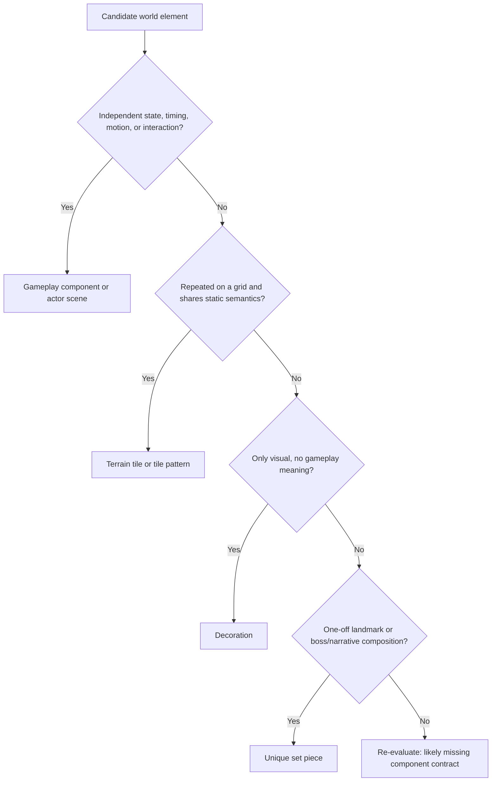

# Game Component And Art System

## Purpose

Define how Cardborne should construct production stages from repeated terrain tiles, reusable gameplay components, stage-specific visual skins, visual-only decoration, actors, and a small number of unique set pieces. This prevents one-off scene art from multiplying while preserving authored platforming challenges and regional identity.

This is a proposed production contract. It does not authorize code or asset migration until the linked ExecPlan enters implementation and the first spike is accepted.

## Locked Visual Direction

- Simplified steampunk plus post-apocalyptic foundry language.
- Verdigris teal, rust red, mustard gold, charcoal, and controlled violet accents.
- Saturated enough to avoid a pale or washed-out image.
- Clean silhouettes and large color planes; two to four major colors per asset.
- Sparse, uniform surface texture only.
- No pointillism, speckled painterly noise, dense hatching, or AI micro-detail.
- Terrain is visually filled below its walkable top, with varied heights and readable empty traversal space.
- Regional art is authored by stage skin; visual modules are never randomly mixed across stages.

The generated boards under `docs/design/references/` are direction and decomposition references. They are not production-ready atlases or sprite sheets.

`WORLD_COMPONENT_IMAGE_PRODUCTION_PLAN.md` defines generation-call scope, candidate
review, cleanup, temporary HTML-gallery approval, and production handoff. This spec
defines the asset boundaries; the plan defines how candidate art moves through them.

## Canonical Terms

| Term | Meaning | Owner |
| --- | --- | --- |
| **Terrain tile** | Repeated, grid-aligned static surface cell with no independent runtime lifecycle. It may own static collision and tile metadata. | External `TileSet` resource and semantic `TileMapLayer`. |
| **Tile pattern** | Reusable multi-cell terrain stamp such as a bridge span, wall cap, or basin lip. It contains tiles only and does not own gameplay state. | `TileSet` pattern library. |
| **Gameplay component** | Reusable scene with independent behavior, timing, interaction, animation, collision, or state. | One focused `PackedScene` plus script/typed definition. |
| **Component skin** | Stage-specific presentation applied to a gameplay component without changing its behavior contract. | Stage skin catalog/resource. |
| **Decoration** | Visual-only content that cannot affect collision, navigation, interaction, damage, cover, or objective state. | Background/foreground decor layer. |
| **Actor** | Player, enemy, boss, projectile, summon, or other autonomous combat entity. | Actor scene plus typed gameplay data and visual/animation skin. |
| **Unique set piece** | Authored one-off composition justified by stage identity, boss mechanics, narrative, or a landmark silhouette. | Owning room/stage scene, still using shared gameplay APIs. |
| **Room composition** | Authored arrangement of tiles, components, anchors, sockets, camera bounds, and set pieces that produces one reviewed gameplay challenge. | Room scene and `RoomTemplateData`. |
| **Stage skin** | One coherent regional palette/material/asset mapping for all semantic visual roles. | Stage presentation catalog. |

## Classification Rule

Classify an asset by behavior and reuse, not by how detailed its picture looks.



Scale, rotation, or appearance variants do not turn a stateful object into a tile. A pendulum trap remains a component even if its mount is grid-aligned.

## Content Classification

### Terrain Tiles

Create semantic tile roles for:

- solid interior fill;
- walkable top cap;
- left/right exposed wall;
- outer and inner corners;
- ceiling and underside;
- one-way platform deck, end, and support bracket;
- shallow step and narrow ledge variants that remain within traversal contracts;
- water/liquid visual edge and submerged fill, with gameplay collision owned separately where needed;
- background masonry/industrial wall;
- non-colliding front trim used sparingly;
- low-frequency crack, moss, pipe, rivet, and mineral alternatives that do not alter silhouette;
- reviewed multi-cell patterns such as short bridges, arch frames, and basin lips.

Do not encode as terrain tiles:

- moving or crumbling platforms;
- spikes, vents, saws, pendulums, reset volumes, or damage values;
- ropes, ladders, switches, gates, chests, pickups, destructibles, checkpoints, exits;
- encounter, reward, objective, socket, or recovery anchors;
- player/enemy/boss actors;
- room-sized landmark machinery.

### Gameplay Components

Use reusable scenes for:

- static spike rows and retracting spike mechanisms;
- timed steam/poison vents;
- pendulum traps and saw/hammer/axe payload variants;
- moving, crumbling, breakable, and switch-controlled platforms;
- ropes and other climbables;
- switches, gates, destructible blockers, checkpoints, exits;
- chests, material nodes, reward sources, field pickups;
- stage-local mechanisms with a declared warning/active/cooldown, disabled/respawning, or equivalent state cycle;
- reusable particle/audio/feedback emitters when they have an independent lifecycle.

Components must remain explicit scene instances resolved by authored anchors or placed directly in the room. Do not hide stateful production hazards inside TileSet scene collections. This preserves IDs, typed definitions, validator access, deterministic spawning, and clear ownership.

### Stage-Specific Skins

Keep behavior shared and skin selection regional.

| Semantic role | Shared contract | Example stage-skin changes |
| --- | --- | --- |
| Solid terrain | Collision silhouette and support semantics | Ruin stone, flooded foundry masonry, fractured sanctum block |
| One-way platform | Support width and drop-through behavior | Wood/iron catwalk, corroded grate, relic slab |
| Pendulum chassis | Pivot, arm length, angular path, timing, damage envelope | Brick mount/iron arm/axe; corroded mount/chain/hammer; sanctum mount/rod/saw |
| Vent | Warning/active/cooldown timing and damage area | Boiler nozzle/steam; corroded pipe/toxin; relic fissure/energy |
| Chest | Interaction and reward transaction | Salvage coffer, sealed workshop crate, sanctum reliquary |
| Rope/climbable | Entry/exit support and climb geometry | Hemp rope, cable, braided relic cord |
| Pickup | Pickup type and settlement behavior | Shared icon silhouette with regional halo/material treatment |
| Enemy archetype | AI and combat role | Regional armor, material, markings, animation accents |

Random generation may choose approved room/content combinations later. It must not randomly compose visual parts from incompatible stage skins.

### Unique Set Pieces

Reserve one-off production for:

- boss arena landmarks and boss-specific hazards;
- stage entrance/exit silhouettes that establish region identity;
- one major landmark machine or ruin composition per region;
- reward altar/rest-forge centerpiece;
- main-menu and result-screen illustrations;
- narrative or progression objects that appear once and need a recognizable silhouette.

A unique set piece may visually combine custom art, but any damaging, interactive, destructible, or traversable portion still delegates to shared component contracts. “Unique” is not permission to invent an unvalidated collision or transaction path.

### Actors

Players, enemies, bosses, summons, and projectiles are actor scenes, never tiles. Reuse follows behavior archetypes plus typed variants:

- archetype owns behavior and animation-state contract;
- variant owns stats and stage-appropriate presentation;
- stage skin may select material/markings, but cannot silently change hitbox, startup, or role;
- unique bosses may own unique silhouettes and animations while using shared damage, telegraph, and settlement contracts.

## Tile Layer Contract

Each room may use these logical layers. Empty layers can be omitted.

| Layer | Collision | Runtime logic | Purpose |
| --- | --- | --- | --- |
| `BackgroundTiles` | No | No | Large repeated back wall and distant structure. |
| `BackDecor` | No | No | Pipes, chains, banners, vegetation, silhouettes behind play. |
| `SolidTerrain` | Yes | Static only | Filled support masses, walls, ceilings, boundaries. |
| `OneWayTerrain` | One-way | Static only | Drop-through ledges and reviewed catwalks. |
| `SurfaceDecor` | No | No | Sparse cracks, moss, rivets, mineral alternatives. |
| `FrontDecor` | No | No | Restrained foreground framing that cannot hide gameplay. |

Components and anchors remain ordinary room children, not TileMap layers.

## TileSet Contract

- TileSets are external `.tres` resources reused across room scenes; do not embed a private TileSet in each room.
- Use separate stage TileSets that implement the same semantic role manifest.
- The first spike compares 24, 32, and 48 px cells; 32 px is the initial candidate only.
- Terrain tiles use orthogonal grid alignment. Oversized art may overhang visually but collision remains inside declared cell semantics.
- Every colliding tile has reviewed collision that matches the readable silhouette.
- Solid terrain remains filled below the support top. Thin floating geometry is allowed only for declared one-way or mechanical platforms.
- Stable atlas source IDs and coordinates are part of serialized room data. Never delete/reorder sources without a migration and missing-tile validation.
- Use alternative tiles for visual variation with identical semantics.
- Tile custom data may contain stable static tags such as `support_role`, `surface_material`, `footstep_family`, or `visual_occlusion_class`.
- Damage amount, reward value, objective ID, mutable durability, timing, and runtime ownership do not belong in tile custom data.
- Terrain auto-connection is an authoring convenience, not traversal validation. Existing geometry and route validators remain authoritative.

## Component Scene Contract

Every reusable world component should expose the smallest applicable node contract:

```text
ComponentRoot (typed behavior root)
|- CollisionRoot
|- VisualRoot
|- TelegraphRoot          # hazards only
|- InteractionArea        # interactables only
|- AnimationPlayer        # when state presentation is timed
|- AudioRoot              # optional
`- DebugRoot              # editor/development only
```

Requirements:

- The scene runs in isolation with safe defaults.
- External context is injected through typed configuration or an owner API.
- Behavior does not search arbitrary room paths or infer stage identity from names.
- Collision and gameplay timing remain behavior-owned.
- Visual nodes consume a component skin or fallback skin.
- Missing presentation falls back without changing gameplay geometry.
- Visual swap cannot alter the support top, interaction area, damage envelope, or motion path unless a separately typed gameplay variant declares it.
- `_get_configuration_warnings()` or a focused validator reports missing required children/configuration.

## Modular Trap Contract

A mechanical trap is assembled conceptually from five roles:

| Role | Owns | May vary visually? | May vary mechanically? |
| --- | --- | ---: | ---: |
| Chassis | Mount bounds and attachment socket | Yes, by stage skin | Only through typed chassis variant |
| Actuator | Pivot/rail/vent mechanism and motion origin | Yes | Only through typed behavior definition |
| Connector | Rod, chain, cable, piston | Yes | Length only through validated gameplay variant |
| Payload | Axe, hammer, saw, crushing block | Yes | Damage envelope only through validated payload definition |
| Telegraph | Warning arc, light, steam pulse, sound cue | Yes | Timing follows behavior definition |

For the pendulum example, the fixed contract is pivot location, arm length, angular envelope, warning, active sweep, recovery, and safe approach. The stage skin can choose brick/iron/relic mounts, rod/chain materials, and axe/hammer/saw payload art. A payload with a different collision envelope is a new validated gameplay variant, not merely a cosmetic random choice.

## Art Production Contract

### Production Files

- Production atlases use transparent PNG source art with a documented grid, padding, pivot, and naming manifest.
- Keep source/editable art outside generated import caches; commit the runtime PNG and source file when licensing allows.
- Prefer one atlas per semantic family and stage skin over one enormous all-game atlas.
- Keep icons and world sprites at integer dimensions and inspect nearest/linear filtering against the selected art direction before locking imports.
- Use simple animation sheets or separate frames with stable pivots. Do not rely on generative interpolation for collision-critical silhouettes.

### Generated Reference Boards

- Use them to choose palette, silhouette, module decomposition, and density.
- Do not crop them directly into tiles: edges, lighting, dimensions, and repetition are not exact.
- Redraw production assets on a strict grid with clean alpha and controlled color count.
- Remove decorative micro-noise that becomes illegible at gameplay scale.

## Validation Contract

### Tiles

- All semantic roles exist in every shipping stage TileSet or declare an explicit fallback.
- No room contains missing TileSet source/atlas IDs.
- Collision bounds match visible support/wall silhouettes.
- One-way tiles use only the declared one-way physics layer.
- Tile alternatives preserve gameplay metadata and collision.
- Room sockets remain open and seam validation passes after migration.

### Components

- Required child nodes and typed definitions resolve.
- Visual-skin swaps leave gameplay snapshots unchanged.
- Declared hazard states, timing, damage/support envelopes, and safe-zone contracts remain visible and valid.
- Components instantiate in an isolated gallery scene and in at least one production room.
- Stage skin manifests contain no cross-region asset paths unless explicitly shared.

### Rooms And Unique Content

- Every required route passes the current shared movement/traversal envelope; presentation work cannot narrow it.
- Foreground decor never hides player, enemy tell, hazard warning, landing edge, reward, or exit.
- Unique collision delegates to the same geometry/recovery validation as repeated content.
- A room remains understandable with debug labels disabled.

## Non-Goals

- Runtime generation of raw collision polygons or art.
- Randomly combining stage visual modules.
- Turning every decorative object into a stateful scene.
- Painting hazards or rewards as anonymous tiles.
- Replacing room/anchor/stage-plan contracts with an editor-specific schema.
- Producing final commissioned art during the first foundation spike.
