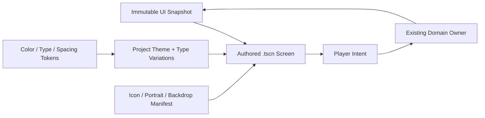

# UI Visual System

## Purpose

Preserve the accepted Cardborne visual language while the runtime is rebuilt as
an isometric action RPG. This specification owns appearance and asset boundaries;
the active pivot plan and later gameplay/UI contracts own behavior and screen flow.

This specification locks the owner's visual direction. The five selected shell backgrounds have production copies under `art/ui/production/backgrounds/`; generated panel sheets remain reference-only until deterministically rebuilt.

## Scope

This document governs the retained visual language, asset-medium decisions,
shared UI tokens, and future screen/component acceptance criteria. It does not
define combat rules, room objectives, progression balance, or the order in which
the new runtime is rebuilt.

## Requirements

- No visible panel or button outlines by default.
- No border frames around HUD clusters, cards, buttons, prompts, or modals.
- Flat color planes, clear spacing, typography, icons, and filled state changes provide hierarchy.
- Avoid glassmorphism, glow-heavy sci-fi panels, drop-shadow card stacks, excessive rounding, and nested cards.
- Default corner radius is `0`. A small radius up to `4 px` is allowed only when the silhouette itself benefits, such as a consumable charge pip; it is not a panel-system default.
- The UI shares the world palette but keeps a dark neutral base so hazards, rewards, action accents, and text remain readable.
- Use bitmap art for expressive or detailed portraits, item illustrations, backdrops, and world assets.
- Use project-authored monochrome SVG masks for simple panel/button silhouettes and semantic glyphs when their geometry remains cleaner and more reusable than raster art.
- Complex AI-generated SVG is not a production dependency. Structural UI remains Godot Control/Theme composition, not baked screenshots.

## World Theme

- The shell UI belongs to one drowned ancient-industrial ruin complex, not a collection of unrelated fantasy biomes.
- Monumental stone masses, vertical shafts, arches, gates, chains, restrained oxidized metal, and sparse moss establish the place.
- Pale cyan distance light creates depth; mustard amber marks rare machinery or guidance; coral and violet remain small semantic accents.
- Different screens show different rooms or camera positions in the same architectural family. They do not repeat one composition or introduce a new palette per screen.

## Image Construction Rules

- Build scenes from large clean color masses and three to five readable depth planes.
- Use value grouping, overlap, scale, and broad light openings for depth. Do not add detail merely to imply quality.
- Keep surfaces mostly clean. Reject pointillism, speckle, hatching, tiny repeated motifs, dense cracks, stains, paint daubs, and noisy procedural texture.
- Use no visible outlines. Separate adjacent shapes through value and hue shifts within the same palette family.
- Keep one dominant dark family, one secondary teal/stone family, and at most one small warm accent in a backdrop.
- Do not bake text, logos, UI controls, characters, enemies, hazards, pickups, or gameplay-significant props into a shell backdrop.
- Compose backdrops at 16:9 with cover-safe edges for `960x540`, `1280x720`, and `1920x1080`. UI occupancy zones remain low contrast and structurally simple.
- A fixed shell backdrop is not a gameplay panorama. Sequential edge continuation applies to scrolling map panoramas, not independent menu-screen camera shots.

## Background And Panel Separation

| Surface | Bitmap background role | Live panel role |
| --- | --- | --- |
| Main Menu | Unique establishing view; left 40-42% stays dark and quiet while the ruin opening and depth sit to the right. | Menu slab and buttons remain live SVG/Theme controls. |
| Hero Preparation | Subdued armory hall; detail stays at extreme edges and the upper band because three live columns occupy most of the screen. | Loadout, model, detail, header, and footer remain live controls. |
| Forge | Ancient workshop with restrained amber heat at the perimeter; the central work area remains low contrast. | Category, comparison, cost, action, and receipt surfaces remain live controls. |
| Settings | A quiet archive/control-room backdrop may be used from shell flow; in-run settings keeps the live game view under a dim layer. | The large settings slab, rows, sliders, bindings, and close action remain live controls. |
| Pause and confirmation | No dedicated bitmap background; retain and dim the current game screen. | Pause and confirmation use compact live modal surfaces. |
| Mid-run rewards | No dedicated bitmap background; retain and dim the current stage or authored reward space. | Choice cards, comparison, and confirm actions remain live controls. |
| Run Result | Unique monumental gate/throne view with a quiet central zone sized for the result stack and edge-weighted framing. | Outcome, summary, rewards, and actions remain live controls. |

Generated panel sheets are reference boards only. Production panels use project-authored SVG masks, NinePatch margins, flat Theme surfaces, or ordinary Godot containers. Never stretch a generated sheet, crop its parts into production, or bake labels and interactive states into it.

## Reference Authority

- `references/ui-shell/owner-reference-lower-ruins.png` is the primary owner-selected theme and structural mood anchor.
- `references/visual-style-slate-cutout.png` is a supporting simplification reference, not a competing palette.
- `references/ui-shell/background-*.png` are the selected source references for the five production shell backgrounds under `art/ui/production/backgrounds/`.
- `references/ui-shell/panel-*.png` and the contact sheet remain review evidence. Presence in the reference folder alone never grants runtime approval.
- `references/ui-assets/README.md` records the 19-file raster UI illustration pack, prompt family, post-processing, and SVG fallbacks. Production copies live under `art/ui/production/illustrations/`.
- `reports/ui-raster-asset-catalog.png` is the checkerboard and 64 px review board for that pack; it is evidence, not a runtime sprite sheet.
- `references/README.md` records how all visual boards may and may not be used.

## System Boundary

- Scenes own composition, responsive containers, focus neighbors, and asset slots.
- Theme resources own recurring visual properties.
- Small presenter scripts bind snapshots and emit intents.
- Domain services retain transactions, inventory, progression, combat, and run state.
- No visual component mutates domain state directly.

## Asset Strategy

### Use Bitmap Images For

- player portraits and detailed equipment/item illustrations;
- expressive attack, status, reward, material, equipment, and consumable art whose identity depends on internal color or texture;
- reward/item thumbnails;
- menu, result, boss, and region backdrop illustrations;
- unique decorative UI stamps that carry world identity;
- hand-authored texture masks when a flat fill alone cannot carry the intended shape.

Requirements:

- transparent PNG for raster icons, portraits, and illustrations;
- one clear silhouette per icon;
- two to four major colors, limited internal texture;
- no baked text, key binding, amount, rarity, cooldown, selection, or disabled state;
- stable padding and optical size inside a documented icon box;
- large source asset with reviewed downscales for gameplay size;
- visual state is composed by UI, not generated as separate “selected” and “disabled” art whenever tint/fill/marker can express it.

The first production illustration pack implements this contract for the single
Traveler, all active equipment models, both Spirit Stones, the small potion,
the five active shared cards, Slime King, and the large Boss Core reward. Its
stable IDs and SVG fallbacks are registered in
`art/ui/production/asset-manifest.json`; runtime screen adoption remains a
separate implementation decision.

### Use Project-Authored SVG Masks For

- simple panel, button, slot, banner, and focus-marker silhouettes;
- monochrome navigation, interaction, equipment-role, material, and status glyphs;
- shapes intended to inherit Theme color through tint rather than carry internal painting.

The starter set under `art/ui/production/` is original project work and embeds no
third-party asset. Keep SVGs fill-only where practical, preserve stable view boxes and
optical padding, and never bake labels, numbers, bindings, rarity, cooldown, focus,
selected, or disabled state into them. Godot rasterizes SVG at import time, so import
at the largest reviewed display scale. Detailed world terrain, characters, enemies,
props, item art, and backdrops remain in the raster pipeline.

### Use Godot Theme/Controls For

- panel and button fill planes;
- meters, cooldown masks, pips, separators, focus markers, and selection bars;
- responsive layout, margins, safe areas, clipping, and scroll behavior;
- text hierarchy and state color;
- hover/pressed/disabled/selected transitions;
- modal dimming and content grouping.

### Use Nine-Slice Or Textured Panels Only For

- a rare unique menu or boss/result surface whose silhouette cannot be expressed by flat planes;
- a texture that remains borderless and does not create nested ornamental frames;
- a reviewed asset with safe stretch margins and no baked content.

Nine-slice is an exception, not the default component implementation.

## Token Ownership

The target system uses one project `Theme` resource plus a small token/asset manifest. Screen-local overrides are exceptions that require a semantic reason.

### Color Roles

Exact color values are tuned in the visual spike. These roles are stable:

| Role | Use |
| --- | --- |
| `canvas` | Full-screen dark neutral base and modal dim layer. |
| `surface` | Standard flat UI fill. |
| `surface_emphasis` | Selected, focused, or primary-action fill. |
| `surface_disabled` | Unavailable state with reduced contrast plus icon/text cue. |
| `text_primary` | Main labels and values. |
| `text_secondary` | Supporting detail. |
| `text_disabled` | Unavailable copy, never the only disabled cue. |
| `health` | Player health only. |
| `threat` | Damage, danger, destructive action, or invalid result. |
| `reward` | Currency, loot, successful acquisition. |
| `interaction` | Context prompt and interactable cue. |
| `recovery` | Healing, safe return, restoration. |
| `melee` | Traveler melee-tool identity and committed melee action. |
| `ranged` | Traveler ranged-tool identity and committed ranged action. |
| `guard` | Shield, armor, stability, and defensive action. |
| `spirit` | Passive Spirit Stone progress and effect. |
| `supply` | Consumables, ammunition, repair supply, and field recovery. |
| `boss` | Boss-specific emphasis. |

The selected world palette starts from charcoal, verdigris teal, rust red, mustard gold, controlled violet, and warm off-white. Avoid a pale beige-dominant result. The first implementation spike locks these baseline values:

| Visual token | Baseline | Constraint |
| --- | --- | --- |
| Canvas charcoal | `#12171A` | Dominant shell and modal-dim family. |
| Surface navy | `#1C2428` | Standard panel family; nearby surfaces vary by value, not unrelated hue. |
| Raised surface | `#263136` | Focused or selected structural plane. |
| Verdigris cyan | `#62A9B5` | Interaction and controlled distance-light family. |
| Moss green | `#6F8F62` | Sparse world-growth and recovery accent. |
| Mustard amber | `#D4A33F` | Rare machinery, reward, and guidance accent. |
| Controlled coral | `#D9654F` | Threat or destructive state, never general decoration. |
| Warm off-white | `#F0F1E8` | Primary text and pale distant light. |
| Muted text/stone | `#A8B4AE` | Secondary copy and desaturated architecture. |
| Controlled violet | `#AA89CF` | Boss-specific or explicitly semantic emphasis only. |

Background generation may shift these values for depth, but it keeps them in the same hue families and uses no additional dominant accent.

### Type Roles

| Role | Purpose | 720p starting target |
| --- | --- | ---: |
| `display` | Main menu/result title only | 32-40 px |
| `screen_title` | Screen or modal title | 24-28 px |
| `section_title` | Choice group or equipment section | 18-20 px |
| `body` | Primary descriptions and commands | 17 px minimum |
| `compact` | HUD labels and secondary data | 14-16 px |
| `micro` | Nonessential counters only | 12-13 px, avoid for instructions |

Do not scale type directly with viewport width. Use compact composition rules and a bounded theme scale. Validate text contrast and minimum readable size at all supported viewports.

### Spacing Roles

Use a 4 px base rhythm: `4`, `8`, `12`, `16`, `24`, `32`. Components may use values between tokens only when optical alignment requires it and the reason is documented.

## Theme Type Variations

Keep the variation vocabulary semantic and small:

- `PrimaryButton`
- `SecondaryButton`
- `DangerButton`
- `IconButton`
- `ChoiceButton`
- `ActionSlot`
- `PromptBadge`
- `FlatPanel`
- `ModalSurface`
- `HealthMeter`
- `ResourceMeter`
- `BossMeter`
- `SectionTitle`
- `SecondaryText`
- `NumericValue`

Do not create per-screen variations such as `ForgeBlueButton` or `StageTwoPanel`. Stage/screen identity belongs in content assets or a narrowly scoped accent, not duplicated component styles.

## Component Hierarchy

### Primitives

- icon;
- label/value pair;
- filled panel plane;
- focus/selection marker;
- progress meter;
- cooldown mask;
- charge pip;
- input binding badge;
- separator rule;
- toast/receipt line.

### Reusable Components

- primary/secondary/danger command button;
- icon button with tooltip/accessibility label;
- action slot;
- player health cluster;
- resource counter;
- objective band;
- interaction prompt;
- reward receipt;
- status effect row;
- item/equipment stat row;
- equipment comparison block;
- reward/level choice;
- forge affix choice;
- modal header/footer;
- focusable list/grid;
- empty/loading/error state.

### Screens

- main menu;
- character/loadout;
- gameplay HUD;
- pause/settings;
- level reward;
- card reward;
- treasure choice;
- rest/forge;
- run result.

Screens compose reusable components. A screen does not introduce a new visual primitive when an existing semantic component can express the state.

## State Contract

Every interactive component defines the applicable states before art production:

| State | Minimum visible channels |
| --- | --- |
| Normal | Base fill, icon/text, stable bounds. |
| Hover | Fill/brightness change; layout remains fixed. |
| Focus | Accent fill or side marker plus icon/text/position cue; no border required. |
| Pressed | Darker/compressed fill and immediate motion/scale response. |
| Selected | Persistent accent plane, check/marker, and selected text/state. |
| Disabled | Muted fill plus lock/unavailable icon or reason text. |
| Cooldown | Remaining time plus radial/linear mask; color is secondary. |
| Empty | Explicit empty icon/text; never an unexplained blank slot. |
| Error | Threat color plus warning icon and concise reason. |
| Success | Reward/recovery color plus confirmation icon and changed value. |
| Loading | Replaces the initiating command, blocks duplicate intent, preserves layout. |

Focus is drawn inside the component's stable bounds or in a reserved marker lane so navigation cannot shift layout.

## HUD Contract

Preserve the current functional layout contract while restyling:

- Traveler health, level/XP, and armor state at upper left;
- compact resources at upper right;
- objective and boss emphasis at upper center;
- interaction prompts and receipts in one context lane;
- a stable bottom dock for contextual melee/ranged attack, guard/shield state, passive Spirit Stone progress, and potion charges;
- no debug labels, raw IDs, route metrics, or multiline testbed instructions;
- no panel outline around each HUD cluster or action slot;
- world visibility takes priority over ornamental UI.

Icons provide recognition; exact cooldown, charge, count, cost, and result values remain text where precision matters.

## Menu And Choice Contract

- The first viewport exposes the actual decision, not explanatory feature copy.
- Choice surfaces compare trigger, effect, current value, resulting value, compatibility, cost, and disabled reason as applicable.
- Use full-width bands or unframed layouts for screen sections; do not nest card panels inside card panels.
- Repeated choice items may use flat repeated surfaces because they are genuine repeated selectable items.
- Illustrations support the product/character/item and cannot replace mechanical information.
- Confirmation and destructive actions remain explicit and idempotent.

## Reset-To-Target Mapping

| Reset baseline | Future implementation |
| --- | --- |
| The pivot has no runtime screens. | New screens compose the retained Theme, manifest-backed assets, and live controls. |
| The retained art contains platform-era subject matter. | Reuse its palette, shape language, and independent illustrations; do not reuse side-view composition as isometric geometry. |
| No HUD contract is active. | The combat proof introduces only health, immediate action/resource state, objective, and essential world-space cues. |
| No UI binding owner exists. | Small presenters consume immutable snapshots and emit player intents without mutating domain state. |
| The asset pack has stable source IDs but no runtime registry. | Recreate one manifest-backed resolver before more than one screen consumes the same asset family. |

## Asset Manifest Contract

Every production UI raster or SVG asset registers:

- stable asset ID;
- semantic role;
- source path;
- native pixel dimensions;
- intended display size(s);
- safe padding;
- fallback asset ID;
- tint permission;
- stage, equipment-role, item, or screen ownership where applicable;
- source/license note.

Missing assets use a declared fallback without changing component size or gameplay state. Asset paths do not appear throughout screen scripts.

## Acceptance Criteria

### Automated

- Add focused render/layout checks as each new screen lands; do not restore the retired platformer validation matrix.
- Render/layout checks cover 960x540, 1280x720, and 1920x1080.
- Every interactive screen has initial focus, valid focus neighbors, and return-focus behavior.
- Text and children remain inside containers with no clipping or overlap.
- Components keep stable dimensions across normal, focus, selected, disabled, cooldown, loading, error, and success states.
- Production Theme styles use zero border width unless an explicitly documented accessibility exception exists.
- Every production image ID resolves or has a valid fallback.
- No production surface contains testbed copy, raw IDs, debug metrics, or unimplemented commands.

### Visual Review

- UI reads as flat and borderless at a glance.
- Gameplay threats, landing edges, player, and telegraphs remain visible behind HUD.
- Focus is unmistakable without relying on an outline.
- Color-blind simulation preserves selection, lock, cooldown, threat, and reward meaning through icon/shape/text channels.
- Text remains readable against both dark and bright world backgrounds.
- The selected steampunk/post-apocalyptic identity is present through icons, shapes, and palette without decorative overload.

## Non-Goals

- Rewriting gameplay state, inventory, reward, progression, or transaction services.
- Baking complete screens into raster images.
- Creating one-off button/panel styles per screen.
- Using color alone for focus, selection, cooldown, lock, threat, or reward.
- Shipping generated reference-board crops as production UI assets.
- Adding touch/mobile UI or localization in the first visual-system migration.
