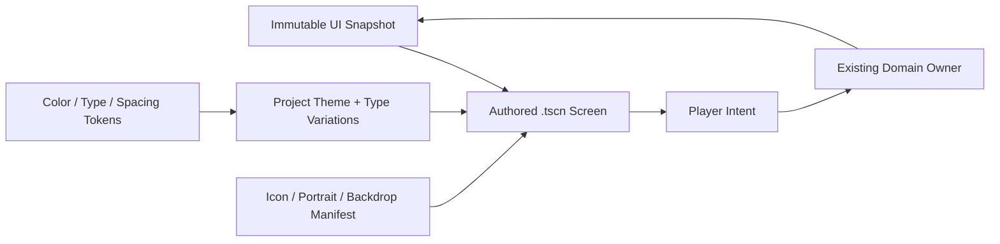

# UI Visual System

## Purpose

Define a coherent game UI system that replaces testbed-like panels and scattered code-local styling without replacing the working snapshot, intent, transaction, focus, and responsive-layout contracts.

This draft locks the owner's visual direction but defers exact asset production and migration until the first implementation spike is approved.

## Locked Direction

- No visible panel or button outlines by default.
- No border frames around HUD clusters, cards, buttons, prompts, or modals.
- Flat color planes, clear spacing, typography, icons, and filled state changes provide hierarchy.
- Avoid glassmorphism, glow-heavy sci-fi panels, drop-shadow card stacks, excessive rounding, and nested cards.
- Default corner radius is `0`. A small radius up to `4 px` is allowed only when the silhouette itself benefits, such as a consumable charge pip; it is not a panel-system default.
- The UI shares the world palette but keeps a dark neutral base so hazards, rewards, class accents, and text remain readable.
- Use bitmap art for expressive icons, portraits, item illustrations, and backdrops. Structural UI remains Godot Control/Theme composition, not baked screenshots.
- Complex AI-generated SVG is not a production dependency. Simple verified SVG or procedural geometry is allowed only when it is genuinely cleaner than a bitmap.

## System Boundary

- Scenes own composition, responsive containers, focus neighbors, and asset slots.
- Theme resources own recurring visual properties.
- Small presenter scripts bind snapshots and emit intents.
- Domain services retain transactions, inventory, progression, combat, and run state.
- No visual component mutates domain state directly.

## Asset Strategy

### Use Bitmap Images For

- player portraits and class emblems;
- attack, skill, status, currency, material, equipment, and consumable icons;
- reward/item thumbnails;
- menu, result, boss, and region backdrop illustrations;
- unique decorative UI stamps that carry world identity;
- hand-authored texture masks when a flat fill alone cannot carry the intended shape.

Requirements:

- transparent PNG for icons and portraits;
- one clear silhouette per icon;
- two to four major colors, limited internal texture;
- no baked text, key binding, amount, rarity, cooldown, selection, or disabled state;
- stable padding and optical size inside a documented icon box;
- large source asset with reviewed downscales for gameplay size;
- visual state is composed by UI, not generated as separate “selected” and “disabled” art whenever tint/fill/marker can express it.

### Use Godot Theme/Controls For

- panel and button fill planes;
- meters, cooldown masks, pips, separators, focus markers, and selection bars;
- responsive layout, margins, safe areas, clipping, and scroll behavior;
- text hierarchy and state color;
- hover/pressed/disabled/selected transitions;
- modal dimming and content grouping.

### Use Nine-Slice Or Textured Panels Only For

- a rare unique menu or boss/result surface whose silhouette cannot be expressed by flat planes;
- a texture that remains borderless and does not create nested ornamental frames;
- a reviewed asset with safe stretch margins and no baked content.

Nine-slice is an exception, not the default component implementation.

## Token Ownership

The target system uses one project `Theme` resource plus a small token/asset manifest. Screen-local overrides are exceptions that require a semantic reason.

### Color Roles

Exact color values are tuned in the visual spike. These roles are stable:

| Role | Use |
| --- | --- |
| `canvas` | Full-screen dark neutral base and modal dim layer. |
| `surface` | Standard flat UI fill. |
| `surface_emphasis` | Selected, focused, or primary-action fill. |
| `surface_disabled` | Unavailable state with reduced contrast plus icon/text cue. |
| `text_primary` | Main labels and values. |
| `text_secondary` | Supporting detail. |
| `text_disabled` | Unavailable copy, never the only disabled cue. |
| `health` | Player health only. |
| `threat` | Damage, danger, destructive action, or invalid result. |
| `reward` | Currency, loot, successful acquisition. |
| `interaction` | Context prompt and interactable cue. |
| `recovery` | Healing, safe return, restoration. |
| `class_warrior` | Warrior identity accent. |
| `class_archer` | Archer identity accent. |
| `class_assassin` | Assassin identity accent. |
| `boss` | Boss-specific emphasis. |

The selected world palette starts from charcoal, verdigris teal, rust red, mustard gold, controlled violet, and warm off-white. Avoid a pale beige-dominant result.

### Type Roles

| Role | Purpose | 720p starting target |
| --- | --- | ---: |
| `display` | Main menu/result title only | 32-40 px |
| `screen_title` | Screen or modal title | 24-28 px |
| `section_title` | Choice group or equipment section | 18-20 px |
| `body` | Primary descriptions and commands | 17 px minimum |
| `compact` | HUD labels and secondary data | 14-16 px |
| `micro` | Nonessential counters only | 12-13 px, avoid for instructions |

Do not scale type directly with viewport width. Use compact composition rules and a bounded theme scale. Validate text contrast and minimum readable size at all supported viewports.

### Spacing Roles

Use a 4 px base rhythm: `4`, `8`, `12`, `16`, `24`, `32`. Components may use values between tokens only when optical alignment requires it and the reason is documented.

## Theme Type Variations

Keep the variation vocabulary semantic and small:

- `PrimaryButton`
- `SecondaryButton`
- `DangerButton`
- `IconButton`
- `ChoiceButton`
- `ActionSlot`
- `PromptBadge`
- `FlatPanel`
- `ModalSurface`
- `HealthMeter`
- `ResourceMeter`
- `BossMeter`
- `SectionTitle`
- `SecondaryText`
- `NumericValue`

Do not create per-screen variations such as `ForgeBlueButton` or `StageTwoPanel`. Stage/screen identity belongs in content assets or a narrowly scoped accent, not duplicated component styles.

## Component Hierarchy

### Primitives

- icon;
- label/value pair;
- filled panel plane;
- focus/selection marker;
- progress meter;
- cooldown mask;
- charge pip;
- input binding badge;
- separator rule;
- toast/receipt line.

### Reusable Components

- primary/secondary/danger command button;
- icon button with tooltip/accessibility label;
- action slot;
- player health cluster;
- resource counter;
- objective band;
- interaction prompt;
- reward receipt;
- status effect row;
- item/equipment stat row;
- equipment comparison block;
- reward/level choice;
- forge affix choice;
- modal header/footer;
- focusable list/grid;
- empty/loading/error state.

### Screens

- main menu;
- character/loadout;
- gameplay HUD;
- pause/settings;
- level reward;
- card reward;
- treasure choice;
- rest/forge;
- run result.

Screens compose reusable components. A screen does not introduce a new visual primitive when an existing semantic component can express the state.

## State Contract

Every interactive component defines the applicable states before art production:

| State | Minimum visible channels |
| --- | --- |
| Normal | Base fill, icon/text, stable bounds. |
| Hover | Fill/brightness change; layout remains fixed. |
| Focus | Accent fill or side marker plus icon/text/position cue; no border required. |
| Pressed | Darker/compressed fill and immediate motion/scale response. |
| Selected | Persistent accent plane, check/marker, and selected text/state. |
| Disabled | Muted fill plus lock/unavailable icon or reason text. |
| Cooldown | Remaining time plus radial/linear mask; color is secondary. |
| Empty | Explicit empty icon/text; never an unexplained blank slot. |
| Error | Threat color plus warning icon and concise reason. |
| Success | Reward/recovery color plus confirmation icon and changed value. |
| Loading | Replaces the initiating command, blocks duplicate intent, preserves layout. |

Focus is drawn inside the component's stable bounds or in a reserved marker lane so navigation cannot shift layout.

## HUD Contract

Preserve the current functional layout contract while restyling:

- player health/class state at upper left;
- compact resources at upper right;
- objective and boss emphasis at upper center;
- interaction prompts and receipts in one context lane;
- six stable action slots at the bottom with a center safe gap;
- no debug labels, raw IDs, route metrics, or multiline testbed instructions;
- no panel outline around each HUD cluster or action slot;
- world visibility takes priority over ornamental UI.

Icons provide recognition; exact cooldown, charge, count, cost, and result values remain text where precision matters.

## Menu And Choice Contract

- The first viewport exposes the actual decision, not explanatory feature copy.
- Choice surfaces compare trigger, effect, current value, resulting value, compatibility, cost, and disabled reason as applicable.
- Use full-width bands or unframed layouts for screen sections; do not nest card panels inside card panels.
- Repeated choice items may use flat repeated surfaces because they are genuine repeated selectable items.
- Illustrations support the product/character/item and cannot replace mechanical information.
- Confirmation and destructive actions remain explicit and idempotent.

## Current-To-Target Mapping

| As-is | To-be |
| --- | --- |
| `ProductionUIStyles.panel_style()` defaults to border and radius. | Project Theme uses border width `0`, radius `0`, flat semantic fills. |
| Button focus/selection is primarily a thicker border. | Reserved side/bottom marker, accent fill, icon, and text state show focus/selection. |
| HUD node tree is substantially built in `ProductionHUD.gd`. | `ProductionHUD.tscn` owns composition; script binds snapshots and responsive state. |
| Scene-local colors/sizes/separations are widespread. | Theme variations and token constants own recurring values; local overrides are audited exceptions. |
| Procedural glyphs and placeholder shapes carry many identities. | Manifest-backed production bitmap icons/portraits replace expressive placeholders incrementally. |
| Panels group nearly every cluster. | Spacing, alignment, fill planes, and typography group content; panel containers exist only where interaction/layout needs them. |

## Asset Manifest Contract

Every production UI image registers:

- stable asset ID;
- semantic role;
- source path;
- native pixel dimensions;
- intended display size(s);
- safe padding;
- fallback asset ID;
- tint permission;
- stage/class/item ownership where applicable;
- source/license note.

Missing assets use a declared fallback without changing component size or gameplay state. Asset paths do not appear throughout screen scripts.

## Validation

### Automated

- Existing snapshot/intent and transaction validators remain green.
- Render/layout validators cover 960x540, 1280x720, and 1920x1080.
- Every interactive screen has initial focus, valid focus neighbors, and return-focus behavior.
- Text and children remain inside containers with no clipping or overlap.
- Components keep stable dimensions across normal, focus, selected, disabled, cooldown, loading, error, and success states.
- Production Theme styles use zero border width unless an explicitly documented accessibility exception exists.
- Every production image ID resolves or has a valid fallback.
- No production surface contains testbed copy, raw IDs, debug metrics, or unimplemented commands.

### Visual Review

- UI reads as flat and borderless at a glance.
- Gameplay threats, landing edges, player, and telegraphs remain visible behind HUD.
- Focus is unmistakable without relying on an outline.
- Color-blind simulation preserves selection, lock, cooldown, threat, and reward meaning through icon/shape/text channels.
- Text remains readable against both dark and bright world backgrounds.
- The selected steampunk/post-apocalyptic identity is present through icons, shapes, and palette without decorative overload.

## Non-Goals

- Rewriting gameplay state, inventory, reward, progression, or transaction services.
- Baking complete screens into raster images.
- Creating one-off button/panel styles per screen.
- Using color alone for focus, selection, cooldown, lock, threat, or reward.
- Shipping generated reference-board crops as production UI assets.
- Adding touch/mobile UI or localization in the first visual-system migration.
