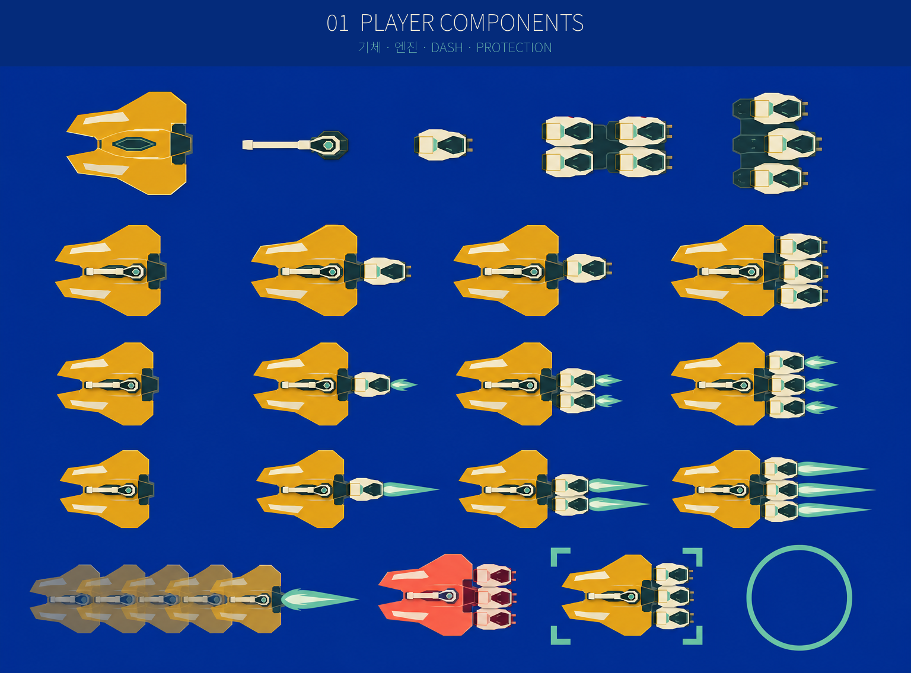
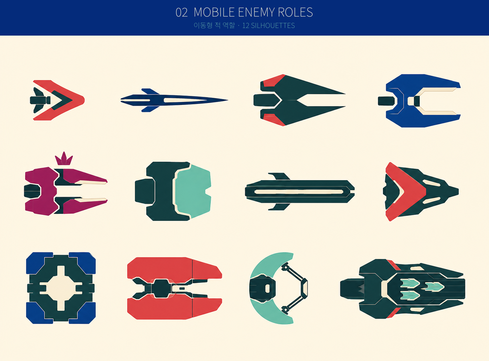
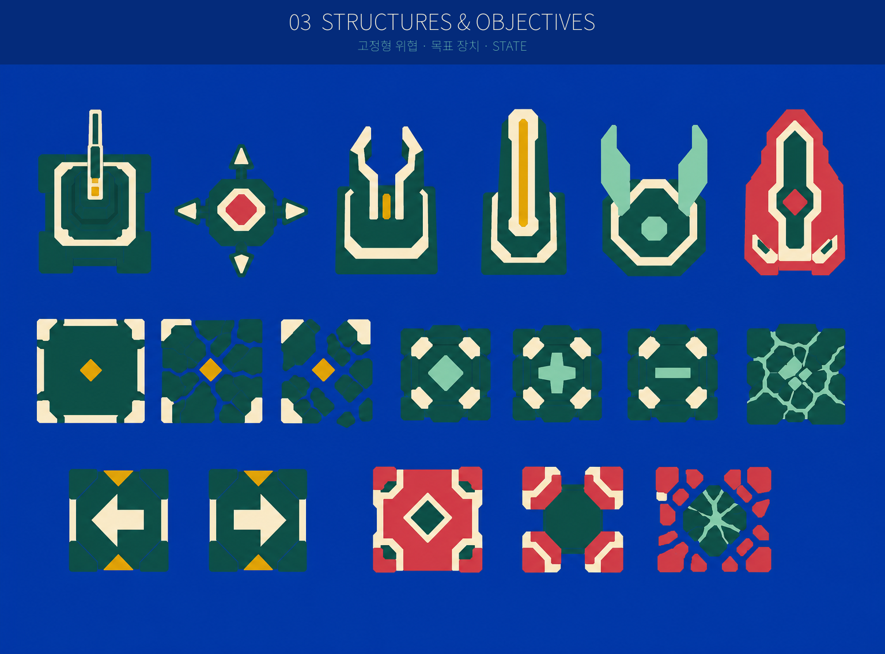
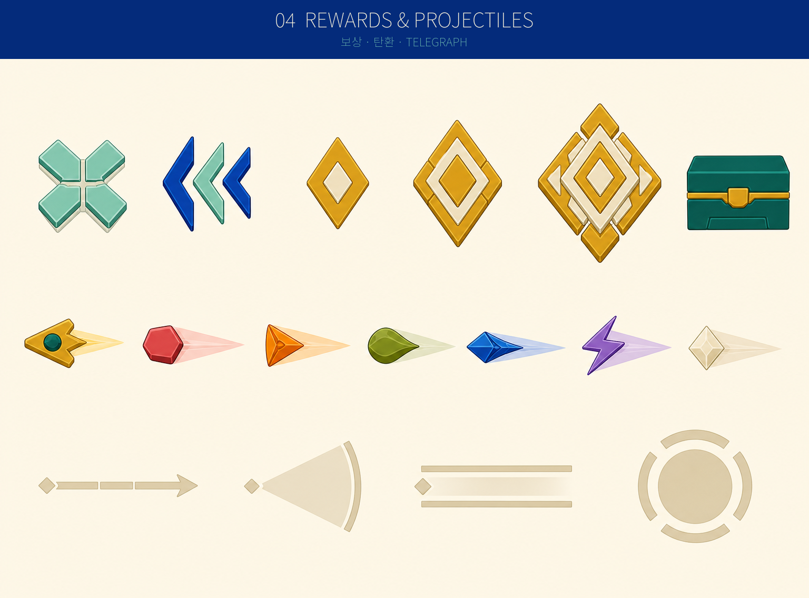
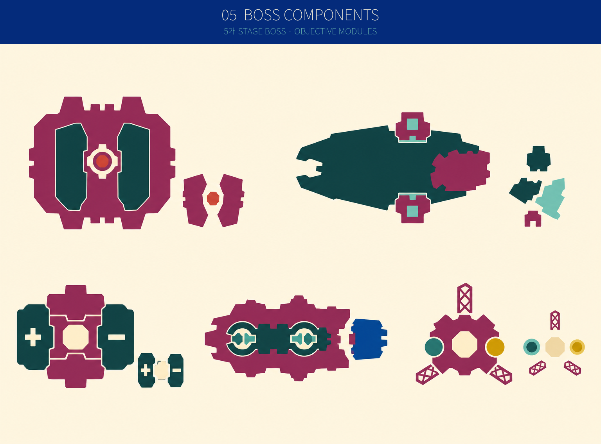
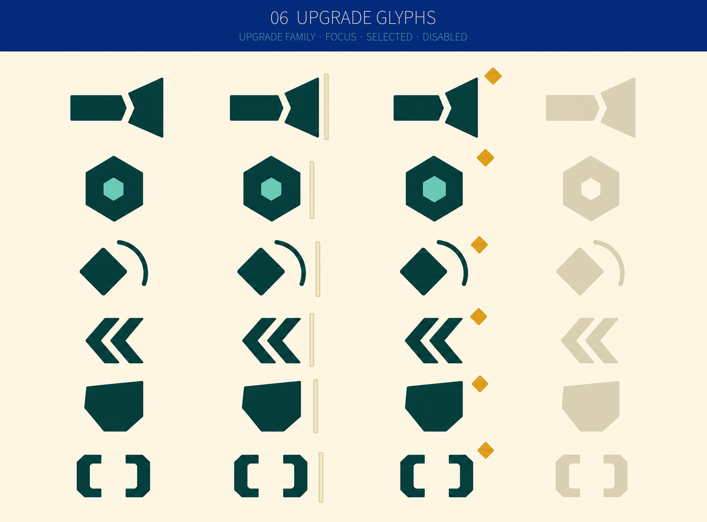

# Cardborne 전투 Component 디자인 시안

## Purpose

이 폴더는 새 전투 component를 구현하기 전에 silhouette, 역할 구분,
부착 관계와 상태 표현을 검토하기 위한 **디자인 시안**이다.

이미지를 그대로 runtime sprite sheet로 사용하지 않는다. 승인된 형태를
Godot의 `ArrayMesh`/`MultiMesh` component로 다시 정의하고, 실제 collision,
attack range와 state는 gameplay code가 계속 소유한다.

## Scope

- player hull, engine, dash와 protection feedback
- mobile enemy와 stationary threat의 역할별 silhouette
- pickup, XP, crate, projectile와 telegraph
- 다섯 stage boss와 damage 가능한 objective module
- upgrade family/state glyph

full map, terrain, 전체 HUD/menu chrome와 shipping runtime geometry는 이
시안의 범위가 아니다.

## Requirements

- 기존 pixel grid, whole-cell, 방향별 raster frame 제약을 사용하지 않는다.
- antialiasing된 flat vector-like 형태와 넓은 matte ceramic mass를 사용한다.
- 작은 장식보다 outer silhouette와 negative space를 먼저 읽게 한다.
- ordinary component는 큰 덩어리 최대 3개, accent 최대 2개로 제한한다.
- 역할은 색상만이 아니라 서로 다른 형태로도 구분한다.
- mustard는 player/reward, coral은 ordinary threat, magenta는 boss/command,
  mint는 support/recovery, cobalt는 energized void, ivory/ink는 대비를 맡는다.
- 원형 badge와 donut를 기본 body로 반복하지 않는다.

## 시안 Sheet

### 01. Player Components

[전체 시안 보기](./01-player-components.png)

비교 대상:

- 넓은 전방 wedge hull과 rear shoulder
- hull과 함께 회전하는 0–3개 rigid engine module
- hull과 독립적으로 조준하는 가는 primary barrel
- idle/thrust engine flame
- 붉은 원 없이 hull 잔상과 rear flare로 보이는 dash
- coral hit flash, mint corner protection, mint barrier

승인 기준은 engine이 항상 rear socket에 붙어 있고, dash와 damage cue가
서로 다른 의미로 보이는 것이다.

### 02. Mobile Enemy Roles

[전체 시안 보기](./02-mobile-enemy-roles.png)

비교 대상:

- Scrap Drone — 작은 chevron/teardrop
- Needle Drone — 좁고 긴 needle
- Chaser — 깊은 전방 spear notch
- Shooter — 중앙 muzzle gap이 있는 넓은 bracket
- Controller — 갈라진 twin prong과 command crown
- Shield Escort — 평평한 전방 shield slab
- Artillery Spotter — 긴 aim rail body
- Rammer — 굵은 arrowhead
- Bulkhead Guard — 무거운 square guard
- Splitter Barge — 둘로 갈라진 lobe
- Repair Tender — mint crescent cradle
- Drone Carrier — 넓은 rear bay

승인 기준은 grayscale에서도 우선 표적과 접근 역할을 silhouette로 구분하는
것이다.

### 03. Structures and Objectives

[전체 시안 보기](./03-structures-objectives.png)

비교 대상:

- Turret, Mine, Interceptor Tower, Beam Sentinel
- Barrier Generator, Boss Pylon
- intact/cracked/broken plate
- idle/positive/negative/overloaded relay
- left/right committed route switch
- locked/open/broken outer core

stationary component는 mobile enemy보다 넓고 바닥에 잠긴 무게감을 가져야
한다. boss objective는 damage 가능한 module이라는 사실이 큰 형태 변화로
보여야 한다.

### 04. Rewards and Projectiles

[전체 시안 보기](./04-rewards-projectiles.png)

비교 대상:

- Repair — mint plus shard
- Experience Recall — 안쪽으로 모이는 세 chevron
- Small/Medium/Large XP — 단계적으로 복잡해지는 diamond shard
- Field Crate — 낮은 ceramic-green chest
- Player projectile — mustard ownership shell과 dark collision core
- Kinetic, Thermal, Toxin, Cryo, Arc, Hybrid hostile projectile
- compact damaging core와 긴 non-damaging direction tail
- lane, wedge, beam, area warning의 최소 형태

승인 기준은 repair/recall을 색을 제거해도 구분하고, projectile의 실제
damage core와 방향 tail을 혼동하지 않는 것이다.

### 05. Boss Components

[전체 시안 보기](./05-boss-components.png)

비교 대상:

- Foundry Colossus — 두 forge plate와 작은 central core
- Archive Leviathan — 긴 body와 side segment lock
- Drydock Titan — square mass와 분리된 polarity relay
- Switchyard Behemoth — 긴 armor body와 detachable rear car
- Crown Engine — 두 outer core, lattice arm과 central core

승인 기준은 label 없이도 다섯 boss를 outer silhouette로 구분하고, 파괴할
module과 vulnerability state를 즉시 찾는 것이다.

### 06. Upgrade Glyphs

[전체 시안 보기](./06-upgrade-glyphs.png)

비교 대상:

- Primary — barrel/impact wedge
- Element — facet core
- Passive — offset seeker와 orbit arc
- Mobility — rear thruster chevron
- Defense — 원이 아닌 broad shield slab
- Utility — inward pickup/magnet bracket
- default, focus, selected, unavailable state

glyph는 24px, 32px, 42px에서 하나 또는 두 개의 filled shape만으로 읽혀야
하며, card text보다 먼저 시선을 빼앗아서는 안 된다.

## Acceptance Criteria

- engine module이 모든 player state에서 rear socket에 붙어 보인다.
- dash는 방향성 잔상과 rear flare로 보이고 coral/radial ring을 사용하지 않는다.
- mobile enemy 12종은 grayscale에서도 silhouette가 중복되지 않는다.
- repair와 experience recall은 color 없이도 서로 다른 pickup으로 보인다.
- hostile projectile의 opaque damage core와 non-damaging tail이 구분된다.
- 다섯 boss는 outer silhouette와 objective module로 서로 구분된다.
- upgrade glyph는 24px에서도 한두 개의 큰 shape로 읽힌다.
- pixel stair step, micro-detail, generic neon glow와 repeated donut body가 없다.

### 검토 순서

1. `01`에서 engine 부착과 dash cue를 먼저 확인한다.
2. `02`와 `04`를 grayscale로 보고 역할을 맞힐 수 있는지 확인한다.
3. `05`에서 다섯 boss와 objective module을 label 없이 구분한다.
4. `03`과 `06`에서 같은 shape grammar가 structure와 UI까지 확장되는지
   확인한다.
5. 승인 후 active ExecPlan Phase 1에서 선택된 형태를 runtime component
   descriptor와 deterministic runtime sheet로 다시 만든다.

## Non-Goals

- 이 시안은 구현 전에 형태 방향을 고정하기 위한 자료다.
- 생성 이미지의 작은 비대칭과 장식은 runtime 요구사항이 아니다.
- runtime에서는 collision overlay, actual gameplay scale, grayscale,
  maximum-pressure capture를 별도로 검증한다.
- full map, terrain과 전체 UI chrome 재설계는 이 sheet의 범위가 아니다.
