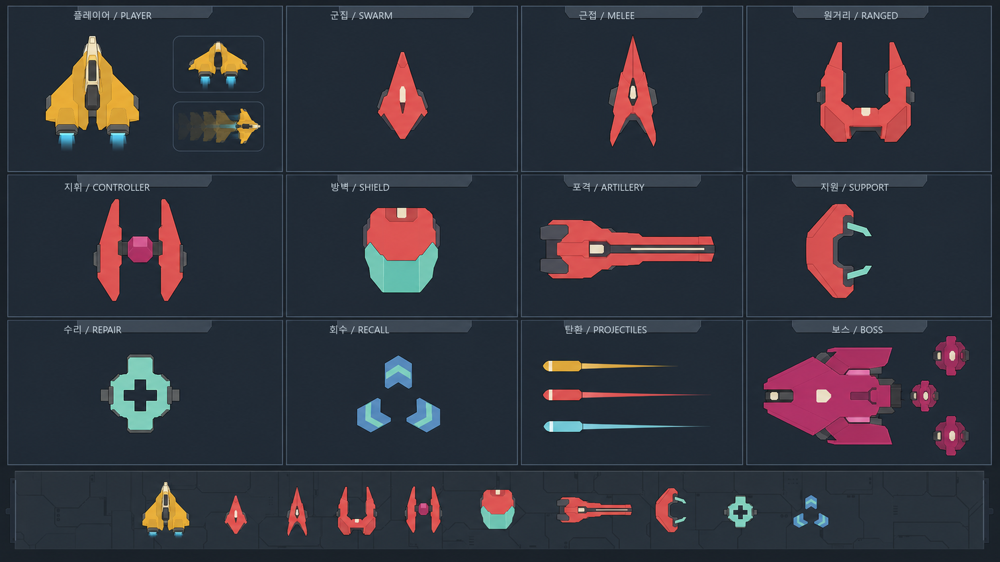

# 일반 SF 전투 컴포넌트 디자인 시안

## Purpose

현재 맵에서 사용하는 역할별 의미를 유지하면서 기존 픽셀 형태를 재사용하지
않는 전체 비주얼 시스템의 선택된 방향 seed다. 이 방향은 전투 컴포넌트에서
시작해 world, effect, HUD와 UI로 확장한다.

이 문서는 `active evidence`이며 정본 spec이나 runtime asset은 아니다. 실제
게임의 visual truth는 runtime descriptor, Godot Theme와 그것으로 생성한
[`system-v1/manifest.json`](./system-v1/manifest.json)이 소유한다.

## Sources

- 현재 최대 압력 gameplay capture: 맵 밝기, 배경 대비, 실제 플레이 크기 확인
- 현재 runtime atlas: 필요한 역할 목록과 semantic color 확인
- `UI_VISUAL_SYSTEM.md`: 일반적인 top-down space-hangar SF, 역할별 색·형태,
  non-pixel combat component 계약

기존 atlas의 실루엣, pixel grid, 장식, 방향별 frame은 디자인 입력으로
사용하지 않았다.

## Findings

| 위치 | 역할 | 형태 기준 |
| --- | --- | --- |
| 1행 | 플레이어, 군집, 근접, 원거리 | wedge, solid chevron, split spear, muzzle bracket |
| 2행 | 지휘, 방벽, 포격, 지원 | twin prong, forward slab, long rail, open cradle |
| 3행 | 수리, 회수, 탄환, 보스 | plus cut, inward chevrons, core/tail, detachable modules |

- 엔진 socket은 플레이어 hull 뒤에 고정되어 있고 thrust 때 flame 길이만
  바뀐다.
- dash는 붉은 원 대신 기체 방향을 유지하는 짧은 afterimage로 표현한다.
- ordinary enemy는 색이 없어도 외곽선과 negative space로 역할을 구분한다.
- repair와 recall은 각각 plus cut과 inward chevron이라 충돌 순간에도
  오인하기 어렵다.
- boss는 원형 blob 대신 비대칭 본체와 외곽 objective module로 구성한다.

## Production component sheets

`system-v1/`의 12개 sheet는 실제 `VehicleStageVisualProfile`, component
catalog, runtime combat mesh와 Noto Sans KR provider에서 결정적으로 생성한다.

| 번호 | sheet | 확인 대상 |
| --- | --- | --- |
| 01 | foundation tokens | 색, 글자, 간격, 역할 문법 |
| 02 | world surfaces | 세 필드의 대형 패널 리듬 |
| 03 | world facilities | 시설별 형태와 4개 상태 |
| 04 | player components | hull, rigid twin engine, aim, dash/hit |
| 05 | enemy components | 18개 역할 실루엣 |
| 06 | boss components | 5개 본체, objective module, phase read |
| 07 | projectile/telegraph/VFX | 6개 affinity와 live footprint |
| 08 | reward/upgrade glyphs | XP, 수리, 회수, 상자, 8개 upgrade family |
| 09 | HUD/minimap markers | four-zone HUD와 shared marker |
| 10 | UI controls | normal/hover/focus/selected/disabled/danger |
| 11 | modal flow | 8개 production/debug surface composition |
| 12 | pressure/accessibility | gameplay 1× composition과 검증 슬롯 |

[`system-v1/manifest.json`](./system-v1/manifest.json)은 12개 PNG hash,
token/catalog fingerprint와 publication 상태를 기록한다. 같은 source에서
연속 생성한 PNG hash는 일치해야 한다.

## Limitations

- 이 이미지는 ImageGen 기반 방향 시안이며 runtime geometry의 정본이 아니다.
- sheet의 composition test는 실제 runtime capture가 아니다. Phase별 runtime
  publication 뒤 native/Web gameplay capture로 교체 검증한다.
- `12-pressure-accessibility.png`의 체크 표시는 디자인 계약 슬롯이며, 최종
  release gate의 실제 결과를 선반영하지 않는다.
