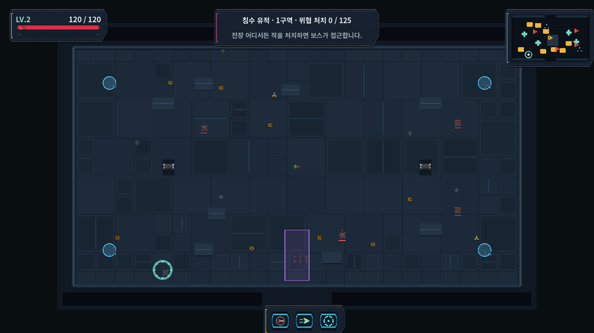
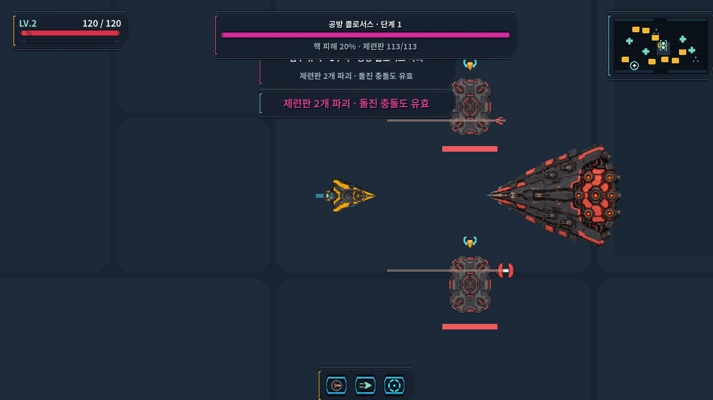
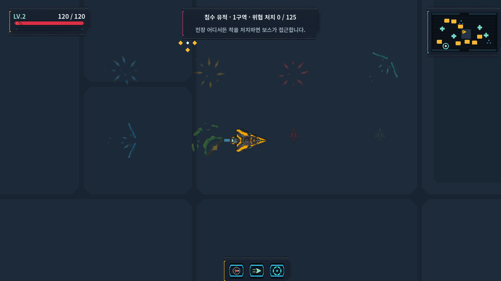

# 맵·지형·탄환·공격 표시 AS-IS / TO-BE

## Purpose

이 문서는 “무슨 이미지를 더 만들 것인가”가 아니라, 사용자가 지적한
화면 문제가 현재 어디에서 생기며 **이미지 교체만으로 해결되는지, 코드
수정이 필요한지**를 확정한다. 인벤토리 그리드는 누락 방지를 위한 확인
수단일 뿐 작업 목적이 아니다.

## Sources

- 바닥·벽 이미지 제외:
  `scripts/presentation/components/vehicle_semantic_asset_provider.gd:11`, `:234`
- deterministic surface compiler:
  `scripts/presentation/vehicle_field_surface_pattern_compiler.gd:9`, `:27`
- 바닥·벽·cover mesh:
  `scripts/presentation/vehicle_world_mesh_builder.gd:97`, `:123`, `:144`
- 기능 지형 진실값:
  `scripts/vehicle/vehicle_terrain_definition.gd:15`,
  `scripts/vehicle/vehicle_terrain_runtime.gd:106`, `:206`, `:271`
- 장판과 탄환 렌더링:
  `scripts/presentation/vehicle_combat_renderer.gd:941`, `:1545`
- 공격 경로 build/render:
  `scripts/combat/vehicle_attack_telegraph_builder.gd:72`, `:284`,
  `scripts/presentation/vehicle_combat_renderer.gd:1083`, `:1111`, `:1153`, `:1211`
- 보스 autonomous pattern 실행:
  `scripts/vehicle/vehicle_run.gd:4521`, `:4543`
- 현재 캡처와 기존 승인 TO-BE: 아래 `화면 비교 근거`.

## Findings

### 핵심 결론

요청된 최종 결과 중 이미지 교체만으로 완결되는 항목은 없다.

- 바닥·벽 이미지는 이미 존재하지만 런타임 asset provider가 의도적으로
  제외한다.
- 회복·공격력 증가 장판은 실제 반경보다 훨씬 작은 중앙 이미지만 쓰고,
  나머지는 원·고리 같은 기본 도형으로 그린다.
- 가장 흔한 적 탄환은 이미지 내부의 실제 불투명 두께가 충돌 지름보다
  얇고 어둡다. 이미지 자체도 문제지만 일반·엘리트·보스 구분 정보가
  렌더러까지 전달되지 않는다.
- 공격 경로는 실제 판정 정보를 계산해도 대부분 3–4 px 선으로만
  표시한다. 일부 보스 패턴은 서로 다른 패턴도 같은 원형 장판으로
  축약된다.

따라서 새 그림을 먼저 더 만드는 방식은 같은 문제를 반복한다. 현재
승인 대상은 **기존 에셋의 재사용 여부와 에셋을 실제 범위·등급·경로에
연결하는 코드 계약**이다.

## 한눈에 보는 수정 분류

| 대상 | 이미지 교체만으로 완료? | 필요한 수정 | 우선 사용할 이미지 |
| --- | --- | --- | --- |
| 맵 바닥 타일 | 아니오 | deterministic 배치 결과에 tile ID·회전·UV를 추가하고 이미지 렌더링 | 기존 `world_shared_floor_00/01.png` |
| 벽 | 아니오 | 경계 선분을 straight/corner/end/junction으로 분류해 정확한 위치에 배치 | 기존 `world_wall_*` 6종 |
| 일반 cover | 아니오 | 실제 collision `Rect2` 위에 이미지 body를 맞춰 렌더링 | 기존 `terrain_solid_cover_block.png`부터 검증 |
| 회복/공격력 증가 장판 | 아니오 | 고정 48-unit 중앙 장식을 실제 150/180 반경 body로 확장하고 상태 표현 추가 | 기존 repair/overdrive 이미지부터 검증 |
| 아군·적 피해 장판 | 아니오 | 정확한 `Rect2` 전체에 strip/body를 방향 맞춰 tile하고 상태를 표시 | 기존 `facility_arc_surge_strip.png`부터 검증 |
| 적 탄환 | 부분 개선만 가능 | 밝고 굵은 head/tail 이미지 + ordinary/elite/boss tier 전달·선택 | 기존 80×80 계약 안에서 먼저 보정 후보 |
| 일반/엘리트/보스 공격로 | 아니오 | 실제 footprint fill, 등급별 cap/pattern, boss pattern geometry 복원 | 승인된 공격 표시 TO-BE를 코드로 구현 |

## 1. 맵 바닥 타일

### AS-IS

- seed 기반 배치 알고리즘은 이미 있다. `288×288` world-unit cell에서
  `1×1`, `2×1`, `1×2`, `2×2` 모듈을 결정적으로 고른다.
- 그러나 결과물은 tile 이미지가 아니라 색이 칠해진 polygon panel이다.
- `world_shared_floor_00.png`, `world_shared_floor_01.png`는 manifest에
  있지만 provider가 `world_shared_floor_` prefix를 제외한다.
- collision, navigation, void와 cover 진실값은 별도 geometry snapshot이
  소유한다.

### TO-BE

- 현재 seed, cell 크기, module 조합, walkable clipping은 유지한다.
- compiler 출력에 `tile_id`, 회전/반전, clip geometry를 포함한다.
- world renderer가 이를 texture UV 또는 tile instance로 그린다.
- tile 이미지는 walkable 영역을 넘지 않으며 collision은 바뀌지 않는다.
- 무효 문양을 뿌리지 않고, 이음새·panel 크기·방향만으로 반복을 줄인다.

**판정:** 코드 + 기존 이미지 연결. 바닥 이미지를 새로 생성하기 전에
기존 2종을 실제 알고리즘 크기로 연결한 preview를 먼저 확인한다.

## 2. 벽과 물리 지형지물

### AS-IS

- 외곽벽은 geometry snapshot의 축 정렬 선분 위에 굵은 rail, 얇은 edge,
  shadow 사각형을 겹쳐 그린다.
- straight/corner/end/T/cross를 판별하는 topology 단계가 없다.
- `world_wall_*` 6종도 provider에서 제외되어 화면에 나오지 않는다.
- 일반 cover는 정확한 collision rectangle을 갖지만 body는 단색 polygon과
  중앙 rail이다. 일부 `terrain_*` PNG는 등록만 되어 있고 실제 gameplay
  draw에서 사용되지 않는다.

### TO-BE

- 현재 경계·collision rectangle을 유일한 위치/크기 진실값으로 유지한다.
- 인접 선분을 분석해 wall topology를 고르고 회전한다.
- 벽은 바닥보다 높은 silhouette, 일관된 외곽선과 shadow로 즉시 구분한다.
- cover body도 실제 collision rectangle에 맞춰 fit 또는 tile한다.
- 이미지가 collision보다 튀어나와 피할 수 없는 것처럼 보이는 오차를
  금지한다.

**판정:** 코드 + 기존 이미지 연결. 기존 wall/terrain 세트를 런타임
geometry에 올린 preview에서 형태가 부족할 때만 부족한 topology를 새로
그린다.

## 3. 회복·공격력 증가·피해 장판

### AS-IS

- 회복 장판 판정 반경은 150, 공격력 증가 장판은 180이다.
- renderer는 실제 반경의 disk/ring/timer를 기본 도형으로 그리지만,
  authored body 이미지는 둘 다 반경 48로 고정한다.
- 결과적으로 플레이어가 영향을 받는 큰 영역과 기능을 설명하는 작은
  중앙 장식이 분리되어 보인다.
- 피해 장판은 정확한 rectangle 판정을 사용하지만, 반투명 사각형 위에
  작은 `facility_arc_surge_strip`을 반복하고 선을 덧그린다.
- 피해 장판은 player, 일반 적, boss 모두에게 서로 다른 피해를 준다.

### TO-BE

- 장판 body 이미지를 실제 원/rectangle 전체에 맞춰 fit 또는 tile한다.
- 정확한 외곽 경계와 진행 시간은 dynamic truth overlay로 남긴다.
- warning, active, cooldown 상태는 밝기뿐 아니라 segment 채움·방향 pattern
  중 하나를 함께 바꾼다.
- 회복은 inward/plus 계열, 공격력 증가는 outward/forward 계열, 양측 피해는
  양방향 충돌 계열로 형태 문법을 분리한다.
- 외곽선이 곧 실제 효과 경계가 되도록 유지한다.

**판정:** 코드 + 기존 이미지의 스케일/타일링 검증. 중앙 body만 바꾸는
image-only 수정은 가능하지만, 사용자가 지적한 범위 불일치를 해결하지
못하므로 최종안으로 채택하지 않는다.

## 4. 적 탄환

### AS-IS

- 적 탄환 collision 반경은 피해량에 따라 5/6/7이다.
- 렌더 quad는 이를 4.5배 확대한 45/54/63-unit canvas로 표시하지만,
  80×80 PNG의 실제 불투명 몸체가 얇다.
- 특히 kinetic의 불투명 세로 두께는 light/standard/heavy에서 약
  6.2/7.4/8.7 unit로, collision 지름 10/12/14보다도 얇다.
- kinetic은 위험색 coral이 아니라 어두운 회색에 가까운 baked color다.
- asset 선택 기준은 affinity뿐이다. ordinary/elite/boss tier가 projectile
  renderer에 없다.

### TO-BE

- collision 5/6/7은 유지하고 그 중심에 항상 collision보다 명확한 밝은
  head/core를 둔다.
- tail은 피해 판정이 없는 방향 정보이며 core보다 채도를 낮춘다.
- ordinary, elite, boss는 head silhouette, tail pattern, startup cap 중
  최소 두 요소가 다르게 보이게 한다.
- tier를 spawn state와 telegraph descriptor에 기록하고 renderer까지
  전달한다.

**판정:** 가장 흔한 kinetic의 굵기·색만은 image-only로 응급 개선할 수
있다. 하지만 모든 공격 등급과 방향을 명확히 한다는 최종 목표는 코드 +
이미지 수정이다. 따라서 tier 계약 없이 단독 탄환 이미지를 먼저
productionize하지 않는다.

## 5. 일반·엘리트·보스 공격 경로

### AS-IS

- projectile startup은 실제 위험 폭을 계산하지만 화면에는 중앙 3/4 px
  line과 작은 cap만 그린다.
- charge는 양쪽 얇은 선과 endpoint ring, beam은 얇은 corridor boundary,
  area는 거의 외곽 고리만 사용한다.
- ordinary/elite/boss의 표시 문법이 거의 같고, cap은 큰 적 sprite 아래에
  가려질 수 있다.
- boss의 `undertow_lanes`, `switch_sweeps`, `crown_lattice` autonomous
  이벤트는 서로 다른 정의에도 현재 모두 원형 denied zone으로 실행된다.
- warning 총시간을 별도로 보존하지 않아 readiness가 진행되지 않다가
  active 상태로 갑자기 바뀌는 경로가 있다.

### TO-BE

- 정확한 live footprint를 유지하되 낮은 alpha fill과 굵은 경계를 함께
  표시한다.
- ordinary는 간결한 filled origin/head, elite는 double-notch 또는 segmented
  side rail, boss는 강한 group origin과 넓은 segmented band를 사용한다.
- projectile, charge, beam, area 각각에 맞는 path grammar를 분리한다.
- boss autonomous pattern은 pattern kind별 lane/beam/area geometry를 그대로
  생성하고 최초 startup 시간을 `warning_total`로 고정한다.
- volley가 여러 줄이면 동일한 가는 선 여러 개가 아니라 하나의 공격
  묶음으로 읽히는 group marker를 둔다.

**판정:** 코드 중심 수정이며, tier별 cap/head가 필요할 때만 소형 cue
asset을 추가한다. 공격 경로 전체를 PNG 한 장으로 굽지 않는다.

## 화면 비교 근거

| 현재 런타임 | 이미 승인된 목표 방향 |
| --- | --- |
|  |  |
|  |  |

탄환 확대 근거:

위 TO-BE 이미지는 새 테마를 추가하는 자료가 아니라, 사용자가 이미 좋다고
평가한 일반 SF 기반의 역할·형태·색 구분 기준이다.

## 승인 후 구현 순서

1. 기존 floor/wall/terrain PNG를 현재 geometry 위에 올린 정적 integration
   preview를 만든다. 여기서 사용할 수 없는 항목만 새 에셋 후보를 만든다.
2. floor tile output과 wall topology 코드를 구현한다.
3. terrain body를 실제 footprint에 맞추고 상태 overlay를 정리한다.
4. projectile에 tier를 전달하고 head/core/tail을 조정한다.
5. telegraph fill/tier grammar와 boss pattern geometry/timing 오류를 고친다.
6. 모든 asset/UI 수정이 끝난 마지막에만 성능 검증을 수행한다.

## 이번 단계에서 하지 않은 일

- runtime code, manifest, provider를 변경하지 않았다.
- 새 에셋을 임의로 만들지 않았다. 기존 승인 에셋을 실제 크기와 경로에
  연결해 본 뒤 부족한 것만 생성해야 하기 때문이다.
- 게임 수치, collision, navigation, boss 피해량을 바꾸지 않았다.
- 성능 검증을 실행하지 않았다.
