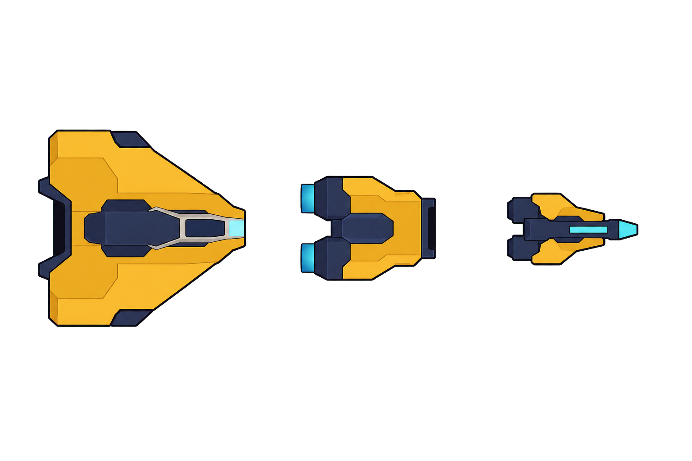
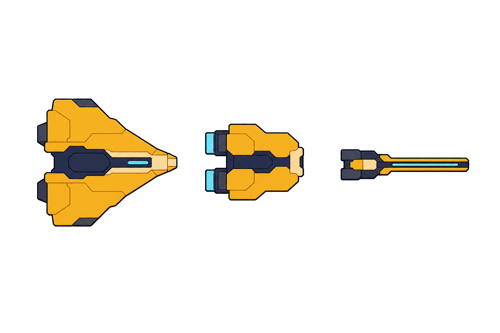
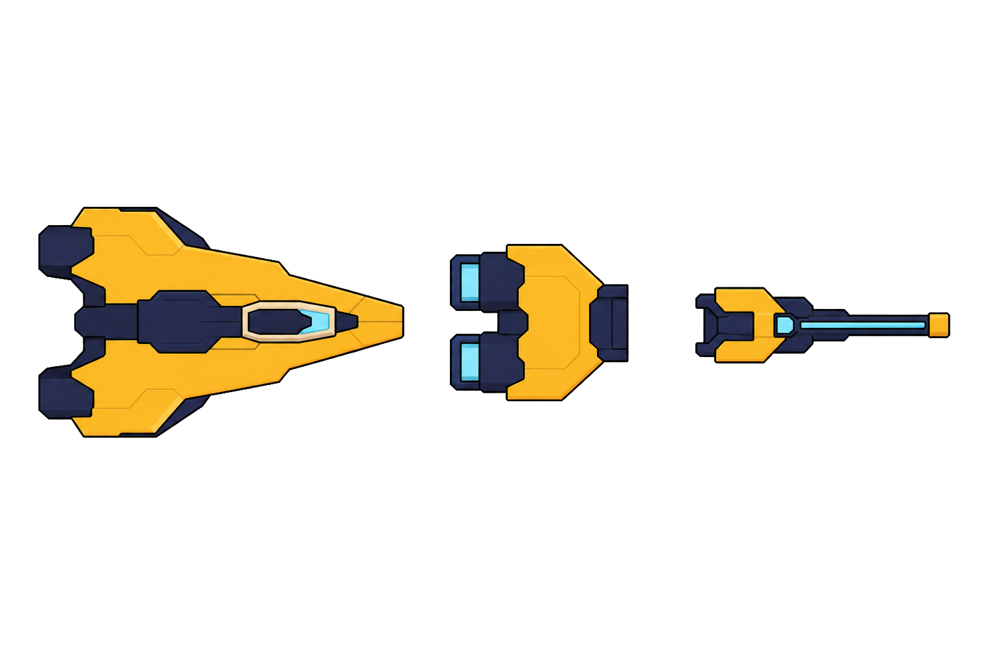

# Cardborne 비주얼 에셋 승인 보드

## Purpose

맵·전투·UI의 실제 문제를 고치기 위해 현재 이미지, 미연결 이미지와 절차
표현을 대응시키고, 재사용·수정·교체·추가 결정을 작은 가족 단위로
승인하기 위한 디렉터리다. inventory는 이 작업의 coverage 수단이며,
후보는 승인 전까지 runtime asset이 아니다.

## Sources

- `../00-general-sf-component-master-v1.png`: 승인된 일반 SF 형태 기준.
- `art/gameplay/semantic-v2/asset-manifest.json`: gameplay image identity.
- `art/ui/production/semantic-v2/ui-asset-manifest.json`: UI image state.
- 기존 gameplay/UI review sheet 11개: 현재 마스터 그리드 입력.

## Findings

### 역할별 승인 리포트

[`asset-switch-approval-report.html`](./asset-switch-approval-report.html)은
작은 카드 그리드가 아니라 다음 구조로 검토한다.

- 상단의 10개 역할 카테고리 tab
- 카테고리 안의 실제 교체·추가·코드 항목 목록
- 한 번에 한 항목을 표시하는 큰 AS-IS / TO-BE viewer
- 원본 전체 화면 확대, 항목별 승인·수정·보류와 JSON export

분류와 이름의 정본은
[`GAMEPLAY_VISUAL_TAXONOMY.md`](../../GAMEPLAY_VISUAL_TAXONOMY.md)다.
구조벽, 엄폐물, 파괴 장벽, 통과형 에너지 장벽, 기능 장판, 위험 장판과
순간이동 게이트를 서로 바꿔 부르지 않는다. v1 리포트의 local decision은
의미가 달라졌으므로 v2로 자동 승계하지 않는다.

새 후보는 `generated/semantic-v4/`에 source와 alpha candidate를 함께
보관한다. 현재 묶음은 다음과 같다.

| family | 승인 단위 |
| --- | --- |
| `floor-decay` | 정상, 마모·균열, 독성 노출, 용암 노출 |
| `structure-family` | 독립 엄폐물, 보상 구역 장벽 3상태 |
| `gate-barrier` | 원형 순간이동 게이트 2상태, 통과형 에너지 장벽 2상태 |
| `world-functional` | 회복 장판 base/active와 공격 증폭 장판 |
| `collectibles-containers-and-pickups` | 상자, 회복, 경험치 회수, 단순 XP |
| `projectile-delivery` | player bolt, hostile bolt, missile, breach slug |
| `hostile-tier` | ordinary, elite, boss projectile tier |
| `laser-beam` | hostile startup cap, repeat core, endpoint contact, boss heavy segment |
| `impact-feedback` | bolt hit, missile hit, reflect, barrier contact |

`generated/semantic-v4/previews/`는 큰 개별 viewer를 위한 기계적 crop이며
별도 production asset owner가 아니다.

이전 `generated/world-v4/world-obstacle-candidates.png`의 cover/bulkhead 안은
새 `structure-family`가 대체하므로 승인·integration 대상으로 사용하지
않는다. `world-functional-candidates.png`에서는 회복 장판과 overdrive만
유효하며, 작은 arc terminal 안은 새 `gate-barrier`가 대체한다.

### 현재 에셋 마스터 그리드

- 원본 11개 review sheet를 그대로 합성했다.
- 생성형 모델로 기존 에셋을 다시 그리지 않았다.
- 파일 단위 전수 목록은
  [`current-asset-inventory.csv`](./current-asset-inventory.csv)에 있다.
- `05 맵 · 벽 · 지형지물`의 floor/wall 8개는 파일만 존재하며 현재
  런타임에는 연결되지 않았다.

### 현재 구현 감사

[`01-world-combat-runtime-gap.md`](./01-world-combat-runtime-gap.md)에 맵
타일, 벽, 기능 지형, 탄환과 일반/엘리트/보스 공격 경로의 AS-IS/TO-BE와
image-only/code-only/both 판정을 기록했다.

핵심은 새 이미지 부족만이 아니다. 기존 floor/wall PNG는 provider에서
제외되고, 기능 장판 이미지는 실제 효과 범위보다 작으며, 탄환과 공격
경로에는 tier와 pattern geometry를 전달하지 않는 코드 문제가 있다.

### Optional comparison: player foundation

비교 대상은 player hull, rigid rear engine, manual-aim mount 3개다.
모두 +X/right 방향이며 한 이미지에 정확히 3개만 둔다.

이 후보는 원래 필수 교체 요청이 아니었다. 현재 player asset은 기본적으로
유지하며, 아래 3안은 사용자가 나중에 명시적으로 채택할 때만 교체한다.

#### 시안 1

- 승인 마스터에 가장 가까운 3–4 plane 처리.
- 사용자는 현재 기체보다 나아 보인다고 평가했지만 runtime 교체를
  지시하지는 않았다.

#### 시안 2

- 큰 실루엣을 유지하면서 기능 plane을 한 단계 더 분리.

#### 시안 3

- 군집 속 1× 판독을 위해 바깥 contour와 negative space를 가장 강하게 사용.

## Review rule

- scoped current asset은 실제 runtime integration 근거가 없으면
  `UNREVIEWED`다.
- 기존 에셋이 실제 크기·경로·배경에서 요구를 충족하면 재사용하고,
  부족한 identity만 수정·교체·추가한다.
- player 1, 2, 3안의 선택은 필수가 아니며 다음 작업을 막지 않는다.
- 다음 필수 승인 단위는 기존 floor/wall 에셋 + deterministic
  algorithm/topology integration preview다.
- 이후 terrain footprint와 projectile/attack tier contract를 확인하고,
  부족함이 입증된 이미지만 생성한다.
- 필수 대상이 승인되기 전에는 manifest/provider/Theme와 runtime 코드를
  바꾸지 않는다.
- UI panel 이미지는 shell만 소유하고, localized text와 dynamic icon은
  Godot Control child로 올린다.

## Generation note

- built-in ImageGen을 사용한다.
- style reference:
  `../00-general-sf-component-master-v1.png`
- flat chroma source를 생성하고 로컬에서 alpha PNG로 변환한다.
- source와 final을 모두 보관해 배경 제거 문제를 재검증할 수 있게 한다.
