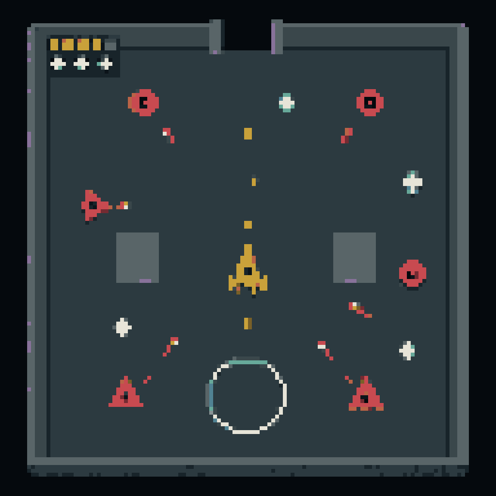
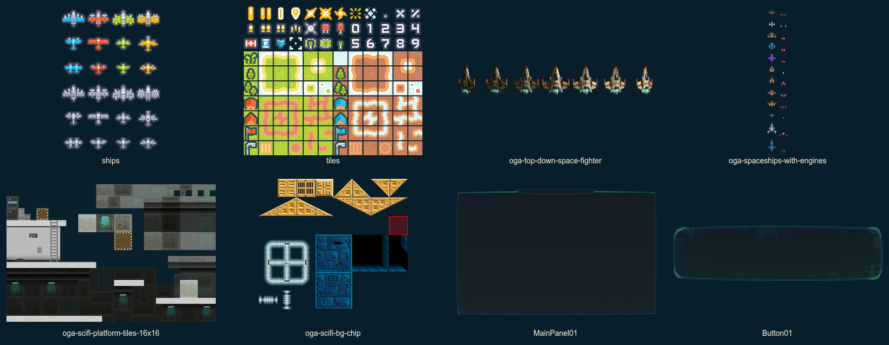
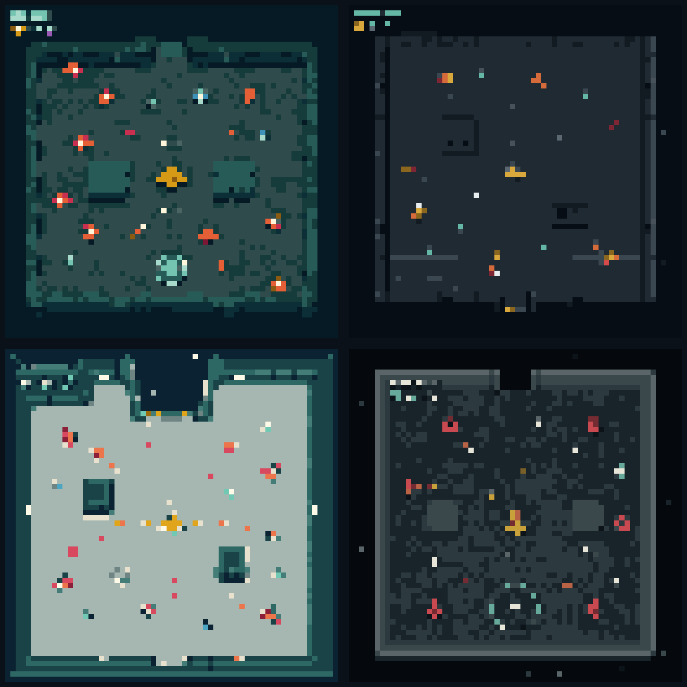
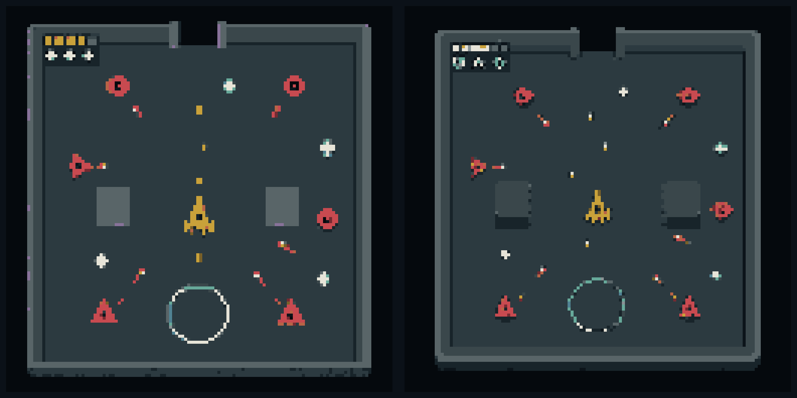

# Pixel Space-Hangar Visual Research

## Purpose

Determine a simple, familiar, and producible pixel-art grammar for Cardborne's
top-down space-hangar game. The target is not novelty or ornament. A first-time
player must immediately distinguish walkable floor, blockers, the player,
enemy roles, projectiles, pickups, and support effects while the screen is busy.

This report is design evidence. It does not supersede
[`UI_VISUAL_SYSTEM.md`](../UI_VISUAL_SYSTEM.md), approve external production
assets, or change the live Godot game.

## Sources

- 20 official image-bearing game references are visible in
  [`REFERENCE_GALLERY.md`](./REFERENCE_GALLERY.md).
- 13 verified CC0 packs are recorded in
  [`reference-manifest.json`](./reference-manifest.json); a bounded subset was
  downloaded with hashes and inspected locally.
- The current runtime owners, 40-family asset inventory, native sizes,
  semantic-layer contract, and batching constraints come from
  [`pixel-art-asset-pipeline`](../pixel-art-asset-pipeline/README.md).
- All generated MVPs use one semantic test scene: floor, void, boundary,
  doorway, two covers, player, two enemy roles, both projectile owners, XP,
  repair, one support zone, and minimal HUD.

## Findings

### Direction recommendation

Use the **refined readable tactical deck** as the provisional production
direction:

It is intentionally ordinary in the useful sense: a quiet charcoal floor,
near-black space, one neutral blocker language, mustard player, coral threats,
cyan support objects, and ivory/gold friendly fire. Its identity comes from the
space boundary, doorway, vehicle silhouettes, and restrained ownership palette,
not from surface decoration.

This image is still an MVP. The source generator left shadows, softened values,
and ambiguous four-point XP marks. Those are rejected and must be replaced by
deterministic authored pixels in individual asset-family passes.

### Reference synthesis

The repeatable design grammar across the inspected references is:

1. Walkable space uses one quiet base value and, at most, one lower-contrast
   functional-zone value.
2. Every non-traversable wall and cover shares one material family. Visual
   decoration never changes collision truth.
3. The player owns one unique warm hue and an asymmetric nose/engine silhouette.
4. Enemy role is communicated by outer shape before color or inner detail.
5. Friendly and hostile shots differ by head shape, value, and trail behavior;
   literal modifier icons never sit inside bullets.
6. Pickups use isolated, stable silhouettes with empty space around them.
7. HUD ornament stays in corners; text, values, cooldown fill, focus, and
   localization remain live UI.

### Free-asset result

The CC0 corpus is useful as construction evidence, not as a ready-made style
pack. Kenney's small ships provide the cleanest silhouette reference. The local
sci-fi tiles and UI frames are explicit anti-references for this game because
their grain, vents, bevels, side shadows, and borders would compete with dense
combat information.

## MVP Loop

### Round 1 — four equal-content directions

Reading order is A/B on the first row and C/D on the second row.

Scores use a five-point scale with equal weights.

| Candidate | Floor / blocker clarity | Ownership | Familiarity | Feasibility | Modularity | Clutter resistance | Total / 30 |
| --- | ---: | ---: | ---: | ---: | ---: | ---: | ---: |
| A — Graphic drydock | 4 | 4 | 4 | 4 | 4 | 3 | 23 |
| B — Pixel industrial | 5 | 4 | 5 | 3 | 5 | 4 | 26 |
| C — Arcade service deck | 5 | 5 | 5 | 3 | 4 | 4 | 26 |
| D — Tactical monochrome | 5 | 5 | 4 | 5 | 5 | 5 | **29** |

Rejection reasons:

- A adds irregular wall rhythm and floor hashes that can be mistaken for
  gameplay content.
- B is familiar and modular but panel seams, vents, and shaded tiles create an
  easy path back to industrial texture noise.
- C is approachable but the near-ivory floor reduces the headroom available for
  bright shots and pickups; outlines, shadows, and its HUD are too prominent.
- D wins on hierarchy and production feasibility, but its first version is too
  sterile and dark and confuses support-zone and repair symbolism.

### Pipeline correction discovered by Round 1

The comparison also falsified one workflow assumption. A whole gameplay scene
must not be snapped to `64 x 64`: actors collapse to two-to-five-pixel fragments
and lose role silhouettes. `64 x 64` remains the player-craft master size, while
enemy, projectile, tile, and pickup families retain the individual native sizes
declared in the asset inventory. Full-scene direction checks use `128 x 128`
logical pixels or a composite assembled from finished native assets.

The failed `64 x 64` results are retained as evidence rather than presented as
production art.

### Round 2 — two bounded corrections

E is on the left; F is on the right.

| Changed criterion | E — Readability | F — Hangar zoning |
| --- | ---: | ---: |
| Floor / void / blocker separation | 5 | 4 |
| Hangar identity without decoration | 4 | 4 |
| Pickup / support separation | 4 | 4 |
| Native `128 x 128` silhouette survival | 5 | 4 |
| **Total / 20** | **18** | 16 |

F proves that broad maintenance bays can add place identity, but they begin to
read like extra floor collision regions around cover. E therefore remains the
safer base. Future tile work may use one doorway threshold and one optional
large maintenance value, never several independent decorative zones.

## Production Recommendation

Generate and clean assets by family, not as a complete AI-generated sheet:

1. player projectile heads, wakes, and impacts;
2. player craft body, weapon, engine, and flame layers;
3. one round swarm enemy and one triangular shooter;
4. XP, repair, recall, and crate silhouettes;
5. floor, void edge, unified blocker, cover, and doorway tiles;
6. remaining actors, secondary weapons, VFX, and UI ornament after the grammar
   survives a representative combat composite.

For each family: use one native-size grid per asset or related frame, snap and
remap without dithering, create a semantic mask, extract full-canvas layers,
reassemble exactly, then pack the atlas. Image generation proposes silhouette
clusters; deterministic tools and pixel editing own final geometry and palette.

## What Must Not Be Generated

- a production sprite sheet containing unrelated objects;
- a complete map whose pixels define collision or navigation;
- text, numbers, key labels, cooldown fill, health, or localized UI;
- exact telegraph or minimap geometry;
- every upgrade or affinity combination as a separate bitmap;
- textures, scratches, stars, vents, bolts, micro-panels, or random floor marks;
- outlines around every object, soft shadows, glow, gradients, or antialiasing;
- decorative shapes that resemble a wall, item, hazard, or interaction state.

## Acceptance Gate

A candidate family is accepted only when:

- its silhouette reads at native scale without zoom;
- its palette contains no more than the declared family colors;
- semantic layers reassemble exactly at a shared origin;
- player, enemy, projectile, pickup, and terrain ownership remain distinct in a
  representative dense-combat composite;
- it preserves current collision truth, live UI ownership, and renderer
  batching;
- Korean/English strings and dynamic values remain outside raster assets.

## Limitations

- Generated scenes are visual-system probes, not usable production maps.
- Store headers can be more stylized than native gameplay and are used only in
  aggregate for named design problems.
- The provisional selection still requires BK's approval before it can replace
  the active visual specification or enter the live game.
