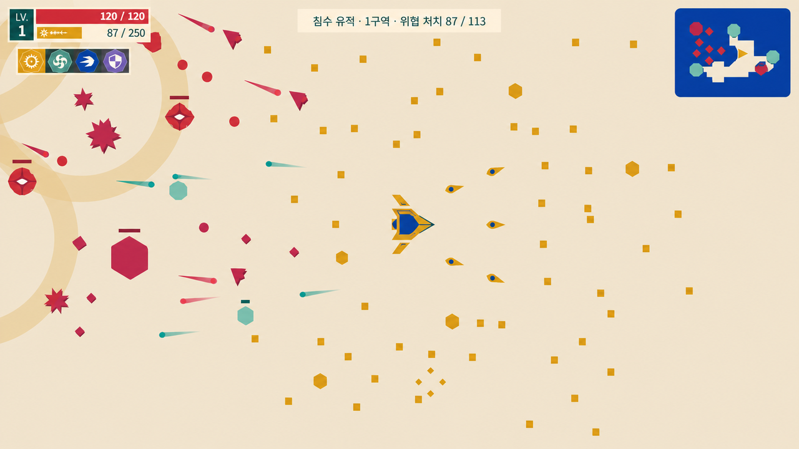
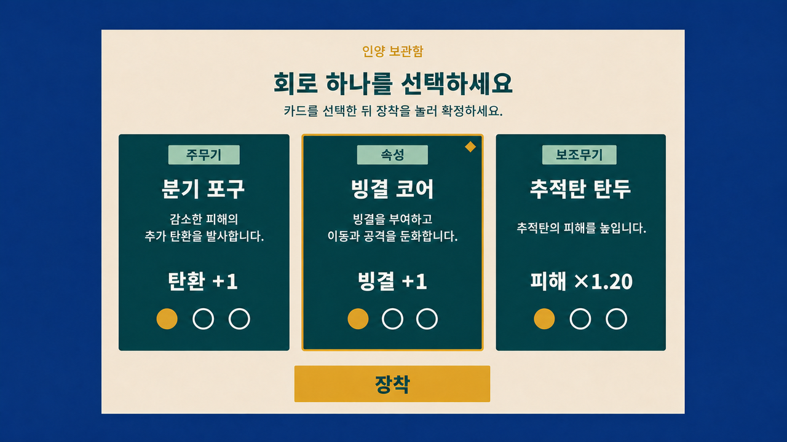
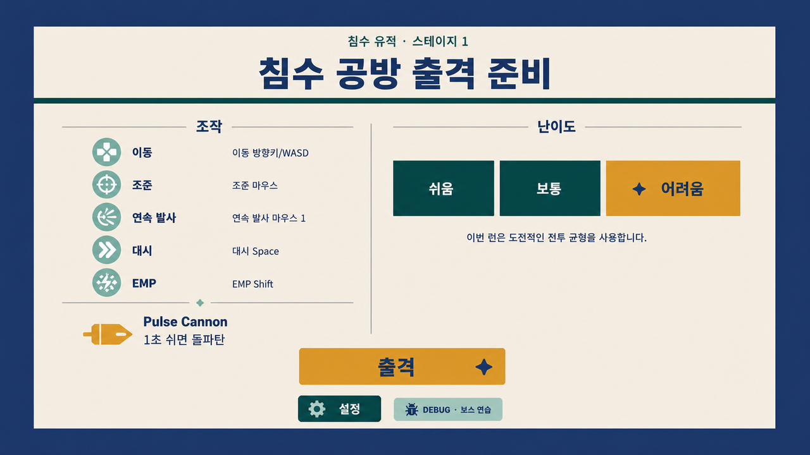
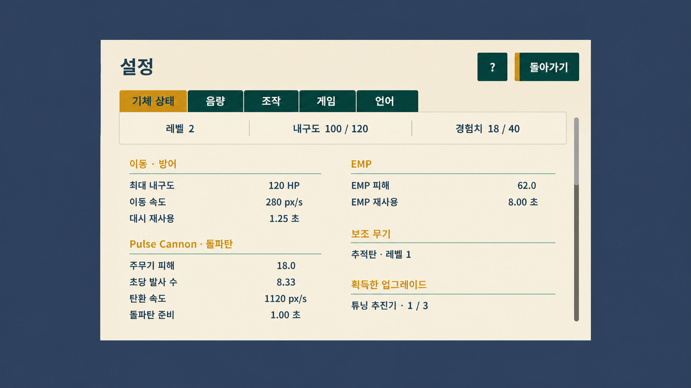
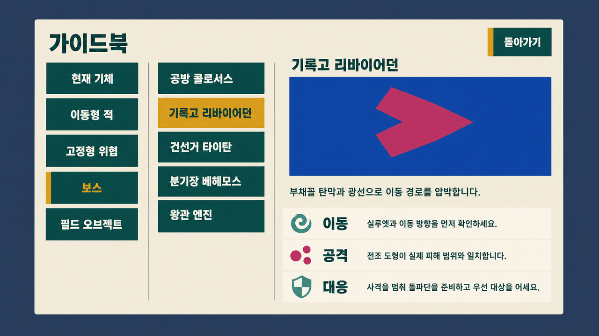
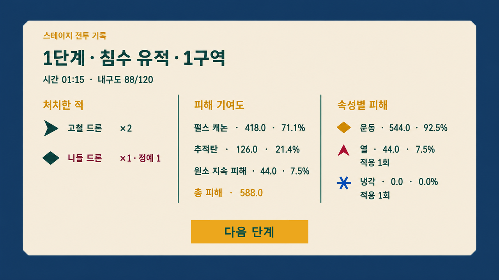

# Cardborne UIUX 개선 결과 미리보기

## Purpose

현재 게임을 완전히 다른 스타일로 바꾸는 자료가 아니다. 실제 런타임
캡처와 현재 코드가 가진 정보만 사용해, 구현 후 화면의 **정보 순서,
공간 밀도, 선택 상태, 전투 판독성**이 어떻게 달라질지를 보여주는
시각 설명서다.

이미지는 이해를 돕는 목표 화면이다. 이미지 안의 글자, 수치, 세부
도형은 그대로 게임에 넣지 않는다. 실제 구현에서는 Godot UI,
한국어/영어 번역 문자열, 현재 프로시저럴 메시를 사용하며 정확한
치수와 동작은 실행 계획서가 기준이다.

결과를 한 문장으로 요약하면, **전투 중에는 화면을 덜 가리고 대상을
더 빨리 구분하며, 전투 밖에서는 무엇을 읽고 선택하고 확정해야 하는지
시선 순서를 명확하게 만든다.**

서로 다른 정보 구조를 가진 여섯 화면만 만들었다. 일시정지와 차고는
출격·설정 화면에서 확정한 모달과 행동 우선순위를 그대로 재사용하므로,
별도 이미지를 더 만드는 것이 새로운 판단 근거를 제공하지 않는다.

## Sources

- 현재 한국어 런타임 캡처:
  `build/audits/ui-visual-snapshot-2026-07-25/runtime/`
- 현재 적·보스·투사체·기체 카탈로그:
  `build/audits/ui-visual-snapshot-2026-07-25/catalog/`
- 현재 구현을 재검증한 외부 시각 감사:
  `build/audits/ui-visual-snapshot-2026-07-25/agy-reports/FINAL-rendered-ui-visual-asis-tobe-audit.md`
- 고정 아트 시스템: `docs/design/UI_VISUAL_SYSTEM.md`
- 게임 동작의 기준: `docs/product/vehicle_game_spec.md`

## Findings

### 1. 실제 전투 화면

바뀌는 핵심은 HUD를 더 붙이는 것이 아니다.

- 좌측 상단 내구도·경험치와 그 아래 작은 액션 아이콘은 유지한다.
- 중앙 목표와 우측 상단 미니맵도 현재 위치를 유지한다.
- 화면 가운데에는 새 패널을 만들지 않는다.
- 같은 네모·육각형을 공유하던 적들의 큰 외곽 형태를 역할별로
  구분한다.
- 적 탄환은 기존 속성 색을 유지하면서도 머리 형태로 속성을 한 번 더
  구분한다.
- 기체, 위험 전조, 적, 경험치의 우선순서가 한눈에 읽혀야 한다.

즉, 전투 화면의 레이아웃은 보존하고 **전투 오브젝트가 무엇인지
판단하는 시간**을 줄이는 방향이다.

### 2. 업그레이드 선택

현재는 카드 하나가 긴 문장 덩어리다. 개선 후에는 시선이 다음 순서로
움직인다.

1. 주무기·속성·보조무기 같은 계열
2. 업그레이드 이름
3. 실제로 달라지는 효과
4. 현재 값에서 다음 값으로 변하는 수치
5. 현재 레벨

선택한 카드는 테두리와 마름모 표식이 함께 바뀌며, 선택 뒤에만
`장착`이 활성화된다. 실수로 바로 적용되지 않는 현재의 2단계 선택
방식은 그대로다.

### 3. 출격 준비

새로운 기능이나 맵 미리보기를 추가하지 않는다. 현재 화면에 이미
있는 내용을 두 덩어리로 다시 정리한다.

- 왼쪽: 조작법과 기본 펄스 캐논 설명
- 오른쪽: 쉬움·보통·어려움과 이번 런에서 난이도가 고정된다는 설명
- 아래: 짧고 분명한 `출격` 주 행동, 설정, 디버그 빌드의 보스 연습

화면 전체 너비의 거대한 버튼 여러 개가 쌓이지 않으며, 무엇을 확인한
뒤 무엇을 눌러야 하는지가 분명해진다.

### 4. 기체 상태와 설정

설정 탭의 기능은 바꾸지 않는다. 진행 중인 런의 기체 상태만 다음처럼
재배치한다.

- 맨 위: 레벨, 현재/최대 내구도, 경험치
- 기체·기동: 최대 내구도, 이동 속도, 대시 재사용
- 주무기·돌파탄: 피해, 연사, 탄속, 돌파탄 준비
- EMP: 피해와 재사용
- 아래: 현재 보조무기와 획득 업그레이드

값은 여전히 게임플레이가 만든 스냅샷 하나에서만 온다. 런 밖에서는
가짜 기본 능력치를 보여주지 않고, 현재처럼 “진행 중인 작전이 없음”
한 문장만 간결하게 보여준다.

### 5. 가이드북

다섯 카테고리와 발견 여부는 유지한다.

- `현재 기체`에서는 의미 없는 두 번째 목록 열을 숨겨 기체 정보에
  넓은 공간을 준다.
- 적·보스·오브젝트에서는 카테고리 → 항목 → 상세의 세 열을 유지한다.
- 상세는 실제 게임 메시 미리보기, 짧은 설명, `이동`, `공격`, `대응`
  세 줄로 정리한다.
- 만나지 못한 항목은 지금처럼 `???`만 보이며 정보가 새지 않는다.

### 6. 스테이지 전투 기록

이 화면은 구조가 이미 맞기 때문에 크게 바꾸지 않는다.

- 처치한 적
- 공격별 피해 기여도
- 속성별 피해

세 열은 그대로 두고 이름·수치·퍼센트의 정렬과 구분선을 다듬는다.
화면 너비 전체를 차지하던 다음 단계 버튼만 작은 주 행동으로
정리한다. 좁은 화면에서 세 탭으로 바뀌는 현재 동작도 유지한다.

## What remains deliberately unchanged

- 게임 조작, 난이도, 적 수, 카드 수치, 스테이지 진행
- 좌측 상단 HUD, 작은 액션 레일, 미니맵, 위협 레이더
- 기체 업그레이드 명암 단계와 엔진 개수 표현
- 잠긴 가이드북 항목
- 최종 결과의 메타게임 흐름
- 현재 의미 색상과 Sunken Ceramic Fresco 아트 스타일

## Limitations

- 생성 이미지의 한글이나 수치는 시각적 자리와 밀도를 보여주기 위한
  예시다. 실제 번역 문자열이 유일한 문구 기준이다.
- 생성 이미지에 남아 있는 약한 그림자·명암·그라데이션은 이미지 모델의
  흔적이다. 실제 구현에는 복사하지 않으며, 모든 면을
  `UI_VISUAL_SYSTEM.md`의 단색 토큰으로 렌더링한다.
- 생성 이미지의 도형은 최종 메시 좌표가 아니다. 메시의 최대 반경,
  충돌 일치, 배치 수, 성능 제한은 실행 계획서와 검증 코드가 기준이다.
- 이 문서는 근거 자료이며 정책이나 제품 사양이 아니다. 구현이 끝난
  뒤 확정된 규칙만 `UI_VISUAL_SYSTEM.md`에 반영한다.
