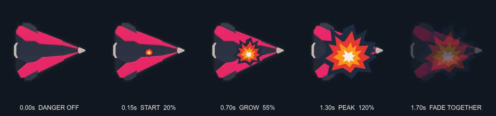

# Shared Boss-Death Explosion Candidate

## Purpose

Provide one review-only explosion overlay that starts small at the center of an existing
boss body, grows once, and fades out with that body. The boss raster remains intact; this
candidate does not replace, slice, or redraw it.

## Sources

- Binding visual contract: `docs/design/VISUAL_SYSTEM.md`, read completely before
  generation.
- Required style reference:
  `docs/design/cardborne-universal-art-style-reference.png`.
- Required and observed reference SHA-256:
  `96ccf5d053e66dd3a102ccdf39daefd0b0c54b0e88d20428b7ba1c894f002889`.
- Original authority-sheet artifact provenance:
  `C:/Users/BK/.codex/generated_images/019fbfe9-857e-7453-b72d-20908d848577/exec-0b8aa606-cf55-45c1-abb3-fb3df762b080.png`,
  timestamp `2026-08-02 12:13:44 KST`.
- The canonical style sheet was visually inspected at original detail and supplied to
  ImageGen as an actual image reference.
- Selected chroma source SHA-256:
  `076a1b5088fef5fadc01c2fd84984aa2591f9bb6ddbaf464e0c103d626d88325`.

## Findings

- Candidate asset: `assets/boss_explosion_burst_candidate.png`, `256x256` RGBA.
- Candidate SHA-256:
  `4eaf22c97fcdac6ff50736410e1e3068febcfa79acfc05ba493080c200113c41`.
- Selected storyboard SHA-256:
  `a5e60c1295df6dfa03b5139b370be8bce49551a0293e91bda50c5d5cd94aee42`.
- The storyboard uses only mechanical resize, alpha, placement, and plain labels over
  the existing approved `actor_boss_colossus_base.png` body.
- Runtime intent is exactly one centered instance: scale 0.20 to 1.20, then synchronize
  its fade with the unchanged boss body. It is one shared overlay, not a sprite sheet or
  per-boss death asset.
- `previews/boss-death-explosion-storyboard.png` preserves the rejected multi-burst layout
  as comparison evidence; it is not the selected runtime direction.

## Limitations

- Review-only; it is not user-approved and is not in the production manifest.
- `VISUAL_SYSTEM.md` currently prohibits effect rasters. Exact user approval plus a
  deliberate spec amendment are required before production promotion.
- Runtime timing, reduced-motion behavior, retained-batch capacity, and final-scale
  readability still require implementation validation.
