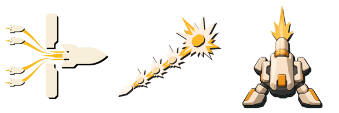

# Primary-Fire Upgrade Card Candidates v1

## Purpose

Preserve review-only raster candidates for Miss Compensation, Hit Chain, and Braced
Fire. They are outside the production manifest and are not approved for runtime use.

## Sources

- Binding authority: `docs/design/VISUAL_SYSTEM.md`, read completely before generation.
- Actual image reference supplied to every generation call:
  `docs/design/cardborne-universal-art-style-reference.png`.
- Expected and observed reference SHA-256:
  `96ccf5d053e66dd3a102ccdf39daefd0b0c54b0e88d20428b7ba1c894f002889`.
- The reference was inspected at original `1448x1086` detail. It supplied style grammar
  only; no depicted object, silhouette, glyph, card shell, text, or layout was copied.
- Built-in ImageGen source directory:
  `C:/Users/BK/.codex/generated_images/01a00142-7f77-7f60-950e-e40e7d1b27cd`.
- Exact prompts: [`generation-prompts.md`](generation-prompts.md).

## Findings

| Candidate | Canvas | SHA-256 | Review state | Mechanic read |
| --- | ---: | --- | --- | --- |
| [`miss_compensation.png`](assets/miss_compensation.png) | 192x192 | `456d7d18c1ff45f94c9c2c9784f6963a0b54c83aa6fce8cb6d0753d09fd0d935` | `direction_clear` | Four misses curve around a gap and feed one enlarged next hit without a target-designator symbol. |
| [`hit_chain.png`](assets/hit_chain.png) | 192x192 | `3c9a9fedd330523e38ceaeaeb0333ef079e525c40c49322f24e26534b3068ac6` | `direction_clear` | Consecutive impacts increase in size along one forward rhythm; no electric or defense metaphor. |
| [`braced_fire.png`](assets/braced_fire.png) | 192x192 | `75bf9358bc5e296d15b65c7d01a06f402a5a3ce53f8268c1692e8c32ff674ba2` | `direction_clear` | Two broad feet and a centered barrel read as a stabilized firing stance. |

- Actual-size sheet SHA-256:
  `6119a4393114501b67526e78769a1b29245583c274e7018c8cb5487287f81424`.
- Grayscale sheet SHA-256:
  `8b485884c0ba2b0022498a4ae40b4466efb3094ee2c516b4011f046a5dc1e407`.
- The chroma helper used border auto-key, soft matte, thresholds `12/220`, and despill.
  ImageMagick performed only trim, resize, transparent placement, grayscale conversion,
  and contact-sheet placement. It did not author or repair visual geometry.
- All target files are RGBA, `192x192`, with transparent corners.

## Limitations

- `direction_clear` means ready for exact user review, not user-approved or switch-ready.
- Runtime readability still requires the existing upgrade-row and build-slot rendered
  checks after approval and promotion.

