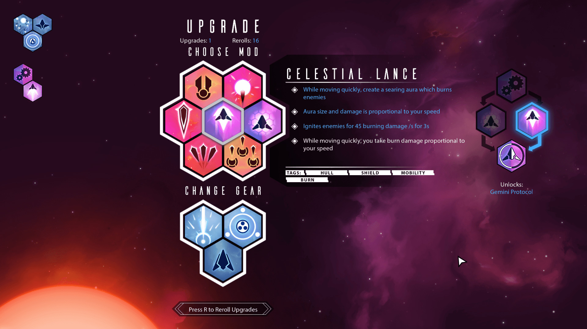
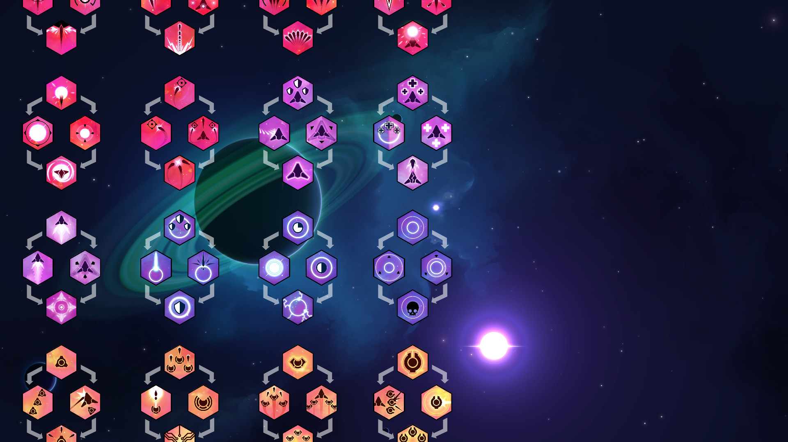
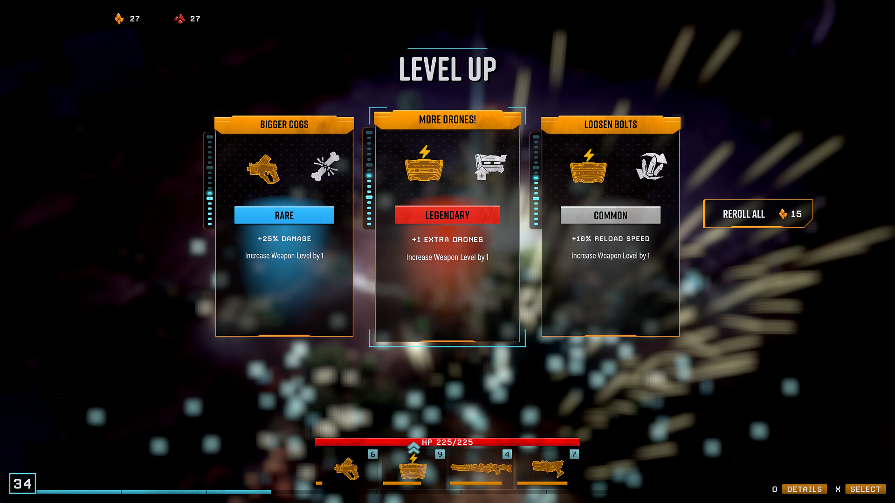
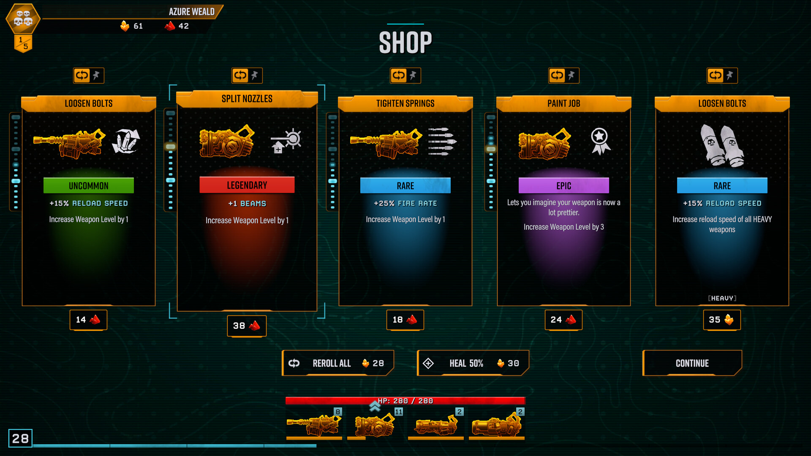
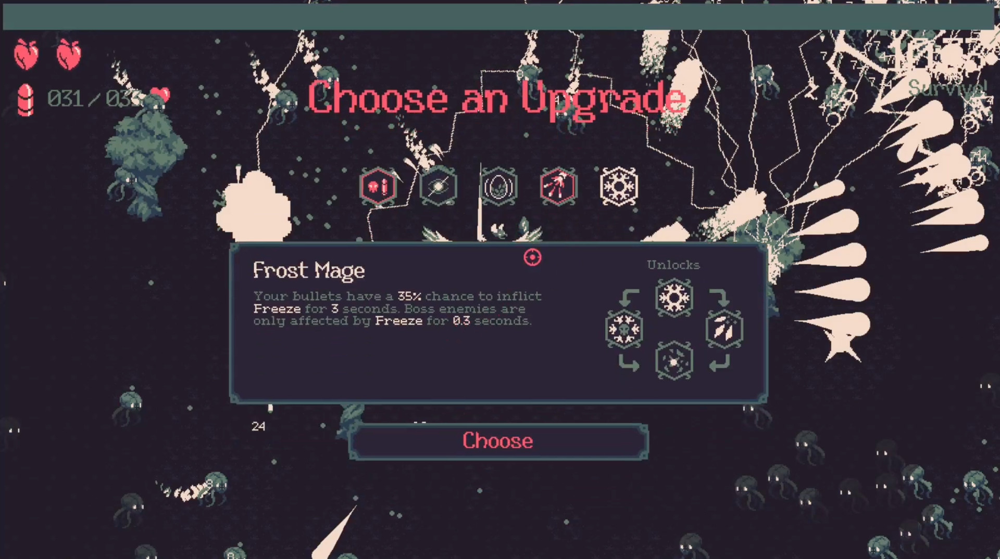
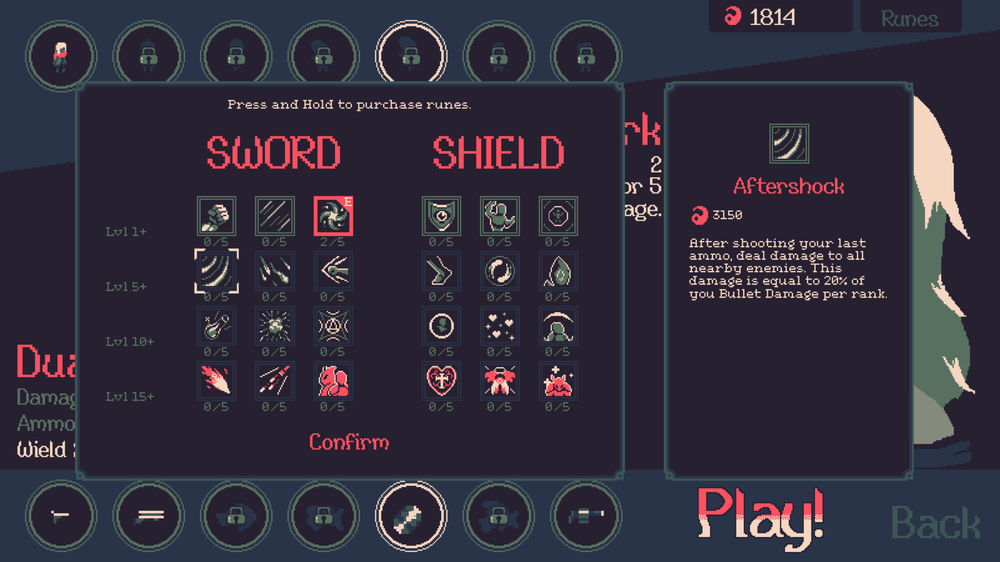
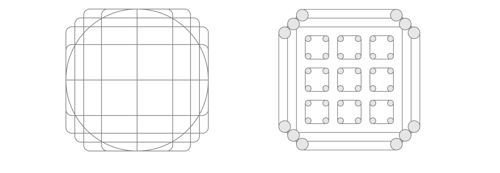
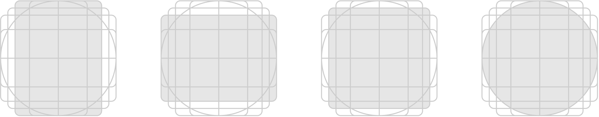
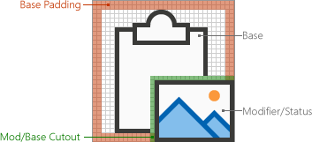
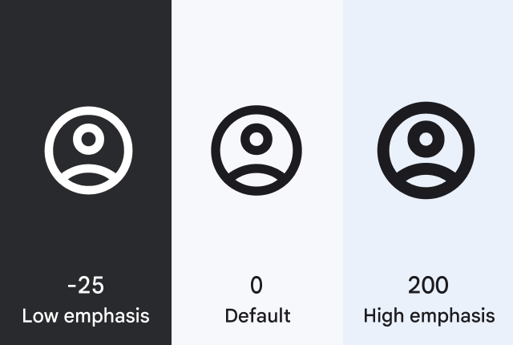

# Cardborne 업그레이드 이미지 레퍼런스 분석

## Purpose

이 문서는 다음 업그레이드 이미지를 만들기 전에 사용할 **근거 문서**다. 외부 게임의
화면과 공식 아이콘 설계 자료를 이미지로 보존하고, 관찰한 사실과 Cardborne 적용
권고를 구분한다. 특정 게임의 아이콘이나 화면을 복제하거나, 이 문서만으로 새
이미지를 승인하지 않는다.

이 문서가 답할 질문은 세 가지다.

1. 업그레이드 이미지가 단독으로 무엇까지 설명해야 하는가?
2. 고유 무기와 여러 무기에 공통 적용되는 강화는 어떻게 구분하는가?
3. 가장 작은 실제 표시 크기에서도 무엇이 남아야 하는가?

## 먼저 내린 결론

- **이미지는 정체성과 빠른 분류를 담당한다.** 정확한 효과, 현재값, 다음값, 지속
  시간과 조건은 카드 제목·설명·수치 행이 담당한다.
- **고유 무기·효과는 하나의 고유 실루엣을 사용한다.** 십자 광선, 블랙홀, 충격파,
  회전 날개처럼 실제 플레이에서 보이는 결과를 가장 단순한 한 장면으로 잡는다.
- **공통 강화는 고유 무기처럼 그리지 않는다.** 대상 계열을 나타내는 공통 base와
  `피해`, `재사용` 같은 modifier 하나를 분리해 보여준다. 정확한 증가량은 이미지에
  넣지 않는다.
- **스택·레벨·개수 증가는 UI가 숫자로 표시한다.** 여러 작은 물체를 억지로 반복해서
  `+1`이나 3중첩을 설명하지 않는다. 단, 투사체 수 자체가 무기의 정체성인 확산
  총구는 예외로 실제 여러 탄환을 주 형상으로 쓸 수 있다.
- **색만으로 의미를 만들지 않는다.** 원소색은 보조 단서이며, 폭발·독성 물질·얼음·
  전기 방전처럼 형상도 달라야 한다.
- **다음 후보는 72px를 최저 기준으로 검토한다.** 기존 v1-v3의 48px 검사도 보조
  스트레스 테스트로 유지할 수 있지만, 현재 카드의 실제 크기는 compact `72px`,
  normal `88px`, large `104px`다.
- **v3의 `원인 → 결과` 순서도식 이미지는 폐기한다.** 한 이미지 안에 여러 물체,
  시간 순서와 결과를 모두 넣어 오히려 제목보다 해석 비용이 커졌다.

이 결론은 제작 지시가 아니라 다음 시안의 평가 기준이다. 최종 형태와 개별 자산
승인은 BK가 별도로 결정한다.

## Sources

### Cardborne 정본과 현재 구현

- [`vehicle_upgrade_catalog.md`](../product/vehicle_upgrade_catalog.md) — 현재 28장,
  분류, 레벨별 효과와 카드 표시 계약.
- [`VISUAL_SYSTEM.md`](../design/VISUAL_SYSTEM.md) — 의미 역할, 3–5개 큰 색면,
  제한된 accent, 실제 크기 검증과 authored PNG 소유권.
- [`cardborne-universal-art-style-reference.png`](../design/cardborne-universal-art-style-reference.png)
  — 스타일 문법만 제공하며 개별 asset 승인이 아님.
- [`vehicle_upgrade_choice_row.gd`](../../scripts/ui/vehicle_upgrade_choice_row.gd) — 현재
  이미지 `72/88/104px`, 제목, 한 줄 설명, 수치 변화 최대 두 개와 레벨 전이를
  별도로 표시하는 실제 UI owner.
- [v2 48px 비교 시트](../design/visual-replacement-workbench/previews/upgrade-artwork-samples-v2/runtime-48-contact-sheet.png),
  [v3 48px 비교 시트](../design/visual-replacement-workbench/previews/upgrade-artwork-revisions-v3/runtime-48-contact-sheet.png)
  — 모두 승인되지 않은 실패 근거다.

시각 정본 사전 점검은 완료했다. `VISUAL_SYSTEM.md`를 전체 확인했고, 스타일 시트를
원본 `1448×1086`로 검사했다. 요구 SHA-256과 관찰값은 모두
`96ccf5d053e66dd3a102ccdf39daefd0b0c54b0e88d20428b7ba1c894f002889`다.

### 외부 이미지 자원과 출처

모든 외부 파일의 원본 페이지, 직접 URL, 크기와 SHA-256은
[`source-manifest.json`](./assets/upgrade-artwork-reference-analysis/source-manifest.json)에
기록했다. 게임 화면은 제작사·퍼블리셔가 공식 Steam 상점이나 press kit에 제공한
홍보 스크린샷이다. **분석용으로만 보관하며 자르기·추출·트레이싱·제작 재사용을
허용하는 자료가 아니다.**

공식 문서 자원은 다음과 같다.

- [Microsoft Windows app icon design](https://learn.microsoft.com/en-us/windows/apps/design/iconography/app-icon-design)
- [Microsoft Office Add-in icon guidelines](https://learn.microsoft.com/en-us/office/dev/add-ins/design/add-in-icons)
- [Google Material Symbols guide](https://developers.google.com/fonts/docs/material_symbols?hl=en)

공식 게임 페이지는 다음과 같다.

- [Nova Drift 공식 press kit](https://novadrift.io/presskit.html) 및
  [Steam 페이지](https://store.steampowered.com/app/858210/Nova_Drift/)
- [Deep Rock Galactic: Survivor Steam 페이지](https://store.steampowered.com/app/2321470/Deep_Rock_Galactic_Survivor/)
- [20 Minutes Till Dawn Steam 페이지](https://store.steampowered.com/app/1966900/20_Minutes_Till_Dawn/)

### 기존 목록에서 제외한 출처

아래 자료는 존재 자체가 나쁜 것이 아니라, **이번 시각 판단을 직접 뒷받침하지
못해서** 핵심 근거와 로컬 이미지 자원에서 제외했다.

| 출처 | 제외 이유 | 다시 사용할 수 있는 경우 |
| --- | --- | --- |
| Hades 공식 patch/update 기록 | boon 선택 UI와 아이콘 구성을 직접 보여주지 않음 | 공식 boon 선택 이미지가 확보될 때 정보 계층 비교 |
| Warframe patch notes | 무기 동작과 변경점은 설명하지만 작은 upgrade artwork 체계를 보여주지 않음 | 개별 mechanic 명칭·동작 조사 |
| Path of Exile forum 설명 | projectile/volley 규칙의 텍스트 근거이며 시각 비교 자료가 아님 | 투사체 수 mechanic 설계 검증 |
| Vampire Survivors 공식 Steam gallery | 현재 공식 gallery에 level-up 선택 화면이 없음 | publisher가 제공한 선택 화면이 확보될 때 |
| Brotato 공식 Steam gallery | 현재 공식 gallery가 전투 장면 중심이라 stat 선택 card를 직접 검증할 수 없음 | 공식 shop/level-up 화면이 확보될 때 |
| 제3자 guide·검색 image | 화면 의미 확인에는 도움되지만 권리·버전·원본성이 불명확함 | 보조 검증만 하고 로컬 자원으로 복사하지 않을 때 |

따라서 이 문서에서 “공식”은 단순히 게임 이름이 붙은 페이지가 아니라, 주장하는
화면과 동작이 publisher/developer 제공 이미지에 실제로 보인다는 뜻이다.

## 조사 방법과 신뢰도

이번에는 페이지에 게임 이름이 있다는 이유만으로 레퍼런스에 넣지 않았다. 이미지에서
주장하는 UI나 아이콘 동작이 **직접 보여야** 채택했다.

| 등급 | 자료 | 이 문서에서 허용하는 판단 |
| --- | --- | --- |
| A | Cardborne 정본·현재 코드 | 현재 크기, 소유권, 카드 구조의 사실 |
| B | 공식 게임 상점·press kit 스크린샷 | 보이는 정보 구조와 시각 구분 방식 |
| B | 공식 플랫폼 아이콘 지침과 도해 | 일반적인 작은 아이콘 구성 원칙 |
| C | 커뮤니티 wiki·가이드 | 공식 화면의 의미 확인을 위한 보조 자료만 |
| 제외 | 검색 썸네일, 출처 불명 이미지, 기억에 의존한 설명 | 근거로 사용하지 않음 |

공식 스크린샷도 특정 버전의 한 화면일 뿐이다. 다른 게임의 수치나 장식 스타일을
Cardborne에 그대로 옮길 근거는 아니다.

## Findings

### 1. 현재 Cardborne에서 이미지가 맡지 않아도 되는 것

현재 선택 row는 이미지 하나 외에도 다음 정보를 이미 표시한다.

- 분류
- 제목
- 최대 한 줄 설명
- 실제 수치 변화 최대 두 개
- `NEW` 또는 현재 레벨에서 다음 레벨로의 전이

따라서 이미지가 `대시 후 2초간 피해 +15%`, `재사용 ×0.90`, `범위 72 → 84`까지
그림만으로 설명할 필요가 없다. 그 시도는 작은 화면 안에 조건, 시간 순서, 대상과
결과를 동시에 넣게 만들며 v3의 실패를 반복한다.

이미지가 반드시 해야 하는 일은 다음 두 가지다.

1. 세 선택지를 훑을 때 서로 다른 계열·능력임을 즉시 구분한다.
2. 이미 얻은 빌드 목록에서 같은 의미를 같은 형상으로 다시 찾게 한다.

### 2. Nova Drift — 고유 능력은 glyph, 정확한 규칙은 상세 영역

관찰한 사실:

- 선택지는 반복되는 육각 tile과 짧은 glyph로 구성된다.
- 선택한 항목 하나만 큰 제목, 여러 줄 효과, tag와 후속 관계를 별도 영역에 표시한다.
- 중심의 기체 같은 공통 motif는 계열을 묶지만, 주변 glyph는 공격·방어·다중 탄환 등
  서로 다른 결과를 강조한다.
- 아이콘 단독으로 모든 bullet point를 설명하지 않는다.

관찰한 사실:

- 같은 계열의 base motif를 반복하고, 갈라지는 효과만 바꿔 계보를 만든다.
- 개수 증가는 복수 탄두처럼 실제 반복 형상으로, 방어는 방패 조각처럼 다른 큰
  형상으로 구분한다.
- 많은 tile을 한 화면에 놓기 때문에 각 glyph의 내부 detail은 제한된다.

Cardborne에 주는 시사점:

- `십자 광선`, `블랙홀`, `충격파`처럼 동작 자체가 정체성인 카드는 고유 동작
  실루엣이 맞다.
- 그러나 조건, 피해량과 재사용은 이미지가 아니라 지금 존재하는 설명·수치 행이
  맡아야 한다.
- Nova Drift의 색, 육각 frame, 기체 glyph와 실루엣은 복제하지 않는다.

### 3. Deep Rock Galactic: Survivor — 대상과 변화량을 분리한다

관찰한 사실:

- 카드 상단에는 제목이 있고, 중앙에는 `강화되는 대상`과 `변화 종류`가 분리되어
  놓인다.
- `Bigger Cogs`는 무기와 충돌/피해 glyph, `More Drones!`는 장비와 추가 drone,
  `Loosen Bolts`는 장비와 reload glyph를 함께 보여준다.
- `+25% DAMAGE`, `+1 EXTRA DRONES`, `+10% RELOAD SPEED`는 그림이 아니라
  명시적 텍스트다.
- 희귀도와 세부 문장이 그림의 의미를 대신하지 않고 별도 계층에 있다.

관찰한 사실:

- 특정 무기 강화는 해당 무기 실루엣을 base로 유지한다.
- 같은 발사 속도나 reload 계열도 대상이 다르면 base가 달라지고, 수치는 텍스트로
  확인한다.
- 모든 강화마다 완전히 다른 장면을 그리지 않는다. target identity와 modifier를
  조합한다.

Cardborne에 주는 시사점:

- 사용자가 처음 제안한 `기존 계열 이미지 + 눈에 띄는 증가 표시`는 실제로 검증된
  방향이다.
- 다만 작은 무기 세 개와 화살표를 한데 모으는 v3 방식은 base가 무엇인지 흐렸다.
  공통 보조무기 강화에는 먼저 **하나의 공통 보조무기 계열 표식**이 필요하다.
- 증가값을 여러 화살표 크기나 개수로 표현하지 말고 현재 카드 수치 행에 맡긴다.

### 4. 20 Minutes Till Dawn — 작은 glyph는 제목·설명과 한 묶음이다

관찰한 사실:

- 후보 glyph는 화면 상단의 작은 동일 규격 tile로 먼저 보인다.
- 선택한 하나만 제목과 설명이 확대되고, 연계 효과는 별도 diagram으로 표시된다.
- `냉기` 같은 속성도 아이콘만으로 확률·지속시간·보스 예외를 설명하지 않는다.

관찰한 사실:

- 많은 항목을 같은 tile 크기와 제한된 색으로 배치한다.
- 계열은 위치와 그룹으로 보강되고, 정확한 규칙은 선택 후 상세 panel에서 확인한다.
- 복잡한 효과도 한 glyph에 작은 사물 여러 개를 넣기보다 큰 방향·충돌·방어 형상을
  우선한다.

Cardborne에 주는 시사점:

- 원소·치명타·수거 같은 추상 stat은 혼자서 완전한 설명을 할 수 없다. 제목·수치와
  결합한 빠른 category cue가 현실적인 목표다.
- 연계 구조나 조건부 규칙까지 이미지에 넣지 않는다. Cardborne에는 이미 설명 행이
  있으므로 별도 tree diagram도 필요 없다.

### 5. Microsoft — literal metaphor, 작은 실루엣, 두 요소 상한

Microsoft는 핵심 개념을 focal point로 두고, 장식이 metaphor를 희석하지 않게 하며,
가능하면 하나, 최대 두 개의 metaphor를 권한다. 위 도해에서는 같은 턴테이블이
단순화되면서도 원판과 tonearm이라는 핵심 관계를 유지한다.

공식 지침은 48×48 grid에서 먼저 균형을 잡고, 작은 크기에서 읽히는 구별 가능한
silhouette, 적은 shape와 corner를 요구한다. 색만으로 의미를 전달하지 말고 prominent
layer에만 detail을 추가하라고 명시한다.

Cardborne에 주는 시사점:

- 이 지침은 일반 app icon용이며 Cardborne의 SF 재질이나 색면을 정의하지 않는다.
- 그러나 `하나의 주 형상`, `최대 한 개의 보조 의미`, `작은 크기에서 실루엣 검사`는
  그대로 적용할 수 있다.
- v3의 대시→탄환 충돌 sequence와 여러 보조무기 묶음은 두 metaphor 상한을 넘거나
  focal point를 잃었다.

### 6. Microsoft Office — base와 modifier는 겹치더라도 분리한다

관찰한 사실:

- base는 주 개념이며, modifier는 action이나 status를 더하는 보조 요소다.
- modifier는 대체로 우측 하단에 놓되 base를 알아볼 수 없게 만들면 다른 corner를 쓴다.
- 겹치는 두 요소 사이에는 cutout/gap을 만들어 하나의 덩어리로 뭉치지 않게 한다.
- Office의 48px monoline 규칙에서는 2px gap을 쓴다.

Cardborne에 주는 시사점:

- `보조무기 피해`, `보조무기 재사용`, `발동무기 피해`, `발동무기 재사용`에는 이
  조합 문법이 유효하다.
- Office의 선 두께, 흰 배경, 색과 monoline style은 가져오지 않는다. Cardborne의
  authored PNG는 정본 스타일의 큰 filled plane을 사용한다.
- modifier와 base 사이의 **시각적 분리 원칙**만 채택한다. 정확한 pixel gap은
  72/88/104px 시안에서 다시 정한다.

### 7. Google Material Symbols — 크기가 바뀌면 같은 굵기를 그대로 축소하지 않는다

Google의 공식 체계는 `fill`, `weight`, `grade`, `optical size`를 분리한다. 특히
optical size는 20–48dp에서 크기가 바뀔 때 stroke thickness도 함께 조정한다.

Cardborne에 주는 시사점:

- 하나의 512px 이미지를 단순 축소한 결과만 보고 승인해서는 안 된다.
- 최소 72px에서 얇은 gap, 작은 화살표와 작은 탄환이 사라지면 source가 멋있어도
  실패다.
- Cardborne은 vector font가 아니므로 자동 보정할 수 없다. ImageGen 원본부터 큰
  형태와 충분한 분리를 갖춰야 한다.

## 비교 결과

| 질문 | Nova Drift | DRG Survivor | 20 Minutes Till Dawn | 공식 icon 지침 | Cardborne 결론 |
| --- | --- | --- | --- | --- | --- |
| 고유 능력 | 고유 glyph + 상세 text | 대상 무기 + 변화 glyph | 고유 glyph + 상세 panel | literal metaphor 우선 | 동작 하나를 고유 실루엣으로 |
| 공통 stat | 계열 motif와 tag | target base + modifier + 값 | uniform tile + 설명 | base + modifier 분리 | 공통 계열 표식 + modifier 하나 |
| 정확한 수치 | text | text | text | icon에 글자 회피 | 현재 UI의 수치 행이 소유 |
| level/stack | tree·상세 정보 | card 값과 level | grid/선택 정보 | icon 밖 정보 | 이미지에 굽지 않음 |
| 작은 크기 | 단순 tile glyph | 큰 base 두 개 | 제한된 색과 단순 glyph | silhouette·optical weight | 72px 실제 크기 필수 검사 |
| 색 | 계열 보조 | rarity/target 보조 | 계열 보조 | 색만으로 의미 금지 | 형상이 먼저, 원소색은 보조 |

## Cardborne 의미 체계 제안

### 문법 A — 고유 무기·고유 행동

대상: `split_muzzle`, `piercing_rounds`, 다섯 보조무기, 세 발동무기, 네 원소와
명확한 조건부 행동.

- 하나의 dominant action silhouette를 사용한다.
- 실제 gameplay에서 플레이어가 보는 결과를 우선한다.
- 시간 순서, 조건과 결과를 한 이미지 안에 연결하지 않는다.
- 제목을 가렸을 때 정확한 수치가 아니라 `다발`, `관통`, `기뢰`, `십자 광선`,
  `블랙홀` 같은 **종류**만 구분되면 성공이다.

### 문법 B — 공통 계열 강화

대상: `secondary_coolant`, `secondary_amplifier`, `active_coolant`,
`active_amplifier`.

- 각 계열에 하나의 승인된 base 표식을 먼저 만든다.
- 같은 base를 피해와 재사용 카드에 반복한다.
- modifier는 하나만 쓰고 base와 명확히 분리한다.
- `피해 증가`와 `재사용 감소`의 정확한 값은 카드 수치 행이 담당한다.
- 여러 실제 무기를 작게 나열해 계열을 설명하지 않는다.

### 문법 C — 보편 stat·지원

대상: `chassis_speed`, `pickup_radius`, `hull_integrity`, `lifesteal`,
`overflow_barrier`, `critical_targeting`, `last_stand_amplifier`.

- 보편적인 대상 하나와 상태 하나만 사용한다.
- 수거 범위는 `원형 범위 + 여러 pickup + 중심` 같은 diagram을 피한다. 자석이나
  pickup shard처럼 이미 익숙한 대상 하나를 쓰고 `수거 범위 +70`은 text가 맡는다.
- 치명타는 탄환, 장갑, fracture, 표적 bracket을 모두 넣지 않는다. `약점 적중`이나
  `강한 충돌` 중 하나의 metaphor만 선택한다.
- 저체력 피해는 낮은 hull 상태와 공격 증가를 동시에 완전 설명하려 하지 않는다.
  hull warning을 주 형상으로 두고 제목이 조건부 피해를 완성한다.

## 문제 항목별 교정 방향

| 문제 항목 | v3가 나빠진 이유 | 다음 시안에서 이미지가 보여줄 것 | text/UI가 계속 맡을 것 |
| --- | --- | --- | --- |
| 보조무기 전반 | 미사일·날개·기뢰를 한데 모아 주체가 사라짐 | 고유 무기는 각자의 실제 실루엣; 공통 강화는 승인된 보조 계열 base 하나 | 모든 보조무기에 적용, 정확한 배율 |
| 전투 조건 전반 | 조건→행동→결과를 작은 sequence로 만듦 | 치명타, dash wake, low-hull 등 조건을 대표하는 한 장면 | 발동 조건, 지속시간, 피해 증가량 |
| 십자 광선 | 네 방향 빛이 의료용 `+`나 일반 crosshair로 보임 | 화면을 가로지르는 두 beam axis라는 `공격 결과` 하나; 장식 emitter와 작은 target 제거 | 엄폐물 무시, 피해·폭·재사용 |
| 수거 범위 | 원형 장과 여러 shard가 UI radar/area effect처럼 보임 | magnet 또는 pickup을 끌어오는 한 관계만 사용 | 반지름 증가값과 최종 수거 반지름 유지 |
| 보조무기 피해 | 여러 무기 + 화살표로 너무 많은 주 형상 | 보조 계열 base + 분리된 damage modifier | 모든 보조무기, 배율 |
| 대시 강화 | dash→탄환→impact가 만화식 시간 순서가 됨 | dash wake를 주 형상으로, 작은 강화 modifier가 필요하면 하나만 | 대시 종료 뒤 2초, 피해 증가량 |

`십자 광선`의 정확한 beam 폭과 `수거 범위`의 최종 metaphor는 아직 승인되지 않았다.
위 표는 다음 두 후보가 만족할 의미 경계이며 완성 형태를 정한 것이 아니다.

## 28장 전체에 적용할 제작 분류

| 카드 | 문법 | 이미지가 먼저 보여줄 것 | 이미지에서 제외할 것 |
| --- | --- | --- | --- |
| 확산 총구 | A | 한 origin에서 벌어지는 복수 탄환 | 총 피해율, 레벨별 탄 비율 |
| 관통 탄환 | A | 같은 탄도가 한 대상을 지나 계속됨 | 추가 관통 1–4 숫자 |
| 추적 미사일 | A | missile과 명확한 유도 궤적 | 정확한 발수·탐색 거리 |
| 전기장 | A | 기체 주위의 전기 damage area | DPS와 tick 간격 |
| 회전 날개 | A | 기체 주위를 도는 큰 blade | 레벨별 blade 수 |
| 후방 기뢰 | A | 이동 뒤에 놓이는 mine | 첫 즉시 설치와 시간값 전체 |
| 자동 레이저 | A | 여러 적을 꿰는 직선 laser | 후보 탐색 수와 exact cadence |
| 원거리 전격포 | A | 먼 지점의 낙뢰 impact | 480–960 거리와 경고 시간 |
| 보조무기 재사용 | B | 보조 계열 base + cooldown modifier | ×0.90/0.82/0.75 |
| 보조무기 피해 | B | 같은 보조 계열 base + damage modifier | ×1.12/1.25/1.40 |
| 열폭발 | A | 한 projectile impact의 broad explosion | 레벨별 반경·피해 |
| 독 부여 | A | 독성 물질이 남은 대상 | DPS·중첩·지속 숫자 |
| 냉기 부여 | A | 얼어붙거나 둔화된 대상 | 보스 절반 규칙과 퍼센트 |
| 감전 | A | 대상의 attack을 끊는 전기 충격 | 재적용 잠금과 정확한 시간 |
| 블랙홀 | A | 떨어진 지점으로 끌어당기는 중심 | 생성 지연·pull 속도·피해 |
| 충격파 | A | 기체에서 퍼지는 한 번의 충격파 | knockback 수치와 cooldown |
| 십자 광선 | A | 두 beam axis가 교차하는 공격 결과 | 의료용 plus 장식, 피해·폭 숫자 |
| 발동무기 재사용 | B | 발동무기 base + cooldown modifier | ×0.90/0.82/0.75 |
| 발동무기 피해 | B | 같은 발동무기 base + damage modifier | ×1.15/1.30/1.50 |
| 주행 속도 | C | 추진 또는 빠른 이동 | 실제 px/s와 multiplier |
| 수거 범위 | C | pickup이 끌려오는 한 관계 | 원형 radar diagram과 반경 숫자 |
| 장갑 내구도 | C | 강화된 hull/armor mass | +15/+30/+45와 즉시 회복 |
| 흡혈 | C | 피해가 hull 회복으로 이어짐 | 회복 예산과 정확한 퍼센트 |
| 과잉 회복 실드 | C | 가득 찬 hull 위에 생긴 barrier | 전환율·상한·8초 |
| 치명타 | C | 하나의 강한 약점 적중 | 확률·2배·재현 규칙 |
| 대시 강화 | C | 강화된 dash wake | 종료 뒤 2초와 증가량 |
| 대시 잔류장 | A | 전체 dash 경로에 남은 field | tick·damage·동시 최대 수 |
| 저체력 피해 | C | 낮은 hull warning 상태 | 60% 시작, 25% 최대와 증가량 |

## 다음 ImageGen 전에 잠글 제작 계약

이 항목은 외부 자료에서 관찰한 사실이 아니라 위 근거에서 도출한 **권고**다.

1. 먼저 고유 행동 A, 공통 강화 B, 보편 stat C에서 각각 한 장만 만든다. 카테고리별
   두 장씩 대량 생성하지 않는다.
2. 각 시안은 한 주 형상과 최대 한 보조 modifier만 사용한다.
3. source 원본을 먼저 평가하지 않고 투명 PNG의 `72×72`, `88×88`, `104×104`를
   함께 검토한다. 48px는 선택적 stress test다.
4. color, grayscale, dark-background에서 모두 silhouette와 base/modifier 분리가
   유지되어야 한다.
5. 제목을 가린 검사는 `정확한 카드명 맞히기`가 아니라 `무기/원소/공통 강화/stat
   종류 구분`을 평가한다. 제목과 수치가 있는 실제 카드에서도 최종 판단한다.
6. 십자 광선이 medical plus, 수거 범위가 radar, 치명타가 일반 crosshair, 재사용이
   일반 시계처럼만 보이면 거부한다.
7. 공통 계열 base는 BK가 먼저 승인해야 한다. 승인 전에는 피해와 재사용 변형을
   확장하지 않는다.
8. ImageGen에는 정본 스타일 시트를 실제 image reference로 공급한다. 외부 게임
   screenshot은 prompt의 복제 대상이나 image reference로 넣지 않고 의미 분석에만
   쓴다.
9. 새 후보는 개별 AS-IS/TO-BE 비교와 별도 승인을 받기 전 production manifest에
   넣지 않는다.

### 최소 승인 질문

다음 생성 전에 BK가 판단할 것은 세 가지뿐이다.

- 고유 행동 표본 한 장이 충분히 단순하고 Cardborne다운가?
- 공통 보조무기 base와 공통 발동무기 base가 각 계열로 읽히는가?
- 보편 stat 표본이 제목·수치와 함께 봤을 때 빠르게 구분되는가?

여기서 통과한 문법만 나머지 28장에 확장한다.

## 이전 레퍼런스 분석이 부족했던 이유

v1은 Fluent, Material Symbols와 여러 게임 페이지의 이름을 나열했지만 실제 화면을
나란히 놓고 분석하지 않았다. 그 결과 다음 오류가 생겼다.

- 일반 app icon 원칙을 game upgrade artwork의 완성 답처럼 사용했다.
- 고유 무기와 공통 stat을 같은 방식으로 그렸다.
- 게임 화면이 실제로 숫자와 설명을 어떻게 분담하는지 확인하지 않았다.
- Cardborne의 실제 표시 크기 `72/88/104px` 대신 48px만 주 기준으로 삼았다.
- `한 아이콘이 모든 규칙을 설명해야 한다`는 잘못된 목표를 세웠다.

v2는 요소 수를 줄였지만 category base 체계가 없었다. v3는 의미 관계를 보완하려다
원인, 행동과 결과를 한 장에 넣어 더 복잡해졌다. 이번 근거가 바꾸는 핵심은 단순히
선을 줄이는 것이 아니라 **이미지와 text의 책임을 다시 나누는 것**이다.

## Recommendations

- 다음 시안은 `십자 광선`, `공통 보조무기 피해`, `수거 범위` 세 장만 먼저 만든다.
  각각 문법 A/B/C를 검증할 수 있다.
- 세 장이 72px 실제 카드에서 통과하기 전에는 나머지 카테고리 이미지를 생성하지
  않는다.
- 세 장의 승인 이후, 같은 base와 modifier 규칙을 재사용하는 제작 brief를 별도
  결정 완료 계획으로 만든다.
- 이 문서의 권고를 `VISUAL_SYSTEM.md`에 자동 반영하지 않는다. BK가 문법을 승인한
  뒤에만 durable spec으로 승격한다.

## Limitations

- 게임 스크린샷은 공식 제공 이미지지만 공개 라이선스 생산 asset이 아니다. 내부
  분석과 출처 검증 외에 재사용하지 않는다.
- 공식 플랫폼 icon 지침은 app/ribbon/font icon용이다. Cardborne의 SF volume,
  색면, asset 매체를 대체하지 않는다.
- 다른 게임에서 `pickup radius`, `crit`, `cooldown`도 대부분 제목과 숫자에 의존한다.
  따라서 그림만 보고 모든 사람이 정확한 stat을 맞히는 것은 현실적인 합격 기준이
  아니다.
- 이번 작업은 분석 문서와 이미지 근거만 만들었다. 새 ImageGen 후보, runtime 적용,
  UI 변경과 실시간 QA는 수행하지 않았다.
