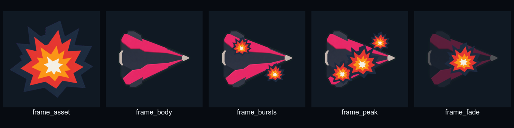
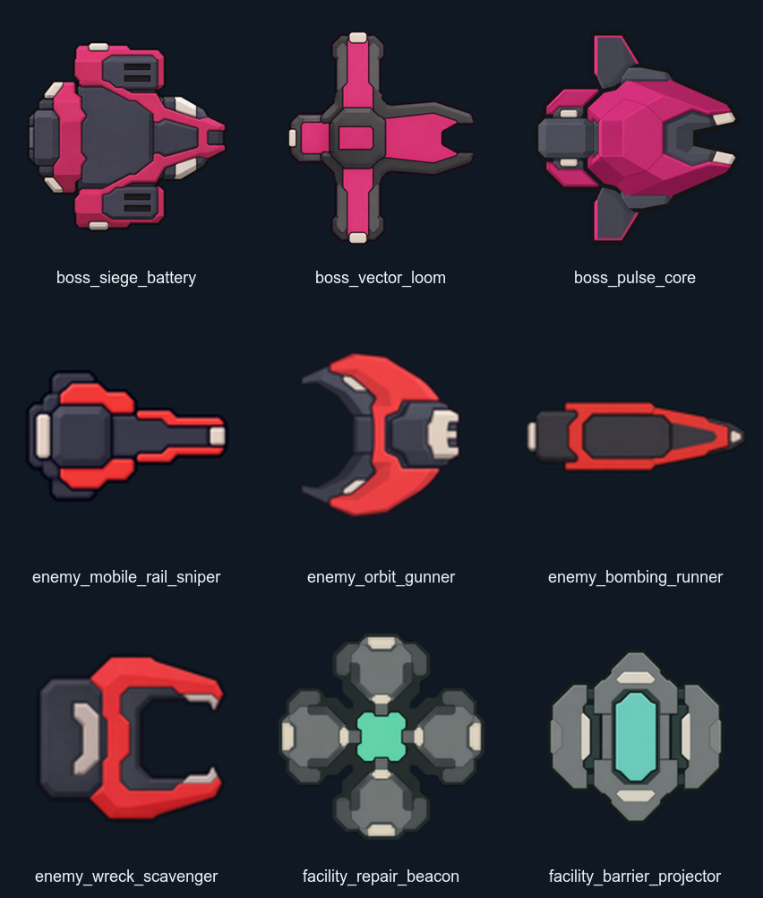

# Eight-Boss Combat Design Analysis

## Purpose

Close the exploratory work before implementation. This record distinguishes current
behavior, compared candidates, selected rules, rejected directions, and remaining
evidence limits. The linked execution plan contains only decision-complete work.

## Sources

### Local evidence

- The campaign has ten stage definitions. Odd stages are quota-only and even stages add
  one of five bosses. Layout, pickups, difficulty, telemetry, and transitions still use
  real stage owners even though the HUD makes the run feel continuous.
- All five bosses currently share a body shield runtime. A direct boss attack lowers
  the shield for four seconds, so boss defenses do not express distinct identities.
- Current boss patterns already include parts of charge, fan, cross, lane, beam, area,
  and summon behavior, but their combinations and shield response are too similar.
- Shock Disruption blocks attack start for 0.6/0.8/1.0 seconds, has a three-second
  reapplication lock, and uses half duration on bosses. It neither changes movement nor
  deals damage, and its report data mixes attempts with successful control.
- `VehicleEffectStore` owns a fixed 96-entry pool and already protects functional
  effects from bounded cosmetic recycling. It is the correct owner for simple boss-
  death pulses; a node-per-fragment animation would violate the existing capacity model.
- The diagnostic store currently retains 20 sessions and prunes on persistence using
  file modification time. Load does not enforce the newest-session count.
- The production manifest declares 78 images, five boss bodies, and zero authored
  transient effect rasters. `VISUAL_SYSTEM.md` requires flat matte forms, 4–6 broad
  planes for bosses, code-native dynamic cues, and exact user approval before promotion.

### Public VFX references

- [Kenney Smoke Particles](https://www.kenney.nl/assets/smoke-particles) provides a broad
  CC0 smoke/particle sheet. [Kenney support](https://kenney.nl/support) documents CC0
  licensing for its asset-page downloads.
- [OpenGameArt Explosion Tilesets](https://opengameart.org/content/explosion-tilesets)
  and [Explosion Sprite](https://opengameart.org/content/explosion-sprite) provide CC0
  frame-based explosion references.

These packs were not selected. Their soft smoke, pixel treatment, and frame-animation
ownership conflict with Cardborne's hard-edged flat planes and its zero transient-effect
raster contract. Importing a particle plugin or generic VFX pack would add a dependency
without improving gameplay truth. The selected solution uses existing approved actor
rasters plus fixed-capacity code-native geometry.

## Findings

### Campaign structure

Adding more numbered stages would preserve the same hidden pair structure and would not
solve the user's model of one continuous field where a boss arrives after ordinary
kills. The selected structure is eight visible boss cycles. It retains quotas, authored
encounters, layout refreshes, and pickups but makes the boss the progression boundary.
No fixed completion-time target is defensible without repeated user play. Structural
enemy-visibility gaps and protected telemetry are actionable acceptance criteria.
The diagnostics decision is to retain the newest ten valid sessions by saved time and
session ID on both load and persistence while keeping the existing byte and age caps.

### Boss candidate matrix

The candidate set was judged on silhouette-independent readability, geometric
distinction, defense/offense coupling, reaction fairness, and compatibility with the
current retained renderer.

| Candidate | Distinct test | Decision |
| --- | --- | --- |
| Furnace lane gates | Lane choice and charge punish | Selected for boss 1 |
| Alternating X-cross | Static diagonal route reading | Selected for boss 2 |
| Frontal shield counterburst | Flanking plus defense-fed offense | Selected for boss 3 |
| Rotating sweep | Continuous movement around one hazard | Selected for boss 4 |
| Shield relay sectors | Target priority and shrinking attack network | Selected for boss 5 as attached hardpoints |
| Sustained firing banks | Long projectile pressure and lane alternation | Selected for boss 6 |
| Translating laser walls | Moving gaps and orthogonal route changes | Selected for boss 7 |
| Wedge pulse rings | Radial distance control | Selected for boss 8 |
| Full invulnerability phase | Waiting without an offensive interaction | Rejected |
| Eight-direction radial laser burst | High coverage but weak route readability | Rejected |
| Randomly curving beam | Telegraph cannot reliably match final collision | Rejected |
| Summon-only commander | Can become defense-only or idle after add failure | Rejected |

All selected bosses receive a committed charge and a broad projectile-row barrage.
The barrage is not a sequence of bullets aimed down one line. One activation emits
three rows, and each row contains at least four simultaneous projectiles distributed
across the playfield. The selected variants match the two user-sketched motions:
`SPREAD` opens the projectile headings into a fixed fan, and `ROTATE` turns the emission
axis between complete rows to sweep an arc. Foundry Colossus, Drydock Titan, Crown
Engine, and Siege Battery use `SPREAD`; Archive Leviathan, Switchyard Behemoth, Vector
Loom, and Pulse Core use `ROTATE`. A selection cap keeps these common attacks from
displacing identity patterns. The first five bosses are revisions of the existing five;
Siege Battery, Vector Loom, and Pulse Core are the three new bosses.

### Defense and damage fairness

Uniform shields were rejected. Only Drydock Titan and Crown Engine use meaningful
defense. Titan converts frontal interception into a warned counterburst. Crown's attached
relay hardpoints each own both a shield sector and a firing lane. Destroying defense
therefore changes incoming attacks.

The chosen damage bands separate readability from severity. High-threat attacks deal
60–85 final damage and always have at least 1.30 seconds of collision-matching warning,
a locked final direction, a player-diameter-plus-80 escape corridor, and one damage
receipt. Pressure attacks deal 10–18, can be harder to avoid, and use hit locks to bound
repeated contact. No true instant-kill pattern remains.

### Boss-death visual comparison

| Option | Readability | Style fit | Runtime cost | Decision |
| --- | --- | --- | --- | --- |
| Generic smoke/explosion sheet | Clear convention | Poor | Bounded but adds raster frames | Rejected |
| Particle plugin | Flexible | Uncontrolled | New dependency and runtime objects | Rejected |
| Texture slicing into debris | Strong body relation | Creates frame/fragment ownership | Higher batching complexity | Rejected |
| One shared explosion overlay over the existing boss raster | Clear and direct | Strong | One texture, fixed-capacity transforms | Selected |

The selected 2.00-second sequence retires danger immediately, overlays five staggered
small/medium explosions and one large center explosion on the unchanged boss body,
then fades that body without slicing or replacing it. Boss-owned adds and facilities
receive one small overlay before removal. Progression waits for cleanup completion. It
reuses existing priority-destruction audio with restrained pitch variation. Reduced
motion keeps timing and opacity changes but removes burst scaling and rotation.

### Ordinary enemy candidates

Shield Breaker was rejected because it depends on a player shield state and does not
add a durable movement or aiming problem. Mobile Rail Sniper, Orbit Gunner, and Bombing
Runner create three distinct routes: exact line escape, tangential pressure, and delayed
ground-route planning.

Wreck Scavenger was changed from corpse collection to a local death-event rule. It gains
up to five permanent stacks when eligible ordinary enemies die within 360 units. This
needs no corpse lifetime, scan, or pickup object and makes target priority immediate.
It keeps a direct attack at zero stacks, so it never idles.

### Shock replacement candidates

| Candidate | Difference from current Shock | Result |
| --- | --- | --- |
| Chain Lightning | Completes the familiar fire/poison, ice, and lightning elemental set; changes each primary hit directly | Selected |
| Movement stun | Stronger version of the same control status | Rejected |
| Vulnerability mark | Readable but overlaps direct damage multipliers | Rejected |
| Projectile magnet | Novel but can distort manual aim and projectile truth | Rejected |
| Target Designator | Does not read as a bullet element and delegates its benefit to automatic weapons | Rejected by user feedback |

Chain Lightning replaces Shock while preserving an immediately recognizable elemental
family. A direct primary hit makes 1/2/3 nearest-target jumps within 180/200/220 world
units. Each hop deals 30% Arc damage, cannot repeat a target or return to the origin, and
requires line of sight. This differs from Thermal Burst's compact area damage, Toxin's
stacking damage over time, and Cryo's slow. Target Designator is removed completely.

### Visual asset scope

The selected authored set adds three boss bodies, four ordinary enemy bodies, two
neutral-facility bodies, three upgrade cards, and one shared boss-death explosion
overlay. Chain Lightning replaces Shock art without increasing the count. The net
addition is 13 images, changing the declared production target from 78 to 91 after exact
user approval.

### Generated boss, enemy, and facility candidates

The first nine actor/facility candidates now exist in the visual workbench:

The [candidate evidence](../design/visual-replacement-workbench/candidates/eight-boss-enemy-facility-assets-v1/README.md)
records exact hashes, prompt provenance, transparent target-size files, actual-size and
grayscale inspection, and approval state. Focused revisions simplified Siege Battery,
Mobile Rail Sniper, Bombing Runner, and Wreck Scavenger. All nine selected files are now
direction-clear for user review; none is production-approved or manifest-integrated.

## Recommendations

- Implement the linked plan in its numbered order. Update product and visual authority
  contracts before integrating candidates or new runtime presentation.
- Preserve campaign, boss, effect, enemy, status, diagnostics, and report responsibility
  owners. Do not move combat state into UI or expand `VehicleRun` with card-specific
  state machines.
- Use exact attack geometry in warnings and validators. Do not infer fairness from color
  or animation alone.
- Preserve fixed workloads during performance comparison. A pass obtained by reducing
  enemies, bullets, effect caps, resolution, or update rates is invalid.
- Treat total completion time as observational telemetry only. Use real user sessions,
  not an agent-generated duration target, for later pacing decisions.

## Limitations

- The current local session set is small and was not produced under one controlled user
  build, so it supports search-gap diagnosis but not a universal completion-time target.
- The nine boss/enemy/facility candidates and one boss-death explosion candidate are
  direction-clear but review-only. All still require exact user approval. Upgrade-card
  and Chain Lightning card candidates are not part of this batch.
- Numeric boss damage and cadence values are implementation starting contracts. User
  play evidence may justify a later balance plan, but implementation must first preserve
  the fairness bands and monotonic progression defined here.
