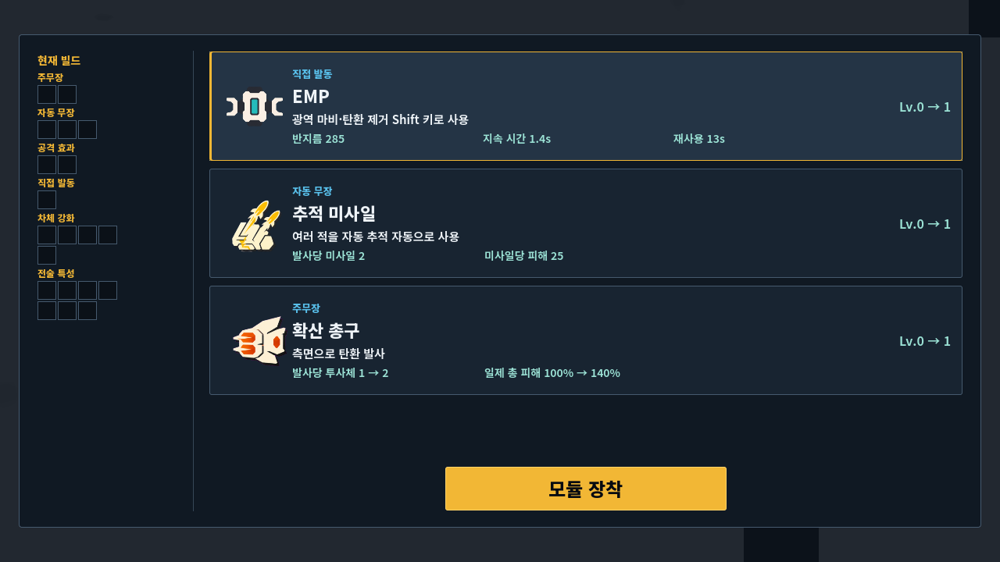
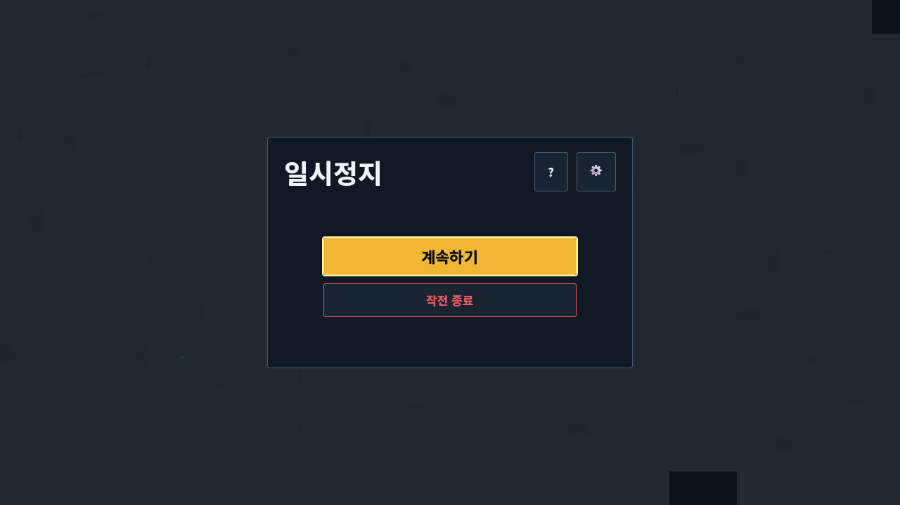
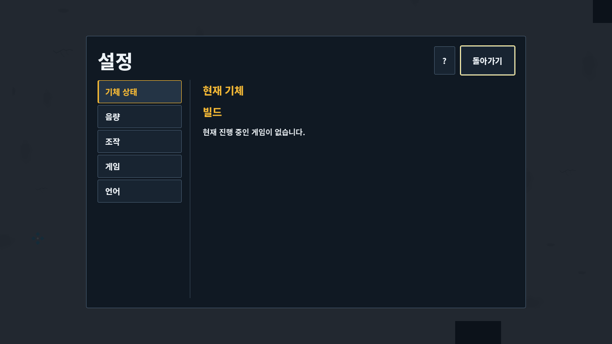
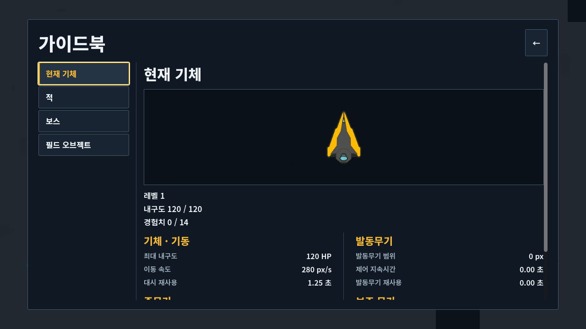
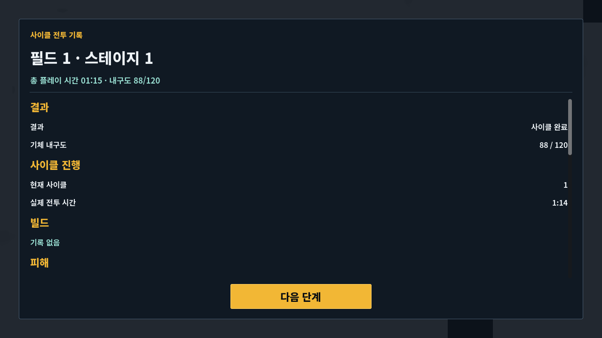
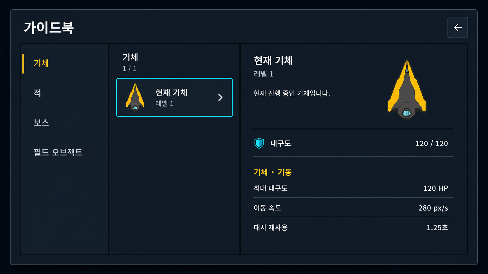
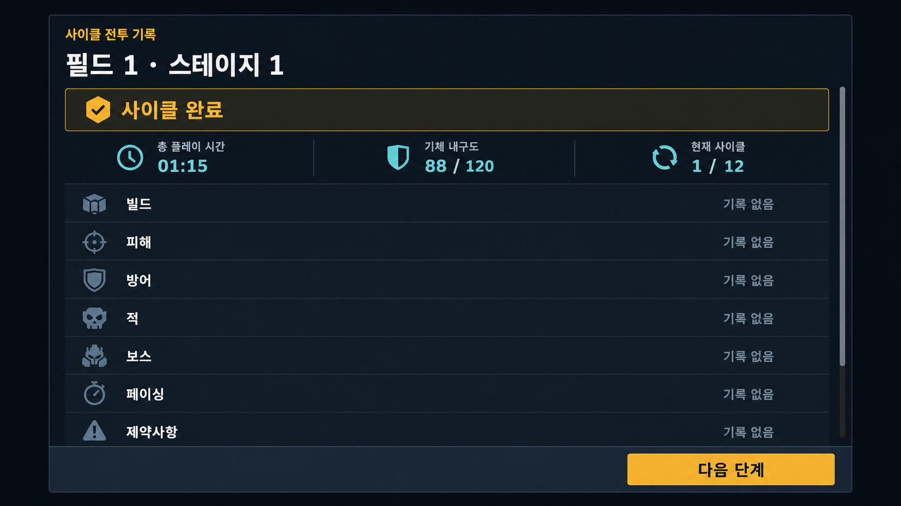

# Cardborne 일반 UI/UX 개선 분석

## 결론

Cardborne의 일반 UI는 기능이 부족해서 어렵다기보다, **큰 빈 면적과 약한 정보 그룹, 화면마다 달라지는 행동 위치, 의미보다 먼저 보이는 거대한 외곽 패널** 때문에 어렵다. 현재 화면은 읽을 내용이 적을 때도 전체 화면을 크게 감싸며, 게임의 기계적 형태 문법보다 개발 도구의 설정 창에 가깝게 보인다.

권장 방향은 **공용 작전 셸(shared operational shell) + 화면 역할별 단일 semantic rail**이다. 모든 화면은 `현재 맥락 → 중요한 내용 → 다음 행동`의 같은 골격을 쓰되, 선택은 amber, focus와 시스템 조작은 cyan, 위험 행동은 coral로 제한한다. 화면별 장식 실루엣이나 별도 프레임은 만들지 않는다.

우선순위는 다음과 같다.

1. Deployment, Pause, Stage/Failure/Result에서 제목·본문·주요 행동의 위치를 통일한다.
2. Settings와 Guidebook을 `category rail → list/content → fixed navigation` 구조로 정리한다.
3. Report 첫 화면에 결과, 진행, 현재 상태를 압축하고 상세 지표는 하나의 세로 흐름에서 단계 공개한다.
4. Upgrade는 현재의 비교 구조를 유지하되 빈 build rail과 텍스트 행의 시선 분산을 줄인다.
5. 모든 화면에서 한국어/영어, 960/1280/1920, 200% text, keyboard/controller focus를 같은 계약으로 검증한다.

## 조사 범위와 증거 한계

### 로컬 증거

- 제품 기준: `docs/product/vehicle_game_spec.md`의 현재 12 boss-cycle 연결 런.
- 비주얼 기준: `docs/design/VISUAL_SYSTEM.md`와 정본 스타일 이미지.
- 런타임 소유자: `scripts/ui/vehicle_stage_ui.gd`가 일반 모달을 조합하며, 각 패널과 `VehicleUiComponentFactory`, 공용 Theme가 책임을 나눈다.
- 최신 완전 유효 캡처: `build/vehicle-run-final/captures-native-device-fixture/`, 2026-08-22 15:28 KST, 한국어 1280×720, 160장, captured commit `8bcdd3f2`.
- 보고서에 보존한 화면: Deployment, shared/gameplay Settings, Guidebook, Upgrade 선택 전/후, Pause, Stage Report, Failure Report, Result 등 10장.

현재 HEAD에서 새 캡처를 한 번 시도했으나, 이 UI 작업과 무관하게 동시에 수정 중인 `vehicle_enemy_upgrade_device_runtime.gd`가 파싱되지 않아 게임이 시작되지 않았다. 해당 프로세스는 종료했고 게임 로직은 수정하지 않았다. 따라서 이 보고서는 **2026-08-22의 최신 유효 렌더를 visual baseline으로 사용하고, 이후 HEAD의 UI source와 변경 diff를 별도로 대조**한다. 정확한 current-HEAD runtime 검증이라고 주장하지 않는다.

### 비주얼 권위 receipt

- `VISUAL_SYSTEM.md` 전체 읽기 완료, SHA-256 `cd44b5f672043d68af4ee5c7bdc140ff81cadcd4a05cf3a9ed4850bad458e798`.
- 정본 PNG 원본 크기 1448×1086 검사 완료.
- 기대/관측 PNG SHA-256 `96ccf5d053e66dd3a102ccdf39daefd0b0c54b0e88d20428b7ba1c894f002889` 일치.
- ImageGen의 모든 생성/수정 호출에 정본 PNG를 `referenced_image_paths`의 실제 이미지 입력으로 제공했다.
- 정본 이미지는 형태·면·대비·detail density를 위한 문법 참고일 뿐, 그 안의 기체·glyph·panel·layout은 복사하거나 승인 자산으로 취급하지 않았다.
- 생성 후 정본 문서가 동시에 변경되어 952줄 전체와 원본 크기 PNG를 다시 검사했다. 변경은 적 업그레이드 장치의 publication 동작에 한정되고 modal, typography, responsive, focus, media ownership 계약은 바꾸지 않아 이 UI concept의 재생성 사유가 되지 않는다.

## 현재 화면 진단

### 공통 문제

| 문제 | 관찰 | 사용자 영향 | 권장 수정 |
| --- | --- | --- | --- |
| 큰 외곽 패널 | 적은 콘텐츠도 화면 대부분을 감싼다 | 시선이 어디서 시작해야 하는지 약하다 | 내용 폭에 맞춘 공용 modal max-width와 일관된 inset 사용 |
| 빈 공간이 정보보다 큼 | Deployment, Settings, Report에서 특히 두드러진다 | 완성도가 낮고 정보 관계가 끊겨 보인다 | 관련 label/value를 가까이 묶고 바깥 여백으로 폭 증가를 흡수 |
| 행동 위치 불일치 | 하단 중앙, 하단 좌측, header icon 등 화면마다 다르다 | muscle memory가 생기지 않는다 | primary는 고정 footer, back/settings는 고정 header command |
| 약한 상태 위계 | 선택·focus·현재 위치가 유사한 선과 색에 의존한다 | keyboard/controller 이동 결과를 놓치기 쉽다 | selected 3 px amber rail, focus 2 px cyan outline을 분리 |
| 개발 도구 같은 인상 | 1 px box와 긴 값 목록이 주된 표현이다 | 게임의 기계적 SF 정체성이 약하다 | broad matte plane, 명확한 mass, sparse semantic accent 사용 |
| 긴 문서형 scrolling | Guidebook/Report가 첫 화면에서 목표를 설명하지 못한다 | 필요한 답을 찾기 전에 스크롤한다 | 첫 화면에 목적·상태·핵심 요약, 상세는 한 outer scroll로 공개 |

### 화면별 평가

#### Deployment

현재 화면은 기체, 무기 설명, 조작법, 출격 행동을 모두 갖추고 있다. 그러나 왼쪽 preview가 작고 두 column의 정보 밀도가 크게 다르며, 출격 버튼이 내용과 멀리 떨어져 있다. 기능 추가보다 **두 column의 균형과 읽기 순서**가 먼저다.


권장 구조는 `출격 준비 → 기체/주무장 요약 + 조작 4행 → 출격`이다. 설정은 header 우측 48×48 command로 유지한다. 난이도, 빌드 철학, 장식 문구는 추가하지 않는다.

#### Upgrade

현재 Upgrade는 세 offer row, 명시적 선택, 고정 `모듈 장착`, 현재 build rail이라는 제품 계약을 이미 잘 따른다. 가장 큰 문제는 왼쪽의 빈 슬롯 군이 강한 시각 무게를 가지는 반면 의미 있는 내용은 오른쪽에 몰린다는 점이다. 전면 재설계보다 다음 수정이 적합하다.

- 빈 슬롯은 outline 대비를 더 낮추고, 채워진 슬롯과 category label만 우선 읽히게 한다.
- offer row는 artwork, category/title, inline stat, state column의 baseline을 통일한다.
- 선택 rail과 focus outline을 동시에 보이게 하되 서로 합치지 않는다.
- 상세 popover는 선택 row와 fixed action을 가리지 않는 현재 계약을 유지한다.



#### Pause

현재 Pause는 작고 단순하며 Resume과 Abort Run의 위험 위계도 명확하다. 이 화면은 크기를 키우기보다 공용 셸 규칙을 고정하는 기준 화면으로 쓰는 편이 좋다.

- 현재 cycle/진행을 한 줄로 보여 줄 수는 있지만, 전체 loadout이나 새 기능을 넣지 않는다.
- `계속하기`는 filled primary, `작전 종료`는 restrained danger를 유지한다.
- Guidebook/Settings icon의 accessible name, tooltip, input hint를 동일하게 유지한다.



#### Settings

현재 category rail은 이해하기 쉽지만, 오른쪽 content의 시작 위치와 정보량이 category마다 크게 달라 빈 화면처럼 느껴진다. `현재 기체`를 Settings에 포함하는 제품 계약은 유지하되, 제목 아래에 현재 category의 목적과 값 상태를 짧게 보여 주고 content width를 제한한다.

- category 순서: 기체 상태, 음량, 조작, 게임/모션, 언어.
- 변경 값은 색만 바꾸지 말고 `변경됨` 표식 또는 reset affordance로 구분한다.
- 슬라이더·toggle·binding row는 label, 현재 값, control의 세 기준선을 공유한다.
- reduced motion은 정보 제거가 아니라 반복 운동의 정적 cue 대체임을 짧게 설명한다.
- 아직 제품에 없는 검색, preset, HUD scale, 색각 mode는 이번 개선에 추가하지 않는다. 외부 근거는 향후 제품 결정 자료로만 남긴다.



#### Guidebook

현재 wide 화면은 category/list/detail 책임이 시각적으로 충분히 분리되지 않고, preview가 세로 공간을 많이 차지한 뒤 stat가 fold 아래로 밀린다. 정본 계약대로 wide에서는 정확히 세 column을 사용한다.

- 왼쪽: category rail과 미발견 count.
- 가운데: 발견된 항목의 짧은 list. selectable `???` 항목은 만들지 않는다.
- 오른쪽: identity, preview, 실제 gameplay owner에서 읽은 stat row.
- preview는 설명의 증거이지 화면의 주인공이 아니다. 첫 핵심 stat가 fold 위에 보여야 한다.
- compact에서는 category tab + list/detail 두 pane으로 접되, 1280 wide 구조를 상단 탭으로 바꾸지 않는다.



#### Stage Report / Failure / Result

현재 보고서는 요구한 한 개의 outer scroll과 fixed action을 갖췄지만, label과 값이 양 끝으로 멀리 떨어지고 섹션 사이의 빈 공간이 많다. 첫 화면에서 “무슨 일이 끝났고, 현재 상태가 무엇이며, 무엇을 누르는가”가 한 덩어리로 읽혀야 한다.

- outcome은 제목 바로 아래 단일 rail로 표시한다.
- total time, Hull, cycle progress를 한 줄의 compact fact group으로 둔다.
- 본문은 `outcome → cycle progress → build → damage → defense → enemies → bosses → pacing → limitations` 순서를 유지한다.
- section은 card가 아니라 heading, spacing, divider로 구분한다.
- Result와 Failure도 같은 body를 재사용하며, fixed primary action만 목적에 맞게 바꾼다.
- 분석 dashboard, tab, metric sub-scroll, narrow build rail은 만들지 않는다.



## 선택한 UI 체계

### 공용 골격

```text
Modal Surface
├─ Header: context/title + optional 48×48 utility command
├─ Content: one task-specific composition
└─ Footer: one fixed primary action, optional restrained destructive action
```

공용 primitive는 기존 `Surface`, `TextRow`, `Command`, `Selectable`, `Meter`, `PreviewWell` 여섯 개만 사용한다. 화면 script는 hierarchy, copy, signal, state만 소유하고 새 local `StyleBox`나 screen-specific chrome을 만들지 않는다.

### 시각 문법

| 역할 | 규칙 |
| --- | --- |
| Surface | flat fill, boundary 최대 1개, 의미가 있을 때 rail 최대 1개 |
| Primary action | amber fill, 고정 footer, 48–52 px 높이 |
| Selected | 3 px amber rail + 구조 변화 |
| Focus | 2 px cyan outline, selected와 별도 표시 |
| Danger | coral text/outline, filled primary와 경쟁 금지 |
| Typography | Noto Sans KR variable, body 650, label/title 800 |
| Spacing | 4/8/12/16/24/32 scale, compact inset 16, wide inset 24 |
| Containment | 보이는 배경/경계 중첩 최대 2단계 |

### 정보 문법

모든 화면의 첫 5초 질문을 고정한다.

1. 나는 어디에 있는가?
2. 지금 결정해야 할 것은 무엇인가?
3. 선택하면 무엇이 달라지는가?
4. 다음 행동은 무엇인가?

이 질문에 답하지 않는 설명, badge, card, frame은 제거 후보로 본다.

## TO-BE 이미지 시안

세 이미지는 **구조와 시각 방향을 검토하는 concept-only evidence**다. 생성 픽셀, 기체, icon, glyph, font rendering, 세부 spacing은 승인되지 않았고 runtime에 직접 사용할 수 없다. 실제 구현은 code-native Theme/Control로 재구성해야 한다.

### Deployment concept


유효한 방향은 preview와 weapon identity를 한 덩어리로 만들고, 오른쪽 control row의 baseline을 통일한 점이다. 다만 생성 이미지의 미세한 tonal shading은 구현 기준이 아니다. 실제 구현은 flat `StyleBoxFlat`과 정본 token을 사용한다.

### Guidebook concept



wide 3열, amber selected rail, cyan focus outline, fold 위 핵심 stat가 핵심이다. 생성된 craft/icon은 placeholder이며 기존 semantic provider의 승인 asset으로 대체해야 한다.

### Stage Report concept



outcome rail과 세 개의 compact fact를 먼저 보여 주고, 아래는 한 개의 세로 report 흐름을 유지한다. 아이콘이 장식적으로 늘어나지 않도록 실제 구현에서는 의미가 중복되는 아이콘을 생략할 수 있다.

## 외부 레퍼런스 조사

외부 자료는 Cardborne의 시각 승인 기준이 아니다. 정보 구조, focus, 다국어 fit, 접근성 검증 방법만 전이했다.

| 출처 | 관찰한 패턴 | Cardborne 적용 |
| --- | --- | --- |
| [Into the Breach GDC postmortem](https://media.gdcvault.com/gdc2019/presentations/Into%20the%20Breach%20Postmortem%20Final.pdf) | 제한된 선택과 명확한 결과로 판단 시간을 줄임 | Upgrade에서 변화량과 선택 결과를 같은 row에 표시 |
| [Into the Breach UI archive](https://interfaceingame.com/games/into-the-breach) | 배치·임무·보상·옵션 목적을 화면별로 분리 | Cardborne의 modal별 목적을 섞지 않음 |
| [Hades updates](https://www.supergiantgames.com/blog/hades-updates/) | 실수 선택, 메뉴 탐색, text fit, Codex 접근을 반복 개선 | confirm 전 선택 상태, locale overflow, controller focus 검증 |
| [Hades Long Winter update](https://www.supergiantgames.com/blog/hades-long-winter-update-patch-notes/) | 현재 build 비교와 victory summary 강화 | Upgrade current-build 비교와 Result 요약 강화 |
| [Hades II patch 2](https://steamcommunity.com/games/1145350/announcements/detail/521992119019110975) | 작은 화면 확대, 보상 preview, 정렬·번역 개선 | compact 구조와 미선택 offer 가독성 검증 |
| [Slay the Spire 2 UI changes](https://www.megacrit.com/news/2024-11-07-neowsletter-issue-4/) | 작은 target과 유사한 방 유형을 크기·색·형태로 보정 | 44 px target, 색 외 rail/shape/text 사용 |
| [Slay the Spire 2 UI archive](https://interfaceingame.com/games/slay-the-spire-2/) | Codex, 설정, 결과, 확인을 독립 흐름으로 유지 | 한 modal에 서로 다른 목적을 추가하지 않음 |
| [Returnal UX design](https://blog.playstation.com/2021/05/11/unpacking-returnals-ux-design-gameplay-first-ui-retro-futuristic-tech-and-accessibility/) | gameplay-first UI와 설정 preview | 전투 가림 최소화, 설정 변경의 즉시 이해 지원 |
| [Dead Cells patch notes](https://deadcells.com/patchnotes/) | text backing, Pause 설명 scroll, tooltip과 camera 설정 개선 | Pause/Settings의 readable backing과 digital navigation 점검 |
| [Risk of Rain Returns announcements](https://steamcommunity.com/app/1337520/announcements/) | UI scale, 압축 layout, tooltip 위치, HUD overlap 개선 | 지원 viewport별 대체 layout과 overflow gate |
| [Risk of Rain 2 patch notes](https://support.2k.com/hc/en-us/articles/47210814399123-Risk-of-Rain-2-Patch-Notes-December-9-2025) | 긴 목표 문장에 맞춘 동적 공간 | 한국어/영어 중 긴 쪽 기준으로 container 확장 |
| [Brotato Paws & Claws update](https://steamcommunity.com/games/1942280/announcements/detail/490463750770395337) | Pause의 run 맥락, Codex 도식, controller focus 개선 | Pause의 compact progress context와 Guidebook stat 우선순위 참고 |
| [God of War Ragnarök accessibility](https://www.playstation.com/en-us/games/god-of-war-ragnarok/accessibility/) | preset과 개별 text/icon/contrast/motion 조절 | 향후 접근성 제품 결정 참고; 이번 범위에 새 기능으로 추가하지 않음 |
| [The Last of Us Part II accessibility](https://blog.playstation.com/2020/06/09/the-last-of-us-part-ii-accessibility-features-detailed/) | 많은 옵션을 시각·청각·운동 preset으로 묶음 | 핵심 신호를 색 하나에만 의존하지 않는 원칙 채택 |
| [Xbox XAG 101: Text display](https://learn.microsoft.com/en-us/xbox/accessibility/xbox-accessibility-guidelines/101) | 실제 화면에서 글자 크기·간격 측정 | 캡처 기반 glyph bounds와 200% text 검증 |
| [Xbox XAG 112: UI navigation](https://learn.microsoft.com/en-us/gaming/accessibility/xbox-accessibility/xbox-accessibility-guidelines/112?source=recommendations) | 일관된 제목·focus order·digital navigation | 공용 focus graph와 header/footer 위치 고정 |
| [Xbox XAG 114: UI context](https://learn.microsoft.com/en-us/gaming/accessibility/xbox-accessibility/xbox-accessibility-guidelines/114) | 목적·역할·선택 결과를 사전에 이해 | 모든 modal의 context와 next action 우선 |
| [Xbox XAG 109: Objective clarity](https://learn.microsoft.com/en-us/gaming/accessibility/xbox-accessibility/xbox-accessibility-guidelines/109) | 현재 목표와 누적 진행을 다시 확인 | Report 첫 화면에 outcome/progress/state 제공 |

### 채택하지 않은 패턴

- Hades의 신화 frame, Returnal의 retro-futuristic overlay, Slay the Spire의 card frame 등 작품 고유 스타일은 복사하지 않는다.
- Turn-based 게임의 모든 정보를 한 화면에 압축하는 원칙을 실시간 Cardborne 전체에 강제하지 않는다.
- Pause에 전체 inventory, timeline, 다음 보상을 모두 넣지 않는다. 현재 제품의 compact pause 계약을 우선한다.
- AAA 사례의 수십 개 접근성 옵션을 이번 UI 정리에서 새로 만들지 않는다.
- Dashboard card grid, tabbed report, nested metric panel은 통계량이 많아 보여도 보고서의 한 줄 흐름과 충돌하므로 채택하지 않는다.

## 구현 우선순위 제안

### P0 — 공용 셸과 행동 위치

- `VehicleUiComponentFactory`의 기존 primitive로 header/content/footer spacing을 표준화한다.
- Deployment, Pause, Stage/Failure/Result의 header utility와 footer action anchor를 일치시킨다.
- 기존 Theme token과 Noto Sans KR wiring만 사용한다.

완료 기준: 세 modal family의 title baseline, safe inset, primary action anchor가 같은 viewport mode에서 일치한다.

### P1 — 정보 밀도와 focus

- Settings의 category content width와 row baseline을 정리한다.
- Guidebook wide 3열과 compact 2-pane을 명확히 분기한다.
- Upgrade의 빈 build slot 대비를 낮추고 selected/focus 동시 상태를 점검한다.

완료 기준: keyboard/controller로 visual order와 같은 focus order를 이동하며, selected와 focus가 색 없이도 구분된다.

### P2 — Report hierarchy

- 공용 `VehicleCombatReportBody`의 section spacing과 label/value 관계를 좁힌다.
- Stage/Failure/Result에 동일한 outcome summary와 단일 outer scroll/fixed action 계약을 적용한다.

완료 기준: 첫 720 px 높이 안에서 outcome, time, Hull, cycle progress, next action을 확인할 수 있다.

### P3 — 반응형·다국어 검증

- ko/en × 960/1280/1920 × 100/200% text 조합을 검증한다.
- text glyph bounds, focus path, overflow, clipping, accidental horizontal scroll, fixed action occlusion을 검사한다.
- Web production build에서 keyboard, mouse, controller navigation을 확인한다.

완료 기준: 겹침·잘림·container 이탈 0, 24×24 미만 target 0, routine target은 44 px 이상이다.

## ImageGen 생성 기록

- 모드: built-in ImageGen.
- 분류: `ui-mockup`; 수정 단계는 `precise-object-edit`.
- 공통 실제 reference: `docs/design/cardborne-universal-art-style-reference.png`.
- current content references: 보존된 Deployment, Settings/Guidebook, Stage Report/Result 캡처.
- 공통 prompt 핵심: 정본 시트는 style grammar only, object/layout 복제 금지; current capture는 기능/내용 참고 only; flat matte surface, broad planes, one boundary, at most one semantic rail, Korean-first, 44 px target, fixed primary action, nested frame/gradient/glow/fake action 금지.
- Deployment 최종 수정: 첫 시안의 정보 구조를 유지하되 row card, grid, corner bracket, gradient/glow를 제거하고 preview well + text row + fixed 52 px action으로 평탄화.
- Guidebook 최종 수정: 첫 시안의 horizontal category tab을 제거하고 1280 wide의 category rail + entry list + detail 3열로 변경.
- Stage Report 최종 생성: outcome rail + compact facts + 하나의 vertical report body + fixed primary action.

모든 최종 이미지의 저장 경로와 SHA-256은 다음과 같다.

| 이미지 | SHA-256 |
| --- | --- |
| `deployment-to-be-concept.png` | `4f69a2b304993487c68be3d0d3b09c764b83e5da500c7e50e5c4f4a7bc51f02d` |
| `guidebook-to-be-concept.png` | `95dea0ca0d337001e0347f6bbcf61076a91139958ed89ddf89d6bd019e9d2260` |
| `stage-report-to-be-concept.png` | `d636e3cc6344c20fad9a2ef7195bedb75d3693509e0099e1b0494d54be54dc9a` |

## 승인 경계

이 보고서는 분석 evidence다. 다음 항목은 별도 사용자 승인 없이는 확정되지 않는다.

- 생성 이미지의 기체, projectile, icon, glyph, font rendering, spacing, tonal shading.
- 생성 이미지를 runtime texture나 production manifest에 넣는 작업.
- 현재 제품에 없는 accessibility preset, HUD scale, search/filter, retry flow 같은 기능 추가.
- 실제 UI 구현과 기존 screen/component contract 변경.

권장 다음 결정은 **P0 공용 셸과 행동 위치를 실제 code-native UI로 구현할지 승인하는 것**이다.
