# Cardborne 일반 UI/UX 개선 분석 — 기반 가정 교정판

## 목적

이 문서는 Cardborne의 Deployment, Guidebook, Report를 포함한 일반 UI가 어떤 자산, 색, 폭, 정보 묶음으로 구성되어야 하는지 판단하기 위한 연구 evidence다. 정본 명세를 대신하지 않으며, 생성 시안은 code-native 구현 전 구조 검토 자료로만 사용한다.

## 한 줄 결론

이전 제안은 철회한다. Cardborne의 일반 UI는 **그림과 남색·노란색으로 넓은 면을 채우는 방향**이 아니라, **콘텐츠에 맞는 작은 면적, 식별에 필요한 자산, bluegray/cyan 크롬, 서로 가까이 묶인 label·input·value**로 다시 설계해야 한다.

가장 먼저 바꿀 것은 장식이 아니라 폭이다. 1280×720에서 현재 Report 1200 px, Deployment 1176 px, Guidebook 1160 px는 사용 가능 폭의 각각 97.4%, 95.5%, 94.2%를 차지한다. 이 값들은 상한이 아니라 사실상 기본값으로 작동한다. 내용이 적어도 화면 전체를 덮으므로 정보가 커 보이는 것이 아니라 패널이 비어 보인다.

교정 방향은 다음 세 문장으로 요약한다.

1. **자산은 선택과 식별에 직접 필요한 경우에만 쓴다.** 유저 기체는 identity anchor로 유지하되 104–112 px 수준으로 제한하고 빈 공간을 만드는 hero image로 쓰지 않는다.
2. **사용자가 선택한 bluegray/cyan 방향을 공용 chrome으로 발전시킨다.** cyan은 focus/system에, amber는 실제 player/reward/confirmed selection에만 제한한다.
3. **패널은 viewport가 아니라 과업의 정보량에 맞춘다.** 각 화면에 content-fit 권장 폭과 예외 조건을 둔다.
4. **관련 정보는 한 perceptual group으로 묶는다.** label과 input/value를 양끝으로 벌리는 `space-between`형 행은 일반 UI에서 사용하지 않는다.

## 이전 방향을 철회하는 이유

첫 보고서는 현재 명세와 화면을 개선 대상으로 보면서도, 다음 전제를 충분히 검증하지 않았다.

- Deployment 기체 그림의 정보 가치를 따지지 않고 넓은 왼쪽 column을 채우는 수단으로 사용했다.
- 현재 Theme가 navy/amber를 넓게 쓰므로 그것이 Cardborne의 올바른 공용 UI 정체성이라고 가정했다.
- 명세에 적힌 modal 최대 크기를 정상적인 기본 크기로 해석했다.
- 넓은 패널 안에서 column 균형을 맞추려 했고, 패널 자체가 필요 이상으로 넓은지는 뒤늦게 보았다.

그 결과 이전 ImageGen 시안은 구조를 정리했지만, 사용자가 지적한 문제를 오히려 강화했다. 해당 세 이미지는 승인 후보가 아니며 `rejected-previous-direction/`으로 분리했다.

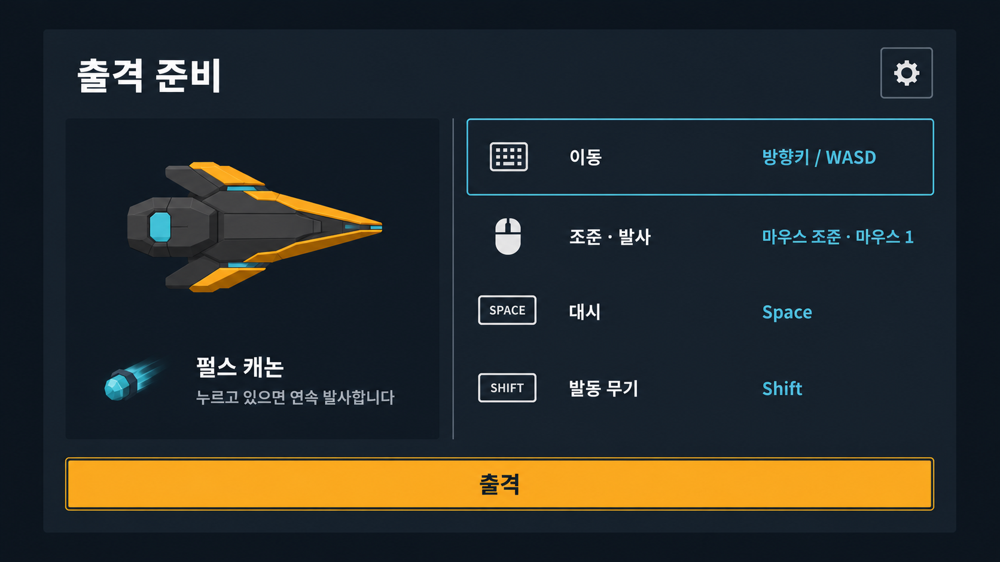

폐기 이유: 기체 preview 자체가 아니라, preview를 이유로 넓은 column과 빈 면을 유지한 것이 문제였다. navy/amber도 정보 의미보다 브랜드 장식으로 먼저 보인다.

## 증거와 한계

### 로컬 증거

- 제품 기준: `docs/product/vehicle_game_spec.md`.
- 비주얼 기준: `docs/design/VISUAL_SYSTEM.md`와 정본 스타일 이미지.
- 화면 조합 소유자: `scripts/ui/vehicle_stage_ui.gd`.
- 크기 제한 소유자: `scripts/ui/vehicle_modal_host.gd`.
- 패널 소유자: `scripts/ui/vehicle_settings_panel.gd`, `scripts/ui/vehicle_guidebook_panel.gd` 및 각 modal panel.
- Theme와 semantic color 소유자: `art/visuals/production/ui/vehicle_stage_theme.tres`, `scripts/vehicle/vehicle_stage_visual_profile.gd`.
- 교정 캡처: 2026-08-22 17:19 KST, 한국어 1280×720, current worktree에서 Godot 4.7.1 capture harness 실행 성공.

교정 캡처의 manifest는 실행 시각과 scenario validity를 기록하지만, embedded build identity는 `8bcdd3f2`, `source_cleanliness: dirty`로 남아 있다. 따라서 이 보고서는 이를 **현재 worktree 실행에서 얻은 진단 캡처**로 사용하며, clean commit의 release 증거라고 주장하지 않는다.

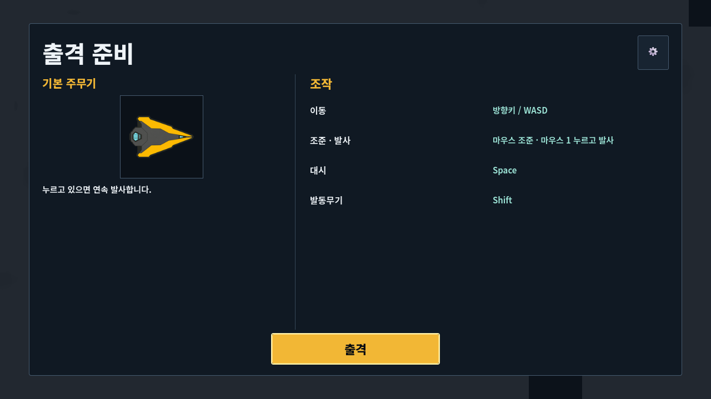

### 비주얼 권위 receipt

- `VISUAL_SYSTEM.md` 952줄 전체 재검사.
- spec SHA-256: `c8dde49b2506d01b4ff298622b0bf31a233f141c4ea609d8a42a7a17a01fb560`.
- 정본 PNG 1448×1086 원본 검사.
- PNG SHA-256: `96ccf5d053e66dd3a102ccdf39daefd0b0c54b0e88d20428b7ba1c894f002889`.
- 모든 ImageGen 호출에 정본 PNG를 실제 `referenced_image_paths` 입력으로 제공했다.
- 정본 이미지는 형태·밀도·읽기 쉬움의 문법 참고일 뿐, 그 안의 기체·layout·yellow palette를 복사하거나 승인 자산으로 취급하지 않았다.

### 현재 명세 해석과 구현 전 교정점

현재 시각 명세는 navy surface `#182431`, amber/reward `#F2B735`를 semantic token으로 두고, Deployment craft preview, primary weapon 설명, complete controls, two-column body를 요구한다. 유저 피드백에 따라 craft preview는 유지한다. 다만 `two-column`은 viewport를 40/60으로 늘리는 표가 아니라, 작은 identity zone과 compact control zone이라는 두 책임으로 해석해야 한다.

- 공용 surface의 기본색과 amber 사용 범위.
- modal minimum size를 사실상 기본 폭으로 만드는 규칙.
- `VehicleUiComponentFactory.text_row()`가 label과 value를 모두 expand시켜 먼 양끝에 배치하는 규칙.
- Guidebook/Upgrade의 artwork가 식별에 필요한 경우와 장식인 경우의 경계.

이 보고서는 해당 변경을 제안하지만, runtime code나 정본 명세를 아직 수정하지 않는다.

## 1. 자산 사용 판단

### 판단 원칙

이미지는 다음 질문 중 하나에 `예`라고 답할 때만 유지한다.

1. 이 이미지가 없으면 서로 다른 선택지를 빠르게 구별하기 어려운가?
2. 이미지 자체가 gameplay 상태나 결과를 전달하는가?
3. 텍스트만으로는 실전에서 필요한 형태 인지를 충분히 전달하지 못하는가?

세 질문에 모두 `아니오`라면 이미지는 제거한다. 남은 빈 공간은 다른 장식으로 채우지 않고 패널을 줄인다.

| 화면 | 기본 자산 정책 | 유지 가능한 예외 | 결론 |
| --- | --- | --- | --- |
| Deployment | 작은 identity preview | 현재 유저 기체와 기본 무기 식별 | 104–112 px craft 유지, hero image와 장식 배경 금지 |
| Pause | 자산 없음 | 없음 | compact task modal 유지 |
| Settings | 자산 없음 | 설정 결과를 즉시 비교해야 하는 preview | 일반 장식 금지 |
| Guidebook | 제한적 사용 | 발견한 기체·적·보스의 형태 식별 | preview가 stat를 fold 아래로 밀면 축소 |
| Upgrade | 선택 식별용 사용 | 세 offer를 빠르게 구별하는 작은 artwork | 큰 카드 그림과 장식 frame 금지 |
| Report/Result | 자산 없음 | 결과 수치와 직접 연결된 작은 semantic glyph | 기념 일러스트·배경 art 금지 |

Deployment는 이 원칙을 검증하기 좋은 화면이다. 유저 기체는 현재 조작할 대상을 확인하는 identity anchor로 유효하다. 문제는 기체를 보여 주는 것이 아니라, 작은 preview를 이유로 200 px보다 훨씬 넓은 column과 빈 면을 유지하는 것이다. preview는 유지하고 주변 panel을 줄인다.

## 2. 색 체계 판단

### 대비가 좋은 것과 방향이 맞는 것은 다르다

현재 조합의 명도 대비는 충분하다.

| 조합 | 계산 대비 | 해석 |
| --- | ---: | --- |
| amber `#F2B735` / navy `#182431` | 8.69:1 | 읽을 수 있음 |
| cyan `#58BFEA` / navy `#182431` | 7.53:1 | 읽을 수 있음 |
| white `#EEF3F7` / navy `#182431` | 14.08:1 | 읽을 수 있음 |

문제는 접근성 실패가 아니라 **의미의 과잉 사용**이다. amber가 보상, 선택, title, tab, primary action, progress에 동시에 쓰이면 어느 것도 특별하지 않다. 넓은 navy surface와 결합하면 모든 화면이 같은 경고·산업 패널처럼 보이고, 실제 gameplay 색의 역할도 약해진다.

### 권장 semantic palette

| 역할 | 권장 | 사용 범위 |
| --- | --- | --- |
| Surround | 거의 검정에 가까운 neutral | gameplay와 modal 분리 |
| Surface | cool bluegray | 일반 패널의 기본 면 |
| Raised row | surface보다 한 단계 밝은 bluegray | 실제 입력·선택 영역 |
| Primary text | warm off-white/cream | title, value, primary label |
| Secondary text | neutral gray | 설명과 보조 정보 |
| Focus/System | cyan | keyboard/controller focus, system feedback |
| Reward/Confirmed selection | amber | 실제 보상과 확정 선택에만 사용 |
| Danger | coral | 파괴·종료·실패 위험 |

권장안은 “노란색 제거”가 아니다. **노란색의 희소성을 회복**하는 것이다. 일반 제목과 출격 버튼까지 amber로 칠하지 않는다. 출격은 중성 filled action이어도 크기, 위치, label로 충분히 primary가 된다.

### 비교 실험

세 실험 모두 기체 그림과 장식 자산을 제거하고 같은 정보 구조를 사용했다.

#### A. 중성 흑연 + cream — 구조 채택, 폭 보정 필요

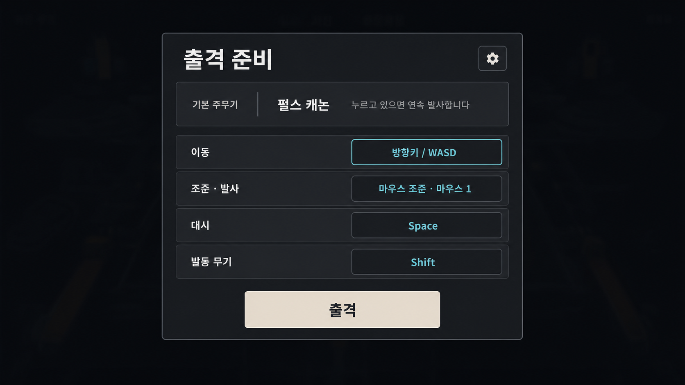

- 장점: navy/amber 의존을 끊고 게임 배경과 자연스럽게 분리된다.
- 단점: 생성 결과가 약 880 px 이상으로 넓어져 목표 680–800 px를 지키지 못했다.
- 판정: **색 방향 채택, 생성 layout은 반려**.

#### B. 청회색 + cyan — 기존 방향과 차이가 부족함

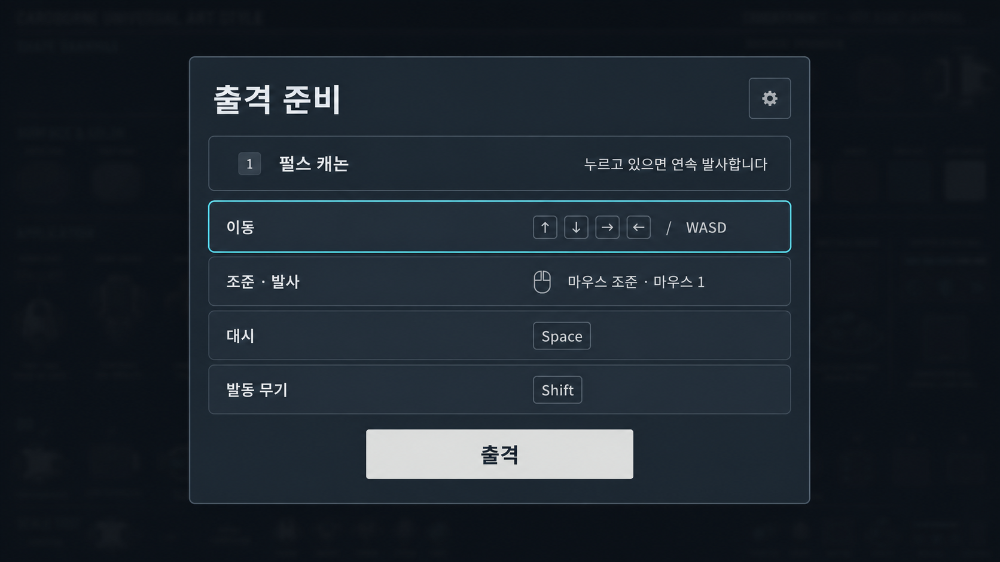

- 장점: focus 의미가 명확하고 노란색 과용이 없다.
- 단점: 면적이 여전히 넓고, 넓은 청회색 면이 기존 dark navy shell과 비슷한 인상을 준다.
- 판정: **보조 token 참고만 유지, 기본 surface로는 반려**.

#### C. 밝은 산업 회색 — 폭·밀도 검증 성공, palette 그대로는 보류

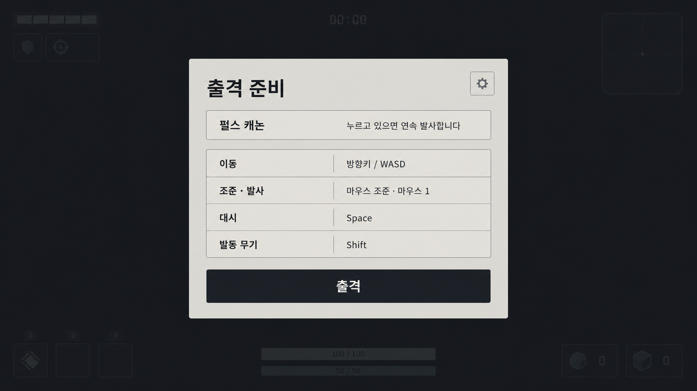

- 장점: 약 720–780 px의 compact footprint, 단일 세로 흐름, 무에셋 구조가 가장 명확하다.
- 단점: 밝은 큰 면은 게임 UI보다 일반 desktop app처럼 보일 수 있고 전투 배경 대비가 과도하다.
- 판정: **구조와 밀도 채택, 밝은 palette는 보류**.

### 최종 색 결정

사용자 선택에 따라 B의 bluegray/cyan을 최종 탐색 방향으로 올린다. 기존 B 시안의 palette는 유지하되 layout은 전면 교체한다.

- cool bluegray surface와 warm off-white text를 기본으로 사용한다.
- cyan은 focus, current system state, navigation feedback에만 사용한다.
- amber는 실제 유저 기체 content, Upgrade 선택, reward, confirmed selection에만 쓴다.
- 일반 title과 primary action은 색이 아니라 크기·굵기·위치·filled state로 위계를 만든다.
- bluegray/cyan을 선택했다고 해서 넓은 navy shell, cyan outline card grid, full-width row를 함께 채택하지 않는다.

## 3. 패널 폭 판단

### 현재 폭이 넓어지는 코드 원인

`scripts/ui/vehicle_stage_ui.gd`의 modal minimum과 `scripts/ui/vehicle_modal_host.gd`의 viewport clamp가 결합한다. 1280 px viewport에서 host는 좌우 합계 48 px만 남겨 1232 px까지 허용한다.

| 화면 | 현재 minimum width | 1280에서 사용 가능 폭 대비 |
| --- | ---: | ---: |
| Deployment | 1176 px | 95.5% |
| Upgrade | 1376 px | 111.7%; clamp 의존 |
| Result | 1176 px | 95.5% |
| Report | 1200 px | 97.4% |
| Settings | 920 px | 74.7% |
| Guidebook | 1160 px | 94.2% |

이 숫자는 “responsive maximum”이 아니라 대부분 화면에서 “항상 넓은 기본값”이 된다. 특히 Report의 1200 px는 좌우 16 px씩만 남겨 modal과 full-page의 구분을 거의 없앤다.

### 권장 content-fit 폭

| 화면 | 1280 기준 기본 폭 | 넓힐 수 있는 조건 |
| --- | ---: | --- |
| Pause | 440–520 px | 없음 |
| Deployment | 760–860 px | 여러 기체를 실제 선택할 때만 900–960 px |
| Settings | 720–880 px | 긴 key binding 편집과 200% text 검증 시 |
| Guidebook | 900–1040 px | wide 3-column 유지에 필요한 범위 내 |
| Upgrade | 920–1040 px | 3개 offer 비교가 깨지지 않는 범위 내 |
| Report / Failure / Result | 720–820 px | 긴 locale text가 실제 overflow할 때 880 px까지 |

폭은 위 범위의 최대값으로 고정하지 않는다. 내용의 preferred size로 시작해, locale·text scale·viewport가 요구할 때만 범위 안에서 늘린다. 960 px 이하에서는 더 좁은 layout으로 재배치하고 horizontal scroll로 해결하지 않는다.

## 화면별 교정 구조

### Deployment

`출격 준비 → 기체/주무장 identity + 조작 legend → 출격` 순서를 쓴다. 왼쪽 200–240 px에는 104–112 px 기체 preview와 무기 한 줄을 두고, 오른쪽에는 네 조작을 2×2 compact cluster로 묶는다. 각 cluster는 `[현재 입력 칩] 행동명`을 12–16 px 간격으로 붙이며, 전체 행 양끝으로 벌리지 않는다.

### Pause

현재처럼 가장 작은 task modal로 유지한다. 진행 맥락은 한 줄을 넘지 않는다. Guidebook/Settings utility command와 Resume/Abort의 위계만 공용 규칙에 맞춘다.

### Settings

category rail은 유지하되 전체 폭을 720–880 px로 줄인다. content는 label/value/control의 세 기준선을 공유한다. 자산을 넣지 않으며, 설정 결과를 실제로 비교할 때만 작은 preview를 쓴다.

### Guidebook

wide에서 category/list/detail 3-column은 유지하되 900–1040 px 안에서 각 column의 읽기 폭을 제한한다. preview는 identity 확인 크기로만 두고 첫 핵심 stat를 fold 위에 보인다. 그림 때문에 detail column이 커지지 않게 한다.

### Upgrade

세 offer를 동시에 비교해야 하므로 일반 화면보다 넓을 수 있다. 그러나 artwork는 option identity 크기에만 머물고 카드 frame이나 큰 장식 배경으로 넓이를 만들지 않는다. 선택과 focus는 rail/outline 구조로 함께 보인다.

### Report / Failure / Result

720–820 px의 단일 세로 report를 쓴다. 각 metric은 `label  value`의 좌측 정렬 inline phrase이며 값은 label 뒤 20–32 px 안에서 시작한다. `outcome → time/Hull/progress → build → damage → defense → enemies → bosses → pacing → limitations`를 한 outer scroll로 유지하고 action만 고정한다.

## 4. 근접 정보 그룹과 3개 주요 화면

### 로컬 원인

- `scripts/ui/vehicle_deployment_panel.gd`는 본문을 40/60 `HBoxContainer`로 늘린다.
- `scripts/ui/vehicle_ui_component_factory.gd`의 `text_row()`는 label과 value를 모두 `SIZE_EXPAND_FILL`로 만들어 먼 양끝에 배치한다.
- 같은 row 문법이 Guidebook과 `vehicle_combat_report_body.gd`에도 이어져, 패널 폭을 줄여도 내부 gap은 남는다.

따라서 modal width만 줄이는 것은 충분하지 않다. 공용 row primitive가 `분산 정렬`이 아니라 `근접 그룹`을 기본으로 가져야 한다.

### 공용 grouping grammar

| 정보 종류 | 권장 구성 | 금지 구성 |
| --- | --- | --- |
| 입력 안내 | `[현재 입력 칩] 행동명`, gap 12–16 px | label left + input far right |
| 짧은 metric | `label  value`, gap 20–32 px | full-row space-between |
| identity | 104–112 px semantic image + title/level/한 줄 설명 | hero image + 빈 preview well |
| 상세 도움말 | focus/tooltip 또는 Guidebook detail | 모든 긴 설명을 기본 row에 상시 노출 |
| 장치 전환 | 현재 입력 장치 한 세트만 표시 | keyboard와 controller 전체 목록 동시 표시 |

#### Deployment — compact control legend

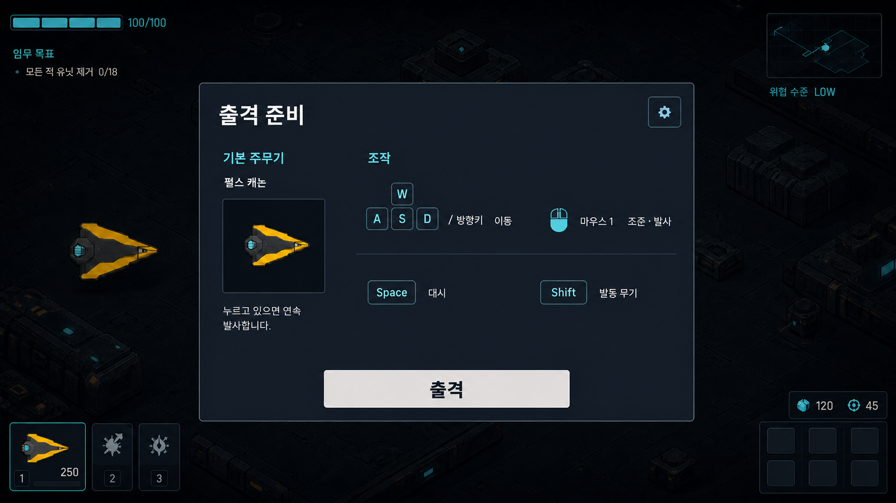

- 유저 기체는 실제 player/reward yellow identity를 유지한다.
- 조작은 네 개의 self-contained cluster로 바꾸고 큰 row/card를 제거한다.
- 생성 이미지의 keycap과 glyph는 구조 참고일 뿐 production glyph 승인안이 아니다.
- 현재 입력 장치만 표시하려면 runtime binding display owner가 필요하다. keyboard/controller 문자열을 화면에 하드코딩하지 않는다.

#### Guidebook — stat-first identity detail

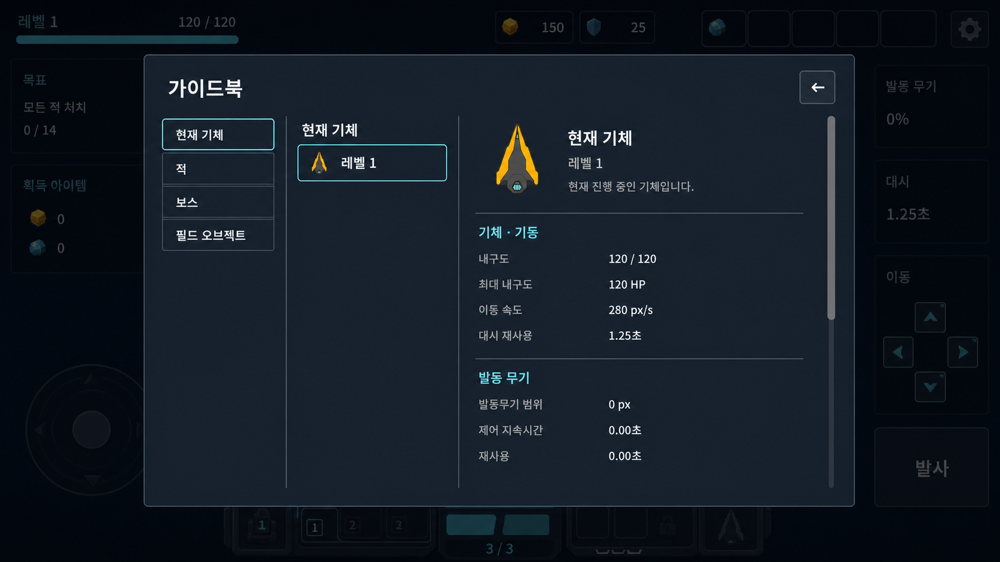

- category/list/detail 3열 책임은 유지한다.
- 기체 preview를 identity header 크기로 줄이고 첫 stat를 fold 위로 올린다.
- 각 stat group 안에서 label과 value를 가까이 두며 전체 detail column 끝으로 보내지 않는다.

#### Stage Report — inline metric phrases

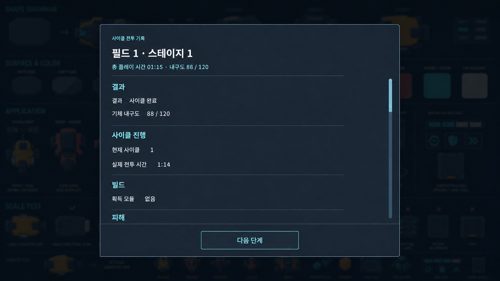

- metric을 독립된 오른쪽 value column에서 제거하고 좌측 inline phrase로 묶는다.
- section은 spacing과 짧은 divider로 나누며 card grid를 만들지 않는다.
- 한 outer scroll과 fixed primary action 계약을 유지한다.

## 5. 필수 3화면 교정: Upgrade / Message / HUD

앞의 Deployment·Guidebook·Stage Report 이미지는 compact grouping을 탐색한 자료일 뿐, 사용자가 요구한 최종 3화면 세트를 대신하지 않는다. 아래 세 이미지를 이번 교정의 필수 to-be 세트로 본다. 세 이미지는 모두 최신 한국어 1280×720 캡처와 현재 소스 계약을 기준으로 만들었고, `deployment-bluegray-cyan-no-asset.png`에서는 색 체계만 이어받았다.

기준 캡처: [현재 Upgrade 선택 상태](./assets/2026-08-22-general-uiux-analysis/current-head-upgrade-message-hud/06b-first-weapon-selected.png), [현재 Message 표시 상태](./assets/2026-08-22-general-uiux-analysis/current-head-upgrade-message-hud/04c-progression-max.png), [현재 고밀도 HUD 상태](./assets/2026-08-22-general-uiux-analysis/current-head-upgrade-message-hud/03-peak-horde.png).

### Upgrade — 3개 제안의 근접 비교

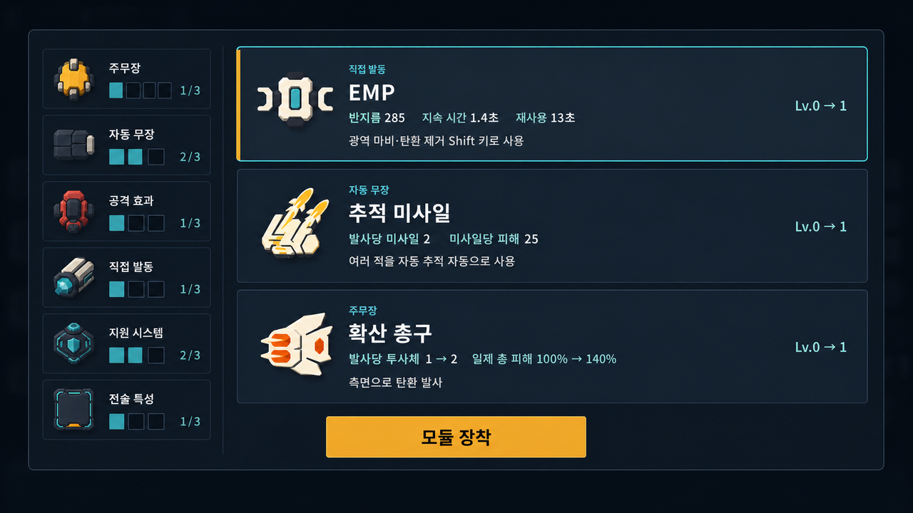

- 왼쪽 current-build summary와 오른쪽 3개 선택 행을 한 화면에서 동시에 읽는다.
- category, title, stat phrase, description을 각 선택 행 안의 한 근접 정보 블록으로 묶는다.
- 통계는 `반지름 285   지속 시간 1.4초   재사용 13초`처럼 label과 값을 붙이고, 행 양끝으로 흩어 놓지 않는다.
- 첫 행의 amber rail은 selected, cyan outline은 focus를 뜻한다. `모듈 장착` 외의 이탈·건너뛰기 action은 두지 않는다.
- 왼쪽 이미지들은 빌드 identity를 빠르게 찾는 semantic content다. 큰 illustration이나 card chrome으로 사용하지 않는다.

### Message — minimap 아래 한 개의 보조 AI 알림

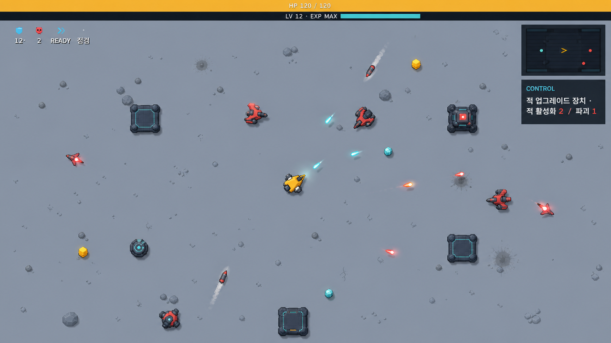

- 메시지는 화면 중앙 banner가 아니라 minimap 바로 아래의 작은 보조 Surface 한 개가 소유한다.
- `CONTROL` sender와 최대 두 줄의 메시지만 표시한다. 예시는 실제 현재 문자열 형식인 `적 업그레이드 장치 · 적 활성화 2 / 파괴 1`이다.
- 같은 tick의 활성화·파괴 결과는 하나로 합치며, toast stack이나 history panel을 만들지 않는다.
- coral은 위험 사건의 작은 semantic accent로만 쓰고, system identity는 cyan으로 유지한다.

### HUD — 전투를 가리지 않는 전체 정보 구조

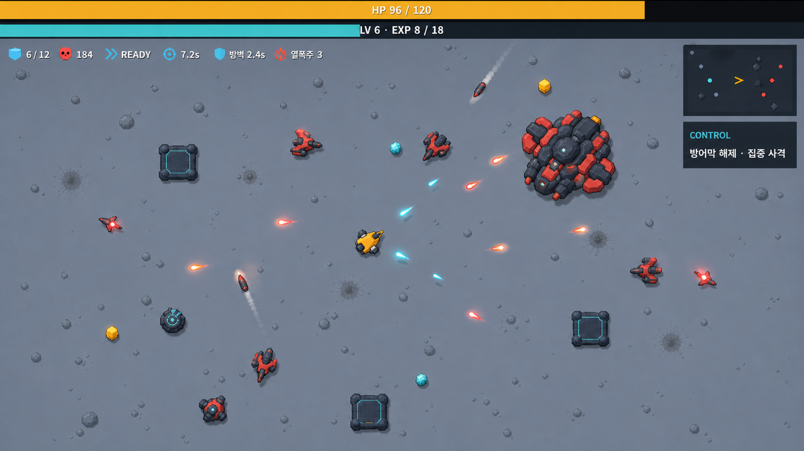

- Hull과 XP는 viewport 최상단에서 gap 없이 쌓인 full-width meter 두 개만 사용한다.
- 바로 아래 좌측은 `stage → defeats → dash → active → conditional status`의 한 줄 panel-free cluster다. 아이콘과 짧은 값만 남기고 card, label column, cooldown ring을 제거한다.
- 우측 상단은 minimap과 그 아래 한 개의 메시지 Surface만 쓴다.
- 유저 기체는 화면 중앙의 player/reward yellow identity로 유지한다. HUD 장식 때문에 기체나 탄환, 위험 대상을 가리지 않는다.
- bottom-center active indicator, objective panel, 화면 가장자리 boss HP, upgrade icon list는 중복 정보이므로 추가하지 않는다.

세 화면의 공통 판단은 “모든 정보를 패널에 넣기”가 아니다. 비교가 필요한 Upgrade만 compact modal을 사용하고, Message는 minimap에 붙은 보조 Surface, HUD의 나머지는 panel-free overlay로 분리한다.

## 외부 근거와 적용 판단

외부 자료는 Cardborne의 비주얼 승인 기준이 아니다. 자산의 정보 가치, 색 의미, readable measure, focus와 navigation 판단만 전이했다.

| 근거 | 가져온 판단 | Cardborne 적용 |
| --- | --- | --- |
| [W3C Images Tutorial](https://www.w3.org/WAI/tutorials/images/) | 정보 이미지와 장식 이미지를 구분 | 자산 유지 여부를 정보 가치로 판단 |
| [Xbox XAG 106](https://learn.microsoft.com/en-us/xbox/accessibility/xbox-accessibility-guidelines/106) | 이미지·control의 목적과 상태가 명확해야 함 | 의미 없는 preview를 일반 modal에 두지 않음 |
| [Apple Image Views](https://developer.apple.com/design/human-interface-guidelines/image-views) | 이미지는 목적을 지원하고 content와 경쟁하지 않아야 함 | preview를 identity 확인 크기로 제한 |
| [Returnal UX design](https://blog.playstation.com/2021/05/11/unpacking-returnals-ux-design-gameplay-first-ui-retro-futuristic-tech-and-accessibility/) | gameplay-first UI | modal 장식보다 과업과 다음 행동 우선 |
| [Hades updates](https://www.supergiantgames.com/blog/hades-updates/) | text fit, menu navigation, Codex 접근을 반복 개선 | locale fit과 focus를 지속 검증 |
| [Apple Color](https://developer.apple.com/design/human-interface-guidelines/color) | 색은 일관된 의미와 충분한 대비를 가져야 함 | amber와 cyan의 역할 분리 |
| [Xbox XAG 102](https://learn.microsoft.com/en-us/xbox/accessibility/xbox-accessibility-guidelines/102) | 실제 전경·배경 대비 검증 | 대비 통과와 방향 적합성을 구분 |
| [Xbox XAG 103](https://learn.microsoft.com/en-us/xbox/accessibility/xbox-accessibility-guidelines/103) | 색만으로 정보를 전달하지 않음 | selected/focus에 rail, outline, text 병행 |
| [Slay the Spire 2 UI changes](https://www.megacrit.com/news/2024-11-07-neowsletter-issue-4/) | 크기·색·형태를 함께 조절해 target 구분 | Upgrade offer와 focus state를 구조로 구분 |
| [Xbox XAG 101](https://learn.microsoft.com/en-us/xbox/accessibility/xbox-accessibility-guidelines/101) | 실제 화면에서 글자 크기와 간격 검증 | 720p와 200% text에서 readable measure 검사 |
| [Xbox XAG 112](https://learn.microsoft.com/en-us/gaming/accessibility/xbox-accessibility/xbox-accessibility-guidelines/112?source=recommendations) | 일관된 focus order와 digital navigation | visual order와 focus order 일치 |
| [Xbox XAG 114](https://learn.microsoft.com/en-us/gaming/accessibility/xbox-accessibility/xbox-accessibility-guidelines/114) | 화면 목적과 선택 결과를 이해할 수 있어야 함 | title, current state, next action 우선 |
| [Apple Designing for Games](https://developer.apple.com/design/human-interface-guidelines/designing-for-games) | 게임의 맥락과 입력 방식에 맞는 UI | desktop app 구조를 그대로 가져오지 않음 |
| [GOV.UK Layout](https://design-system.service.gov.uk/styles/layout/) | 긴 line length를 피하고 content에 맞는 폭 사용 | viewport 충전 대신 readable content width 사용 |

### 조작·metric 근접 배치 집중 조사

| 근거 | 관찰한 layout pattern | Cardborne 적용 |
| --- | --- | --- |
| [FINAL FANTASY XIV Operation Manual](https://na.finalfantasyxiv.com/game_manual/operation/) | `Command · Default Button`의 좁은 2열 표와 단계형 Active Help | 조작을 기능별 compact group으로 묶고 긴 설명은 단계 공개 |
| [Apex Legends PC and Controller Settings](https://help.ea.com/sv/articles/apex-legends/pc-and-controller-settings/) | PC/controller별 `Action · Input` 정의 목록 | 현재 입력 장치 한 세트만 표시하고 action/input을 인접 배치 |
| [Fortnite PC Controls](https://www.epicgames.com/help/en-US/fortnite-c75/c118/pc-a3337?lang=en-US) | 플레이 방식별 장치 구분과 해당 장치 icon | keyboard/controller 전체 목록을 동시에 노출하지 않음 |
| [God of War Ragnarök Accessibility](https://www.playstation.com/en-us/games/god-of-war-ragnarok/accessibility/) | input visualization을 필요한 gameplay 맥락에만 표시 | Deployment에 큰 controller diagram을 상시 두지 않음 |
| [Xbox XAG 106](https://learn.microsoft.com/en-us/xbox/accessibility/xbox-accessibility-guidelines/106) | control 이름·유형·현재값을 한 의미 단위로 제공 | `[입력 칩 + 행동명]`을 한 focus group으로 구성 |
| [Xbox XAG 112](https://learn.microsoft.com/en-us/gaming/accessibility/xbox-accessibility/xbox-accessibility-guidelines/112?source=recommendations) | 입력 방식이 달라도 같은 순서와 prompt 위치 유지 | 세 화면의 visual order와 focus order를 일치 |
| [Xbox XAG 114](https://learn.microsoft.com/en-us/gaming/accessibility/xbox-accessibility/xbox-accessibility-guidelines/114) | label을 관련 control 가까이에 두고 긴 설명은 tooltip으로 분리 | label/value 분산 금지, 긴 조작 문장 단계 공개 |
| [The Sandbox Evolution Controls Manual](https://cdn.steamstatic.com/steam/apps/466940/manuals/TheSandboxEvolution-ControlsHelpSheet.pdf?t=1513117405) | mode별 조작 그룹과 짧은 행동 옆 input 표시 | 네 기본 조작을 2×2 cluster로 압축 |
| [Backstage: Murdered Sleep Manual](https://shared.akamai.steamstatic.com/store_item_assets/steam/apps/2687830/manuals/0cab3402e06d50d7a2de1b353493cbb8393b24c0/BACKSTAGE_MURDERED_SLEEP_GAME_MANUAL.pdf?t=1730938088) | key/analog icon과 짧은 동작명을 짝지어 기본·전투 조작 분리 | keycap과 한국어 동작명을 한 local group으로 묶음 |

자산·색·폭과 compact grouping 패턴마다 독립 근거가 2개 이상 모이고, 추가 자료가 결론을 바꾸지 않는 시점에 조사를 중단했다.

## 구현 순서 제안

### P0 — 명세와 token 교정

- `VISUAL_SYSTEM.md`의 공용 surface/amber 규칙과 modal 폭 계약을 이번 결정에 맞춰 수정한다.
- 자산 사용의 정보 가치 기준과 화면별 예외를 명시한다.
- 기존 wide navy/amber concept를 승인 후보에서 제외한다.

완료 기준: 구현자가 현재 명세와 이 보고서 사이에서 상반된 지시를 받지 않는다.

### P1 — compact shell과 Deployment

- modal host를 content-fit preferred size + 화면별 max band로 바꾼다.
- Deployment를 200–240 px identity zone + 420–520 px compact control zone으로 재구성한다.
- current player craft preview를 104–112 px로 유지한다.
- `text_row()` 대신 input/action과 label/value를 가까이 묶는 공용 compact pair primitive를 만든다.
- bluegray surface + cyan focus의 code-native prototype을 만든다.

완료 기준: 1280에서 Deployment가 760–860 px, 좌우 충분한 gameplay context, 빈 hero area 0, input/action gap 16 px 이하, 기체 preview 104–112 px다.

### P2 — 화면군별 폭 축소

- Pause 440–520 px.
- Settings 720–880 px.
- Guidebook/Upgrade만 필요 조건 아래 900–1040 px.
- Report family 720–880 px.

완료 기준: 각 추가 100 px의 폭이 어떤 정보 관계를 지키는지 설명할 수 있다.

### P3 — 상태·다국어·입력 검증

- ko/en × 960/1280/1920 × 100/200% text.
- keyboard/mouse/controller focus.
- overflow, clipping, horizontal scroll, fixed action occlusion.
- Web production build의 실제 렌더.

완료 기준: 겹침·잘림·container 이탈 0, selected/focus의 비색상 구분, routine target 44 px 이상이다.

## ImageGen 기록과 판정

모든 이미지는 `ui-mockup` 비교 실험이며 production asset이 아니다. 생성 픽셀, icon, glyph, font rendering과 spacing은 승인되지 않았다. runtime에서는 Godot Theme/Control로 다시 구현해야 한다.

| 이미지 | SHA-256 | 판정 |
| --- | --- | --- |
| `deployment-graphite-cream-no-asset.png` | `e99c5f9010120b05d5e20ce4614d109ec26593a5a25914ef29d254ffce7343ba` | 색 방향 채택, 폭 반려 |
| `deployment-bluegray-cyan-no-asset.png` | `4fb3680e89c5031cbd8c9ee0af6ad851f5e47376cf85eb801b021f4f47e70829` | 보조 token 참고, 기본 surface 반려 |
| `deployment-light-industrial-no-asset.png` | `e5be871f453dbb518aa24dcfee50d4a1d7d4434a9c331f3796e90359b2c818ef` | 구조·밀도 채택, 밝은 palette 보류 |
| `deployment-wide-asset-concept.png` | `4f69a2b304993487c68be3d0d3b09c764b83e5da500c7e50e5c4f4a7bc51f02d` | 폐기 |
| `guidebook-wide-asset-concept.png` | `95dea0ca0d337001e0347f6bbcf61076a91139958ed89ddf89d6bd019e9d2260` | 폐기 |
| `stage-report-wide-navy-amber-concept.png` | `d636e3cc6344c20fad9a2ef7195bedb75d3693509e0099e1b0494d54be54dc9a` | 폐기 |
| `deployment-bluegray-compact-controls.png` | `51734eb43affc3ba7b2cede3d9ad9d8231c301be2663cf975189d8e2ae51e860` | 사용자 선택 palette + compact grouping 기준 |
| `guidebook-bluegray-stat-first.png` | `336b74f5b6320e3b5ad7742b96f2ccdf0235062096f9cf944d17a343bea1436a` | 3열 책임과 stat-first detail 기준 |
| `stage-report-bluegray-inline-metrics.png` | `d47494bdbfba9f8fb3fdf826e2dd59d81831b30512bd5d28d20b55f676239840` | inline metric grouping 기준 |
| `upgrade-bluegray-compact-comparison.png` | `7a657581a7672265e6dfbf5d656da5b64076a8a4d8287de2796172073a9725db` | 필수 Upgrade 화면; 근접 비교 구조 기준 |
| `message-bluegray-auxiliary-ai.png` | `21296a80a9f25421fa543223ac87fa616b6efdc9f97737d51a81c9dfc3e3084d` | 필수 Message 화면; minimap 아래 단일 알림 기준 |
| `hud-bluegray-cockpit-compact.png` | `8942dd59fd29b011cf8b1642aa933d8f54ca9dcce7bdb4440d3c2be3dc257069` | 필수 HUD 화면; panel-free 전투 정보 구조 기준 |

교정 실험의 공통 prompt 계약은 다음과 같다.

- 정본 시트는 style grammar only, object/layout/palette 복제 금지.
- current 화면은 content와 real identity reference only.
- 유저 기체 artwork는 작은 identity content로 유지하고 장식 asset은 제거.
- Deployment 760–860 px, Guidebook 900–1040 px, Report 720–820 px 범위.
- bluegray/cyan chrome, yellow는 player/reward content에만 허용.
- input/action과 label/value를 하나의 local group으로 묶고 distributed gap 금지.

## 결정 및 승인 경계

이 교정판이 권고하는 방향은 다음과 같다.

- general UI의 기본은 **compact bluegray surface + cyan system/focus**.
- cyan은 focus/system, amber는 reward/confirmed selection, coral은 danger.
- 유저 기체와 Guidebook/Upgrade art는 식별·선택·상태 전달 가치가 있을 때 작은 content image로 사용.
- max width는 기본값이 아니며, content-fit preferred size가 먼저다.
- action/input과 metric label/value를 양끝으로 벌리는 공용 row 구조는 교체 대상이다.

아직 승인하거나 수행하지 않은 항목은 다음과 같다.

- 정본 시각 명세와 Theme token 수정.
- runtime panel 구현.
- 생성 이미지를 production texture로 승격.
- 새 기능, 새 접근성 옵션, 새 gameplay 선택지 추가.

다음 결정은 **Upgrade·Message·HUD 3화면의 grammar를 code-native prototype으로 옮길지**다.
