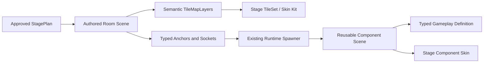

# Component And UI Foundation Research - 2026-07-13

## Decision Summary

Use a Godot-native foundation first:

- `TileMapLayer` plus external `TileSet` resources for repeated, grid-aligned static terrain;
- explicit reusable `PackedScene` components for interactive, animated, stateful, or independently colliding objects;
- typed gameplay definitions for behavior and separate stage-skin data for presentation;
- project-level `Theme` resources and type variations for UI structure, with bitmap assets for icons, portraits, and illustrated backdrops;
- authored room scenes and the existing typed room/anchor contracts as the source of truth.

Do not adopt LDtk, Tiled, or a community importer in the first implementation batch. They remain candidates for a bounded import spike after the native pipeline proves the semantic contracts. This avoids coupling the current 30-room catalog and traversal validators to a version-sensitive adapter before the tile/component boundary is stable.

## Research Questions

1. Which content should be painted as tiles, instantiated as reusable scenes, selected as stage skins, or authored as unique set pieces?
2. How should the UI move from code-local border styles to a coherent flat system without breaking snapshot, focus, and responsive-layout contracts?
3. Which external tools improve authoring enough to justify a dependency?
4. What must an implementation branch preserve while the main worktree contains active gameplay changes?

This document records evidence and recommendations. The linked design specs own proposed contracts; the ExecPlan owns future execution order.

## Current Codebase Evidence

### Terrain And Rooms

- The repository has 30 production room scenes: 10 Lower Ruins, 9 Flooded Works, and 11 Broken Sanctum.
- No production `TileMap`, `TileMapLayer`, or `TileSet` usage exists.
- Repeated terrain is authored per room as `StaticBody2D`, collision shapes, and `Polygon2D` fills/caps.
- `TerrainPresentationStyler.gd` applies a regional color palette by traversing polygon names such as `RockVisual` and `SupportCap`.
- `RoomTemplateHost.gd`, typed room resources, sockets, anchors, stage plans, and geometry validators already form a valuable semantic layer that should survive any presentation migration.
- `MAP_AUTHORING_PIPELINE_CONTRACT.md` already rejects raw runtime collision/art generation and defines room scenes as the geometry/anchor source of truth.

Implication: migrate the repeated visual/collision representation inside rooms; do not replace the room, socket, anchor, plan, or traversal contracts.

### Runtime Components

- Reusable scenes already exist for chests, field pickups, material nodes, moving platforms, and stage rewards.
- Hazard behavior is data-driven through `HazardDefinition`, `HazardCatalog`, and `StageRuntimeContentSpawner`.
- Existing hazard scenes cover timed vents, spikes, fall reset, and crumbling platforms.
- Runtime placement resolves typed room anchors before instantiating enemy, hazard, and reward scenes.
- Many component visuals are still procedural `Polygon2D` output, so behavior reuse exists but presentation skins are not a first-class owner.

Implication: preserve these behavior and spawn contracts; add a visual-skin seam rather than creating a second trap or interaction framework.

### UI

- Production UI has 12 authored scenes, including four reusable component scenes.
- UI snapshots, intents, focus rules, responsive layouts, and focused validators are already substantial and should remain intact.
- `ProductionUIStyles.gd` is a shared style owner, but its normal vocabulary is bordered, rounded `StyleBoxFlat` panels.
- `ProductionHUD.gd` still constructs much of its node tree in code.
- Numerous scene-local `theme_override_*` values duplicate color, typography, and spacing decisions.
- Existing validation covers 960x540, 1280x720, and 1920x1080, including clipping, overlap, focus, six action slots, prompts, and receipts.

Implication: the target is not a new UI behavior stack. It is a presentation-system migration that centralizes tokens and composition while retaining the current state and validation boundaries.

## Official Tool Evidence

| Source | Verified capability | Cardborne implication |
| --- | --- | --- |
| [Godot 4.7: Using TileSets](https://docs.godotengine.org/en/4.7/tutorials/2d/using_tilesets.html) | TileSets own atlas tiles, collision, navigation/occlusion, per-tile custom data, alternatives, terrains, and scene collections. | One external TileSet per stage skin can carry repeated terrain visuals and matching static collision. Custom data should describe static tile semantics only. |
| [Godot 4.7: Using TileMaps](https://docs.godotengine.org/en/4.7/tutorials/2d/using_tilemaps.html) | Multiple `TileMapLayer` nodes are recommended for distinct logical layers; reusable patterns live in external TileSets; terrain painting resolves edges/corners. | Separate solid, one-way, background, and decoration layers. Store common terrain stamps as patterns instead of copying polygons between rooms. |
| [Godot Theme resource](https://docs.godotengine.org/en/stable/classes/class_theme.html) | A project Theme can style all Controls; type variations provide named specializations and may inherit from each other. | Replace broad local overrides with one project Theme and a small semantic variation set. |
| [Godot 4.7 UI overview](https://docs.godotengine.org/en/4.7/tutorials/ui/index.html) | Controls separate content from layout; Containers, anchors, focus, and Themes are the intended UI primitives. | Keep screens in `.tscn`, use Containers for responsive composition, and let scripts bind snapshots rather than build the visual tree. |
| [Godot UI focus](https://docs.godotengine.org/en/4.7/tutorials/ui/gui_navigation.html) | Complex UI should explicitly define focus neighbors and initial focus; gameplay actions should not reuse UI focus actions. | Every reusable UI component needs a focus/state contract independent of border styling. |
| [Godot scene organization](https://docs.godotengine.org/en/stable/tutorials/best_practices/scene_organization.html) | Reusable scenes should be focused, self-contained, and loosely coupled; owners inject external context. | Traps and interactables should own their visual/collision children and expose typed configuration, not depend on arbitrary room node paths. |
| [Godot project organization](https://docs.godotengine.org/en/4.7/tutorials/best_practices/project_organization.html) | Assets should generally live near the scenes that consume them; documentation-only assets can be excluded from import with `.gdignore`. | Production art should live with its TileSet/component family. Reference boards stay under docs and their generated `.import` metadata remains ignored. |
| [LDtk entities](https://ldtk.io/docs/general/editor-components/entities/) and [auto-layer rules](https://ldtk.io/docs/general/auto-layers/auto-layer-rules/) | Typed fields, placement constraints, IntGrid semantics, and rule-driven visual layers are strong authoring concepts. | LDtk is attractive if native authoring becomes the bottleneck, especially for typed anchors, but it must map into existing Godot contracts through one adapter. |
| [Godot Asset Library: LDtk Importer 2.0.1](https://godotengine.org/asset-library/asset/2181) | Community release targets Godot 4.3 and was published in 2024; it imports `.ldtk` into scenes and supports post-import scripts. The repo ledger records that a later reviewed importer commit imported and booted in an external Godot 4.7 clone. | Basic engine import is promising, but Cardborne's typed anchors, collision, stable IDs, deterministic reimport, and no-hand-edit boundary remain unproven. Keep it behind a locked-version repository spike. |
| [Tiled object templates](https://doc.mapeditor.org/en/stable/manual/using-templates/) and [Automapping](https://doc.mapeditor.org/en/stable/manual/automapping/) | Object templates propagate defaults to instances; terrains and rule maps automate repeated tile transitions and decoration. | These are useful design patterns even if Tiled is not adopted. A future adapter must preserve template IDs, overrides, anchors, and deterministic output. |
| [Xbox Accessibility Guidelines](https://learn.microsoft.com/en-us/xbox/accessibility/guidelines) | Text, contrast, additional visual channels, UI navigation, and focus handling are separate review areas. | Flat, borderless UI still needs visible focus, readable text, and icon/shape/text channels; color alone cannot carry state. |

## Other-Game Production Lessons

The useful reference is process, not visual copying.

- [GDC: Designing Celeste](https://www.gdcvault.com/play/1024307/Level-Design-Workshop-Designing-Celeste) describes the tools and process used to arrange more than 300 focused platforming stages into larger area maps. The transferable lesson is to author and validate compact gameplay spaces, then compose them into area progression; do not ask an art tile system to invent traversal logic.
- [GDC: Dead Cells - What the F*n!?](https://www.gdcvault.com/play/1026247/-Dead-Cells-What-the) emphasizes the importance of small control and game-design details discovered through iteration. For Cardborne, readable collision, telegraphs, recovery, and combat spacing remain higher priority than multiplying art variants.
- Godot's [official 2D Platformer Demo](https://godotengine.org/asset-library/asset/2727) is useful as an engine-pattern reference, not a production framework to copy. It demonstrates a complete small scene with tile/collision/physics interactions but does not replace Cardborne's progression, combat, room, or stage contracts.

Inference: high-quality platformer production commonly combines authored gameplay spaces, reusable mechanisms, and repeated art kits. The robust boundary is “authored challenge composition over reusable pieces,” not “everything is a tile” or “everything is generated.”

## Tool Decision Matrix

| Option | Authoring speed | Contract fit | Dependency risk | Current decision |
| --- | ---: | ---: | ---: | --- |
| Godot `TileMapLayer` + external TileSet + PackedScenes | High after initial setup | High | Low | **Baseline** |
| LDtk + community Godot importer | Potentially high | Medium until adapter exists | Medium | Spike later |
| Tiled + importer/adapter | High for tile/object workflows | Medium until adapter exists | Medium | Spike only if native/LDtk fail |
| Continue room-local polygons | Low | Existing but presentation-heavy | Low dependency, high maintenance | Retire gradually |
| Runtime procedural raw terrain/art | Variable | Conflicts with fixed room contracts | High gameplay risk | Reject for current production |

## Recommended Ownership Boundary

The stage plan selects rooms and runtime content. Rooms own geometry composition and anchors. TileSets render repeated static surfaces. Components own independent behavior/collision. Skins change presentation without changing IDs, timings, or traversal.

## Risks To Carry Forward

- Godot terrain painting can produce the correct visual neighbor but still be wrong for traversal if collision is not reviewed separately.
- Scene tiles initialize as TileMap updates are batched; stateful hazards should remain explicit scene instances rather than hidden scene tiles.
- Reindexing or deleting TileSet sources can leave invalid tile references in room scenes. Stable IDs and a manifest validator are required.
- A single atlas combining all regions encourages accidental cross-stage visual mixing. Share semantic role names, not one unrestricted palette.
- AI-generated guide boards are not pixel-accurate tile sheets. Their spacing, seams, lighting, and perspective cannot be sliced directly into production assets.
- A borderless UI can lose focus clarity. Selection must use fill, position, marker, icon, and text/state changes instead of silently removing the focus channel.
- Importers may overwrite hand edits. If an external editor is adopted, generated scenes must be treated as generated output and customized only through a post-import layer. The existing external Godot 4.7 boot result is not a substitute for a repository-specific round-trip.

## Open Decisions For The First Spike

- Confirm the logical terrain cell size by testing 24, 32, and 48 px against current player/collision dimensions. Use 32 px as the starting candidate, not a locked contract.
- Select one representative room that contains solid mass, an inner corner, one-way support, a socket seam, and at least one component anchor.
- Decide whether stage skins use separate TileSet resources or one semantic base plus texture swaps. Separate TileSets are the safer first spike because they prevent accidental cross-stage mixing.
- Decide the minimum production icon set after auditing which HUD/menu states actually exist. Do not generate a broad speculative icon library.
- Re-evaluate LDtk only after measuring native room-authoring time and validating a round-trip without broken IDs or collisions.

## Research Stop Condition

Preproduction research is sufficient to begin a bounded implementation spike when:

- the linked component/art and UI specs are owner-accepted;
- the implementation branch is rebased onto the latest clean local `master`;
- one representative room and one representative UI screen are named;
- no external package or asset license is required for the spike.
