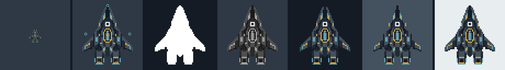
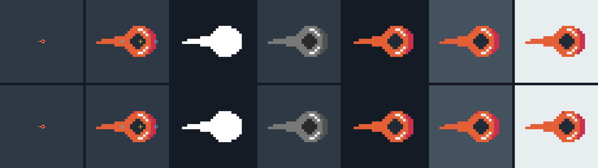
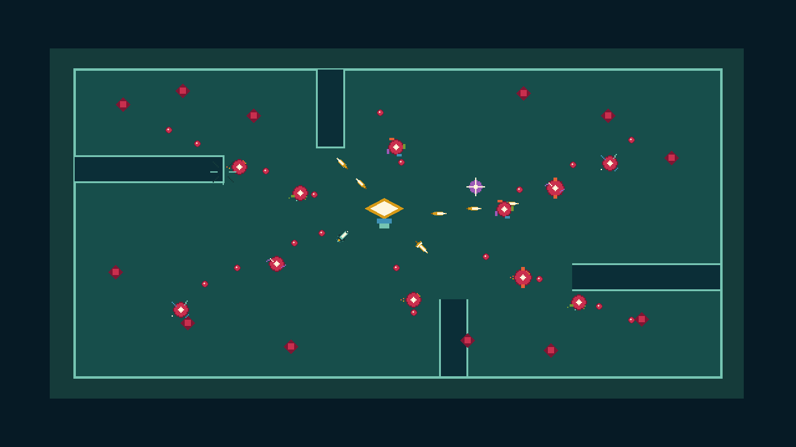

# Pixel-Art Asset Production Pipeline

Everything used to research, plan, produce, validate, and review the pixel-art
migration lives under this directory:

```text
pixel-art-production/
  README.md
  assets/       # inventory, palettes, editable source/proof assets, builds
  design/       # research, reference manifests, experiments, guidelines
  evidence/     # baselines, samplers, and approval-gate captures
  runtime/      # approved Godot-consumed atlas, tiles, catalog, and shader
  schemas/      # brief and manifest contracts
  tools/        # production and validation scripts
```

Each offline-heavy child directory has its own `.gdignore`, keeping references,
proofs, and authoring tools out of Godot's resource scan. The current publisher
writes only approved runtime outputs into `runtime/`; the entire pixel-art
effort therefore stays discoverable beneath this one root without importing
production evidence into the game.

## Purpose

Define one production path for replacing Cardborne's procedural visual assets
with editable pixel art. The path applies to map tiles, terrain, the player
craft, enemies, bosses, projectiles, secondary weapons, effects, pickups, and
icon artwork without turning collision, telegraphs, localization, or changing
runtime values into bitmaps.

The complete machine-readable inventory is
[`assets/asset-inventory.json`](./assets/asset-inventory.json). It currently contains 39 asset
families: 29 raster-atlas families, nine procedurally positioned pixel
families, and one live-UI family.

## Scope

This specification owns:

- the current visual-asset inventory and migration priority;
- native logical sizes, variants, directions, states, and semantic parts;
- the manifest contract for one producible asset family;
- generation input, palette cleanup, semantic masking, layer extraction,
  exact reassembly, pixel-SVG export, and atlas packing;
- acceptance checks before an atlas may be considered runtime-ready.

It does not:

- own or redesign the live Godot renderer;
- replace authored collision, navigation, line of sight, or spawn legality;
- bake exact telegraph areas, minimap positions, cooldowns, numbers, focus
  states, or Korean/English strings into images;
- add an image API client, API key, package, or external production dependency;
- accept an ImageGen output as finished art without deterministic cleanup.

## Current State

The current game consumes
`runtime/atlases/cardborne-pixel-atlas.png`, three repeat tiles under
`runtime/tiles/`, `runtime/catalog.json`, and
`runtime/shaders/pixel_atlas_multimesh.gdshader`. The catalog exposes 39 asset
families through `vehicle_pixel_asset_catalog.gd`; the retained
`vehicle_combat_renderer.gd` and `vehicle_pixel_world_mesh_builder.gd` select
atlas regions and repeat materials without making raster art the collision
owner.

`tools/design/generate_complete_pixel_library.gd` is the current publisher.
World geometry remains owned by the field, tactical-layout, and terrain
runtimes; telegraphs, localization, focus, timers, and changing combat state
remain live. Offline reference, source, proof, and review PNGs are production
evidence rather than Godot runtime assets.

### Inventory coverage

| Group | Asset families |
| --- | --- |
| Environment, terrain, facilities, props (9) | `world_floor_void_tiles`, `wall_cover_tiles`, `water_void_edge_tiles`, `arc_surge_strip`, `breakable_bulkhead`, `transit_gate`, `repair_field`, `overdrive_field`, `reward_crate` |
| Player and effects (7) | `player_chassis`, `player_engine_modules`, `player_engine_flame`, `player_dash_effect`, `player_status_overlays`, `enemy_condition_overlays`, `impact_effects` |
| Enemies and bosses (4) | `mobile_enemy_set`, `stationary_enemy_set`, `elite_trait_overlays`, `boss_set` |
| Projectiles (3) | `player_primary_projectiles`, `player_projectile_modifier_overlays`, `hostile_projectile_affinities` |
| Secondary weapons (5) | `secondary_seeker`, `secondary_ion_field`, `secondary_orbit_blades`, `secondary_wake_mines`, `secondary_escort_drone` |
| Pickups (3) | `experience_shards`, `repair_pickup`, `experience_recall_pickup` |
| Combat feedback and UI (8) | `telegraph_shape_system`, `world_targeting_markers`, `hud_action_icons`, `minimap_world_markers`, `guidebook_previews`, `upgrade_card_icons`, `ui_frame_system`, `dynamic_combat_ui` |

Each set entry expands into the variants named in the JSON inventory. For
example, the mobile-enemy set contains all 13 current archetypes, the stationary
set contains six roles, the boss set contains five stage variants, and the card
icon set contains all 46 current upgrade IDs.

## Requirements

### Three output modes

| Mode | Use | Examples |
| --- | --- | --- |
| `raster_atlas` | Approved fixed silhouettes, frames, or connected tiles | craft, enemies, bosses, projectiles, pickups, walls |
| `procedural_pixel` | Pixel glyphs or small tiles positioned by exact runtime state | telegraph fill/border, status rings, minimap markers |
| `live_ui` | Values and interactions that must remain dynamic and localized | health, cooldown fill, report values, Korean/English text |

An asset family may use a raster base plus procedural overlays. Do not generate
every modifier combination as a separate bitmap.

### Native grids

| Family | Native master |
| --- | ---: |
| Floor, void, wall, and edge tile | `24 x 24` |
| Projectile, seeker missile, or impact frame | `32 x 32` |
| Small experience shard | `16 x 16` |
| Pickup, status, or HUD glyph | `24 x 24` |
| Common mobile enemy | `32 x 32` |
| Tower, mine, terrain component | `32–64 px` |
| Player craft frame | `64 x 64` |
| Boss frame | `96 x 96` |

One ImageGen job contains one asset or one deliberately related frame—not a
sheet of unrelated objects. A `512 x 512` guide canvas maps exactly onto the
declared logical grid. The finished native frame is the logical size, not
`512 x 512`.

Do not divide that guide into a `4 x 4` sheet of named asset slots. The rejected
experiment showed that a model can imitate the composition while breaking tile
topology, edge thickness, pivots, and palette discipline; each slot therefore
needs its own canonical grid-native source or deterministic derivation.

### Semantic part contract

Every visible source pixel must belong to exactly one semantic layer. Each layer:

- uses one unique ID color in a same-size semantic mask;
- occupies the full frame canvas and preserves the shared origin;
- declares a stable z-order;
- keeps anchors and pivots in logical-pixel coordinates;
- can be edited independently and reassembled at `(0, 0)`;
- must reassemble to the approved source with an absolute pixel difference of
  zero.

The image model may propose a part layout, but the semantic mask is corrected
deterministically. A prompt instruction such as “leave a visible seam between
the wing and body” improves separability; it does not prove pixel-perfect
ownership. The mask and validator do.

### Stable gameplay anchors

Actor manifests declare one pivot and named anchors such as muzzle, engine
nozzle, orbit center, status position, and impact origin. All direction and
animation frames keep those anchors stable unless the animation explicitly
moves that part. Collision is never derived from alpha.

## Production Workflow

### 1. Register the family

Add or update one entry in `assets/asset-inventory.json`. Record the current code owner,
target mode, master size, variants, directions, states, semantic layers, and
priority. This prevents forgotten runtime visuals and duplicate ownership.

### 2. Create the job manifest

Create a brief from
[`assets/examples/player-craft.brief.json`](./assets/examples/player-craft.brief.json), then
copy the manifest shape in
[`assets/examples/player-craft.manifest.json`](./assets/examples/player-craft.manifest.json).
Validate both before producing frames. The manifest validates against
[`schemas/pixel-asset-manifest.schema.json`](./schemas/pixel-asset-manifest.schema.json).
The version-2 manifest is the durable contract: it records approval state,
production method, reference IDs, native-source checksum, stable frame tuple
(`variant`, `direction`, `state`, and `sequence_index`),
semantic layers, runtime group, collision owner, review backgrounds, and fixed
atlas gutter. Filenames inferred from a prompt are not a contract.

### 3. Build the generation input

Create a white `512 x 512` guide with one exact logical grid. Supply that guide,
the approved display palette, a small style reference, and a structured prompt.
The prompt must state:

1. asset identity and camera direction;
2. exact silhouette and functional anchors;
3. permitted flat colors and no dithering/gradients;
4. transparent or white removable background;
5. one object only, centered with margin;
6. large, clean semantic parts separated by simple one-cell boundaries;
7. invariants that an edit must not change.

Example actor prompt:

> Create one north-facing drydock interceptor inside the supplied 64-by-64
> logical-cell guide. Fill every occupied cell edge-to-edge with one flat
> palette color. Keep body, left wing, right wing, cockpit, weapon mount, and
> two engines as large contiguous regions with clean boundaries. Keep the
> muzzle on the vertical centerline and both engine nozzles symmetric. No
> outlines, gradients, dithering, texture speckles, labels, shadows, or extra
> objects. Preserve transparent background outside the silhouette.

For later variations, edit the approved frame instead of regenerating from
scratch. State the invariants first, then request one small change.

An individual asset grid is not a scene grid. Do not shrink a complete gameplay
frame to a `64 x 64` actor master: small actors, projectiles, and pickups collapse
below their readable silhouette sizes. Visual-direction scenes use at least
`128 x 128` logical pixels or are assembled from already-clean native assets.
The retained diagnostic and comparison are documented in
[`visual-research`](./design/visual-research/README.md).

### 4. Snap to the logical grid and palette

`snap_image_to_pixel_grid.ps1` normalizes the image to the guide size, samples
one logical cell, disables dithering, remaps to the approved palette, and removes
the declared key background. Hidden RGB in transparent input is normalized
before remapping so it cannot become visible pixels.

### 5. Create the semantic mask

Create a same-canvas mask using the manifest's ID colors. The mask may be drafted
by image editing or by broad deterministic regions, then corrected at native
resolution. It is not presentation art and its colors do not affect the game.

The mask must assign every visible pixel once, assign no transparent pixel, use
only declared colors, and populate every required layer.

### 6. Split, verify, and reassemble

`split_pixel_asset_layers.ps1` checks source/mask coverage, writes one
full-canvas transparent PNG per semantic layer, composites them in z-order, and
rejects the build unless the reassembled image has pixel difference `0`.
Version-2 sources also reject partial alpha and any display or semantic color
outside the locked palettes.

`raster_to_pixel_svg.ps1` then creates an optional integer-grid SVG for direct
pixel correction. Same-color horizontal runs are merged. PNG remains the atlas
and runtime contract; SVG is only an editable intermediate.

### 7. Produce directions and animation

- Player aim: 16 directions.
- Asymmetric mobile enemies: eight directions.
- Symmetric swarm units, mines, and fixed bases: directionless when readable.
- Projectiles: use fewer directional frames only when rotation preserves their
  silhouette exactly.
- Effects: short state-specific loops; do not add idle micro-animation.

Generate or edit one frame at a time. Validate silhouette area, pivot, and anchor
drift before packing. Recoil, flame, dash, and status effects remain separate
layers or sheets so chassis combinations do not multiply.

### 8. Pack the atlas

`pack_pixel_asset_atlas.ps1` follows explicit `atlas_index` values and writes a
PNG plus JSON metadata containing every frame region, cell region, source hash,
pivot, anchor, variant, direction, state, and duration. Every version-2 frame
uses one extruded edge pixel surrounded by a two-pixel transparent inter-frame
gutter. Connected tile families declare all 16 orthogonal edge signatures and
must pass full edge comparison plus a repeated `3 x 3` seam proof.

`build_pixel_asset_catalog.ps1` aggregates version-2 atlas metadata into stable
runtime keys. The catalog validator checks checksums, region bounds, extrusion,
transparent gutters, and duplicate keys. The frame-budget validator enforces
each inventory-family ceiling and the global `646`-frame limit.

`build_pixel_asset_review.ps1` produces the mandatory native-size, enlarged
nearest-neighbor, pivot/anchor, silhouette, grayscale, and declared-background
panels. A `proof` or `candidate` may pass technical validation without becoming
approved production art.

### 9. Publish and integrate

Godot integration uses one reviewable publication path:

- retain current gameplay geometry and retained high-count batching;
- select atlas regions in existing renderer-owned batches;
- use nearest texture filtering and whole-number sprite scale;
- derive visual tiles from geometry, never the reverse;
- publish the shared atlas, repeat tiles, frame metadata, checksums, and source
  provenance through `generate_complete_pixel_library.gd`;
- validate the runtime catalog and Godot import settings after publication;
- test the Web export at `1280 x 720` and `1920 x 1080`;
- compare combat readability and frame pacing before accepting a replacement
  asset slice.

## Family-Specific Rules

### Map tiles

Floor variation is large and sparse; it may never resemble collision, hazards,
pickups, or telegraphs. Walls and every impassable blocker use one material
grammar. Orthogonal wall/edge sets use all 16 neighbor combinations. Static art
does not own collision. Each tile family needs a `3 x 3` repeat and connection
proof.

### Player, enemies, and bosses

Silhouette communicates ownership and role before interior detail. Attack
startup, active state, recovery, damage, and destruction use separate states
only when visible during play. Boss sprite phases support boss logic but never
replace exact procedural attack geometry.

### Projectiles and effects

The rendered projectile head must not imply a smaller safe area than the actual
collision radius. Ownership, affinity, and threat weight use shape plus value;
wall clipping and hit truth stay in combat code.

Projectile art is built as ammunition, not as a centered upgrade icon. A
directional flight frame has a leading edge, connected body/core, rear anchor,
and motion wake. Player basic fire, the opening/breach shot, and the seeker use
eight directions with two flight frames. Round hostile light and standard shots
use two directionless pulse frames; the heavy shot uses three. Thermal, toxin,
cryo, arc, and hybrid are two-frame edge/wake overlays on the complete hostile
head. Kinetic uses the unmodified head.

Wall, enemy, player-hull, barrier, and breach-interrupt impacts are separate
four-frame clips: contact, expansion, fragments, and fade. Modifier behavior is
communicated by flight motion, wake, impact, and live state where required; do
not place a literal pierce, poison, ricochet, or affinity glyph inside an
ordinary bullet. Do not bake every upgrade combination into the atlas.

### Items and facilities

Repair and experience recall remain the only field-item behaviors. XP value
classes share one family. Repair/overdrive fields use a pixel fixture, while
radius, lifetime, and fill animation remain exact live geometry.

### UI

Raster art is limited to glyphs, markers, and restrained ornament. Text,
bindings, focus, selection, changing numbers, progress arcs, and accessibility
states remain live controls. Korean and English never become atlas text.

## Commands

From the repository root:

```powershell
./pixel-art-production/tools/design/create_pixel_palette.ps1 `
  -PaletteSpecPath pixel-art-production/assets/palettes/pixel-hangar-v1.json `
  -ColorGroup colors `
  -OutputPath pixel-art-production/assets/palettes/pixel-hangar-v1.png

./pixel-art-production/tools/design/validate_pixel_asset_inventory.ps1

./pixel-art-production/tools/design/validate_pixel_asset_brief.ps1 `
  -BriefPath pixel-art-production/assets/examples/player-craft.brief.json

./pixel-art-production/tools/design/validate_pixel_asset_manifest.ps1 `
  -ManifestPath pixel-art-production/assets/examples/player-craft.manifest.json `
  -RequireInputFiles

./pixel-art-production/tools/design/invoke_pixel_asset_build.ps1 `
  -ManifestPath pixel-art-production/assets/examples/player-craft.manifest.json `
  -OutputDirectory pixel-art-production/assets/examples/player-craft-build-v2

./pixel-art-production/tools/validation/validate_pixel_asset_pipeline.ps1
```

The checked-in version-2 proofs split the 64-cell craft and 32-cell projectile
into independent editable layers, reassemble them with zero changed pixels,
pack them with the production gutter, aggregate them into a two-frame proof
catalog, and build mandatory review boards:





The earlier 85-frame projectile-system sheet and the pipeline sampler remain
technical exploration evidence. They do not enter the version-2 catalog and are
not approved product assets.

The gameplay-density proof tests ownership, direction, and threat at native
one- and two-times scale. It is offline evidence, not a claim that the atlas is
already connected to Godot:



## Acceptance Criteria

- [ ] Every current visual family is present in the inventory exactly once.
- [ ] Each manifest passes structural and input-file validation.
- [ ] The generated frame is snapped to its declared logical size and approved
      palette with no dithering or partial cells.
- [ ] Every visible pixel has exactly one known semantic owner.
- [ ] Every required semantic layer contains pixels.
- [ ] Layer reassembly has absolute pixel difference `0`.
- [ ] Pivots and anchors stay stable across directions and frames.
- [ ] Connected tiles pass the repeated seam and adjacency tests.
- [ ] Actor, enemy, projectile, pickup, and telegraph roles remain distinguishable
      at gameplay scale and in grayscale.
- [ ] A representative dense-combat composite preserves every accepted family
      at its declared native size; no whole-scene downsample substitutes for
      native-family review.
- [ ] Collision, navigation, telegraph truth, live state, localization, and
      accessibility remain outside raster art.
- [ ] Godot integration retains batching and passes the Web export before any
      family is declared migrated.

## Sources

Sources reviewed on 2026-07-26:

- [OpenAI Image generation guide](https://developers.openai.com/api/docs/guides/image-generation):
  the Image API supports single generation/edit jobs, while the Responses API
  supports multi-turn image editing. Masks require matching image dimensions
  and alpha. The current documented image model is `gpt-image-2`.
- [OpenAI GPT Image prompting guide](https://developers.openai.com/cookbook/examples/multimodal/image-gen-models-prompting-guide):
  use structured prompts, explicit constraints and invariants, references, and
  small iterative edits. Exact consistency and composition still require
  downstream validation.
- [Godot TileMapLayer](https://docs.godotengine.org/en/stable/classes/class_tilemaplayer.html),
  [TileSetAtlasSource](https://docs.godotengine.org/en/stable/classes/class_tilesetatlassource.html),
  and [MultiMesh](https://docs.godotengine.org/en/stable/tutorials/performance/using_multimesh.html):
  atlas art can replace presentation while the current geometry and retained
  batching remain authoritative.

The local Codex ImageGen capability is used for visual drafts. This repository
does not call an image API directly, so the pipeline does not assume an exposed
model selector, API key, or transparent-output option. Transparency is
normalized during deterministic cleanup.
